# NF-网:规格化自由网

> 原文：<https://medium.com/analytics-vidhya/nf-nets-normalizer-free-nets-95648703109a?source=collection_archive---------30----------------------->

*败落为批量正常化的开始？*

# 介绍

D eepMind 发布了一系列先进的图像分类网络，远远超过了之前的最佳产品——[efficient net](https://ai.googleblog.com/2019/05/efficientnet-improving-accuracy-and.html)。新架构背后的主要思想是使用无规格化器神经网络或 NF-net 来训练网络，而不是批量规格化，批量规格化由于其丰富的优点仍然广泛用于几乎所有其他神经网络。**NF-Net-F1 的精确度与 EfficientNet-B7 相当，但训练速度却快了 8.7 倍！**下面给出的是 ImageNet 数据集上用于图像分类的最新最先进架构的准确性与延迟的关系图。

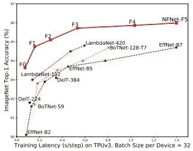

正如我们在这里看到的，NFNet-F0 的精确度几乎与 EfficientNet-B5 相当，并凭借其 NFNet-F5 全面击败了 EfficientNet-B7。图片鸣谢— NFNet [论文](https://arxiv.org/pdf/2102.06171v1.pdf)。

> 将会有一个向神经网络的范式转变，不再使用批处理规范化

# 背景

几乎所有的神经网络，尤其是在计算机视觉-图像分类领域，都严重依赖于批量标准化来训练深度网络。可能是损失的平滑，减少协变量偏移，或者是正则化效应，批处理正则化在训练神经网络中一直具有前所未有的优势，直到现在。这就要改变了！NF-Net 的作者表明，我们可以在不进行批量归一化的情况下训练深度残差网络，方法是用一些其他技术代替它，这些技术将导致比启用批量归一化的网络更快的训练和更好的准确性。神经网络的训练速度更快，批量可以达到 4096 个！但是在深入新的替代方案和技术的细节之前，让我们先通过一个小的批处理规范化演练来设置**上下文**。

# 批量标准化

简单回顾一下，批量标准化是一种通过标准化每个小批量的输入来训练像 ResNet 这样的深度网络的方法。观察到一个称为内部协变量转移的问题，这是各层之间输入分布的变化，它看起来像是网络朝着移动的目标进行训练。这是因为神经网络对初始权重和算法非常敏感。批量标准化在初始阶段很大程度上解决了这一问题，它通过计算均值和方差参数来移动输入，从而平滑损失情况并稳定训练。

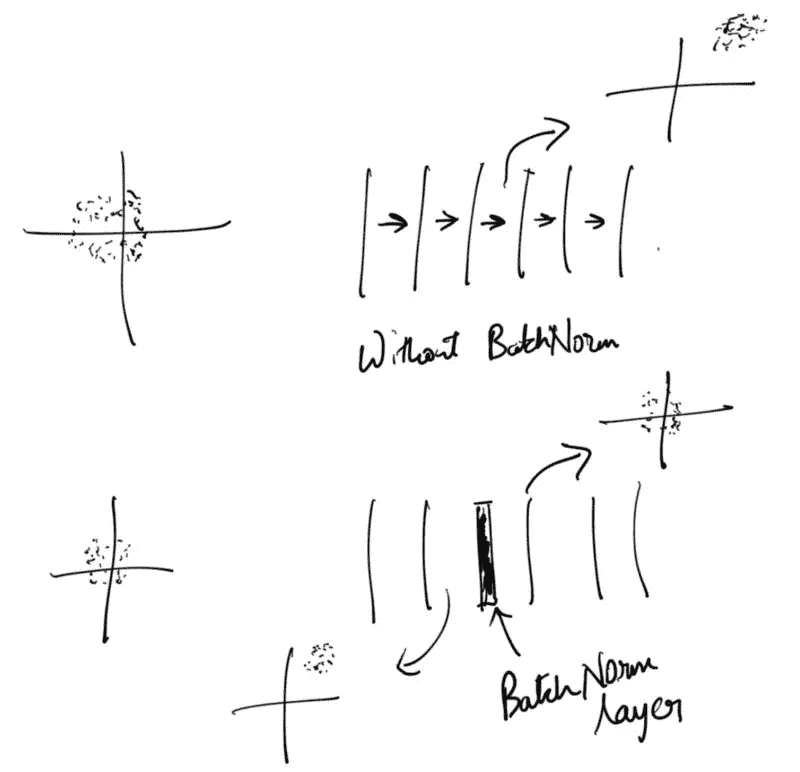

批量标准化图解。

下图显示了每个小批量的批量标准化过程中的各个步骤和公式。

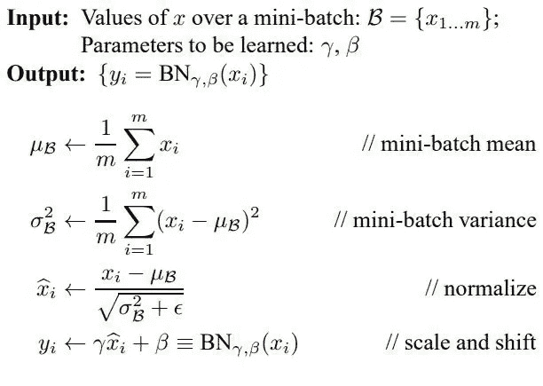

*批量归一化操作中执行的连续步骤——均值、方差、归一化和标度&移动。γ和β参数是神经网络中的可学习参数。图片来自* [*论文*](https://arxiv.org/pdf/1502.03167.pdf) *。*

## 批处理规范化的优点

1.  当训练由 1000 个层组成的深度 ResNet(ResNet、ResNeXt 等)时，它在**缩小隐藏激活**方面非常成功。怎么会？当在剩余分支上使用时，批量标准化在按比例缩小激活输出方面是有效的。另一方面，当对跳过分支应用批处理规范化时，它会导致对剩余分支的轻微偏向。这确保了初始训练是稳定的，并导致有效的优化。
2.  **消除了 ReLU & GELU 等函数输出非零均值激活时的均值漂移效应**。主要问题是，随着网络越来越深入，平均激活变得越来越大，越来越积极，这导致网络预测所有训练样本的标签相同，训练不稳定。批量标准化通过确保所有层的平均激活为零来解决这一问题。
3.  它有很好的正则化效果，在训练神经网络时，它可以代替 Dropout 作为正则化因子。用批量标准化训练的网络不容易过度拟合，并且对于任何给定的数据样本都概括得很好。这主要是由于将有噪声的批次统计数据标准化。此外，通过调整批次大小可以提高验证的准确性。
4.  它可以**以更大的批量和更大的学习率训练神经网络**。由于损失前景是平滑的，因此可以使用更大且稳定的学习率来进行训练。对于较小的批量，这可能效率不高。此外，与非批量标准化神经网络相比，它以更少的步骤实现了相同的精度，从而提高了训练速度。

## 批处理规范化的缺点

1.  在一些网络中，由于计算平均值和缩放参数并存储它们以用于反向支持步骤，因此计算量可能很大。
2.  在训练和测试期间，网络行为可能会有差异。在训练时，网络可能已经学习并训练了某些批次，这使得网络依赖于该批次方式的设置。因此，当在推理中只提供一个例子时，它可能表现不好。
3.  批处理规范化**打破了批处理中实例之间的独立性。**这意味着在一批中选择的例子是有意义的，并导致我们有两个更多的前景——**批量大小问题**和低效的**分布式训练**，这将导致网络欺骗损失函数。
4.  批量大小很重要，因为在小批量中，平均近似值会有噪声，而在大批量中，近似值可能值得考虑。据观察，较大的批量导致稳定和有效的训练。**此外，如果训练时统计数据的方差很大，批量归一化网络的性能也会下降。**
5.  关于欺骗损失函数、困难的分布式训练和在另一个硬件中复制结果的第二点，当我们在并行流中分布训练时，每个流将接收一批的一部分或碎片，并且应用向前传递。当批标准化层之间没有通信时，即所有流将独立计算均值和方差参数时，就会出现差异。这是错误的，因为参数不是对整批都成立，而是对每个碎片都成立，这导致**欺骗**损失函数。

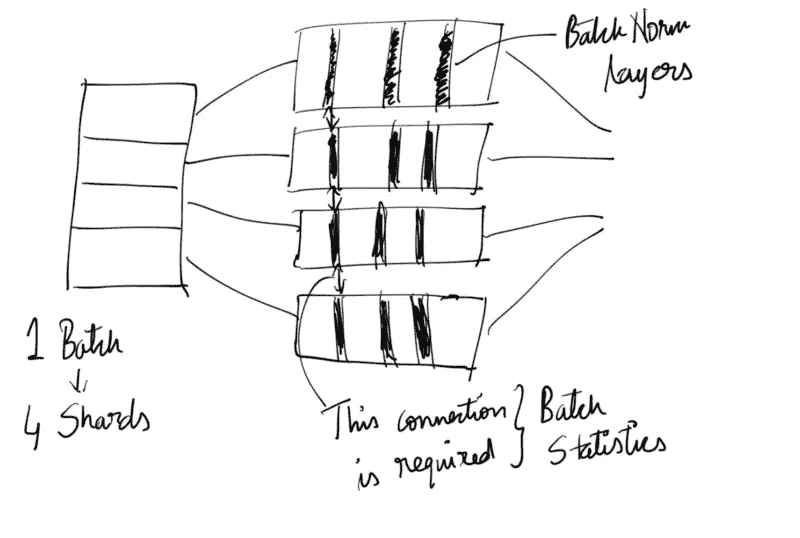

神经网络中出现批量标准化时所需的分布式训练的图示。

# 神经网络的背景

从以上对利弊的讨论中，我们了解到，尽管批处理规范化在训练深度网络中是有帮助的，但是存在主要的缺点，并且作者提出了走向无批处理规范化的神经网络的新方向的想法。实现这一点的方法是通过抑制剩余分支上的隐藏激活来替换批量范数。这篇[ [论文](https://arxiv.org/pdf/2101.08692.pdf)的作者通过在初始化时抑制剩余分支并使用**比例权重标准化实现了一个无规格化器的 ResNet。**权重标准化在卷积层中单独控制每个输出通道的权重的一阶和二阶矩。权重标准化以可区分的方式标准化权重，其目的是在反向传播期间标准化梯度。

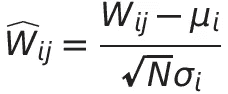

称重标准化。

> 其中，μ和σ指权重的均值和标准差，N 指卷积层的 f-in

这些网络( **NF-ResNet** )能够匹配批量标准化 ResNet 的精度，但在批量较大的情况下难以匹配，无法匹配当前最先进的 EfficientNet。NF-Nets 建立在这项研究工作的基础上。

## 研究的主要贡献

1.  作者提出了一种新的方法，**自适应梯度裁剪，**，该方法可用于基于梯度范数与参数范数的单位比*来裁剪梯度，从而允许训练具有更大批量和更强数据扩充的神经网络。*
2.  *它引入了一个**系列的无规格化器网络**NF-Nets，它超越了之前最先进架构 EfficientNets 的结果。最大的 NF-Net 模型在不使用额外数据的情况下实现了 86.5%的顶级准确性(最新技术水平)!*
3.  *它表明 **NF-Nets 在 ImageNet 上微调时，在验证准确性方面优于批量归一化网络**。微调后的最高精度为 89.2%*

***让我们了解这篇论文的主要亮点，即自适应梯度裁剪***

# *自适应渐变裁剪*

*在进入自适应梯度削波或简称 ADC 之前，什么是梯度削波？渐变裁剪是一种限制渐变值发生巨大变化的方法，无论是正变化还是负变化。简单来说，我们不希望梯度在寻找全局最小值时发生大的跳跃。当梯度值太大时，我们简单地剪掉它。但是，我们还必须适应这样的情况，即梯度必须足够大，以便在穿过损失景观时从局部最小值中出来或修正其路线。如果合成的路径足够好，我们肯定会再次得到它，但另一方面，如果它是一个坏的梯度，我们希望限制它的影响。*

*作者假设，梯度裁剪将使训练的神经网络具有较大的批量和较大的学习率。这是因为以前的语言建模工作 T12 论文 T13 稳定了训练，并且它还允许使用更大的学习率，从而加速了训练。标准梯度剪裁 T14 纸张 T15 由下式给出:*

*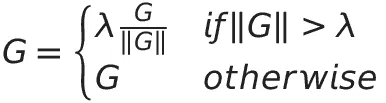*

**标准渐变裁剪。**

*其中 g 是梯度向量，G = ∂L/∂θ，其中 l 表示损失，θ表示所有模型参数的向量。此剪辑在更新θ之前完成。λ是必须调整的限幅阈值超参数。作者观察到，这个超参数对训练的影响非常大(训练稳定性对选择的限幅阈值非常敏感)，因此需要非常精细的调整。为了应对这一点，他们引入了**自适应梯度削波或 ADC** 。*

*ADC 的要点是，它以这个特定的比率(梯度范数 G^ *l* 与层 *l* 的权重范数 W^ *l* (梯度有多大/梯度作用的权重有多大)来裁剪梯度。这将给出改变原始权重的梯度步长变化的度量。具体地，第 *l-* 层的梯度的每个单位*I*—G(*l)(I)*由下式给出:*

*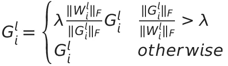**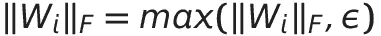*

*自适应渐变裁剪公式。*

*其中ε= 10^-3，以防止零初始化的参数被削波回 0。随着 AGC 的使用，它能够以 4096 的批量稳定地训练神经网络，这对于一批来说是相当大的数量。λ是限幅参数，它的设置取决于优化器、学习率和批处理大小。下图描述了较大批量的 NF-net 的缩放。*

*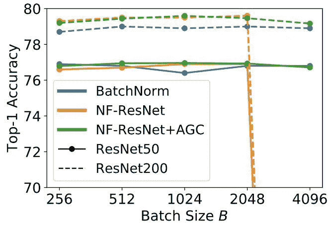*

**正如我们所看到的，它很好地支持到 4096 年，但是最大观测精度有它的
批量在 2048 年左右。图片摘自* [*论文*](https://arxiv.org/pdf/2102.06171v1.pdf) *。**

*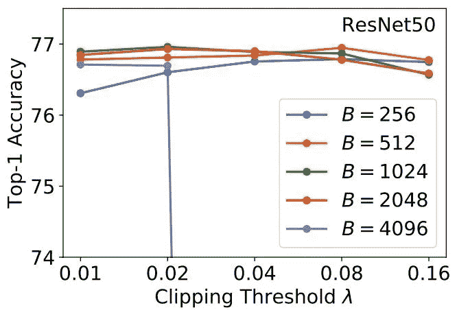*

**0.02 的限幅阈值保持良好，并给出最大可能的精度。
图片取自* [*论文*](https://arxiv.org/pdf/2102.06171v1.pdf) *。**

*根据经验，我们发现**较低的削波阈值适用于较大的批量。**考虑批量较大的情况，此时批次统计数据没有那么嘈杂。在这里，剪辑必须设置为低，否则它会崩溃。同样，如果批处理大小非常小，批处理统计中可能会有更多的噪声，我们可以使用更高的限幅阈值。*

# *体系结构*

*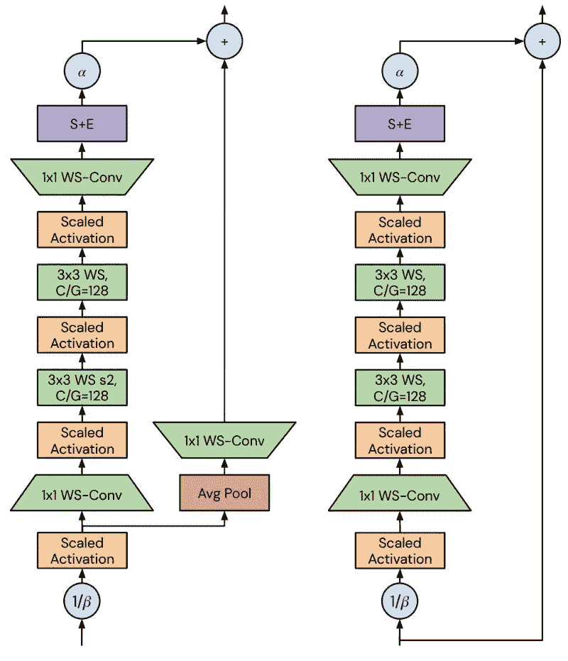*

**NF-Net 架构。图片取自* [*纸*](https://arxiv.org/pdf/2102.06171v1.pdf) *。左图描绘了过渡块，右图描绘了非过渡块。**

*说到架构，NF-Net 是 SE-ResNeXt-D [ [论文](https://arxiv.org/pdf/1709.01507.pdf) ]的修改版。该模型的初始“主干”由 16 通道的 3×3 步距-2 卷积、分别 32 通道和 64 通道的两个 3×3 步距-1 卷积以及 128 通道的最终 3×3 步距-2 卷积组成。这里使用的激活函数是格律[ [纸](https://arxiv.org/pdf/1606.08415.pdf) ]，其性能不亚于雷律&路斯。*

*剩余阶段由两种类型的块组成，从过渡块开始，接着是非过渡块。所有模块都采用预激活 ResNe(X)t 瓶颈模式，并在瓶颈内添加 3×3 分组卷积。在最后一个 1×1 卷积之后是挤压和激励层，其全局平均汇集激活，将两个线性层与交错缩放的非线性应用于汇集的激活，应用 sigmoid，然后通过两倍于该 sigmoid 的值按通道重新缩放张量。*

*在所有剩余阶段之后，我们应用 1×1 扩展卷积，使通道数加倍。当使用非常薄的网络时，该层主要是有帮助的，因为通常希望最终激活向量(分类器层接收的)的维数大于或等于类的数量。到了最后一层，它输出一个带有可学习偏差的 1000 向类向量。该层的权重初始化为 0.01，而不是 0。*

*NF-Nets 的**重要**特征是**“无规格化器”。**残差块主路径的输入乘以 1/β，其中β是初始化时该块方差的预测值，该块的输出乘以标量超参数α，通常设置为小值，如α = 0.2。这些标量α和β非常有助于实现无规格化器的实现。下面给出了公式，*

*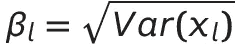**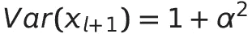*

**每个阶段开始时的单位信号方差。**

*该模型及其配置相当复杂，如果您正在复制/实现 NF-net，通读本文将会有所帮助。这些实验也有点长，为了在这篇博客中保持简洁，我没有包括实验和消融研究。*

# *基准和结果*

*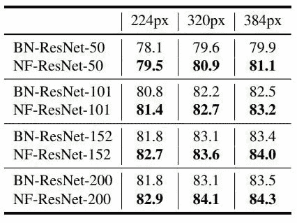*

**NF-ResNet 和 BN-ResNet(批量归一化-ResNet)在各种图像大小(像素)下的比较。图片摘自* [*论文*](https://arxiv.org/pdf/2102.06171v1.pdf) *。**

*正如我们所看到的，NF-Nets 优于它们的批处理规范化对应物。**NF-Net-F5 模型实现了 86%的顶级验证准确率，超过了之前最先进的结果。看，我们有了 NF-Net 作为新的最先进的网络**，而 NF-Net-F1 模型与 EfficientNet-B7 的 84.7%的分数相匹配(所有这些都在下表中描述)。*

*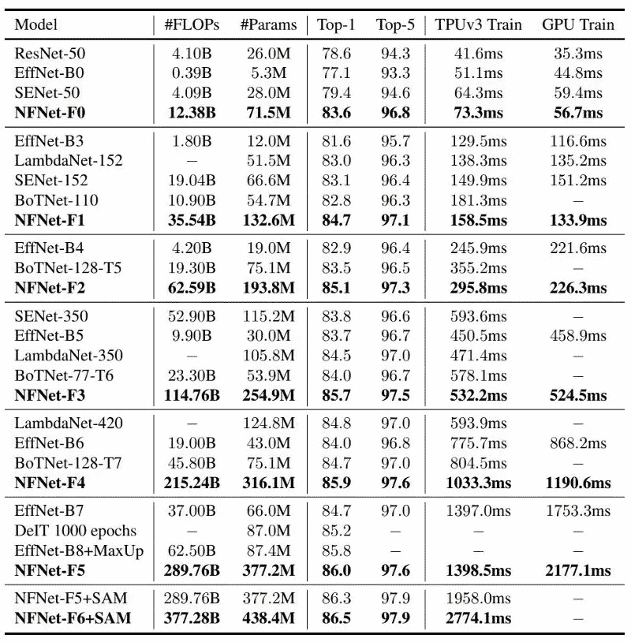*

**各种架构与训练次数的对比。图片摘自* [*论文*](https://arxiv.org/pdf/2102.06171v1.pdf) *。**

# *可能尚未解决的问题*

1.  *如果我们观察**实现**是如何完成的，那么训练示例仍然隐含地依赖于该批次:在该批次的平均操作之后进行削波。*
2.  *训练和测试时间中不同行为的观察被引用为批量标准化的问题之一。但是在这里，在实现中，他们使用了 Dropout，这在训练和测试时也有不同的行为。*

# *结论*

*总之，在这篇论文中有很多东西在进行，但是没有几个对无规范器神经网络的成功开发是非常重要的。引入的 NF-Nets 的性能超过了最新的图像分类技术(不使用额外的数据)，并且训练速度也更快。还表明 NF-Nets 家族比批量标准化变体更适合于对大型数据集进行微调。*

# *参考*

1.  *https://arxiv.org/pdf/2102.06171v1.pdf*
2.  *效率网:【https://arxiv.org/pdf/1905.11946.pdf】T4*
3.  *批量归一化:[https://arxiv.org/pdf/1502.03167.pdf](https://arxiv.org/pdf/1502.03167.pdf)*
4.  *ImageNet:[http://www.image-net.org/](http://www.image-net.org/)*
5.  *雷斯内特:[https://arxiv.org/pdf/1512.03385.pdf](https://arxiv.org/pdf/1512.03385.pdf)*
6.  *https://arxiv.org/pdf/1811.03378.pdf*
7.  *葛鲁:[https://arxiv.org/pdf/1606.08415.pdf](https://arxiv.org/pdf/1606.08415.pdf)*
8.  *非标准化 ResNet:[https://arxiv.org/pdf/2101.08692.pdf](https://arxiv.org/pdf/2101.08692.pdf)*
9.  *规范和优化 https://arxiv.org/pdf/1708.02182.pdf 的 LSTM 语言模型:*
10.  *渐变裁剪和正则化:[https://arxiv.org/pdf/1211.5063.pdf](https://arxiv.org/pdf/1211.5063.pdf)*
11.  *SE-ResNeXt-D(压缩和激励网络):[https://arxiv.org/pdf/2102.06171v1.pdf](https://arxiv.org/pdf/2102.06171v1.pdf)*

**原载于 2021 年 3 月 7 日 http://appliedsingularity.com***。***