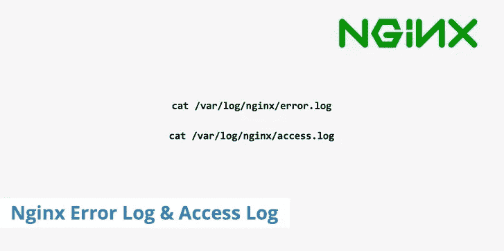

# Nginx 访问日志和错误日志

> 原文：<https://medium.com/analytics-vidhya/nginx-access-logs-and-error-logs-7dd637f621e?source=collection_archive---------17----------------------->



日志对于监控任何应用程序的活动都非常有用，除了在您排除故障时为您提供有价值的信息。像任何其他应用程序一样，NGINX 也记录事件，如您网站的访问者、遇到的问题等，并记录到日志文件中，从而使您能够在注意到日志事件中的一些严重差异时采取先发制人的措施。

# NGINX 中的日志

默认情况下，NGINX 将其事件写在两种类型的日志中——错误日志*和访问日志*中*。在大多数流行的 Linux 发行版中，如 Ubuntu、CentOS 或 Debian，访问和错误日志都可以在 */var/log/nginx* 中找到，假设你已经在核心 nginx 配置文件中启用了访问和错误日志。*

让我们找到更多关于 NGINX 访问日志、错误日志以及如何启用它们的信息，如果您之前没有这样做的话。

# 什么是 NGINX 访问日志？

NGINX 在访问日志中记录所有访问者的活动。在这里你可以找到哪些文件被访问，NGINX 如何响应请求，客户端使用什么浏览器，客户端的 IP 地址等等。可以使用访问日志中的信息来分析流量，以发现一段时间内的站点使用情况。此外，通过适当地监控访问日志，可以发现用户是否正在发送一些不寻常的请求，以发现部署的 web 应用程序中的缺陷。

# 什么是 NGINX 错误日志？

另一方面，如果 NGINX 遇到任何故障，它会将事件记录到错误日志中。如果配置文件中有错误，就可能发生这种情况。因此，如果 NGINX 无法启动或突然停止运行，那么您应该检查错误日志以找到更多详细信息。您可能还会在错误日志中发现一些警告，但这并不表示出现了问题，但该事件可能会在不久的将来造成严重的问题。

# 如何启用访问日志？

一般来说，可以在 **http** 或 **server** 部分使用以下指令启用访问日志。第一个参数 **log_file** 是必需的，而第二个参数 **log_format** 是可选的。如果您没有指定任何格式，那么日志将以默认的**组合**格式写入。

```
 access_log log_file log_format; 
```

默认情况下，访问日志在核心 NGINX 配置文件的 **http** 上下文中启用。这意味着所有虚拟主机的访问日志将被记录在同一个文件中。

```
 http {
       …
       …
       access_log /var/log/nginx/access.log;
       …
       …
} 
```

最好是通过将所有虚拟主机的访问日志记录在单独的文件中来隔离它们。为此，您需要用服务器上下文中的另一个 **access_log** 指令覆盖 **http** 部分中定义的 **access_log** 指令。

```
 server {
          listen 80; 
          server_name domain1.com
          access_log /var/log/nginx/domain1.access.log;
          …
          …
} 
```

重新加载 NGINX 以访问文件**/var/log/NGINX/domain 1 . access . log**中的域**domain1.com**的日志事件。

# 在访问日志中应用自定义格式

用于在访问日志中记录事件的默认日志格式是**结合**日志格式。您可以通过创建自己的定制日志格式来覆盖默认行为，然后在 **access_log** 指令中指定定制格式的名称。

下面的例子通过用响应的 gzip 压缩比的值扩展预定义的**组合**格式来定义一个定制的日志格式。然后通过用 **access_log** 指令指示日志格式来应用该格式。

```
 http { log_format custom ‘$remote_addr — $remote_user [$time_local] `
     ‘“$request” $status $body_bytes_sent ‘
     ‘“$http_referer” “$http_user_agent” “$gzip_ratio”’; server {
             gzip on;
             ...
             ...
             access_log /var/log/nginx/domain1.access.log custom;
             ...
             ...
  }
} 
```

一旦在您的环境中应用了上述日志格式，重新加载 NGINX。现在跟踪访问日志，在日志事件的末尾找到 gzip 比率。

```
 # tail -f /var/log/nginx/domain1.access.log
102.29.205.179 — — [28/Feb/2019:13:17:10 +0000] “GET /?p=1 HTTP/2.0” 200 5316 “[https://domain1.com/?p=1](https://domain1.com/?p=1)" “Mozilla/5.0 (Windows NT 6.1) AppleWebKit/537.36 (KHTML, like Gecko) Chrome/72.0.3626.119 Safari/537.36” “**2.75**” 
```

# 如何启用错误日志？

**error_log** 指令通过指定要记录的错误消息的最低严重级别，将错误记录到文件或 **stderr** 或 **syslog** 中。 **error_log** 指令的语法是:

```
 error_log log_file log_level 
```

**log_file** 定义日志文件的路径， **log_level** 定义要记录的日志事件的严重程度。如果不指定 **log_level** ，那么默认情况下，只记录严重级别为 **error** 的日志事件。

例如，以下示例将错误消息的严重级别设置为记录到 **crit** 中。此外， **http** 上下文中的 **error_log** 指令意味着所有虚拟主机的错误日志将在单个文件中可用。

```
 http {
       …
       error_log /var/log/nginx/error_log crit;
       …
 } 
```

还可以通过在服务器上下文中覆盖 **error_log** 指令来分别记录所有虚拟主机的错误日志。以下示例通过在服务器上下文中覆盖 **error_log** 指令来实现这一点。

```
 http {
       …
       …
       error_log /var/log/nginx/error_log;
       server {
                listen 80;
                server_name domain1.com;
                error_log /var/log/nginx/domain1.error_log warn;
       …
       }
       server {
                listen 80;
                server_name domain2.com;
                error_log /var/log/nginx/domain2.error_log debug;
                …
       }
} 
```

上述所有示例都将日志事件记录到一个文件中。您还可以配置 **error_log** 指令，用于将日志事件发送到 syslog 服务器。下面的 **error_log** 指令以调试格式将错误日志发送到 IP 地址为 192.168.10.11 的 syslog 服务器。

```
 error_log syslog:server=192.168.10.11 debug; 
```

在某些情况下，您可能希望禁用错误日志。为此，将日志文件名设置为 **/dev/null** :

```
 error_log /dev/null; 
```

# Nginx 错误日志严重性级别

有许多类型的日志级别与日志事件相关联，并具有不同的优先级。在以下日志级别中，调试具有最高优先级，并且也包括其余级别。例如，如果您将错误指定为一个级别，那么它还将捕获标记为**严重、警告和紧急**级别的日志事件。

```
 **emerg**: Emergency messages when your system may be unstable.
**alert**: Alert messages of serious issues.
**crit**: Critical issues that need to be taken care of immediately.
**error**: An error has occurred. Something went wrong while processing a page.
**warn**: A warning messages that you should look into it.
**notice**: A simple log notice that you can ignore.
**info**: Just an information messages that you might want to know.
**debug**: Debugging information used to pinpoint the location of error. 
```

# 摘要

NGINX 中的访问和错误日志不仅可以记录用户的活动，还可以节省调试的时间和精力。此外，如果需要更多信息，您还可以定制访问日志。因此，您可能希望启用访问和错误日志，因为这两个文件包含了更好地维护 NGINX 服务器的所有线索。