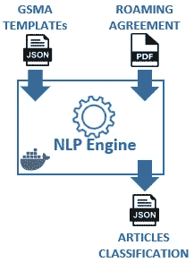
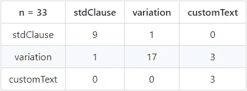

# NLP 引擎检测变量、标准条款、变体和定制文本。

> 原文：<https://medium.com/analytics-vidhya/nlp-engine-to-detect-variables-standard-clauses-variations-and-customized-texts-893ff9f903e5?source=collection_archive---------8----------------------->

T 以下是与项目[相关的 **6 集系列**的**第 2 集**使用 NLP 和 DLT 实现电信漫游协议的数字化](https://wiki.hyperledger.org/display/INTERN/Project+Plan%3A+The+Use+of+NLP+and+DLT+to+Enable+the+Digitalization+of+Telecom+Roaming+Agreements) [，](https://wiki.hyperledger.org/display/INTERN/Project+Plan%3A+The+Use+of+NLP+and+DLT+to+Enable+the+Digitalization+of+Telecom+Roaming+Agreements),)主要目的是*将* **电信漫游协议** *起草和谈判过程转化为基于* **区块链** *技术*的数字化版本 Ahmad Sghaier 、 [Noureddin Sadawi](https://medium.com/u/f2446988a932?source=post_page-----893ff9f903e5--------------------------------) 和 [Mohamed Elshrif](https://medium.com/u/cf57b73312bb?source=post_page-----893ff9f903e5--------------------------------) 也是本部分的作者。

在本系列的 [Part-1](/@sfl0r3nz05/blockchain-based-digitization-of-the-roaming-agreement-drafting-process-dec003923521) 中提到，在 **漫游协议** *起草*的*协商过程中，各方(即 MnO)应分析 GSMA 定义的标准模板中包含的条款/子条款，以确定是否:*

1.保留模板中的文章/子文章，从而建立一个**标准条款**。

2.在文章/子文章中引入某些**变化**，改变与原文相关的变量，如 MNO、日期、罚款、货币等，即 **GSMA 模板**。

3.通过构建**定制文本**来引入全新的文章/子文章，以响应特定的兴趣。

4.指定在特定文本中找到的特定**变量**的值，如日期、实体名称、金额等。

为了尽可能准确地确定这四个特征作为组成这个[项目](https://wiki.hyperledger.org/display/INTERN/Project+Plan%3A+The+Use+of+NLP+and+DLT+to+Enable+the+Digitalization+of+Telecom+Roaming+Agreements)中漫游协议的每个条款的一部分的存在，设计了一个基于*自然语言处理(NLP)* 的文本处理和分析工具，以下简称为 *NLP 引擎*。

下图显示了在 docker 基础设施上集成的 **NLP 引擎**的*整体架构*，建立了作为输入的**漫游协议**，以及 **GSMA 模板**；作为处理层的逻辑与 **NLP 引擎**相关联，并作为输出*标准条款*、*变化*、*定制文本、*和*变量*中的**文章/子文章分类。**

**图 1**:NLP-引擎架构。

# **NLP 引擎背后的逻辑**

为 **NLP 引擎**设计的逻辑有两种方法:*检测*和*比较*。

- *检测*代表**变量**在漫游协议中的位置。

- *比较*在漫游协议中出现的每个子条款之间进行，涉及 **GSMA 模板**中出现的*子条款*。

虽然子文章级别的文本之间几乎完全一致表示一个**标准条款**，但是文本之间几乎零一致(或者只是子文章不存在)表示一个**定制文本**。中间情况由**变量**表示，其中存在高度的一致性，差异由**变量**给出，如 MNO、日期、货币等。

## **检测变量**

变量检测经历以下步骤:

1.对转换成文本的**漫游协议**文档进行解析，移除不需要的字符。

2.解析后的文本被分成由 *100 个单词*组成的组，使用**亚马逊理解工具**【1】从中检测*实体*、*关键短语、*和*语法*。

3.基于检测到的元素的组合应用后处理机制，即*实体*、*关键短语、*和*语法*。

## **基于亚马逊理解的分析**

使用**亚马逊理解工具**检测*实体*、*关键词、*和*语法*。当实体被检测到时，通过 REST API 发送到 **Amazon 领悟工具**的每段文本( *100 个单词*)返回如表达式(1)所示的对象列表。该信息与基于表达式(2)和表达式(3)的处理和验证相结合，允许确定**变量**。当检测到关键短语时，表达式(2)构成由 Amazon understand 返回的对象列表的对象。当执行语法分析时，表达式(3)也构成由**Amazon comprehension**返回的对象列表的对象。

> {'BeginOffset':0，' EndOffset':8，' Score':0.43067169189453125，' Text':'Proximus '，' Type':'ORGANIZATION'} (1)
> 
> {'BeginOffset':0，' EndOffset':24，' Score':0.956875205039978，' Text ':' Proximus reference offer ' }(2)
> 
> {'BeginOffset': 0，' EndOffset':8，' PartOfSpeech ':{ ' Score ':0.9324524402618408，' Tag':'PROPN'} (3)

## **分项比较**

为了在文本元素之间建立比较，预处理步骤是必要的:

1.对转换成文本的**漫游协议**文档进行解析，移除不需要的字符。

2.解析后的文本被分成文章，文章又被分成*子文章*。

3.*子条目*用于建立与 **GSMA 模板**代表的参考相关的*相似度*。

4.在从*相似性*分析确定子文章是变体的情况下，然后我们继续在变体中寻找相应的**变量**。

## **相似性分析**

在本项目中，相似性分析包括将**漫游协议**的*子条款*与用作参考的*子条款*进行比较。*相似性*分析基于 *Jaccard 的相似性*【2】，选择该相似性是因为其在项目的这一阶段易于实施。然而，这个项目的代码开发方式允许使用其他相似性类型，如*余弦相似性*。当将*子条款* 1.1 与一个**漫游协议**进行比较时，表达式(4)也构成了由 *Jaccard 相似度*返回的对象列表中的一个对象，该**漫游协议涉及存在于 **GSMA 模板**中的*子条款*。**

> {'id': '1.1 '，'相似度':0.7380952380952381} (4)

## **用文章/子文章的分类填充文件**

一旦执行了确定**变量**的后续相似性分析，以将子文章分类为**标准条款**、**变体、**和**定制文本**以及**变体**中的现有**变量**，则执行进一步的处理以用文章/子文章的分类填充文件。

# **准确度测定**

由于 pdf 文件由非结构化文本组成，例如，尽管对文本进行了解析，但仍可能保留不需要的字符，因此一旦填充了具有**文章/子文章分类**的文件，就必须确定所获得结果的**准确性**。为此，已经执行了基于人眼检查机制的验证。以下实验测试是在 MNO *Proximus* 的**漫游协议**样本上进行的。

## **基于人眼检查的精度确定**

此**准确性分析**包括从**漫游协议**样本中随机选择 5 条，并进行目视检查(人眼检查)以确定存在的*变体*、*标准条款、*和*自定义文本*的数量。然后将获得的结果与相同文章的**文章和子文章分类文件**中填充的值进行比较。下面的混淆矩阵将*标准条款*检测的命中率设置为 80%，将*变异*检测的命中率设置为 81%，将*自定义文本*检测的命中率设置为 100%。

**图 2** :精度判定样本

这项实验获得的详细结果已经发表在科学论文“面向

漫游协议的数字化”会议 [ILCICT 2021](https://ilcict.lit.ly/en/) 。这份手稿还包含了另一项实验的结果，该实验基于使用文本比较工具 [Countwordsfree](https://countwordsfree.com/comparetexts) 在符号层面进行的分析。

在我们的下一部分(第 3 部分)，我们将开始讨论我们提出的*Hyperledger Fabric block chain code*的设计，以管理**漫游协议**的起草和协商流程的数字化，提供一个透明和可审计的机制来捕捉各方之间的所有交互。

# **参考文献**

1.AWS，“亚马逊理解开发者指南”，2021 年。【在线】。可用:[https://docs . AWS . Amazon . com/intensive/latest/DG/intensive-DG . pdf .](https://docs.aws.amazon.com/comprehend/latest/dg/comprehend-dg.pdf.)【访问时间:2021 年 7 月 24 日】。

2.S. Gupta，《Python 中文本相似性度量综述》，2018 年 5 月 15 日，2018。【在线】。可用:[https://towardsdatascience . com/overview-of-text-similarity-metrics-3397 c 4601 f 50。](https://towardsdatascience.com/overview-of-text-similarity-metrics-3397c4601f50.)【访问日期:2021 年 7 月 24 日】。