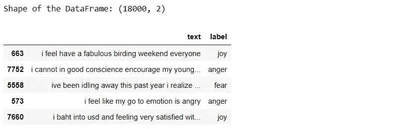

# NLP —情感分析入门

> 原文：<https://medium.com/analytics-vidhya/nlp-getting-started-with-sentiment-analysis-126fcd61cc4a?source=collection_archive---------1----------------------->


## 情感分析

顾名思义，它的意思是识别一种情况背后的观点或情绪。它的基本意思是分析和发现一篇文章或一段讲话或任何交流方式背后的情感或意图。

在本文中，我们将重点研究文本数据的情感分析。

我们人类用各种各样的语言相互交流，任何语言都只是我们试图表达自己的一种媒介或方式。无论我们说什么或写什么，都有与之相关的情感。它可能是积极的或消极的，也可能是中性的。

## 让我们举个例子——

假设有一家快餐连锁公司，他们出售各种不同的食品，如汉堡、比萨饼、三明治、奶昔等。他们创建了一个网站来销售他们的食品，现在顾客可以从他们的网站上订购任何食品。网站上有一个选项，让顾客提供反馈或评论，比如他们是否喜欢这些食物。

用户评论 1:我喜欢这个奶酪三明治，太好吃了。
网友评论 2:这个鸡肉汉堡味道非常不好。
用户评论 3:我今天点了这个披萨。

因此，正如我们看到的，在以上三篇评论中，

1.  第一次评价肯定是积极的，这表明顾客对三明治非常满意。
2.  第二次审查是否定的，因此公司需要调查他们的汉堡部门。
3.  第三个问题并不意味着客户是否满意，因此我们可以将此视为中性陈述。

通过查看上面的评论，该公司现在可以得出结论，如果他们想增加整体销售额，他们需要更多地关注三明治的生产和推广，并提高汉堡的质量。

但是，现在出现了一个问题，他们的产品会有成千上万的用户评论，一段时间后，几乎不可能浏览每一个用户评论并得出结论。

他们也不能仅凭 100 条左右的评论就得出结论，因为也许前 100-200 名顾客有相似的口味，因此他们喜欢三明治。

但随着时间的推移，当评论数量增加时，可能会出现正面评论被更多负面评论所取代的情况。

所以这就是情感分析和机器学习发挥作用的地方，让整个过程无缝衔接。用于情感分析的 ML 模型接受具有用户评论的大量数据，然后找到一种模式，并基于真实证据而不是基于小样本数据的假设得出结论。

现在，我们知道我们有三种主要的情绪与每个句子相关。但是，我们甚至可以将这些主要情绪(积极的、消极的和中性的)分解成更小的次级情绪，比如“快乐”、“爱”、“惊喜”、“悲伤”、“恐惧”、“愤怒”等等。根据需要或业务要求。

## 让我们举一个真实的例子——

1.  曾经有一段时间，像脸书这样的社交媒体服务对每个帖子只有两种情绪，也就是说，你可以喜欢一个帖子，或者你可以毫无反应地离开帖子，这意味着你不喜欢它。
2.  但是，随着时间的推移，这些对帖子的反应已经发生了变化，并成长为我们现在看到的更具体的情感，如“喜欢”、“爱”、“悲伤”、“愤怒”等。


由于这一升级，当任何公司在脸书上推广其产品时，他们都会收到更具体的评论，这反过来有助于他们改善客户体验。

正因为如此，他们现在对如何对待他们的消费者有了更细致的控制，即他们可以以不同于“愤怒”的客户的方式瞄准“悲伤”的客户，并相应地提出商业计划，因为现在，仅仅做最少的**是不够的**。


现在，我们将创建一个情感分析模型，但是说起来容易做起来难。

因为我们人类用自然语言相互交流，这对于我们来说很容易理解，但如果我们真的去研究它，它会变得更加复杂和混乱。

因为有几十亿人，他们有自己的交流方式，也就是说，语言中加入了许多微小的变化，并附加了许多情感，这对我们来说很容易理解，但对机器来说却是一个挑战。例如，我们大多数人在句子中使用讽刺，这只是说了与事实相反的话。

因此，机器学习模型很难理解这种情绪。


这就是为什么我们需要一个过程，让计算机像我们人类一样理解自然语言，这就是我们所说的自然语言处理(NLP)。

情感分析是 NLP 的一个子领域，在机器学习技术的帮助下，它试图从数据中识别和提取洞察力。

现在，让我们通过实现情感分析来尝试一下，它将预测给定语句的情感。

## 首先，让我们导入我们将在整个程序中使用的所有 python 库。

## 基本 Python 库

1.  **熊猫**——用于数据分析和数据处理。
2.  **Matplotlib** —用于数据可视化。
3.  **Seaborn** —它基于 matplotlib，为数据可视化提供了一个高级接口。
4.  **WordCloud** —用于以云的形式可视化文本数据。
5.  **re** —提供根据给定的正则表达式预处理字符串的函数。

```
import pandas as pd
import matplotlib.pyplot as plt
import seaborn as sns
from wordcloud import WordCloud
import re
```

## 自然语言处理

1.  **nltk** —自然语言工具包是一个用于自然语言处理的库集合。
2.  **停用词** —对句子没有任何意义的单词集合。
3.  **WordNetLemmatizer** —它用于将不同形式的单词转换成一个条目，但仍然保持上下文完整。

```
import nltk
from nltk.corpus import stopwords
from nltk.stem import WordNetLemmatizer
```

## sci kit-Learn(Python 的机器学习库)

1.  **计数矢量器** —用于将文本转换成矢量。
2.  **GridSearchCV** —用于 ML 模型的超参数调整。
3.  **RandomForestClassifier**—用于分类的机器学习算法。

```
from sklearn.feature_extraction.text import CountVectorizer
from sklearn.model_selection import GridSearchCV
from sklearn.ensemble import RandomForestClassifier
```

## 评估指标

1.  **准确度分数** —正确分类的实例数/实例总数。
2.  **精度分数**—它是正确预测的实例与总阳性实例的比率。
3.  **召回分数** —它是正确预测的实例与该类中所有实例的比率。
4.  **Roc 曲线**——真阳性率对假阳性率的曲线图。
5.  **分类报告** —准确率、召回率和 f1 评分报告。
6.  **混淆矩阵** —用于描述分类模型的表格。

```
from sklearn.metrics import accuracy_score,precision_score,recall_score,confusion_matrix,roc_curve,classification_report
from scikitplot.metrics import plot_confusion_matrix
```

我们将使用[这个](https://www.kaggle.com/praveengovi/emotions-dataset-for-nlp)数据集，可以在 Kaggle 上获得，用于情感分析，它由句子及其各自的情感组成，作为目标变量。该数据集包含 3 个单独的文件，分别名为 train.txt、test.txt 和 val.txt。

现在，我们将读取训练数据和验证数据。由于数据是文本格式，用分号分隔，没有列名，我们将创建数据帧，用 read_csv()和参数分别作为“分隔符”和“名称”。

```
df_train = pd.read_csv("train.txt", delimiter=';',names=['text','label'])
df_val = pd.read_csv("val.txt", delimiter=';',names=['text','label'])
```

因为我们将使用交叉验证，并且我们也有单独的测试数据集，所以我们不需要单独的验证数据集。因此，我们将连接这两个数据帧，然后我们将重置索引以避免重复索引。

```
df = pd.concat([df_train,df_val])
df.reset_index(inplace=True, drop=True)
```

我们可以使用 pandas 的“sample”方法查看数据集内容的样本，并使用“shape”方法检查维度。

```
print("Shape of the DataFrame:", df.shape)
df.sample(5)
```



现在，我们将使用 seaborn 检查数据集中的各种目标标签。

```
sns.countplot(df.label)
```


正如我们可以看到的，我们在数据集中有 6 个标签或目标。我们可以做一个多类分类器用于情感分析。但是，为了简单起见，我们将把这些标签合并成两类，即积极情绪和消极情绪。

1.  *积极情绪——“喜悦”、“爱”、“惊喜”*
2.  *消极情绪——“愤怒”、“悲伤”、“恐惧”*

现在，我们将创建一个自定义编码器，将分类目标标签转换为数字形式，即(0 和 1)。

```
def custom_encoder(df):
    df.replace(to_replace ="surprise", value =1, inplace=True)
    df.replace(to_replace ="love", value =1, inplace=True)
    df.replace(to_replace ="joy", value =1, inplace=True)
    df.replace(to_replace ="fear", value =0, inplace=True)
    df.replace(to_replace ="anger", value =0, inplace=True)
    df.replace(to_replace ="sadness", value =0, inplace=True)custom_encoder(df['label'])sns.countplot(df.label)
```


现在，我们可以看到我们的目标变成了 0 和 1，即 0 表示负，1 表示正，数据或多或少处于平衡状态。

## 数据预处理

现在，我们将对数据进行一些预处理，然后将其转换为向量，并传递给机器学习模型。

我们将创建一个数据预处理功能。

1.  首先，我们将遍历每条记录，通过使用**正则表达式**，我们将去掉除字母之外的任何字符。
2.  然后，我们将把字符串转换成小写的**，因为单词**【好】**不同于单词**【好】**。**

***注意——因为，如果我们不将字符串转换成小写，当我们创建这些单词的向量时，会导致一个问题，因为将为同一个单词创建两个不同的向量，这是我们不想要的。***

**3.然后，我们将检查数据中的停用词并删除它们。**

****术语预警** — ***停用词*** *是句子中的常用词，如“the”、“an”、“to”等。这并没有增加多少价值。***

**4.然后，我们将对每个单词执行**词条化**，即将一个单词的不同形式转换为一个词条，称为词条。**

****术语提醒** — *一个* ***词条*** *是一个词的基本形式。例如，“跑”、“奔跑”和“奔跑”都是同一个词位的形式，其中“奔跑”是引理。因此，我们把所有出现的同一个词位转换成它们各自的引理。***

**5.然后，我们将返回一个经过处理的数据语料库。**

**因此，首先，我们将创建一个 WordNetLemmatizer 对象，然后我们将执行转换。**

```
#object of WordNetLemmatizer
lm = WordNetLemmatizer()def text_transformation(df_col):
    corpus = []
    for item in df_col:
        new_item = re.sub('[^a-zA-Z]',' ',str(item))
        new_item = new_item.lower()
        new_item = new_item.split()
        new_item = [lm.lemmatize(word) for word in new_item if word not in set(stopwords.words('english'))]
        corpus.append(' '.join(str(x) for x in new_item))
    return corpuscorpus = text_transformation(df['text'])
```

**现在，我们将创建一个**字云**。**

****术语提醒**—***word cloud****是一种数据可视化技术，用于以这样一种方式描述文本，即与不太频繁的单词相比，更频繁的单词看起来更大。这让我们对数据经过所有步骤处理后的样子有了一点了解。***

```
rcParams['figure.figsize'] = 20,8
word_cloud = ""
for row in corpus:
    for word in row:
        word_cloud+=" ".join(word)
wordcloud = WordCloud(width = 1000, height = 500,background_color ='white',min_font_size = 10).generate(word_cloud)
plt.imshow(wordcloud)
```

****

## **一袋单词**

**现在，我们将使用单词袋模型(BOW)，它用于以单词袋的形式表示文本，即语法和句子中单词的顺序不被赋予任何重要性，相反，多重性，即(单词在文档中出现的次数)是主要关注点。**

**基本上，它描述了单词在文档中的总出现次数。**

****Scikit-Learn** 提供了一种使用**计数矢量器**执行单词包技术的简洁方法。**

**因此，我们将通过拟合和转换我们创建的语料库，将文本数据转换为向量。**

```
cv = CountVectorizer(ngram_range=(1,2))
traindata = cv.fit_transform(corpus)
X = traindata
y = df.label
```

**我们将 **ngram_range** 作为(1，2 ),表示二元模型。**

****术语提醒— *Ngram*** *是一行或一个句子中“n”个单词的序列。“ngram_range”是一个参数，我们使用它来赋予单词组合以重要性。***

***例如，单词“* ***【社交媒体】*** *”放在一起与单词“* ***【社交*** *”和“* ***媒体*** *”分开具有不同的含义。***

**我们可以试验 **ngram_range** 参数的值，并选择给出更好结果的选项。**

## **模型创建**

**现在是机器学习模型创建部分，在这个项目中，我将使用**随机森林分类器**，我们将使用 GridSearchCV 调整超参数。**

****GridSearchCV** ()用于根据预定义超参数的所有可能组合来拟合我们对训练数据的估计，我们将向其提供信息并为我们提供最佳模型。**

**我们将向 GridSearchCV 提供以下参数，**

1.  ****估计器或模型** —在我们的例子中是 RandomForestClassifier。**
2.  ****参数** —超参数名称及其值的字典。**
3.  ****cv** —表示交叉验证折叠。**
4.  ****return_train_score** —返回各种模型的训练分数。**
5.  ****n_jobs** —表示并行运行的作业数量(“-1”表示将使用所有 CPU 内核，这大大减少了训练时间)**

**首先，我们将创建一个字典“parameters”，它将包含不同超参数的值。**

**我们将把它作为一个参数传递给 GridSearchCV，使用这些参数的所有可能组合来训练我们的随机森林分类器模型，以找到最佳模型。**

```
parameters = {'max_features': ('auto','sqrt'),
             'n_estimators': [500, 1000, 1500],
             'max_depth': [5, 10, None],
             'min_samples_split': [5, 10, 15],
             'min_samples_leaf': [1, 2, 5, 10],
             'bootstrap': [True, False]}
```

**现在，我们将数据放入网格搜索中，并使用 GridSearchCV 的“ **best_params_** ”属性查看最佳参数。**

```
grid_search = GridSearchCV(RandomForestClassifier(),parameters,cv=5,return_train_score=True,n_jobs=-1)
grid_search.fit(X,y)
grid_search.best_params_
```

****

**然后，我们可以查看所有模型及其各自的参数，平均测试分数和等级，因为 GridSearchCV 将所有中间结果存储在 **cv_results_** 属性中。**

```
for i in range(432):
    print('Parameters: ',grid_search.cv_results_['params'][i])
    print('Mean Test Score: ',grid_search.cv_results_['mean_test_score'][i])
    print('Rank: ',grid_search.cv_results_['rank_test_score'][i])
```

****

**输出的样本**

**现在，我们将选择从 GridSearchCV 获得的最佳参数，并创建最终的随机森林分类器模型，然后训练我们的新模型。**

```
rfc = RandomForestClassifier(max_features=grid_search.best_params_['max_features'],
                                      max_depth=grid_search.best_params_['max_depth'],
                                      n_estimators=grid_search.best_params_['n_estimators'],
                                      min_samples_split=grid_search.best_params_['min_samples_split'],
                                      min_samples_leaf=grid_search.best_params_['min_samples_leaf'],
                                      bootstrap=grid_search.best_params_['bootstrap'])
rfc.fit(X,y)
```

## **测试数据转换**

**现在，我们将读取测试数据，并执行与训练数据相同的转换，最后根据预测评估模型。**

```
test_df = pd.read_csv('test.txt',delimiter=';',names=['text','label'])X_test,y_test = test_df.text,test_df.label
#encode the labels into two classes , 0 and 1
test_df = custom_encoder(y_test)
#pre-processing of text
test_corpus = text_transformation(X_test)
#convert text data into vectors
testdata = cv.transform(test_corpus)
#predict the target
predictions = rfc.predict(testdata)
```

## **模型评估**

**我们将使用各种指标来评估我们的模型，如准确度分数、精确度分数、召回分数、混淆矩阵，并创建 roc 曲线来可视化我们的模型的表现。**

```
rcParams['figure.figsize'] = 10,5
plot_confusion_matrix(y_test,predictions)
acc_score = accuracy_score(y_test,predictions)
pre_score = precision_score(y_test,predictions)
rec_score = recall_score(y_test,predictions)
print('Accuracy_score: ',acc_score)
print('Precision_score: ',pre_score)
print('Recall_score: ',rec_score)
print("-"*50)
cr = classification_report(y_test,predictions)
print(cr)
```

****

## **混淆矩阵:**

****

## **Roc 曲线:**

**我们将使用随机森林分类器的 predict_proba()方法找到类的概率，然后绘制 roc 曲线。**

```
predictions_probability = rfc.predict_proba(testdata)
fpr,tpr,thresholds = roc_curve(y_test,predictions_probability[:,1])
plt.plot(fpr,tpr)
plt.plot([0,1])
plt.title('ROC Curve')
plt.xlabel('False Positive Rate')
plt.ylabel('True Positive Rate')
plt.show()
```

****

**正如我们可以看到的，我们的模型在情感分类方面表现得非常好，准确率、精确度和召回率大约为。 **96%** 。roc 曲线和混淆矩阵也很好，这意味着我们的模型可以准确地对标签进行分类，出错的机会更少。**

**现在，我们也将检查自定义输入，并让我们的模型识别输入语句的情感。**

**预测自定义输入:**

```
def expression_check(prediction_input):
    if prediction_input == 0:
        print("Input statement has Negative Sentiment.")
    elif prediction_input == 1:
        print("Input statement has Positive Sentiment.")
    else:
        print("Invalid Statement.")# function to take the input statement and perform the same transformations
def sentiment_predictor(input):
    input = text_transformation(input)
    transformed_input = cv.transform(input)
    prediction = rfc.predict(transformed_input)
    expression_check(prediction) input1 = ["Sometimes I just want to punch someone in the face."]
input2 = ["I bought a new phone and it's so good."]sentiment_predictor(input1)
sentiment_predictor(input2)
```

****

**万岁，我们可以看到，我们的模型准确地分类了两个句子的情绪。**

**如果你喜欢这篇文章，那么请在 [LinkedIn](https://www.linkedin.com/in/nkr4nikhilraj) 上关注我。**

**并且，你可以从[这里](https://github.com/redocer/NLP_Sentiment_Analysis)得到完整的代码。**

**结局？**