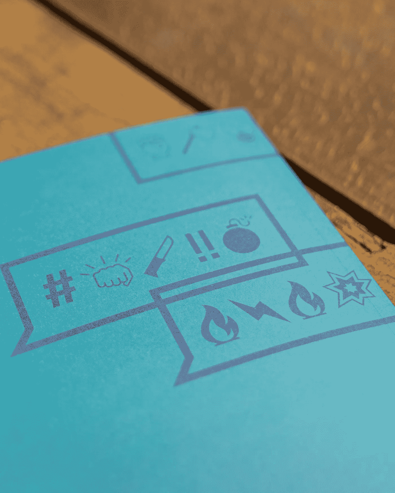
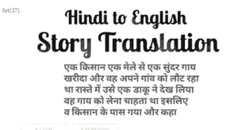
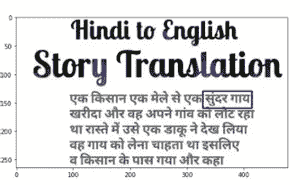
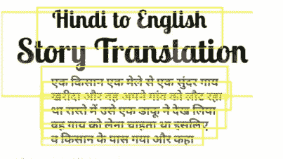

# NLP: OCR，语言翻译，文本到语音，语音到文本

> 原文：<https://medium.com/analytics-vidhya/nlp-ocr-language-translation-text-to-speech-speech-to-text-6d8682e6e886?source=collection_archive---------8----------------------->



图像[来源](https://unsplash.com/photos/QBCS3iSKAyE?utm_source=unsplash&utm_medium=referral&utm_content=creditShareLink)

当你创建一个聊天机器人或任何其他 NLP 应用程序时，会遇到许多挑战，如从图像中获取文本、将语音转换为文本或文本转换为语音、语言翻译等。

让我们先睹为快，看看这些任务是如何轻松完成的。

**OCR-光学字符识别**

我们经常需要从图片中提取文本，我们有一个库 easyocr 可以为您轻松完成这项工作。

这个库支持各种语言，包括英语、印地语、法语、中文、卡纳达语、马拉雅拉姆语等等。

它使用 3 个主要组件 Resnet、迁移学习模型、序列标记(LSTM)和解码(CTC)。

更多细节，你可以通过它的[文档。](https://github.com/JaidedAI/EasyOCR)

```
pip install easyocr
```

**语言翻译**

安装谷歌翻译语言之间的翻译

```
pip install google_trans_new
```

**文本转语音**

安装库谷歌文本到语音

```
pip install gTTs
```

导入以下库

```
from google_trans_new import google_translator  
from gtts import gTTS
from IPython.display import Audio
import matplotlib.pyplot as plt
import cv2
from pylab import rcParams
from IPython.display import Image
import easyocr
```

我们目前正在使用英语和印地语的 OCR，因此我们提到了这两种语言，更多您可以添加更多。

```
reader=easyocr.Reader(['hi','en'])
```

我刚刚从谷歌选择了一个随机图片，并将其作为我的输入图像，它有英语和印地语文本都要检查。

```
rcParams['figure.figsize'] = 8, 16
file_name = "../input/hinditoenglish/HtE.png"
Image(file_name)
```



作者图片

```
output = reader.readtext(file_name)
output
```

这给出了:

```
[([[89, 0], [399, 0], [399, 59], [89, 59]],
  'Hidi to Egliah',
  0.05413757637143135),
 ([[14, 44], [477, 44], [477, 135], [14, 135]],
  'Story Traalation',
  0.12739677727222443),
 ([[229, 121], [336, 121], [336, 163], [229, 163]],
  'मेले से एक',
  0.11104584485292435),
 ([[128, 128], [198, 128], [198, 154], [128, 154]],
  'किसान',
  0.47020599246025085),
 ([[328, 130], [414, 130], [414, 160], [328, 160]],
  'सुंदर गाय',
  0.1349133998155594),
 ([[90, 132], [130, 132], [130, 156], [90, 156]], 'एक', 0.928795337677002),
 ([[196, 132], [236, 132], [236, 156], [196, 156]], 'एक', 0.9367656111717224),
 ([[90, 154], [422, 154], [422, 184], [90, 184]],
  'खरीदा और वह अपने गांव को लौट रहा',
  0.010415691882371902),
 ([[89, 177], [411, 177], [411, 218], [89, 218]],
  'था रास्ते में उसे एक डाकू ने देख लिया',
  0.0011817723279818892),
 ([[90, 208], [396, 208], [396, 238], [90, 238]],
  'वह गाय को लेना चाहता था इसलिए',
  0.009780121967196465),
 ([[90, 234], [368, 234], [368, 264], [90, 264]],
  'व किसान के पास गया और कहा',
  0.018567530438303947)]
```

选择一个文本，并尝试在坐标的帮助下在它周围制作一个边界，以查看它选择了正确的文本。

```
cordinates = output[4][0]
x_min, y_min = [int(min(idx)) for idx in zip(*cordinates)]
x_max, y_max = [int(max(idx)) for idx in zip(*cordinates)]
image = cv2.imread(file_name)
cv2.rectangle(image,(x_min,y_min),(x_max,y_max),(255,0,0),2)
plt.imshow(cv2.cvtColor(image, cv2.COLOR_BGR2RGB))
```



作者图片

试图在每个文本上划分界限。

```
bounds = reader.readtext(file_name, add_margin=0.55, width_ths=0.7, link_threshold=0.8, decoder='beamsearch',blocklist='=-')
bounds
```

它给出的输出为:

```
[([[68, 0], [418, 0], [418, 78], [68, 78]],
  ' Hindi to Engliah',
  0.08436790853738785),
 ([[0, 9], [477, 9], [477, 170], [0, 170]],
  'Stry Traulalion',
  0.14103898406028748),
 ([[76, 112], [428, 112], [428, 174], [76, 174]],
  'एक किसान एक मेले से एक सुंदर गाय',
  0.19112536311149597),
 ([[78, 142], [434, 142], [434, 196], [78, 196]],
  'खरीदा औ़र वह अपने गांव को लौट रहा',
  0.07050563395023346),
 ([[75, 165], [425, 165], [425, 231], [75, 231]],
  'था रास्ते में उसे एक डाकूने देखलिया',
  0.0004027755931019783),
 ([[78, 196], [408, 196], [408, 250], [78, 250]],
  'वहू गाय को लेना चाहर्ता था इसलिए',
  0.031241701915860176),
 ([[77, 221], [381, 221], [381, 264], [77, 264]],
  'वकिसान के पास गया और कहा',
  0.02784109301865101)]import PIL
from PIL import ImageDraw
im=PIL.Image.open('../input/hinditoenglish/HtE.png')def draw_boxes(image, bounds, color='yellow', width=2):
    draw = ImageDraw.Draw(image)
    for bound in bounds:
        p0, p1, p2, p3 = bound[0]
        draw.line([*p0, *p1, *p2, *p3, *p0], fill=color, width=width)
    return image

draw_boxes(im, bounds)
```



作者图片

从没有坐标的图像中只提取文本。

```
text_list = reader.readtext(file_name, add_margin=0.55, width_ths=0.7, link_threshold=0.8, decoder='beamsearch',blocklist='=-', detail=0)
text_list
```

这段代码的输出如下:

```
[' Hindi to Engliah',
 'Stry Traulalion',
 'एक किसान एक मेले से एक सुंदर गाय',
 'खरीदा औ़र वह अपने गांव को लौट रहा',
 'था रास्ते में उसे एक डाकूने देखलिया',
 'वहू गाय को लेना चाहर्ता था इसलिए',
 'वकिसान के पास गया और कहा']
```

分隔英语和印地语文本

```
text_hi=text_list[2] + " "+text_list[3] + " "+text_list[4] + " "+text_list[5] + " "+text_list[6] text_en=text_list[0] + " "+text_list[1]
```

**如果我们选择语言为“hi ”,文本将转换为印地语 ascent 中的语音**

```
ta_tts=gTTS(text_hi, lang='hi')
ta_tts.save('trans.mp3')
Audio('trans.mp3' , autoplay=True)
```

在英语 ascent 中，如果我们选择语言为“en ”,文本将转换为语音

```
ta_tts=gTTS(text_en, lang='en')
ta_tts.save('trans.mp3')
Audio('trans.mp3' , autoplay=True)
```

你可以尝试用不同的语言来玩这个游戏，从中获得乐趣。

如果我们想将**印地语翻译成英语，谷歌翻译如下:**

```
translator = google_translator()
text_en=translator.translate(text_hi, lang_tgt='en')
print(text_en)
```

这就给出了:

```
A farmer bought a beautiful cow from a fair and he was returning to his village, on the way he wanted to take a cow to see a robber, so went to the farmer and said
```

你可以用同样的方法翻译成不同的语言。

**语音识别-语音转文本**

将语音转换成文本需要一个名为 PyAudio 的库。

PyAudio 为 PortAudio 提供了到 python 的绑定，PortAudio 是跨平台的音频输入/输出库。使用 PyAudio，您可以轻松地使用 Python 在各种平台上播放和录制音频。

只有当我们想要使用麦克风输入时，PyAudio 才是必需的，否则它将返回一个错误。

```
pip install PyAudio   # or conda install PyAudio
```

安装用于执行语音识别的库，这是一个功能齐全且易于使用的 Python 语音识别库。

```
pip install SpeechRecognition
```

为语音识别器导入下列库。

```
import speech_recognition as sr
import pyaudio
```

运行这段代码说点什么，然后看它转换成文本。

```
# this will require PyAudio because it uses the Microphone classimport speech_recognition as sr     
r = sr.Recognizer()
with sr.Microphone() as source:          
    audio = r.listen(source) try:
    print("You said " + r.recognize_google(audio))  
    # recognize speech using Google Speech Recognition
except LookupError:                    # if speech is unintelligible
    print("Could not understand audio")
```

这个功能可以用在很多事情上，比如通过语音在谷歌或 youtube 上进行搜索。

这些是 NLP 应用程序中经常使用的函数。所有这些都可以在上面给出的库的帮助下以非常简单的方式完成。然而，如果有人想为社区的帮助而使图书馆变得更完美，他们可以这样做。

这些功能可以在聊天机器人中使用，以支持不同的语言，添加语音功能，甚至从图像中检索文本以供进一步处理或获取信息。

感谢阅读！

*原载于 2021 年 1 月 21 日*[*【https://www.numpyninja.com】*](https://www.numpyninja.com/post/nlp-ocr-language-translation-text-to-speech-speech-to-text)*。*