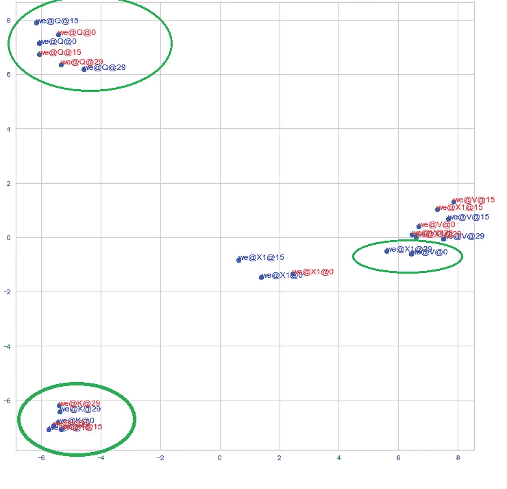

# NLP 变压器测试

> 原文：<https://medium.com/analytics-vidhya/nlp-transformer-unit-test-95459fefbea9?source=collection_archive---------4----------------------->

在机器学习中，很难可视化或测试小东西。当它是自然语言处理时，领域是自然语言，这个任务变得更加困难。
我试图创建一个非常非常小的样本数据集，以最简单的方式测试 transformer。我从教程中获取了基础代码，并根据我的调试意图更改了路径和变量名。

我从[这里](#https://github.com/bentrevett/pytorch-seq2seq/blob/master/6%20-%20Attention%20is%20All%20You%20Need.ipynb)得到基础代码。但是我变化太大了，所以你可能跟不上我的台词。代码在 github，但使用 nbviewer.com 查看颜色。nbviewer 中的
代码[链接](https://nbviewer.jupyter.org/github/mcelikkaya/medium_articles/blob/main/transformer_debugging.ipynb)github 中的
代码[链接](https://github.com/mcelikkaya/medium_articles/blob/main/transformer_debugging.ipynb)

我将重点测试 transformer 的学习阶段。如果你不知道主题，请阅读关于变压器的好教程。这只是为了更好地理解变压器架构的可视化。在接下来的两篇文章中，你会看到变压器逻辑中的**自我关注**和 **Q，K，V** 。

[第二部分:自我关注](https://celikkam.medium.com/how-self-attention-works-in-transformer-6c76a12396b0)
[第三部分:Q、K、V](https://celikkam.medium.com/understanding-q-k-v-in-transformer-self-attention-9a5eddaa5960)

此外，你必须知道编码器-解码器架构和编码器-解码器与**注意**架构，以了解变压器。我在帖子里一般用向量这个词代替张量。

该数据集包含英语到德语的句子。这是一个平衡的集合，每个单词在他的组(主语、宾语、动词)中出现的频率相同。有一种“想”的模式，导致翻译长短不一。此外,“能”和“想要”模式在翻译中导致不同的顺序，因此翻译也必须了解位置。还有简单的句型“我吃苹果”，动词+宾语产生不同的顺序。即使你不知道德语单词是如此简单。你可以查下表，看看哪个单词对应哪个英语单词。此外，句子非常简单，不正确(丢失的文章…)事实上，你可以改变第二栏，输入你的语言并尝试。(还必须将笔记本中的德语单词换成您的语言中的单词。我将为日本人做一个样品)

transformer 不同于其他网络架构的地方在于**自我关注**。在神经网络中，我们有一个输入域和输出域，我们为映射训练网络。

在 NLP 任务中，我们有句子作为输入，我们给出这些句子作为输入，我们通常有一个嵌入层来从这些句子中创建向量。在 pytorch 中，torch.nn.Embedding 是一个可训练的查找表。可训练意味着它将通过训练更好地模拟单词之间的关系。


建模单词

如果我们想要捕捉一个单词的每一个方面，我们必须创建一个如上的表，并有数千个列来完美地创建每个单词的向量。在嵌入层中，我们通过训练网络用低维(64，128，512…)实现这一点。这里嵌入层通过检查丢失在每个时期更新它的矢量。

我想我把所有的英文单词都分了列。就拿“金星”这个词来说吧，历史上有没有人“我在金星吃苹果”，正常情况下肯定没有，所以在“金星”一栏下面肯定有 0 或者某个非常非常低的值来平滑。所以训练一个语言模型实际上是试图理解这些关系，以此作为起点。

在 transformer 上，我们仍然有嵌入层，但是我们也使用了另一种方法来创建单词的向量。(Q，K，V 我们用嵌入作为开始向量，尝试学习更好的)。如果我们根据上下文生成向量，那么我们就获得了对解空间的类似人类的理解。人类就是这样做的，对吗？当我们在一个句子中看到“苹果”时，我们可以期待那个句子有一个动词**“吃”**。因此，当你用大量的句子训练一个网络时，它会模拟单词之间的关系。

transformer 架构具有自我关注功能，可以从句子本身创建向量。所以在自我关注时，输入和输出领域是相同的。(在**的**层，这是完全真实的，**的**层同样真实，但是在**的**层就有点不同了。检查 MultiHeadAttentionLayer 代码。

代码的相关部分

在自我关注层，我们尝试学习 3 个权重(线性层)。(Q，K，V)
我们通过输入数据来训练这些网络，并试图根据每个单词的句子来获得它的良好表示。假设我们有两个句子。
**-我们吃苹果
-我们吃面包**
我们会为【我们，吃，苹果，面包】生成向量，为句子生成向量。但是**【吃面包】**一定是和**【吃苹果】**不同的动作。因此，在这些步骤中，网络生成的矢量肯定略有不同。基本上，我们试图根据上下文来学习好的向量表示。

**矢【我们，吃，苹果】** =矢【我们】，矢【吃】，矢【苹果】
**矢【我们，吃，面包】** =矢【我们】，矢【吃】，矢【面包】

想想**的“吃”字，即使是同一个字，在不同的句子里也一定有不同的、可分的向量。**

**另一种思考方式是，在我的集合中,“can”与许多单词一起出现，但“apple”只与“eat”一起出现，因此“eat”和“apple”必须比“can”更多地添加到彼此的表示中。这实际上是人类的思维方式，我们通过检查句子中的其他单词来捕捉句子中一个单词的意思。如果我要你填下面这句话**“我要 ___ 苹果”**，你不会说“我要踢苹果”或者“我要读苹果”，因为你从来没见过这样的样本。这就是我们在这里用向量数学所做的。**

****变形金刚如何学习？****

**为了展示学习过程，我创建了一个实用程序类来记录每个时期的向量值。**

**如果你检查 MultiHeadAttentionLayer 类，有 4 个重要的向量。q，K，V，X1。
X1 是 MultiHeadAttentionLayer 的最终向量。(请检查代码，解释一切会很长。)**

**所以我记录了重要向量 Q，K，V，X1…训练的所有中间步骤。训练有 30 个纪元。所以纪元是 1… 29，30。下图显示了这些向量随时间的变化。**

**这些向量实际上是 64 维的。为了形象化，我把它们缩小到 2 或 3 维。下图显示了它们是如何改变位置以获得最佳空间位置的。正如你所看到的，通过训练，网络稍微改变向量以更好地学习。正如我所说，训练是学习重量，并学习如何将输入转换为最佳向量，以减少损失。**

****

****向量如何随着训练而变化。****

**每个句子都有不同的颜色。您将在图表中看到如下项目。**

**we@X1@30
的意思是:
**字** : we
**向量** :X1
**在历元** : 30
我得到第 1、15、30 步(只是试多了也看)**

**检查 **we@X1@1** 、 **we@X1@15** 、 **we@X1@30** 如何改变位置。下图为**“吃”**。**

**检查 Q、K、V 和 X1 群集。你能看到星团彼此靠近吗？在新标签页打开图片，你需要看到完整的图片。你也可以玩代码，看看更多的步骤或所有步骤。(搜索章节**#随时间变化的矢量**)**

****

****训练过程如何利用 q、k、v 生成不同的 x1****

**从上面可以看出，网络对 Q，K，V 做了很小的改变，使得 X1 对于不同的上下文是不同的。虽然第一历元值是随机的，但是对于 Q、K、V，最终结果不会改变太多，因为我们用学习率进行小的更新，但是 X1 可能会有大的变化，因为它是用这些值的组合计算的。(Softmax( (K*V)/Scale) ) * V)**

**让我用一张图展示给你看。**

****

****网络如何遍历每个单词的不同位置(向量)。****

**现在我们来玩一个不同的向量。 **src_final** 。在编码器层**中，src_final** 是最后一个矢量。(检查我的代码命名)你可以认为它是层的最后输出。所以它意味着你如何总结你的输入句子。**“我能吃苹果”**是给人类的。计算机用向量来表达这一点。所以向量的每一个维度都代表了一些特征。**

```
test_sentences = [
"i can eat apple",
"i can eat bread",
"i can **eat book**",
"i can **eat newspaper**",
"i can **eat apple book**"]
```

**我创造了 5 个测试句子。如你所见，第一句和第二句是有效句。第三句**“吃书”**和第四句**“吃报纸”**是无意义的句子。在第五句话中,**“苹果”**和**“书”**都存在。以上 5 句翻译如下:(3，4，5 翻译不正确)**

```
**translation** ['ich', 'konnen', 'apfel', 'essen', '<eos>']
**translation** ['ich', 'konnen', 'brot', 'essen', '<eos>']
**translation** ['ich', 'konnen', 'apfel', 'essen', '<eos>']
**translation** ['ich', 'konnen', 'brot', 'essen', '<eos>']
**translation** ['ich', 'konnen', 'apfel', 'essen', '<eos>']
```

**他们给出了以上翻译。如你所见,“吃”在坏句子中占主导地位，他们用“吃”造出句子。(网络也能产生阅读书籍，但动词更占优势。)**

**现在让我们看看网络是如何为这些生成矢量的。**

****

**正如你所看到的，有正确单词(1 和 2)和 5(包括相同的单词)的句子有相似的向量。观察到**“can”**向量位于相似的位置。因此，即使我们为同一个单词**“吃”**生成向量，我们也位于空间的不同部分。“can”向量也可以形成一个更紧凑的簇。**

# **网络学习与训练**

**现在让我们试着将注意力的训练过程形象化。我会通过步骤转储训练步骤注意力分数。在训练步骤 1 中，你会发现注意力是随机的。随着时间的推移，它变得更好，最后一步是把注意力放在适当的地方。在下面的代码中，你可以看到我是如何收集各个时期(0，10，20，30)的注意力向量的，如果你想在不同的时期看到更多或不同的注意力向量，可以看看第 5 行。**

**在下图中，你可以看到翻译步骤中注意力向量的变化。
**栏目**【SOS，we，can，eat，apple，eos，pad】为源词。
**索引**【1】SOS-wir，2)wir- > konnen，3)konnen- > apfel，4)apfel- > essen，5)essen- > eos】显示每一步的翻译单词。
你一定认为它是最后一个生成的字——>在这一步生成的字。**

****"1)sos- > wir"** :表示翻译步骤 1，从“sos”到“wir”，意味着翻译中的第一个单词预测，在初始步骤中，我们只有“sos”，我们预测“wir”。**

**在纪元 1，我们可以看到注意力集中在**【SOS】**。如果你检查纪元 30(最后一个纪元)，注意力在**“我们”**。检查其他纪元。**

****

****各时期注意力的变化****

**在**【埃森】****【SOS】**之后的最后一个纪元似乎有了更多的关注。但是不要忘记，注意力并不是我们用来产生最终结果的唯一媒介。所以让我把培训后的翻译过程甩了。让我们打印翻译信息。**

**我有一个方法叫做 translate_info，它展示了翻译的逻辑和注意事项。 **Logits** 是 Softmax 之前分类模型的原始(非归一化)分数。然后 softmax 生成这些分数的概率总和为 1。**

**翻译是从输入**【SOS】**生成下一个单词的过程，直到生成输出**【EOS】**(或者到我们尝试的最大长度)。所以当你看到下图时，它显示了每个翻译步骤的逻辑和注意事项。所以如果输入句子是**“我能吃苹果”**，翻译过程有 5 个步骤，**“ich konnen apfel essen<EOS>**。**

**如下图所示，在最后一步，虽然注意力更多地集中在**【SOS】**上，但 Logit 显示了最高点的**【EOS】**。表格显示了每个步骤的逻辑，热图显示了(翻译流程的)每个步骤的注意力。**

****

# **自我关注的重要性**

**如前所述，transformer 是对编码器-解码器架构的改进。Transformer 的要点是在每个状态中以最佳方式使用编码器状态。正如你在上面的热图中看到的，它改变了翻译过程中每一步的注意力。现在我将试着想象一下注意力机制的重要性。我将使用默认的注意机制(第 25 行下面的代码)以正常的方式翻译所有的句子。
然后，我将对所有的编码器状态(第 27 行以下的代码)进行同等关注的翻译(我们不在乎我们通过训练学到的向量，认为所有的单词在源句子中具有同等的重要性)(你可以在本教程的第二部分看到这个逻辑的细节)**

**我使用的矢量是 DecoderLayer 末尾的**“tr G4”**矢量。也认为我得到了翻译过程的所有中间步骤。对于翻译[ich，mochten，apfel，essen，eos]创建 5 个向量。我还检查生成句子的长度。(第 14 行)。**

**但是当我没有以适当的方式运用注意力时，句子的顺序就会改变。如果你检查下面的方法，我发送过滤字。这意味着，在翻译步骤 1，我们希望网络生成**【ich】**或**【wir】**。对于无效的注意力应用句子，我只过滤产生**【ich】**或**【wir】**的句子。在这里，我试图说明，即使网络生成同一个单词，它的编码也是不同的。我这样做不是“比较苹果**和橘子**的。我所比较的向量属于同一类型，象征着同一事物。(我只是在比较[ich，wir]有效向量(有自我注意)和[ich，wir]无效向量(同等注意)。**

**同样在所有的句子中，我用粉红色标记无效的句子，无效句子的结尾有如下后缀:**

****吃**::！！!"
**喝**:"]]"
**读作** : " < < <"**

**第一张图片下面是翻译步骤 1。在翻译步骤 1 中，我们通常会生成什么，要么是“ich”，要么是“wir”。所以你可以看到左边部分是**“ich”(我)**，右边部分是**“wir”(我们)**。网络很好地分离了这些媒介。(我使用源句子作为标签，这给出了更多的想法)**

****

**在下图中，当我们包括残疾人时，你可以看到他们位于中间。不够分离。此外，即使注意力没有适当地应用，网络仍然在第一步生成“ich”或“wir ”,但是正如你所看到的，它们的表示与其他的非常不同。**

**下面我们来口头陈述一下图片**:****

> *****没有* **注意**
> 即使我们创建了
> 相同的向量[ **ich，wir** ]
> 在同一个步骤(翻译的第一步)
> 那些向量[ **ich，wir** ]不同于用**注意**创建的相同向量[ **ich，wir** ]
> 。****

********

****在翻译步骤 2 中，我们有["konnen，" mochten"]，所以下图显示了网络如何学会分离它们。右边可以看到“能”，左边是“要”。****

********

****下面我们看到，当我们没有应用自我关注时，只有很少的句子生成[konnen，mochten]，正如你看到的，它们远离正常的集群。****

> ****没有**关注**
> 即使我们创建了
> 相同的向量[ **konnen，mochten** ]
> 在同一个步骤(2 步翻译)
> 向量[ **konnen，mochten** ]不同于用关注创建的相同向量【konnen，mochten】
> 。****

********

****在翻译步骤 3 中，我们有["buch "，" zeitung "，" apfel "，" brot "，" wasser "，" beer"]，所以下图显示了网络如何将它们分开。你可以看到物体集群。****

********

****在下图中，当添加了残疾人，你可以看到粉红色的句子是如何分散的。****

********

****在 4 个步骤中，我们生成动词。如下图所示，它们在下图中是分开的。甚至你可以看到动词被动词+宾语分开。****

********

****当我们添加残疾人时，你可以看到粉红色分散在图像上。****

********

****正如你所看到的，当我们不应用 transformer **自我关注**(在所有翻译步骤中将注意力平均分配给所有单词)时，表示相同单词的向量被破坏了。因为缺乏良好的关注，他们没有足够的分离。他们没有抓住上下文。****

****在这篇文章中，我试图展示 Transformer architecture 正在学习什么，以及我们如何更好地了解它。阅读关于**注意力**和 **Q、K、V** 的帖子，以获得更多更详细的想法。****