# Python 中文本分类的 NLP 教程

> 原文：<https://medium.com/analytics-vidhya/nlp-tutorial-for-text-classification-in-python-8f19cd17b49e?source=collection_archive---------0----------------------->

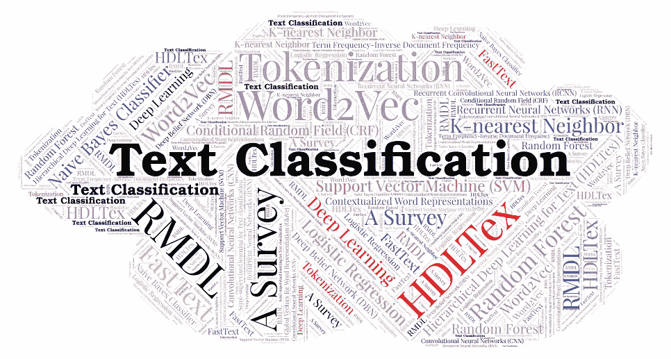

文本形式的非结构化数据:聊天记录、电子邮件、社交媒体、调查反馈如今无处不在。文本可以是丰富的信息来源，但由于其非结构化的性质，很难从中提取真知灼见。

文本分类是有监督机器学习的重要任务之一。这是一个为文档分配标签/类别的过程，帮助我们以经济高效的方式自动快速构建和分析文本。它是自然语言处理的基本任务之一，具有广泛的应用，如情感分析、垃圾邮件检测、主题标注、意图检测等。

***在这篇文章中，我将带你一步步了解我们如何使用 Python*** 进行文本分类。我已经在 GitHub 上传了完整的代码:[https://github.com/vijayaiitk/NLP-text-classification-model](https://github.com/vijayaiitk/NLP-text-classification-model)

让我们将分类问题分成以下步骤:

1.  设置:导入库
2.  加载数据集和探索性数据分析
3.  文本预处理
4.  从文本中提取矢量(矢量化)
5.  运行 ML 算法
6.  结论

# 步骤 1:导入库

第一步是导入以下库列表:

```
import pandas as pd
import numpy as np**#for text pre-processing**
import re, string
import nltk
from nltk.tokenize import word_tokenize
from nltk.corpus import stopwords
from nltk.tokenize import word_tokenize
from nltk.stem import SnowballStemmer
from nltk.corpus import wordnet
from nltk.stem import WordNetLemmatizernltk.download('punkt')
nltk.download('averaged_perceptron_tagger')
nltk.download('wordnet')**#for model-building**
from sklearn.model_selection import train_test_split
from sklearn.linear_model import LogisticRegression
from sklearn.naive_bayes import MultinomialNB
from sklearn.metrics import classification_report, f1_score, accuracy_score, confusion_matrix
from sklearn.metrics import roc_curve, auc, roc_auc_score**# bag of words**
from sklearn.feature_extraction.text import TfidfVectorizer
from sklearn.feature_extraction.text import CountVectorizer**#for word embedding**
import gensim
from gensim.models import Word2Vec
```

# 步骤 2:加载数据集和 EDA

我们将在本文中使用的数据集是著名的“ [***自然语言处理灾难推文***](https://www.kaggle.com/c/nlp-getting-started/overview) ”数据集，其中我们将预测给定推文是关于真实灾难(目标=1)还是关于真实灾难(目标=0)

*在这场比赛中，你面临的挑战是建立一个机器学习模型，预测哪些推文是关于真正的灾难，哪些不是。你可以访问一个由 10，000 条推文组成的数据集，这些推文都是经过人工分类的。*

在 Kaggle 笔记本中加载数据集:

```
**df_train**= pd.read_csv('../input/nlp-getting-started/train.csv')
**df_test**=pd.read_csv('../input/nlp-getting-started/test.csv')
```

我们在训练(有标签的)数据集中有 7613 条推文，在测试(无标签的)数据集中有 3263 条推文。这是我们将用于构建模型的训练/标记数据集的快照

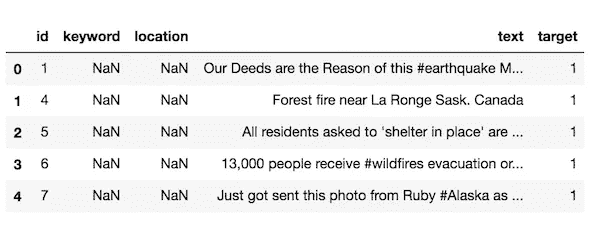

标记数据集的快照

**探索性数据分析(EDA)**

1.  ***类别分布*** :类别 0(无灾害)的推文比类别 1(灾害推文)多。我们可以说，该数据集相对平衡，有 4342 条非灾难推文(57%)和 3271 条灾难推文(43%)。因为数据是平衡的，所以在构建模型时我们不会应用 SMOTE 这样的数据平衡技术

```
x=df_train['target'].value_counts()
print(x)
sns.barplot(x.index,x)
```

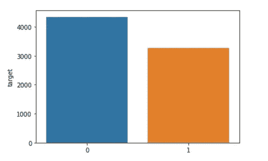

阶级分布

2. ***缺失值*** :我们在位置字段中有大约 2.5k 个缺失值，在关键字列中有 61 个缺失值

```
df_train.isna().sum()
```

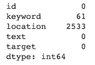

3. ***一条微博的字数*** :灾难微博比非灾难微博更啰嗦

```
**# WORD-COUNT**
df_train['word_count'] = df_train['text'].apply(lambda x: len(str(x).split()))
print(df_train[df_train['target']==1]['word_count'].mean()) #Disaster tweets
print(df_train[df_train['target']==0]['word_count'].mean()) #Non-Disaster tweets
```

一条灾难微博的平均字数是 15.17 个字，而一条非灾难微博的平均字数是 14.7 个字

```
**# PLOTTING WORD-COUNT**
fig,(ax1,ax2)=plt.subplots(1,2,figsize=(10,4))
train_words=df_train[df_train['target']==1]['word_count']
ax1.hist(train_words,color='red')
ax1.set_title('Disaster tweets')
train_words=df_train[df_train['target']==0]['word_count']
ax2.hist(train_words,color='green')
ax2.set_title('Non-disaster tweets')
fig.suptitle('Words per tweet')
plt.show()
```

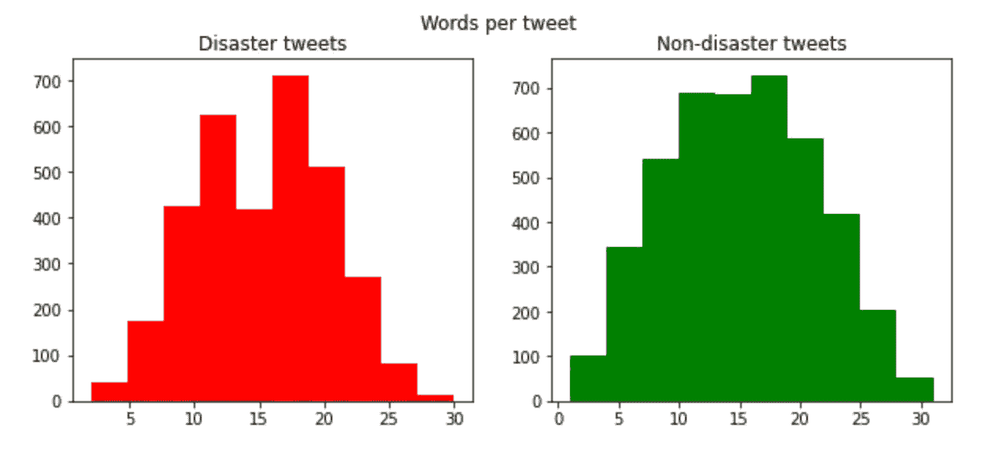

每条推文的字数图(灾难与非灾难推文)

4. ***一条微博的字数*** :灾难微博比非灾难微博长

```
**# CHARACTER-COUNT**
df_train['char_count'] = df_train['text'].apply(lambda x: len(str(x)))
print(df_train[df_train['target']==1]['char_count'].mean()) #Disaster tweets
print(df_train[df_train['target']==0]['char_count'].mean()) #Non-Disaster tweets
```

一条灾难微博的平均字数是 108.1 个，相比之下，一条非灾难微博的平均字数是 95.7 个

# 步骤 3:文本预处理

在我们开始建模之前，我们需要通过删除标点符号&特殊字符、清理文本、删除停用词和应用词汇化来预处理我们的数据集

***简单的文本清理流程*** :一些常见的文本清理流程包括:

*   删除标点符号、特殊字符、网址和标签
*   删除前导空格、尾随空格和额外空格/制表符
*   错别字、俚语被纠正，缩写以其长形式书写

***停用词移除*** :我们可以使用 *nltk 从英语词汇中移除一系列通用停用词。*这样的词有“我”、“你”、“一个”、“这个”、“他”、“哪个”等。

***词汇化:是将单词还原为其基本形式的过程***

***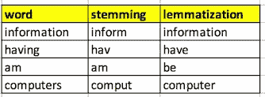***

***词干化与词汇化***

***下面是文本预处理的代码:***

```
*#**convert to lowercase, strip and remove punctuations**
def preprocess(text):
    text = text.lower() 
    text=text.strip()  
    text=re.compile('<.*?>').sub('', text) 
    text = re.compile('[%s]' % re.escape(string.punctuation)).sub(' ', text)  
    text = re.sub('\s+', ' ', text)  
    text = re.sub(r'\[[0-9]*\]',' ',text) 
    text=re.sub(r'[^\w\s]', '', str(text).lower().strip())
    text = re.sub(r'\d',' ',text) 
    text = re.sub(r'\s+',' ',text) 
    return text # **STOPWORD REMOVAL**
def stopword(string):
    a= [i for i in string.split() if i not in stopwords.words('english')]
    return ' '.join(a)**#LEMMATIZATION**
# Initialize the lemmatizer
wl = WordNetLemmatizer()

# This is a helper function to map NTLK position tags
def get_wordnet_pos(tag):
    if tag.startswith('J'):
        return wordnet.ADJ
    elif tag.startswith('V'):
        return wordnet.VERB
    elif tag.startswith('N'):
        return wordnet.NOUN
    elif tag.startswith('R'):
        return wordnet.ADV
    else:
        return wordnet.NOUN# Tokenize the sentence
def lemmatizer(string):
    word_pos_tags = nltk.pos_tag(word_tokenize(string)) # Get position tags
    a=[wl.lemmatize(tag[0], get_wordnet_pos(tag[1])) for idx, tag in enumerate(word_pos_tags)] # Map the position tag and lemmatize the word/token
    return " ".join(a)*
```

*****最终预处理*****

```
*def finalpreprocess(string):
    return lemmatizer(stopword(preprocess(string)))df_train['clean_text'] = df_train['text'].apply(lambda x: finalpreprocess(x))
df_train.head()*
```

***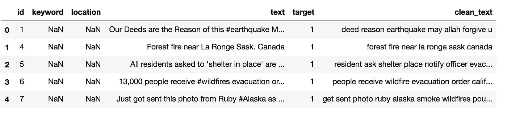***

***清理的文本快照***

# ***步骤 4:从文本中提取矢量(矢量化)***

***在建立机器学习模型时，很难处理文本数据，因为这些模型需要定义良好的数字数据。将文本数据转换成数字数据/向量的过程称为**矢量化**或者在 NLP 世界中称为单词嵌入**。*单词包*** *(BoW)* 和 ***单词嵌入****(*with Word 2 vec)是将文本数据转换为数值数据的两种众所周知的方法。***

*****包单词**有几个版本，对应不同的单词评分方法。我们使用 Sklearn 库通过以下方法计算 BoW 数值:***

1.  *****Count vectors** :它从文档语料库中构建一个词汇表，并计算单词在每个文档中出现的次数***

***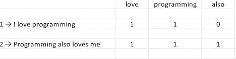***

***计数向量***

***2.**术语频率-逆文档频率(tf-Idf)** :计数向量可能不是将文本数据转换为数字数据的最佳表示。因此，除了简单的计数，我们还可以使用单词包的高级变体，它使用**术语频率-逆文档频率**(或 Tf-Idf) **。**基本上，一个单词的值随着在文档中的计数成比例地增加，但是它与该单词在语料库中的频率成反比***

******Word2Vec*** :使用**词袋**技术的一个主要缺点是，它不能从向量中捕获词的含义或关系。Word2Vec 是使用浅层神经网络学习单词嵌入的最流行的技术之一，浅层神经网络能够捕捉文档中单词的上下文、语义和句法相似性、与其他单词的关系等。***

***我们可以使用这些方法中的任何一种将我们的文本数据转换成数字形式，这将用于构建分类模型。考虑到这一点，我将首先使用下面提到的代码将数据集划分为训练集(80%)和测试集(20%)***

```
***#SPLITTING THE TRAINING DATASET INTO TRAIN AND TEST**
X_train, X_test, y_train, y_test = train_test_split(df_train["clean_text"],df_train["target"],test_size=0.2,shuffle=True)**#Word2Vec** # Word2Vec runs on tokenized sentences
X_train_tok= [nltk.word_tokenize(i) for i in X_train]  
X_test_tok= [nltk.word_tokenize(i) for i in X_test]*
```

***下面是使用 ***单词包*** (使用 Tf-Idf)和 **Word2Vec** 进行矢量化的代码***

```
***#Tf-Idf**
tfidf_vectorizer = TfidfVectorizer(use_idf=True)
X_train_vectors_tfidf = tfidf_vectorizer.fit_transform(X_train) 
X_test_vectors_tfidf = tfidf_vectorizer.transform(X_test)**#building Word2Vec model**
class MeanEmbeddingVectorizer(object):
    def __init__(self, word2vec):
        self.word2vec = word2vec
        # if a text is empty we should return a vector of zeros
        # with the same dimensionality as all the other vectors
        self.dim = len(next(iter(word2vec.values())))def fit(self, X, y):
        return selfdef transform(self, X):
        return np.array([
            np.mean([self.word2vec[w] for w in words if w in self.word2vec]
                    or [np.zeros(self.dim)], axis=0)
            for words in X
        ])w2v = dict(zip(model.wv.index2word, model.wv.syn0)) df['clean_text_tok']=[nltk.word_tokenize(i) for i in df['clean_text']]
model = Word2Vec(df['clean_text_tok'],min_count=1)     
modelw = MeanEmbeddingVectorizer(w2v)**# converting text to numerical data using Word2Vec**
X_train_vectors_w2v = modelw.transform(X_train_tok)
X_val_vectors_w2v = modelw.transform(X_test_tok)*
```

# ***第五步。运行 ML 算法***

***是时候在矢量化数据集上训练一个**机器学习模型**并进行测试了。现在我们已经将文本数据转换为数值数据，我们可以在***X _ train _ vector _ tfi df***&***y _ train****上运行 ML 模型。*我们将在***X _ test _ vectors _ tfi df***上测试该模型，得到 ***y_predict*** 并进一步评估该模型的性能***

1.  *****Logistic 回归:**我们先从最简单的一个 Logistic 回归开始。您可以使用下面几行代码在 scikit 中轻松构建一个 LogisticRegression***

```
***#FITTING THE CLASSIFICATION MODEL using Logistic Regression(tf-idf)**lr_tfidf=LogisticRegression(solver = 'liblinear', C=10, penalty = 'l2')
lr_tfidf.fit(X_train_vectors_tfidf, y_train) **#Predict y value for test dataset**
y_predict = lr_tfidf.predict(X_test_vectors_tfidf)
y_prob = lr_tfidf.predict_proba(X_test_vectors_tfidf)[:,1]print(classification_report(y_test,y_predict))
print('Confusion Matrix:',confusion_matrix(y_test, y_predict))

fpr, tpr, thresholds = roc_curve(y_test, y_prob)
roc_auc = auc(fpr, tpr)
print('AUC:', roc_auc)*
```

***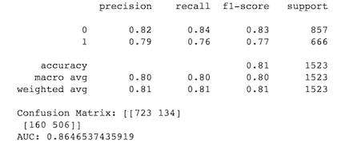***

```
***#FITTING THE CLASSIFICATION MODEL using Logistic Regression (W2v)**
lr_w2v=LogisticRegression(solver = 'liblinear', C=10, penalty = 'l2')
lr_w2v.fit(X_train_vectors_w2v, y_train)  #model**#Predict y value for test dataset**
y_predict = lr_w2v.predict(X_test_vectors_w2v)
y_prob = lr_w2v.predict_proba(X_test_vectors_w2v)[:,1]print(classification_report(y_test,y_predict))
print('Confusion Matrix:',confusion_matrix(y_test, y_predict))

fpr, tpr, thresholds = roc_curve(y_test, y_prob)
roc_auc = auc(fpr, tpr)
print('AUC:', roc_auc)*
```

***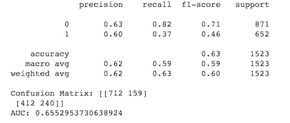***

***2.**朴素贝叶斯:**这是一种概率分类器，它利用了[贝叶斯定理](https://en.wikipedia.org/wiki/Bayes%27_theorem)，这是一种基于可能相关的条件的先验知识使用概率进行预测的规则***

```
***#FITTING THE CLASSIFICATION MODEL using Naive Bayes(tf-idf)**nb_tfidf = MultinomialNB()
nb_tfidf.fit(X_train_vectors_tfidf, y_train) **#Predict y value for test dataset**
y_predict = nb_tfidf.predict(X_test_vectors_tfidf)
y_prob = nb_tfidf.predict_proba(X_test_vectors_tfidf)[:,1]print(classification_report(y_test,y_predict))
print('Confusion Matrix:',confusion_matrix(y_test, y_predict))

fpr, tpr, thresholds = roc_curve(y_test, y_prob)
roc_auc = auc(fpr, tpr)
print('AUC:', roc_auc)*
```

***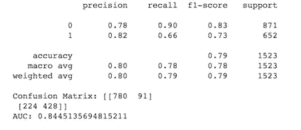***

***现在，您可以选择最佳模型( *lr_tfidf* )来估计未标记数据集的“目标”值( *df_test* )。这是代码***

```
***#Pre-processing the new dataset**
df_test['clean_text'] = df_test['text'].apply(lambda x: finalpreprocess(x)) #preprocess the data
X_test=df_test['clean_text'] **#converting words to numerical data using tf-idf**
X_vector=tfidf_vectorizer.transform(X_test)**#use the best model to predict 'target' value for the new dataset** 
y_predict = lr_tfidf.predict(X_vector)      
y_prob = lr_tfidf.predict_proba(X_vector)[:,1]
df_test['predict_prob']= y_prob
df_test['target']= y_predict
final=df_test[['clean_text','target']].reset_index(drop=True)
print(final.head())*
```

***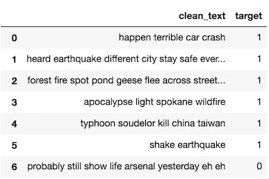***

***未标记数据集的预测目标值***

# *****结论*****

***在本文中，我演示了构建一个文本分类模型的基础知识，该模型比较了**单词包**(使用 Tf-Idf)和**单词嵌入**与 Word2Vec。通过以下方式，您可以使用此代码进一步增强模型的性能***

*   ***使用其他分类算法，如**支持向量机(SVM)、XgBoost、集成模型、神经网络等。*****
*   ***使用 Gridsearch 调整模型的超参数***
*   ***使用先进的单词嵌入方法，如 **GloVe** 和 **BERT*****

***如果你喜欢这篇文章，请点赞、评论并分享。欢迎您的反馈！***

***[](https://github.com/vijayaiitk/NLP-text-classification-model) [## vijayaitk/NLP-文本-分类-模型

### 在 GitHub 上创建一个帐户，为 vijayaitk/NLP-text-classification-model 开发做贡献。

github.com](https://github.com/vijayaiitk/NLP-text-classification-model) 

[https://www.linkedin.com/in/vijayarani/](https://www.linkedin.com/in/vijayarani/)***