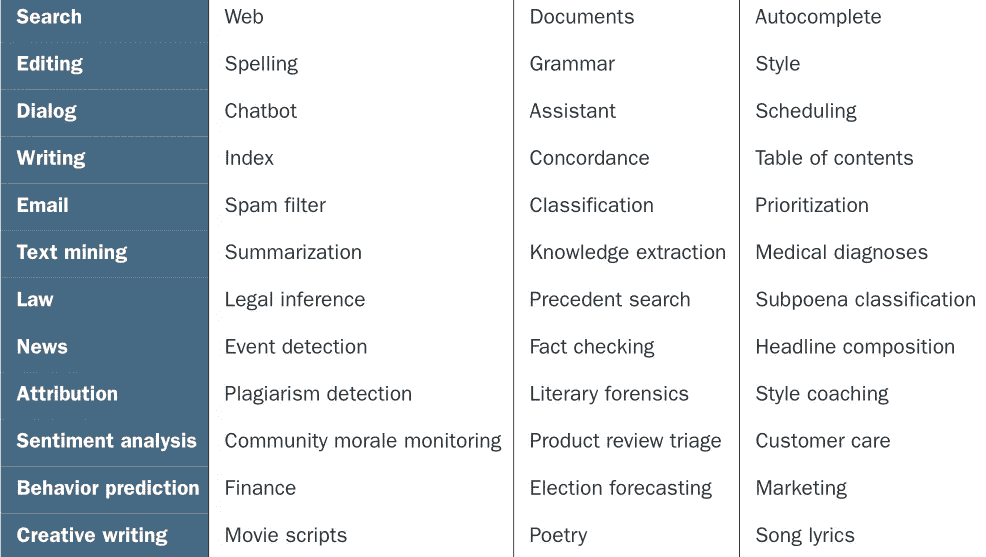
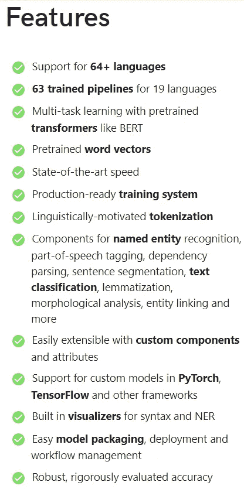
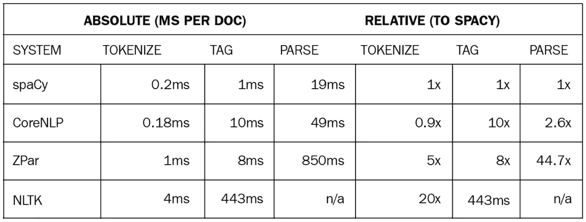
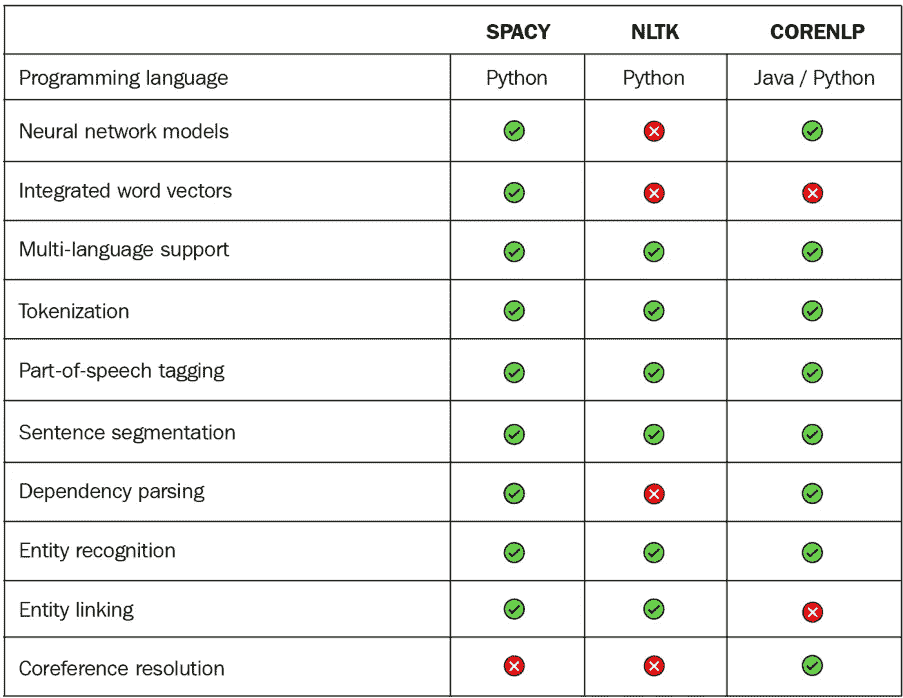

# 带空间的 NLP 教程:第 1 部分(简介)

> 原文：<https://medium.com/analytics-vidhya/nlp-with-spacy-tutorial-part-1-introduction-9804e541f581?source=collection_archive---------3----------------------->

欢迎阅读关于热门话题 NLP 的这一系列文章。我将解释我从使用 spaCy 实现 NLP(自然语言处理)任务中学到的一切，spaCy 是一个用于高级 NLP 任务的免费开源库。

我想你对 NLP 和 spaCy 是完全陌生的。别担心，我会尽力从头解释一切。

那么，让我们开始吧…

## 什么是 NLP(自然语言处理)？

自然语言处理是计算机科学和人工智能(AI)的一个研究领域，涉及处理自然语言(也称为人类语言)，如英语、法语、汉语等。

但是，怎么回事？为什么我们需要处理自然语言？

因为我们希望计算机能够理解人类世界。我们将让我们的计算机从有关自然语言的文本中学习。在自然语言的处理阶段，我们把自然语言翻译成数据(数字)，因为计算机理解数字。最终，我们甚至可以给我们的电脑编程来生成人类语言的文本。下面的图片展示了一些让我感兴趣，甚至会让你感兴趣的应用程序



根据不同类别的自然语言处理的应用


空间软件库(徽标)

现在，我们知道了深入 NLP 有什么用，让我们对什么是空间有一个大致的了解。

为了实现我们的 NLP 任务，我们需要一些工具。首先，一门编程语言。我强烈建议您选择 Python 作为编程语言，因为它易于理解，并且让您专注于您的项目，而不是拥有编程语言的高级知识。

我们可以只用 Python 完成一些 NLP 任务，但不是全部。我们需要一个工具，可以利用我们的 NLP 工作流程。有几个工具可以选择，比如- **NLTK** (自然语言工具包) **Core NLP** 等。但是有一个工具脱颖而出，那就是 ***spaCy*** 。以下是 spaCy 的特点:-



空间特征

好吧，为什么选择 spaCy 而不是其他 NLP 库或框架呢？？？

这张速度对比图肯定会回答你的问题



速度比较

我知道，你仍然对这一切持怀疑态度…🙄现在我最后一次试图证明 spaCy 是一流的，看这个:—



功能比较

我希望我说服了你选择 Python 和 spaCy 来做 NLP 的工作。

最后一部分，让我们安装空间…

选择虚拟环境后，在命令提示符下键入以下内容，然后按 enter…

```
pip install spacy
```

如果你不知道如何设置 Python，我已经在这里发布了另一篇关于这个[的文章。安装 **Tensorflow** 也不失为一个好主意，这是谷歌的一个开源机器学习框架。也许在我接下来的文章中，我们会需要这个高性能库。](/analytics-vidhya/the-perfect-jupyterlab-environment-with-tensorflow-gpu-installation-afe32fcba0ba)

到目前为止，我们已经安装了一个完美的 Python 环境和我们可爱的空间。

现在我们需要通过 spaCy 安装一个预先训练好的统计语言模型。安装统计模型的目的是为了执行很多 NLP 任务(我后面会讨论，不要着急)。由于我们将处理与**英语**语言相关的计算文本，我们需要下载相应的语言模型。

要安装英语语言模型，请键入以下内容:-

```
python -m spacy download en_core_web_md
```

这里， *en_core_web_md* 指:-

*   *en* 是语言代码，即英语
*   *核心*是模型能力的类型，即*核心*表示词汇、语法、实体和向量的通用
    模型。
*   *web* 是流派，即模型识别的文本类型；可以是*网页*、*新闻*、*推特*等。
*   *md* 是模型的尺寸，即大的可以是 *lg* ，中的可以是 *md* ，小的可以是 *sm* 。

对于许多 NLP 任务，如**词性标注**，中等大小的语言模型就可以了。但是如果你需要做类似**情感分类**这样的高级 NLP 任务(还是那句话，不用担心我后面会解释)，那么推荐大尺寸语言模型。

**注意** :-如果你正在处理与新闻或 Twitter 相关的文本，那么下载相应的语言模型用于特定目的。它会给你的最终结果带来很好的准确性。

本文到此为止。我们已经安装了执行 NLP 任务所需的所有必要设备。在接下来的文章中，我们将学习自然语言处理的核心概念，并使用我们可爱的空间实现它们。

转到 [**第二部分(分词和句子切分)**](https://ajitsahoo29.medium.com/nlp-with-spacy-tutorial-part-2-tokenization-and-sentence-segmentation-352df790a214)

谢谢你读到这里…😀

作者✍ *阿吉特·库马尔·萨胡*