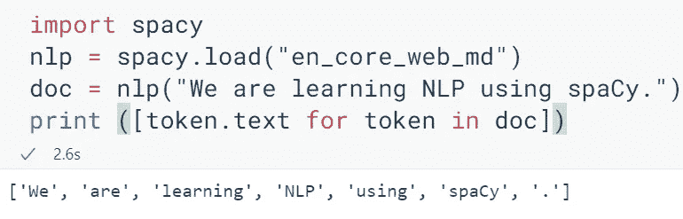
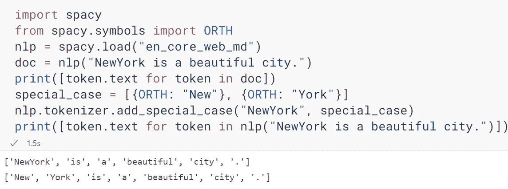
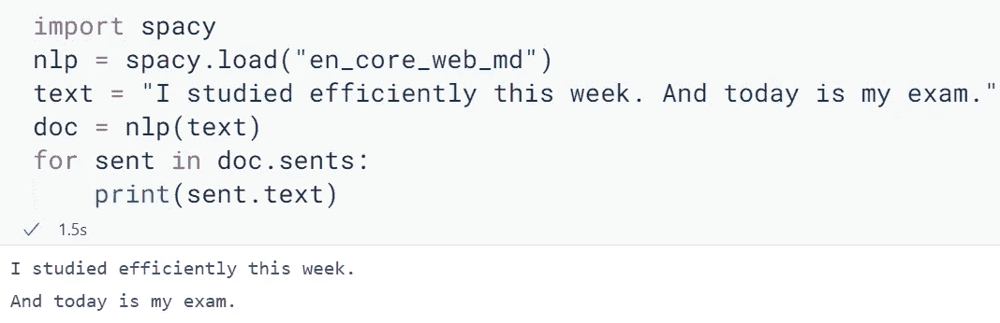

# 带空间的自然语言处理教程:第 2 部分(标记化和句子分割)

> 原文：<https://medium.com/analytics-vidhya/nlp-with-spacy-tutorial-part-2-tokenization-and-sentence-segmentation-352df790a214?source=collection_archive---------0----------------------->

欢迎阅读使用 spaCy 学习 NLP 之旅的第二部分。转到 [**第一部分**](https://ajitsahoo29.medium.com/nlp-with-spacy-tutorial-part-1-introduction-9804e541f581) 。

oke 化是文本处理管道的第一步，因为 NLP 中的所有其他操作都需要令牌。

现在的大问题是，什么是**令牌**？

一个句子包含单词、数字、符号、标点符号等标记。它们都有意义，这就是为什么一个标记被称为一个元素或语义单位。

那么，现在什么是**标记化**？

简单来说，标记化就是把句子拆分成标记的方法。

让我们看看它在空间中是如何工作的



## **理解代码**

第一行相当简单，只是导入了 spaCy 库。

spaCy 语言处理管道总是依赖于统计模型及其功能。这就是为什么我们总是用 *spacy.load()* 加载语言模型，作为我们代码的第二步。在这个 **load** 方法中，我们输入了之前下载的语言模型的名称，即 *en_core_web_md* 。因此，创建了 nlp 语言类的一个实例。

现在，我们需要一个句子来做标记化。这就是为什么我输入了:- " ***我们正在使用 spaCy 学习 NLP。***“NLP 对象内部。为什么在 nlp 对象内部？？？因为它将文本转换成 spaCy 的 *Doc* 对象。换句话说，

> 它最初是字符串，然后通过 nlp 对象转换成一个 *Doc* 对象。

当 *Doc* 对象被创建并存储在 **doc** 变量中时(第三步)，spaCy 隐式地生成了令牌对象。

然后，最后，使用传统的 *print* 函数将转换为文本并打印的记号迭代，以获得句子的所有记号作为输出，即‘我们’，‘是’，‘学习’，‘NLP’，‘使用’，‘空间’，’

请注意“.”是如何(句号)被认为是记号，因为它是一个标点符号。

**注意** :- ***spaCy*** 提供了非破坏性的标记化，这意味着我们总是能够从标记中恢复出原始文本。在标记化过程中会保留空格和标点符号信息，因此输入文本会原样保留。

## 自定义标记器

有时，我们需要特定的单词或实体作为单个标记或单独的标记。由于 ***标记器*** 类负责标记化的过程，我们需要与这个标记器类进行交互，以便添加一个特殊的规则。为此，我这样做了:-



请注意，在上面的代码中，我输入的第一个句子包含了 NewYork。并且这被认为是第一输出中的一个令牌。但是我需要不同的代币，也就是纽约和纽约。所以，我们应该使用 ORTH(代表正字法)符号。然后，将分离的标记以字典的格式写在列表中:- ORTH: <value>。因为我们需要两个代币，这就是为什么，</value>

```
[{ORTH: "New"}, {ORTH: "York}]
```

然后在*tokenizer . add _ special _ case*中键入需要拆分的令牌。最后，我们通过启动一个列表理解形式的 for 循环来打印标记。

我知道你一定想知道为什么我写纽约，然后把它们分开？？？

这只是一个简单的例子。在实际情况下，当您试图打印出记号时，像- ***lemme*** 或 ***gimme*** 这样的单词默认显示为单个记号。但在某些情况下，我们可能需要将 ***lemme*** 分离为 *lem* 和*me*；还有 ***给我*** 做 *gim* 和 *me* 。因此，每当您想要基于语法规则或其他类似因素将一个标记分割成多个标记时，您可以使用这个方法来定制标记化器。这种方法被称为**基于规则的标记化**。

# 句子分割

如果你在一个文本中有多个句子，你想把每个句子分开并打印输出，那么**句子分割**就派上用场了。

因此，它是将一串书面语言文本分割成其组成句子的过程。



在上图中，文本和结果中出现了两个句子:- 2 个句子被分离出来。那就是句子分割。

本文到此为止。

谢谢你读到这里…😀

作者✍ *阿吉特·库马尔·萨胡*