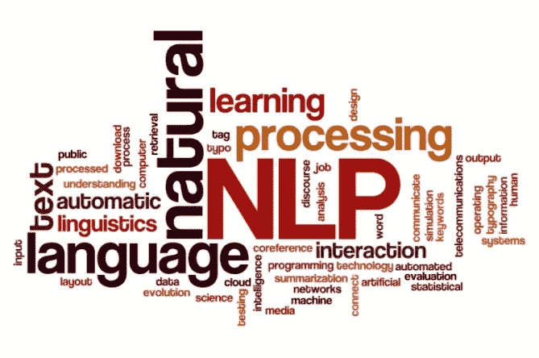
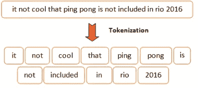
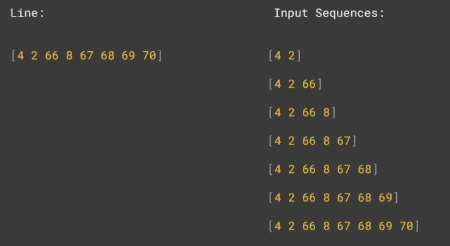
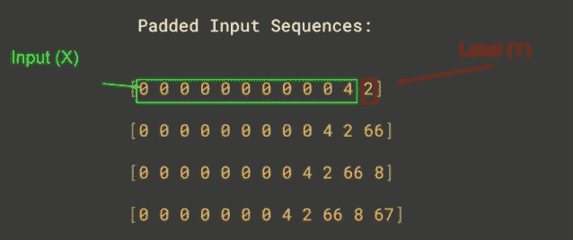
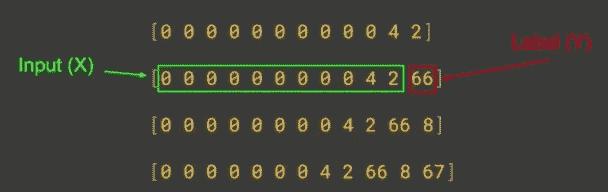
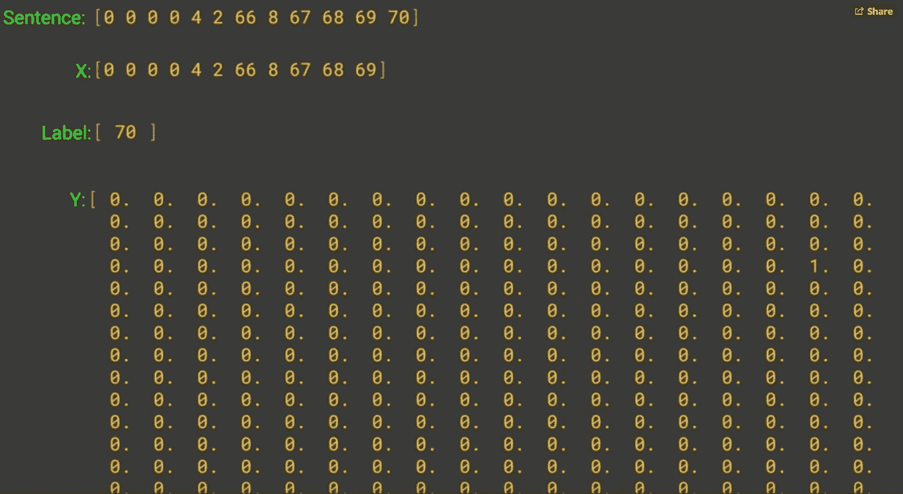
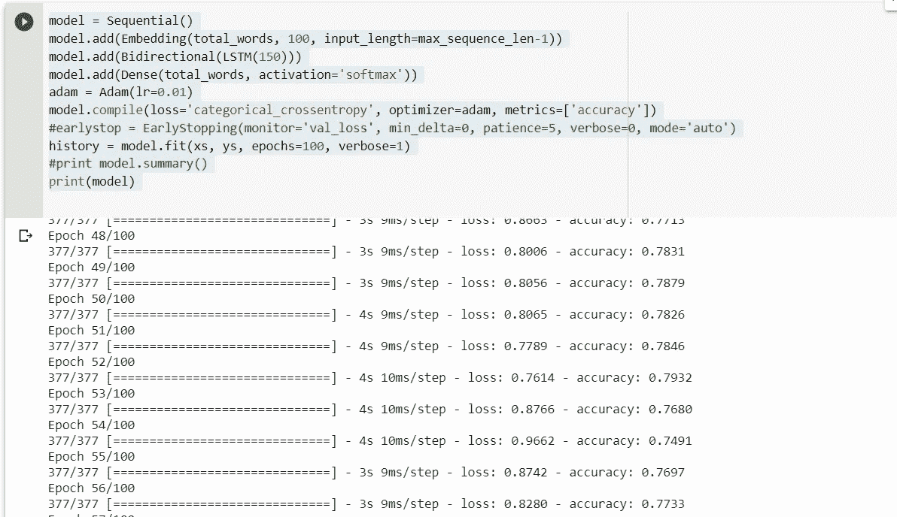
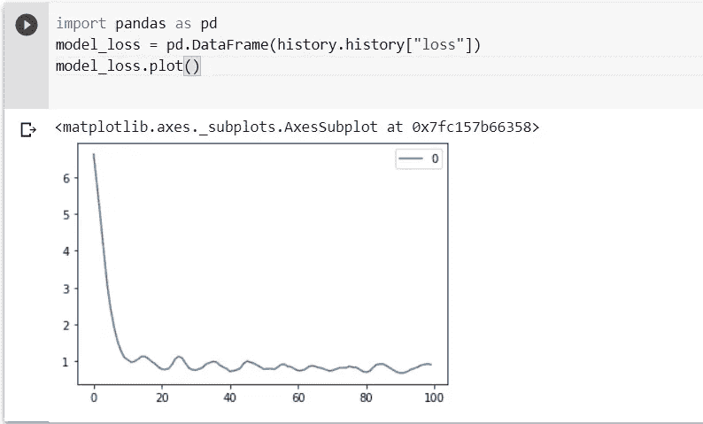
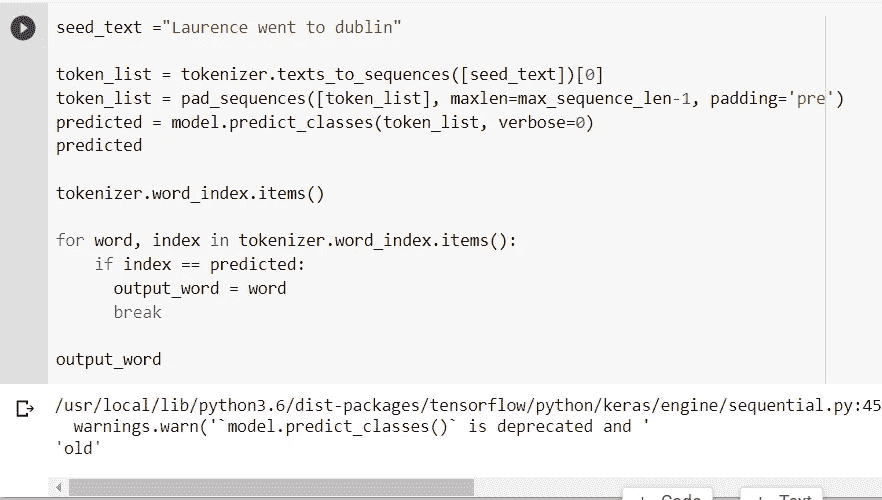
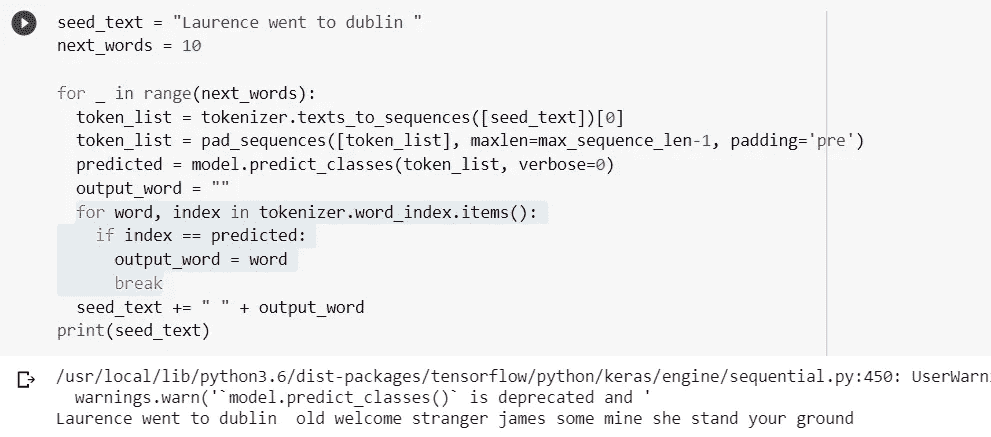

# 基于双向 LSTM 的自然语言处理单词预测

> 原文：<https://medium.com/analytics-vidhya/nlp-word-prediction-by-using-bidirectional-lstm-9c01c24b2725?source=collection_archive---------2----------------------->



**自然语言处理** ( **NLP** )是[语言学](https://en.wikipedia.org/wiki/Linguistics)、[计算机科学](https://en.wikipedia.org/wiki/Computer_science)和[人工智能](https://en.wikipedia.org/wiki/Artificial_intelligence)的一个分支，涉及计算机和人类语言之间的交互，特别是如何给计算机编程，以处理和分析大量的[自然语言](https://en.wikipedia.org/wiki/Natural_language)数据。其结果是计算机能够“理解”文档的内容，包括其中语言的上下文细微差别。然后，该技术可以准确地提取文档中包含的信息和见解，并对文档本身进行分类和组织。

我们将讨论如何预测你的诗歌或故事中的下一个单词。我们将用 python 实现来展示它。

```
# **first off all we imported libraries which we need****import** tensorflow **as** tf**from** tensorflow.keras.preprocessing.sequence **import** pad_sequences**from** tensorflow.keras.layers **import** Embedding, LSTM, Dense, Bidirectional**from** tensorflow.keras.preprocessing.text **import** Tokenizer**from** tensorflow.keras.models **import** Sequential**from** tensorflow.keras.optimizers **import** Adam**import** numpy **as** np
```

# 预处理

在开始处理数据之前，我们收集的数据集中有一些问题需要解决。这些都是简单的清理程序，便于在后续步骤中使用数据。但是 Tensorflow 通常会为我们实现。下面是一些通常要做的预处理步骤。

*   去除空白
*   小写转换
*   移除数字
*   删除标点符号
*   删除不需要的单词
*   删除非英语单词

# 标记化

一种重要的规范化方法叫做标记化。它只是将连续的文本分割成单个的单词片段。一个非常简单的方法是在每个空格上分割输入，并为每个单词分配一个标识符。举个例子，

tokenizing*“2016 里约奥运会不包括乒乓球不酷”*会产生；



```
**#** **We read data and specified Tokenizer**tokenizer = Tokenizer()data = open('/tmp/irish-lyrics-eof.txt').read()**# We splited the data by whitespaces and created sentence list** corpus = data.lower().split("\n")**# with "fit_on_text" method tokenized each sentence in the corpus**tokenizer.fit_on_texts(corpus)**# Afterwards we created word index specified unique number of words in the corpus by assign index number each of them
# like this;** {'car': 1, 'prison': 2, 'him': 3, 'welcome': 4}total_words = len(tokenizer.word_index) + 1 **# we'll add one to this to consider vocabulary words****# This is a key value pair with the key being the word and the value being the token for that word** print(tokenizer.word_index)
print(total_words)
```

# 填充序列

即使在将句子转换成数值之后，仍然存在向我们的神经网络提供相等长度输入的问题——不是每个句子都是相同长度的！有两种主要方法可以处理输入的句子来实现这一点——用零填充较短的句子，以及截断一些较长的序列以使其更短。事实上，您可能会使用这些方法的组合。

使用 TensorFlow，`tf.keras.preprocessing.sequence`中的`pad_sequences`函数可用于这两项任务。给定一个序列列表，您可以指定一个`maxlen`(任何比它长的序列都将被缩短)，以及是否从开头或结尾填充和截断，这取决于`padding`和`truncating`参数的`pre`或`post`设置。默认情况下，填充和截断将从序列的开始发生，所以如果您希望它发生在序列的结尾，请将它们设置为`post`。

因此，让我们来看看将这个语料库转化为训练数据的代码。这是开始，我们将一行一行地解开这个。首先，我们所有的训练轴将被称为输入序列，这将是一个 python 列表。

```
**# each line of the corpus we'll generate a token list using the tokenizers, text_to_sequences method.****example:** In the town of Athy one Jeremy Lanigan

                 [4,2,66,67,68,69,70]**This will convert a line of text like,sentence above into a list of tokens representing the words.**input_sequences = []for line in corpus: token_list = tokenizer.texts_to_sequences([line])[0]**Then will iterate over this list of tokens and create a number of n-grams sequences, namely the first two words in the sentence or one sequence then the first three are another sequences etc.**

    for i in range(1, len(token_list)): n_gram_sequence = token_list[:i+1] input_sequences.append(n_gram_sequence)
```

这样做的结果是，对于之前创建的句子，将生成以下输入序列。每一行都会发生同样的过程，但是正如你所看到的，输入序列只是被分解成短语的句子，前两个单词，前三个单词，等等



我们接下来需要找到语料库中最长句子的长度。为了做到这一点，我们将遍历所有的序列，找到最长的一个，代码如下。

```
max_sequence_len = max([len(x) for x in input_sequences])
```

一旦我们有了最长的序列长度，接下来要做的就是填充所有的序列，使它们长度相同。我们将预先填充零，以便更容易提取标签。

```
Line:                                 Padded Input Sequences:[4 2 66 8 67 68 69 70]               [0 0 0 0 0 0 0 0 0 0 4 2]
                                     [0 0 0 0 0 0 0 0 0 4 2 66]
                                     [0 0 0 0 0 0 0 0 4 2 66 8]
                                     [0 0 0 0 0 0 0 4 2 66 8 67]
                                     [0 0 0 0 0 0 0 4 2 66 8 67 68]
                                     [0 0 0 0 0 4 2 66 8 67 68 69]
                                     [0 0 0 0 4 2 66 8 67 68 69 70] 
```

所以现在，我们的行将由一组填充的输入序列表示，看起来像上面的例子。现在，我们有了我们的序列，接下来我们需要做的是将它们转换成 **x** 和 **y，**我们的输入值和它们的标签。现在你想想，句子是这样表示的，我们要做的就是把除了最后一个字符之外的所有字符都作为 **x** ，然后把最后一个字符作为标签上的 **y** 。



我们像上面这样做，其中对于第一个序列，直到 **4** 的所有内容都是我们的输入，而 **2** 是我们的标签。



同样，在第二个序列中，输入是两个字，第三个字，标记为 66。

至此，我们应该清楚为什么要进行预填充，因为这使得我们通过获取最后一个令牌来获取标签变得更加容易。

```
**So now, we have to split our sequences into our *x's* and our *y's*. To do this, let's grab the first n tokens, and make them our *x's*.** X = input_sequences[:,:-1]
labels = input_sequences[:,-1]**We'll then get the last token and make it our label. Before the label becomes a y, there' s one more step, and you'll see that shortly.** **# One-hot encode with keras convert list to a categorical. The number of classes which is my number of words.**Y = tf.keras.utils.to_categorical(labels, num_classes=total_words)**Now, I should one-hot encode my labels as this really is a classification problem. We can classify from the corpus, what the next word would likely be.** 
```



如果我们把这个记号列表看作一个句子，那么 x 是直到最后一个值的列表，标签是最后一个值，在这个例子中是 70。y 是一个独热编码数组，不管 length 是单词集的大小，而设置为 1 的值是标签索引处的值，在这种情况下是第 70 个元素。

所以现在我们可以建立一个神经网络，给定一个句子，它可以预测下一个单词。

```
**# Now that we have our data as xs and ys, it's relatively simple for us to create a neural network to classify what the next word should be, given a set of words.**model = Sequential()# **Embedding layer 1st parameter  : we'll want it to handle all of our words, so we set that in the first parameter.****# 2nd parameter: number of dimensions to use to plot the vector for a word.** **# finally, the size of the input dimensions will be fed in, and this is the length of the longest sequence minus 1\. We subtract one because we cropped off the last word of each sequence to get the label.**model.add(Embedding(total_words, 100, input_length=max_sequence_len-1))**# Bidirectional LSTM****#Unidirectional LSTM only preserves information of the past because the only inputs it has seen are from the past.****#Using bidirectional will run your inputs in two ways, one from past to future and one from future to past and what differs this approach from unidirectional is that in the LSTM that runs backwards you preserve information from the future and using the two hidden states combined you are able in any point in time to preserve information from both past and future.****# We specified 150 units here**model.add(Bidirectional(LSTM(150)))**# Finally there is a dense layer sized as the total words, because we have as many outputs as the total word count.**model.add(Dense(total_words, activation='softmax'))adam = Adam(lr=0.01)**#We're doing a categorical classification, so we'll set the laws to be categorical cross entropy.****#And we'll use adam optimizer to minimize loss. Optimizers are algorithms or methods used to change the attributes of your neural network such as weights and learning rate in order to reduce the losses.**model.compile(loss='categorical_crossentropy', optimizer=adam, metrics=['accuracy'])#earlystop = EarlyStopping(monitor='val_loss', min_delta=0, patience=5, verbose=0, mode='auto')**#And we specified epochs number, One Epoch is when an entire dataset is passed forward and backward through the neural network only once.**history = model.fit(xs, ys, epochs=500, verbose=1)#print model.summary()print(model)
```



我们可以用历史方法来查看列车损失。正如你所看到的，我们的模型在前 10 个时期迅速下降到 0.1 的水平。它继续着，几乎没有起伏。



要了解更多关于 LSTM 的信息，您可以点击此[链接](https://www.youtube.com/watch?v=WCUNPb-5EYI&t=52s)

如果我们想预测句子中接下来的 10 个单词。

```
**# We need return our text into sequences to do prediction, because our input shape like this below.**tokent_list = tokenizer.text_to_sequences([text])[0]**#we need to do pre padding to make each sequences same length by longest sentence in the corpus**token_list = pad_sequences([token_list], maxlen = max_sequence_len-1, padding="pre")text = Laurence went to dublin[0,0,0,0,0,0,0,134,13,59]**# and by passing our token list into the prediction function we can do prediction.
# This will give us the token of the word most likely to be the next one in the sequence.** predicted = model.predict_classes(token_list)
```

如果我们运行下面的代码行，我们可以看到预测的下一个单词是**【old】**。



```
**# we can do a reverse lookup on the word index items to turn the token back into a word and to add that to our text.**text = "Laurence went to dublin "next_words = 10**With for loop below, we can predict next word. We can  specify next word number above. Each iterartion add new predicted word our text.**for _ in range(next_words): token_list = tokenizer.texts_to_sequences([text])[0] token_list = pad_sequences([token_list],          maxlen=max_sequence_len-1, padding='pre') predicted = model.predict_classes(token_list, verbose=0) output_word = "" for word, index in tokenizer.word_index.items(): if index == predicted: output_word = word break seed_text += " " + output_wordprint(seed_text)
```

如果我们想要预测 **seed_text，**之后的下 10 个单词，我们可以将 next_word 指定为 10，当我们查看输出时，您可以看到添加了 10 个单词的句子。**“劳伦斯去都柏林老欢迎陌生人詹姆斯一些我的她坚持你的立场”**这没有足够的意义，但如果我们用大得多的语料库训练我们的模型，我们可以获得良好的结果。



```
import tensorflow as tf
from tensorflow.keras.preprocessing.sequence import pad_sequences
from tensorflow.keras.layers import Embedding, LSTM, Dense, Bidirectional
from tensorflow.keras.preprocessing.text import Tokenizer
from tensorflow.keras.models import Sequential
from tensorflow.keras.optimizers import Adam
import numpy as nptokenizer = Tokenizer()
data = open('/tmp/irish-lyrics-eof.txt').read()
corpus = data.lower().split("\n")
tokenizer.fit_on_texts(corpus)
total_words = len(tokenizer.word_index) + 1
print(tokenizer.word_index)
print(total_words)input_sequences = []for line in corpus:
    token_list = tokenizer.texts_to_sequences([line])[0]
    for i in range(1, len(token_list)):
        n_gram_sequence = token_list[:i+1]
        input_sequences.append(n_gram_sequence)**# pad sequences**max_sequence_len = max([len(x) for x in input_sequences])
input_sequences = np.array(pad_sequences(input_sequences, maxlen=max_sequence_len, padding='pre'))**# create predictors and label**xs, labels = input_sequences[:,:-1],input_sequences[:,-1]
ys = tf.keras.utils.to_categorical(labels, num_classes=total_words)**#Model build**model = Sequential()
model.add(Embedding(total_words, 100, input_length=max_sequence_len-1))
model.add(Bidirectional(LSTM(150)))
model.add(Dense(total_words, activation='softmax'))
adam = Adam(lr=0.01)
model.compile(loss='categorical_crossentropy', optimizer=adam, metrics=['accuracy'])
#earlystop = EarlyStopping(monitor='val_loss', min_delta=0, patience=5, verbose=0, mode='auto')
history = model.fit(xs, ys, epochs=100, verbose=1)
#print model.summary()
print(model)seed_text = "Laurence went to dublin "next_words = 10**#Prediction**for _ in range(next_words): token_list = tokenizer.texts_to_sequences([seed_text])[0] token_list = pad_sequences([token_list], maxlen=max_sequence_len-1, padding='pre') predicted = model.predict_classes(token_list, verbose=0) output_word = "" for word, index in tokenizer.word_index.items(): if index == predicted:
            output_word = word
            breakseed_text += " " + output_word
print(seed_text)
```