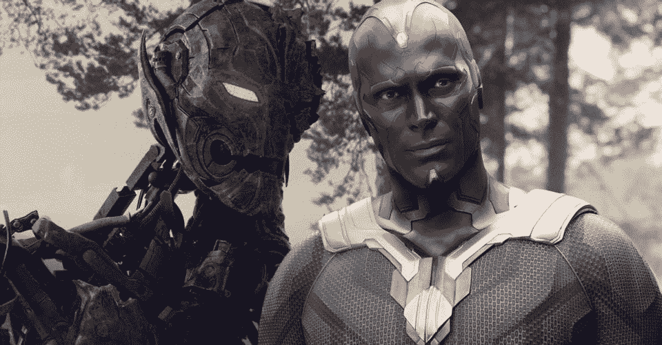
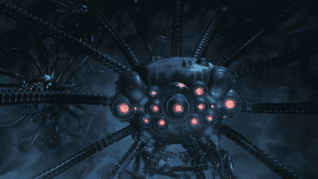
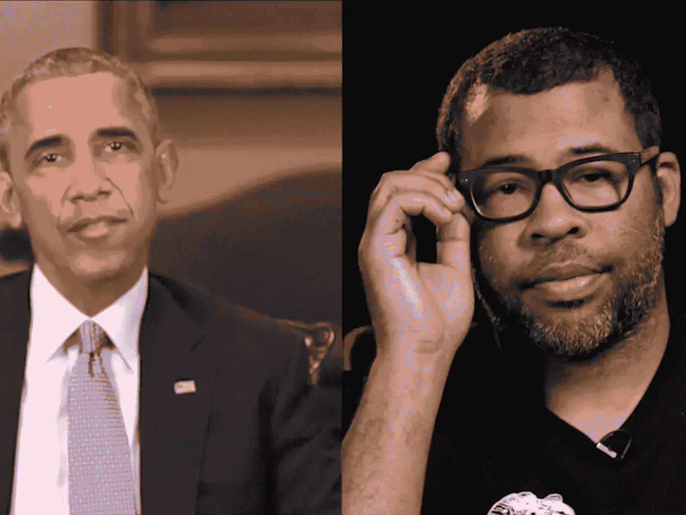

# 不，人工智能不是威胁

> 原文：<https://medium.com/analytics-vidhya/no-ai-is-not-a-threat-613d9bdcb2ea?source=collection_archive---------3----------------------->

奥创和视觉，都是《复仇者联盟 2》里的 AI

我们都看过把 AI 描绘成威胁的电影。在《复仇者联盟 2》中，钢铁侠创造了奥创，以便它可以帮助复仇者联盟保护人们免受敌人的伤害。但是奥创失去了控制，想要统治人民，变成了敌人。但作为一名专业的机器学习工程师，我不认为人工智能会主宰我们。有很多悲观的观点让你认为人工智能和机器学习正在把现代社会变成一个反乌托邦。但在这篇文章中，我想揭开 AI 的神秘面纱，向你展示它乐观的一面。

人们之所以如此悲观，是因为对这个新概念不熟悉。当人们震惊于 AI 能有多强的时候，也想质疑它对我们是不是一种威胁。因此，这种恐惧在大众媒体中传播得非常快，甚至在大众媒体中激起焦虑。而且，不仅仅是对 AI，还有妖魔化每一种先进技术的观点和阴谋论，比如“Covid 疫苗是危险的，因为微芯片被插在你的身体里”“GMO 是对我们健康的威胁，因为它含有病毒的基因”。所有现代技术都是人们焦虑的牺牲品。大众娱乐可以玩弄它。例如，制作《黑客帝国》系列的沃卓斯基夫妇不是计算机科学专家，而是专业的演艺人员。他们可以制作一个有趣的赛博朋克故事，为此需要一个反派角色。因此，令人焦虑的“智能机器”适合这个角色。但请不要害怕人工智能，即使他们被描绘成恶棍，因为当你知道人工智能的本质，你会发现人工智能永远不会对人类怀恨在心。

黑客帝国中的恶棍

首先，我想从我的角度解释一下机器学习。与人类不同，机器无法在学习的同时增长智力，因为它们只做统计。“机器学习”这个术语乍一看让我很困惑。当我在学习计算机科学的数据结构课程时，我需要学习排序算法，让计算机知道如何快速排序数据。我在想，“为什么这个不叫机器学习？程序员在教计算机整理数据。”事实上，我们为计算机设计的所有程序都是为了让它们学会解决问题。但是，排序算法不被认为是“机器学习”。所谓的“机器学习”算法应该能够通过使用大量数据进行统计建模来进行预测。但我宁愿说“统计学习”而不是“机器学习”作为一个更准确的术语，因为“机器学习”的本质仍然是统计。正是这些算法背后的统计学使用大量数据来计算概率。统计数据不是威胁；它在很久以前就被发明了，并且伴随着人类文明的进化为我们服务。例如，天气预报已经伴随我们很长时间了。气候学家利用气象站测得的数据来预测未来几天降雨的可能性。统计学习的基本原理就像天气预报一样。随着技术的进步，有了更多的数据和更好的计算能力，人们可以使用统计学习来获得更好的准确性、更高的速度和更多样化的目的。

第二，我想从自己的角度解释一下深度学习。同样，最近的深度学习不会威胁到人类，因为它的本质是计算而不是思考。深度学习被认为是使用人工神经网络的机器学习的一个子领域，它是由人脑启发的。人工神经网络，或简称为神经网络，极大地提高了人工智能的性能，但也在公众中滋生了恐惧。人们担心人工智能会被发展成超级智能。最终，人工智能可以像人类一样思考，并挑战人类。这种担忧在大众娱乐中被广泛描绘，如电影 *I，机器人*；还有电视剧*西部世界*。然而，深度学习仍然不同于人脑。我们没有使用人工神经网络来构建电子大脑。人工神经网络中的“神经元”不是类似于人的神经元的电子神经元，而仅仅是线性模型和非线性模型相结合的地方，以便计算可以根据通用逼近定理近似逼近任何类型的函数。用更简单的方式来解释，人工神经网络就是矩阵乘法的回合。人工智能不能像人类一样思考。

AI 真的比人类聪明吗？是的，但只是因为人类希望 AI 变得聪明，这样它才能为人类服务。AI 不会像那些引起焦虑的电影和戏剧那样学习邪恶的想法本身，因为这些算法背后总是有工程师。有人声称，因为上帝创造了人类，而人类也想成为像上帝一样的创造者；人类创造了 AI。恐怖电影系列*普罗米修斯&外星人:契约*正是讲述了这个故事。在这部电影系列中，人类创造了比人类更强大、更狡猾的人工智能，杀死了人类和人类的创造者。然而，并不是所有的算法工程师都相信神创论。农民之所以养猪，不是因为农民想当猪神，而是因为猪肉能喂饱人。而我们算法工程师培养 AI 的原因和农民一样。我们使用机器学习不是因为我们想成为创造者，而是因为我们希望那些可以对大数据进行计算的算法来解决我们的问题。比如我在电商领域工作。我设计我的算法来为我的营销同事预测热销商品。我们的平台上有数以百万计的商品。因为我们的人无法逐一查看数百万个项目的所有信息。我使用统计算法对这些项目进行排序，这样我的营销同事只需要检查图表上的前 1000 个项目。这是因为处理大量数据是一项令人疲惫的重复工作，我们让统计学习算法分担我们的负担，高效地工作。这就好比我们在现代使用卡车和起重机运送大量材料来建造摩天大楼，而不是像旧时代的埃及法老一样使用大量的人类奴隶来建造金字塔。

尽管人工智能本身并不构成威胁，但当它落入坏人之手时，就可能被用于卑鄙的目的。最近的 deepfake 就是一个很好的例子，它可以用来在视频中用计算机生成的人脸替换一个人的脸。机器学习使这些视频令人信服地真实，但也很难识别它们是否可信。[乔丹·皮尔的视频](https://youtu.be/cQ54GDm1eL0)为 Deepfake 的有害使用方式敲响了警钟。政客们的虚伪会对民主构成威胁。名人的假货会对他们的名誉构成威胁。伪造的伪证会对司法造成威胁。但我不会责怪 AI，而是责怪那些出于不良目的使用 deepfakes 的人。在 deepfakes 之前，人们用 Photoshop 制作别人的假图像。在 Photoshop 出现之前，人们使用颜料和画笔来伪造假画。假货伴随我们的文明已经很久了。而 Deepfakes 将其带到了一个新的高度。随着现代技术的发展，我们需要对新的操作方式保持警惕。我们应该始终质疑消息来源是否可信。

乔丹·皮尔笔下的奥巴马

我还想用人工智能涵盖很多其他方面，比如推荐算法和就业。这些主题是巨大的，所以我将在以后单独解释每一个。但无论如何，人工智能不会主宰我们，因为它的本质是静态学习，这将大大提高我们在现代社会的效率。请对我们与 AI 的未来保持乐观。