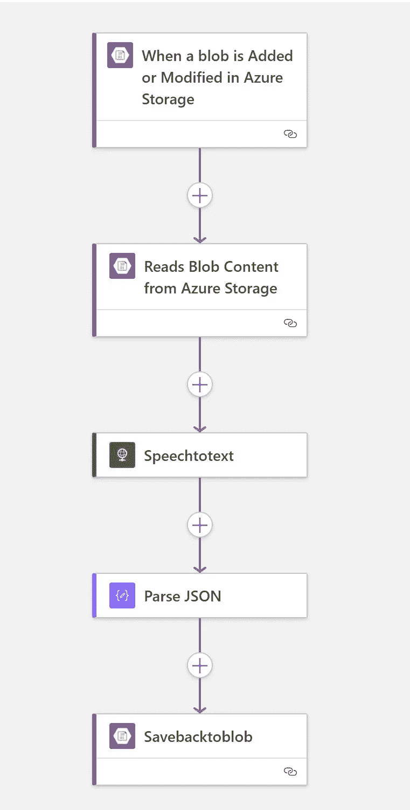
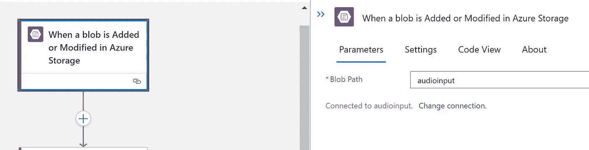
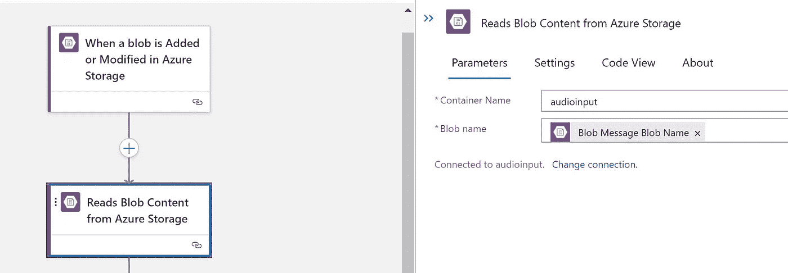
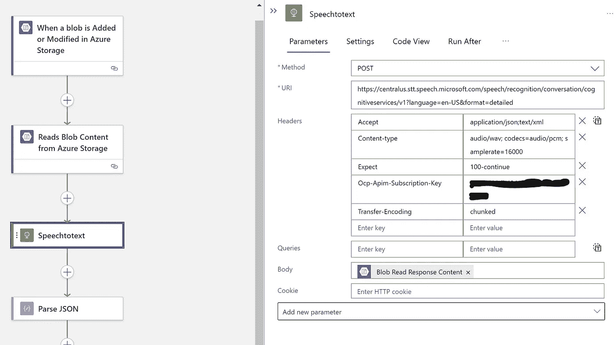
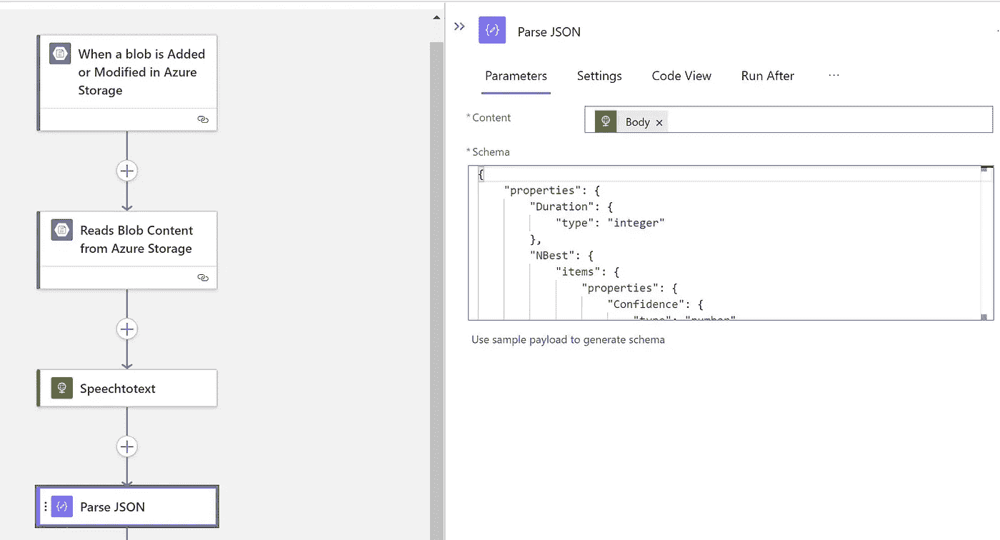
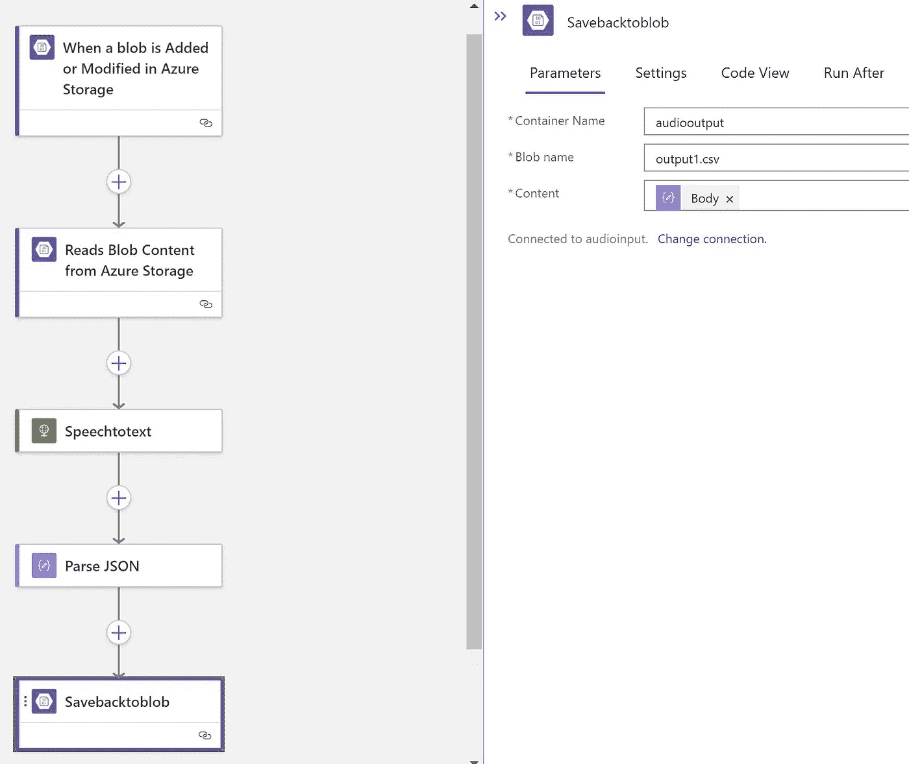

# 无代码方法—处理语音并转换为文本—逻辑应用

> 原文：<https://medium.com/analytics-vidhya/no-code-approach-process-speech-and-convert-to-text-f6e56970b687?source=collection_archive---------15----------------------->

# 使用 Azure 认知服务语音转文本和逻辑应用

# 无代码—工作流风格

我们也可以为其他 Azure 认知服务重用相同的模式。

# 先决条件

*   Azure 帐户
*   Azure 存储帐户
*   Azure 认知服务
*   Azure 逻辑应用
*   获取存储的连接字符串
*   获取要用作认知服务订阅密钥的主键
*   音频文件应该是 wav 格式
*   音频文件不能太大
*   音频时间 10 分钟

# 逻辑应用

*   首先从 Blob 创建一个触发器



*   使用 blob 连接字符串创建连接字符串



*   现在带来“从 Azure 存储读取 Blob 内容”



*   容器名称:音频输入
*   选择动态，并选择如上图的斑点名称
*   带来 HTTP 操作
*   这里我们需要调用语音到文本并传递参数
*   接受:application/JSON；文本/xml
*   内容类型:音频/wav；编解码器=音频/PCM；采样率=16000
*   预期:100-继续
*   OCP-Apim-订阅-密钥:xxxx-xxxxxx-xxxxxx-xxxx
*   传输编码:分块



*   对于主体，选择读取 blob 内容
*   这应该将音频二进制内容传递给认知服务 api
*   现在让我们解析 api 输出
*   现在从 http 输出中选择主体
*   提供架构作为

```
{
    "properties": {
        "Duration": {
            "type": "integer"
        },
        "NBest": {
            "items": {
                "properties": {
                    "Confidence": {
                        "type": "number"
                    },
                    "Display": {
                        "type": "string"
                    },
                    "ITN": {
                        "type": "string"
                    },
                    "Lexical": {
                        "type": "string"
                    },
                    "MaskedITN": {
                        "type": "string"
                    }
                },
                "required": [
                    "Confidence",
                    "Lexical",
                    "ITN",
                    "MaskedITN",
                    "Display"
                ],
                "type": "object"
            },
            "type": "array"
        },
        "Offset": {
            "type": "integer"
        },
        "RecognitionStatus": {
            "type": "string"
        }
    },
    "type": "object"
}
```



*   现在添加将数据上传到 blob 的操作
*   给出一个容器输出
*   给出一个输出名称



*   转到概述，然后单击运行触发器，然后单击->运行
*   上传 wav 文件
*   等待它处理


*   给语音 API 一些时间来处理
*   现在转到 blob 存储

```
{
  "RecognitionStatus": "Success",
  "Offset": 300000,
  "Duration": 524000000,
  "NBest": [
    {
      "Confidence": 0.972784698009491,
      "Lexical": "the speech SDK exposes many features from the speech service but not all of them the capabilities of the speech SDK are often associated with scenarios the speech SDK is ideal for both real time and non real time scenarios using local devices files azure blob storage and even input and output streams when a scenario is not achievable with the speech SDK look for a rest API alternative speech to text also known as speech recognition transcribes audio streams to text that your applications tools or devices can consume more display use speech to text with language understanding louis to deride user intents from transcribed speech and act on voice commands you speech translation to translate speech input to a different language with a single call for more information see speech to text basics",
      "ITN": "the speech SDK exposes many features from the speech service but not all of them the capabilities of the speech SDK are often associated with scenarios the speech SDK is ideal for both real time and non real time scenarios using local devices files azure blob storage and even input and output streams when a scenario is not achievable with the speech SDK look for a rest API alternative speech to text also known as speech recognition transcribes audio streams to text that your applications tools or devices can consume more display use speech to text with language understanding louis to deride user intents from transcribed speech and act on voice commands you speech translation to translate speech input to a different language with a single call for more information see speech to text basics",
      "MaskedITN": "the speech sdk exposes many features from the speech service but not all of them the capabilities of the speech sdk are often associated with scenarios the speech sdk is ideal for both real time and non real time scenarios using local devices files azure blob storage and even input and output streams when a scenario is not achievable with the speech sdk look for a rest api alternative speech to text also known as speech recognition transcribes audio streams to text that your applications tools or devices can consume more display use speech to text with language understanding louis to deride user intents from transcribed speech and act on voice commands you speech translation to translate speech input to a different language with a single call for more information see speech to text basics",
      "Display": "The Speech SDK exposes many features from the speech service, but not all of them. The capabilities of the speech SDK are often associated with scenarios. The Speech SDK is ideal for both real time and non real time scenarios using local devices files, Azure blob storage and even input and output streams. When a scenario is not achievable with the speech SDK, look for a rest API. Alternative speech to text, also known as speech recognition, transcribes audio streams to text that your applications, tools or devices can consume more display use speech to text with language, understanding Louis to deride user intents from transcribed speech and act on voice commands. You speech translation to translate speech input to a different language with a single call. For more information, see speech to text basics."
    }
  ]
}
```

*   以上是示例输出
*   置信度得分和显示可用

*最初发表于*[*【https://github.com】*](https://github.com/balakreshnan/Samples2021/blob/main/AzureAI/speechtotext.md)*。*