# 无代码-使用逻辑应用程序将表单识别器处理为文本

> 原文：<https://medium.com/analytics-vidhya/no-code-process-form-recognizer-to-text-using-logic-apps-ddd4b881fc06?source=collection_archive---------4----------------------->

# 使用 Azure 认知服务表单识别器和逻辑应用程序

# 无代码—工作流风格

# 先决条件

*   Azure 帐户
*   Azure 存储帐户
*   Azure 认知服务—表单识别器
*   Azure 逻辑应用
*   获取存储的连接字符串
*   获取主键以用作认知服务的订阅键
*   音频文件应该是 pdf 格式
*   音频文件不能太大

# 完全流通

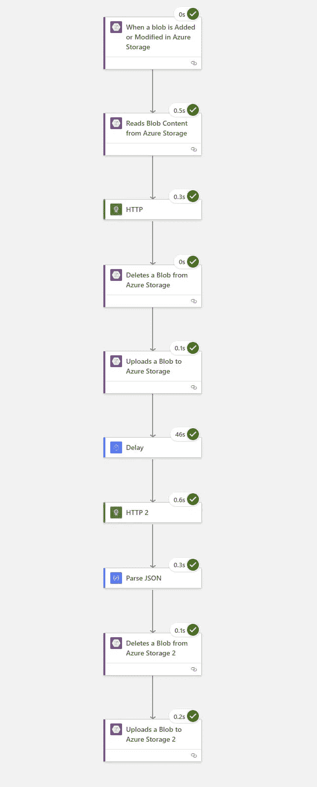

# 逻辑应用

*   首先从 Blob 创建一个触发器

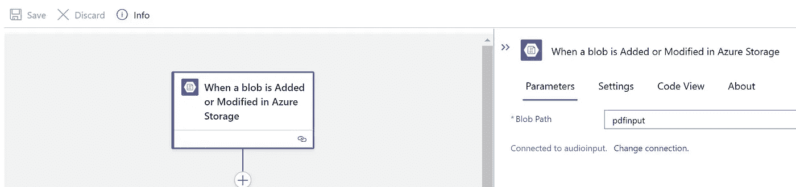

*   输入容器名:pdfinput
*   读取 Blob 内容
*   容器名称:pdfinput
*   blob 名称—指定 blob 名称

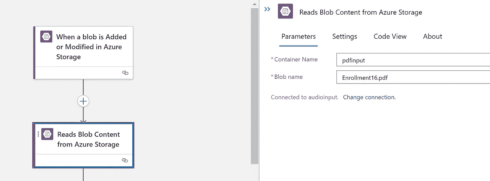

*   带来 HTTP 操作
*   方法:邮寄
*   URI—[https://cogsvcname . cognitiveservices . azure . com/form recognizer/v 2.1/layout/analyze](https://cogsvcname.cognitiveservices.azure.com/formrecognizer/v2.1/layout/analyze)
*   需要标题
*   sub-Ocp-Apim-订阅密钥
*   从以前的操作中选择 Blob 响应数据

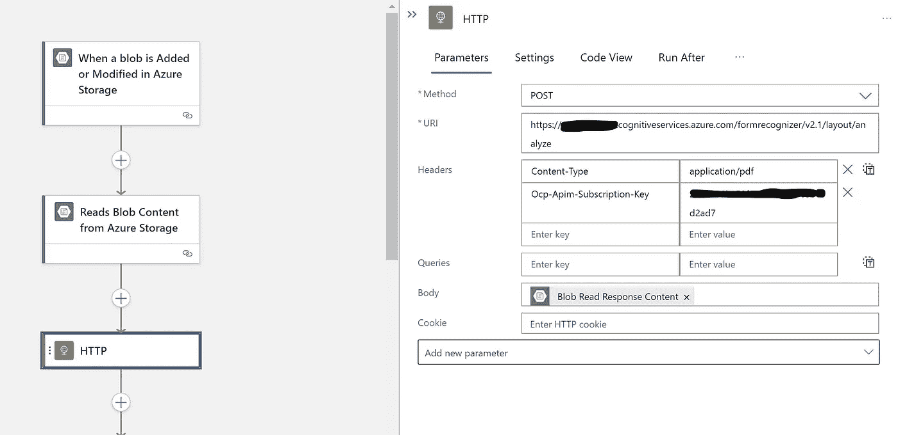

*   删除现有的标题信息存储
*   指定容器名称和 blob 名称
*   集装箱名称—港口输出
*   blob 名称— pdfoutputanalyze.json

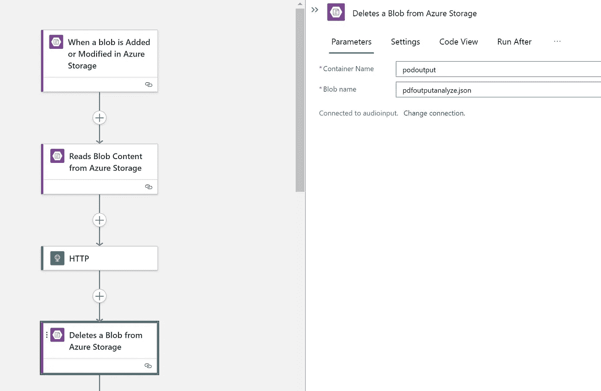

*   现在上传新的头内容到 blob
*   容器名称
*   Blob 名称
*   内容:标题(选择)

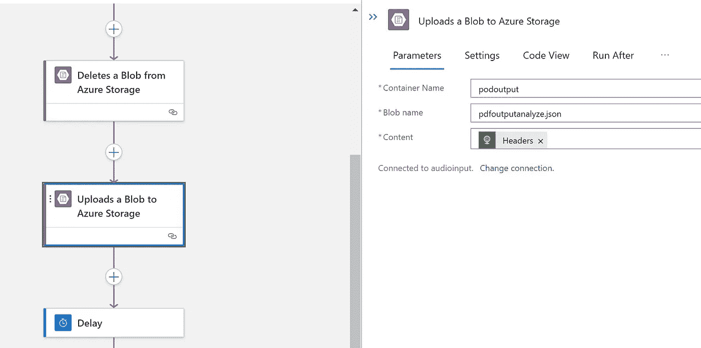

*   现在引入 API 处理的延迟
*   这可以根据文件的大小进行定制
*   选择单位为 Selcong
*   对于计数= 45–45 秒

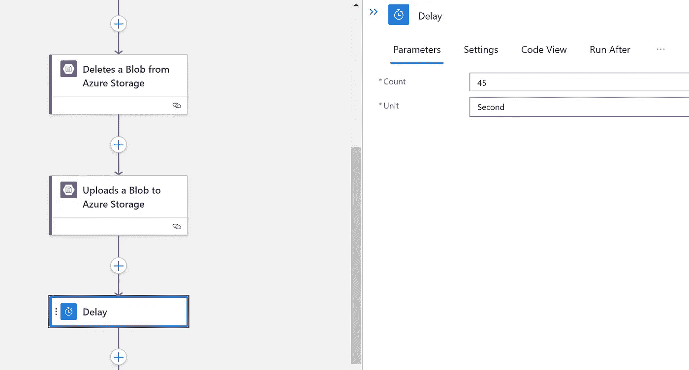

*   现在引入 HTTP 操作来检索结果
*   细节
*   URL 格式

```
concat('https://cushwakepdf.cognitiveservices.azure.com/formrecognizer/v2.1/layout/analyzeResults/', outputs('HTTP')?['headers']?['apim-request-id'])
```

*   将标题添加为 Ocp-Apim-Subscription-Key —这是主/辅密钥

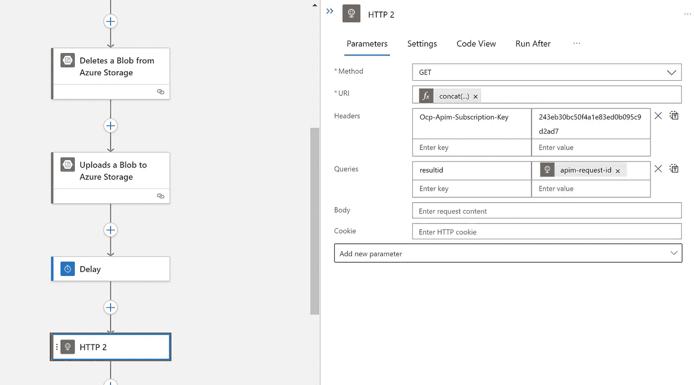

*   现在解析 JSON
*   带来 parseJSON 操作
*   选择上面的输出作为内容
*   内容:正文
*   对于模式

```
{
    "properties": {
        "analyzeResult": {
            "properties": {
                "pageResults": {
                    "items": {
                        "properties": {
                            "page": {
                                "type": "integer"
                            },
                            "tables": {
                                "items": {
                                    "properties": {
                                        "boundingBox": {
                                            "items": {
                                                "type": "number"
                                            },
                                            "type": "array"
                                        },
                                        "cells": {
                                            "items": {
                                                "properties": {
                                                    "boundingBox": {
                                                        "items": {
                                                            "type": "number"
                                                        },
                                                        "type": "array"
                                                    },
                                                    "columnIndex": {
                                                        "type": "integer"
                                                    },
                                                    "elements": {
                                                        "type": "array"
                                                    },
                                                    "isHeader": {
                                                        "type": "boolean"
                                                    },
                                                    "rowIndex": {
                                                        "type": "integer"
                                                    },
                                                    "text": {
                                                        "type": "string"
                                                    }
                                                },
                                                "required": [
                                                    "rowIndex",
                                                    "columnIndex",
                                                    "text",
                                                    "boundingBox",
                                                    "elements",
                                                    "isHeader"
                                                ],
                                                "type": "object"
                                            },
                                            "type": "array"
                                        },
                                        "columns": {
                                            "type": "integer"
                                        },
                                        "rows": {
                                            "type": "integer"
                                        }
                                    },
                                    "required": [
                                        "rows",
                                        "columns",
                                        "cells",
                                        "boundingBox"
                                    ],
                                    "type": "object"
                                },
                                "type": "array"
                            }
                        },
                        "required": [
                            "page",
                            "tables"
                        ],
                        "type": "object"
                    },
                    "type": "array"
                },
                "readResults": {
                    "items": {
                        "properties": {
                            "angle": {
                                "type": "number"
                            },
                            "height": {
                                "type": "number"
                            },
                            "lines": {
                                "items": {
                                    "properties": {
                                        "appearance": {
                                            "properties": {
                                                "style": {
                                                    "properties": {
                                                        "confidence": {
                                                            "type": "number"
                                                        },
                                                        "name": {
                                                            "type": "string"
                                                        }
                                                    },
                                                    "type": "object"
                                                }
                                            },
                                            "type": "object"
                                        },
                                        "boundingBox": {
                                            "items": {
                                                "type": "number"
                                            },
                                            "type": "array"
                                        },
                                        "text": {
                                            "type": "string"
                                        },
                                        "words": {
                                            "items": {
                                                "properties": {
                                                    "boundingBox": {
                                                        "items": {
                                                            "type": "number"
                                                        },
                                                        "type": "array"
                                                    },
                                                    "confidence": {
                                                        "type": "number"
                                                    },
                                                    "text": {
                                                        "type": "string"
                                                    }
                                                },
                                                "required": [
                                                    "boundingBox",
                                                    "text",
                                                    "confidence"
                                                ],
                                                "type": "object"
                                            },
                                            "type": "array"
                                        }
                                    },
                                    "required": [
                                        "boundingBox",
                                        "text",
                                        "appearance",
                                        "words"
                                    ],
                                    "type": "object"
                                },
                                "type": "array"
                            },
                            "page": {
                                "type": "integer"
                            },
                            "selectionMarks": {
                                "items": {
                                    "properties": {
                                        "boundingBox": {
                                            "items": {
                                                "type": "number"
                                            },
                                            "type": "array"
                                        },
                                        "confidence": {
                                            "type": "number"
                                        },
                                        "state": {
                                            "type": "string"
                                        }
                                    },
                                    "required": [
                                        "boundingBox",
                                        "confidence",
                                        "state"
                                    ],
                                    "type": "object"
                                },
                                "type": "array"
                            },
                            "unit": {
                                "type": "string"
                            },
                            "width": {
                                "type": "number"
                            }
                        },
                        "required": [
                            "page",
                            "angle",
                            "width",
                            "height",
                            "unit",
                            "lines",
                            "selectionMarks"
                        ],
                        "type": "object"
                    },
                    "type": "array"
                },
                "version": {
                    "type": "string"
                }
            },
            "type": "object"
        },
        "createdDateTime": {
            "type": "string"
        },
        "lastUpdatedDateTime": {
            "type": "string"
        },
        "status": {
            "type": "string"
        }
    },
    "type": "object"
}
```

*   删除输出 blob

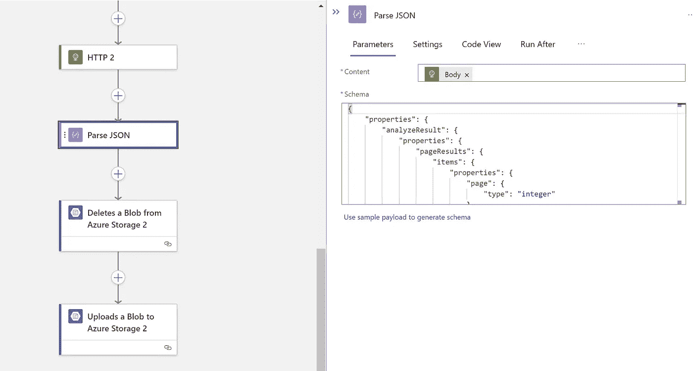

*   现在删除旧数据
*   我这样做，因为它的相同的文件名和连接器不允许覆盖
*   集装箱名称:podoutput
*   Blob 名称:formoutput.json

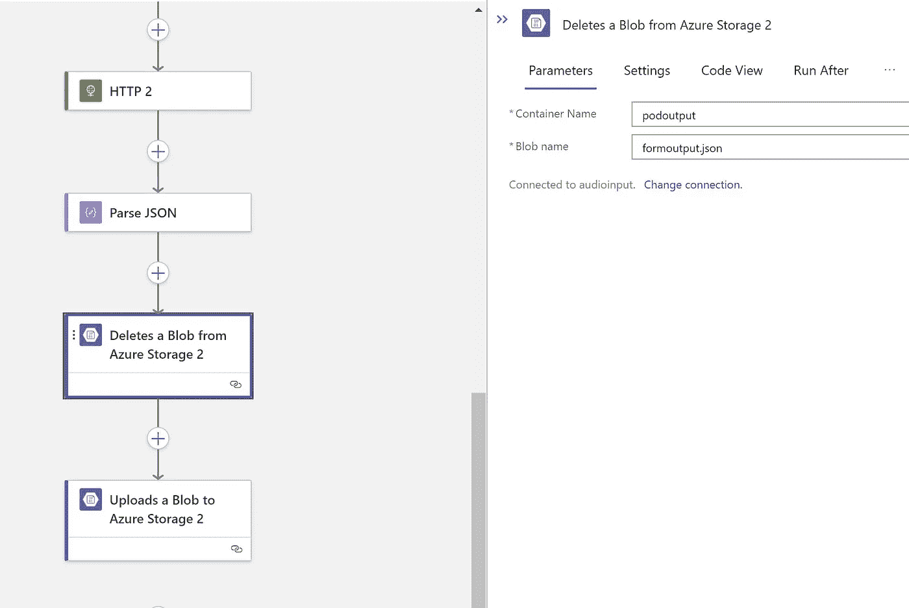

*   写入输出
*   集装箱名称:podoutput
*   Blob 名称:formoutput.json
*   内容:从 parseJSON 中选择正文

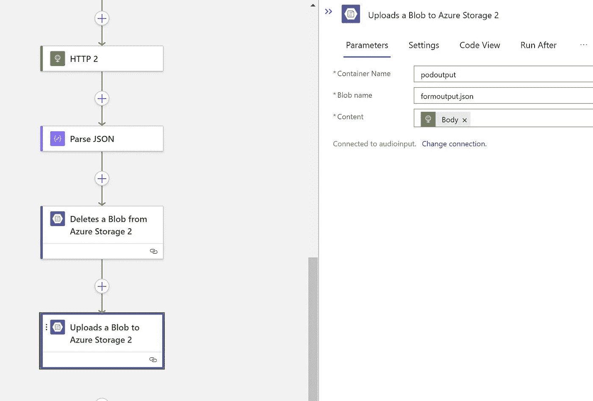

原文—【github.com samples 2021/formanalyze . MD at main balakreshnan/samples 2021