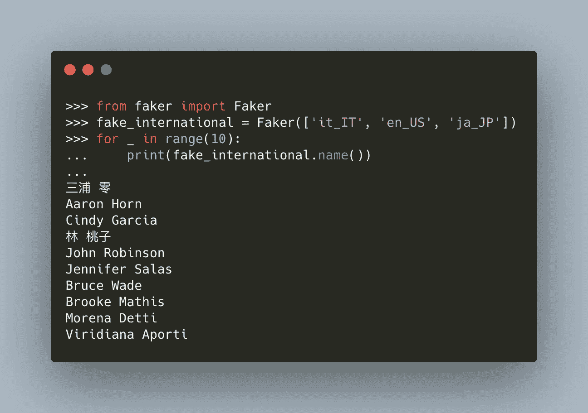

# 没有数据没有问题，使用 Faker 来测试数据工程和分析的想法

> 原文：<https://medium.com/analytics-vidhya/no-data-no-problem-use-faker-to-test-ideas-for-data-engineering-and-analytics-de76af8644c1?source=collection_archive---------0----------------------->

# 介绍

数据分析和工程是快速发展的领域，有可能彻底改变我们做生意和决策的方式。然而，任何数据项目的一个关键方面是访问正确的数据。但是如果你不能访问真实世界的数据呢？这就是 Faker 的用武之地。冒牌货…