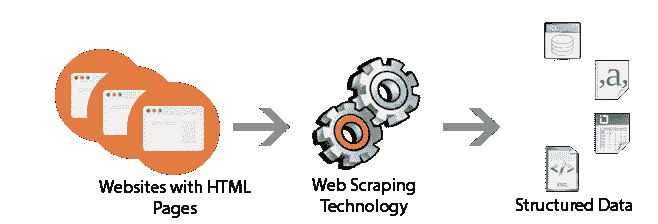

# 没有数据？没问题。使用美汤的网络抓取网站

> 原文：<https://medium.com/analytics-vidhya/no-data-no-problem-webscraping-websites-using-beautiful-soup-8dc1a5fd8a5d?source=collection_archive---------3----------------------->

有多少次，你想到了一个数据科学/机器学习项目的想法，却发现 kaggle、谷歌数据集或任何地方都没有数据。如果你曾经想到过，我向你介绍网络搜集的艺术。

资料来源:发展至

## 但是，什么是网络抓取？