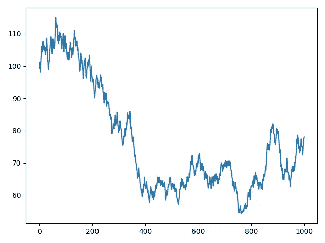
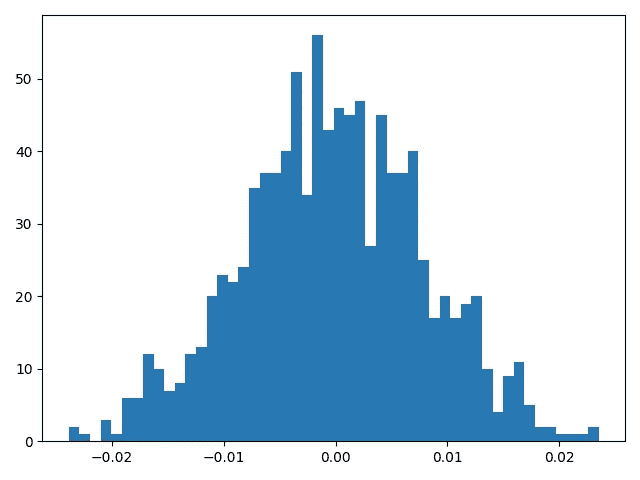

# 不，LSTMs 不能预测股票价格

> 原文：<https://medium.com/analytics-vidhya/no-lstms-cant-predict-stock-prices-11f10dcb35d6?source=collection_archive---------0----------------------->

尽管 LSTMs 是一种非常流行的方法，但它本质上是一种糟糕的估计股票价格的方法

[图像来源](https://towardsdatascience.com/how-animal-investors-beat-the-market-3c052dd1e31c)

长短期记忆(LSTM)网络是一种非常流行的递归神经网络，主要用于学习序列和顺序依赖性。因此，当涉及到学习音频、语言，当然还有时间序列数据——任何具有时间维度的东西时，它们通常是非常可靠的选择。很自然，人们会尝试将这种时间学习能力用于最受欢迎的时间序列数据:股票市场。然而，不管这种技术有多流行，我们会发现这是一种本质上非常糟糕的预测股票市场的方法。

# 猴子是很好的资金管理者

1973 年，一位名叫伯顿·戈登·马尔基尔的普林斯顿经济学家出版了一本相当著名的书*《漫步华尔街》*，他在书中提出:

> “一只被蒙住眼睛的猴子向一份报纸的金融版投掷飞镖，可能会选择一个与专家精心挑选的投资组合一样好的投资组合。”

马尔基尔将被证明是正确的，因为存在许多对这种情景的模拟——对专业策划的投资组合的随机选择——这确立了他的说法。

一个这样的实验在文章 [*中有详细描述，该文章来自马尔基尔的《猴子的令人惊讶的阿尔法和颠倒的策略*](https://thereformedbroker.com/wp-content/uploads/2014/11/jpm_summer2013_rallc.pdf) *，*，作者从总共 1000 只股票中随机选择了 30 只股票。这一过程重复了 100 次，值得注意的是，100 个投资组合中有 96 个的表现超过基准指数平均每年 1.7%。

《华尔街日报》*、*中描述了一个类似的模拟，在纽约举行的 Sohn 会议上，[、*的记者在街上听到*、](https://www.wsj.com/articles/making-monkeys-out-of-the-sohn-investing-gurus-11557115260)、*、*的记者向报纸上的股票列表投掷飞镖，然后继续将他们随机挑选的股票与基金经理进行比较。随机挑选的股票表现超过基金经理 22 个百分点——只有 33%的 Sohn 挑选的股票表现超过标准普尔 500 指数。

事实上，把这种说法发挥到极致，1999 年，一只名为乌鸦“Thorogood III”的猴子选择了一个由 10 只股票组成的投资组合，对着一块板子扔飞镖。Raven 成为美国第 22 位最成功的基金经理，并以 213%的收益超过了华尔街的 6000 多名专业经纪人。这一成就将迅速为瑞文赢得吉尼斯世界纪录的一席之地。说真的，你可以在这里查看[。](https://www.guinnessworldrecords.com/world-records/most-successful-chimpanzee-on-wall-street)

这样的结果现在显然只能归因于股票大多是随机的这一事实。不管一个人做了多少分析和研究，投资组合的成功在很大程度上可以归结为运气和机会。股票走势基本上是随机的。LSTM，更不用说任何一种机器学习模型，都无法预测天生随机的东西。就其定义而言，随机性是不可预测的。

# 漫无目的地到处走

股票在很大程度上是随机的这一信念被称为 r *和随机游走理论*，它声称股票价格的变化具有相同的分布，并且相互独立。随机游走理论认为，股票采取随机和不可预测的路径，使得所有持续预测股价的方法都无效。因此，任何以前的股票价格，趋势或信息都不能用来预测未来的运动。然而，值得注意的是，并不是每个人都赞同随机漫步理论。

让我们先熟悉一下*到底是什么*随机漫步。随机漫步不是一个随机数序列，而是一个对前一个随机修改的数字序列。

例如，给定一个值，我们可以随机选择给它加-1 或 1。然后我们取这个新值，并在接下来的时间步重复同样的随机过程。我们可以对任意数量的时间步长重复这个过程。这是一次“随机漫步”。

与前面描述的随机游走理论相关，我们将模拟一个假想的股票作为例子。随机游走理论表明，股票价格的变化具有相同的分布，并且相互独立。为了简单起见，我们将假设我们假想的股票以正态分布随机波动，日价格变化在-2.5%和 2.5%之间。简而言之，给定一天的股票价格将是相对于先前价格的随机正/负百分比变化，变化通常分布在-2.5%和 2.5%之间。

我们将从初始值 100 美元开始，并运行一个 Python 脚本来模拟和绘制这个假想股票的 1000 个时间步长。

这些是结果:

正如我们所看到的，我们想象的股票可能看起来很熟悉，因为它有相当真实的行为。这是另一个例子:

这些是随机漫步。请记住，这些例子完全是我们虚构的股票和我们虚构的参数的虚构产物，当然都是基于随机漫步理论。它们看起来就像真的一样，但是它们完全是随机的！如果我们要计算这些生成的随机游走之一的百分比变化，并将其绘制成直方图，我们可以观察到以下情况:

正如所料，百分比变化正态分布，平均值为 0，介于-2.5%和 2.5%之间。

为了进一步探索，我们将以一些真实的 IBM 股票数据为例进行一些实验。

以下是 IBM 股票去年的收盘价:

这看起来已经很像随机漫步了。让我们计算每天的百分比变化，并将它们排列成直方图:

坦率地说，这再好不过了。每天 IBM 股票价格的变化几乎是正态分布，平均值为 0，大约在-10%到 10%之间。这只股票简直就是随机漫步。

当然，并不是所有现存的股票都这么好。然而，通常只需要几个数据转换就可以得出类似的结论。随机游走理论也不要求分布特别漂亮，重要的是每天的价格变化具有相同的分布。

随机游走理论肯定有强有力的证据，即过去的价格和趋势对未来的价格没有影响，因为它们都是完全随机的。事实上，在试图预测股票价格时，人们常说:

> “对明天股票价格的最佳预测是今天的价格”

一个 LSTM 人利用过去的股票价格来学习预测未来的股票价格从定义上来说是不可能的，因此，推而广之，也是无用的。

# 真的没那么简单

如果我们完全无视随机游走理论，并假设确实存在某种持续预测股票价格的可能模型，那么 LSTMs 仍然是不适合的。

这是因为，如果要对股票市场进行建模，它肯定会是一个比之前的价格值之间的某种关系复杂得多的模型。股票市场的走势至少会受到各种现实世界变量的影响。一家公司的业绩、新产品的推出或产品召回、员工裁员——甚至是首席执行官的一条[推文](https://www.cnbc.com/2021/01/29/elon-musks-tweets-are-moving-markets.html#:~:text=He%20infamously%20tweeted%20last%20year,cryptocurrencies%20for%20a%20while%20now.)都会对股价和未来走势产生重大影响。

认为股票价格受所有可用信息影响的观点是所谓的有效市场假说的一种形式。有效市场假说有 3 种不同的版本:

*   弱势形态:弱势形态表明今天的股票价格反映了过去价格的所有数据，任何形式的技术分析都不能有效地帮助投资者做出交易决策。
*   **半强势形态:**半强势形态表明，由于所有公开的信息都用于计算股票的当前价格，投资者无法利用技术或基本面分析在市场上获得更高的回报。
*   **强式:**强式版本表示所有信息，包括私人信息，都完全计入了当前的股票价格，并且没有任何类型的信息可以在市场上给投资者带来优势。

假设以前的股票价格是未来股票价格的主要影响者是可笑的！一般来说，当 LSTM 在一些股票数据上被训练时，问题被设置成使得 LSTM 试图仅在股票价格中找到对先前值的序列相关性。这是一个粗略的假设，因为仅仅是这些信息不足以构建任何一种股票市场模型，即使这样的东西真的存在。股票市场是一个极其复杂、精密和错综复杂的系统，依赖于整个世界——股票价格无法预测股票价格。

# 总结想法

尽管尝试用 LSTMs 预测股票价格的方法非常流行，但不幸的是，这种事情完全是虚构的。

股票价格本质上是随机游走，每个后续的未来价格都独立于上一个价格。这并不是说 LSTMs 是一个没有足够预测能力的弱模型——它们可以是非常强的时间序列和序列数据预测器——而是事实上没有什么是从*开始*可预测的*。根据其定义，随机性是不能被可靠预测的。因此，试图从本身没有顺序相关性的数据中学习顺序相关性显然是不可能的。*

不管怎样，仅仅是以前的价格并不能提供足够的信息。股票市场极其复杂和错综复杂，现实世界中受数百个变量影响的任何偶然的非随机变化都不可能通过仅使用以前的收盘价建立预测问题来解释。

坦率地说，使用 LSTMs 进行股票价格预测可能是完全无用的，但是仍然应该鼓励这样做，因为这种做法提供了教育价值。这个项目通常在初学者中很受欢迎，在教育背景下，它无疑是学习更多关于 LSTMs 和时间序列数据的好方法。

[信用](https://www.wsj.com/articles/sohn-stock-tips-may-not-be-worth-peanuts-1524592131)

然而，如果你追求的是经济上的成功，那么你最好玩玩飞镖游戏。