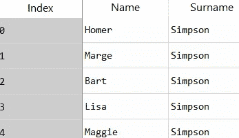
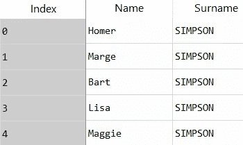
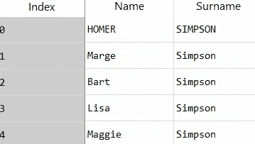
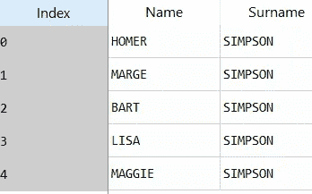
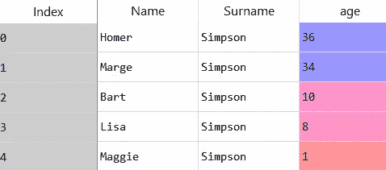
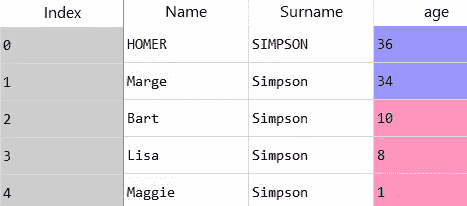
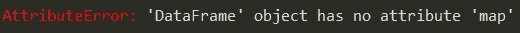
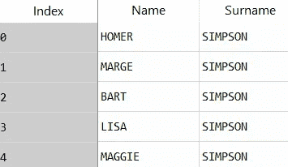

# apply()、map()和 applymap()之间不再混淆

> 原文：<https://medium.com/analytics-vidhya/no-more-confusion-between-apply-map-and-applymap-f982bb98c099?source=collection_archive---------3----------------------->


巴勃罗·加西亚·萨尔达尼亚在 [Unsplash](https://unsplash.com?utm_source=medium&utm_medium=referral) 上拍摄的照片

你是否发现自己经常在 Python 的 apply()、map()和 applymap()函数之间感到困惑？好吧，让我们花几分钟来理解这些功能。

# 【apply()做什么？

pandas apply()函数在**数据帧**和**系列**上运行。我们可以在数据帧的列(轴=1)或行(轴=0)上使用它。让我们举个例子来更好地理解这一点。

```
df = pd.DataFrame({ 'Name': ["Homer","Marge","Bart","Lisa","Maggie"],'Surname': ["Simpson","Simpson","Simpson","Simpson","Simpson"]})
```



为了将姓氏“Simpson”改为大写，我们在列级别上进行操作。

```
df['Surname']=df['Surname'].apply(lambda x: x.upper())
```



为了将任何一行转换成大写，我们在索引级别上操作。

```
df.loc[0]=df.loc[0].apply(lambda x: x.upper())
```



我们还可以在整个数据帧上使用 apply()。

```
df=df.apply(lambda x: x.str.upper())
```



# map()做什么？

map()只能在序列上操作，而不能在整个数据帧上操作。因此，我们可以使用 map()函数替换数据帧中一个系列或一列的所有值，或者替换同类数据帧行的所有值。

在我们的示例中，因为我们将列和行作为一系列同质字符串传递，所以 map()函数也可以在这里替换。

```
df['Surname']=df['Surname'].map(lambda x: x.upper())
df.loc[0]=df.loc[0].map(lambda x: x.upper())
```

但是，如果我们在数据集中添加一个年龄列，map()和 apply()都不能用于行操作，因为我们执行的是字符串操作。



```
df['age']=[36,34,10,8,1]
df.loc[0]=df.loc[0].map(lambda x: x.upper())**AttributeError: 'numpy.int64' object has no attribute 'upper'**
```

这可以用一个小条件来解决！

```
df.loc[0]=df.loc[0].apply(lambda x: x.upper() if type(x)==str else x)
```



与 apply()不同，map()不会对数据帧起作用，即使所有列的数据类型都相同。



# applymap()是做什么的？

最后，applymap()对整个数据帧进行操作，并执行元素操作。

```
df=df.applymap(lambda x: x.upper())
```



*快乐编码！*