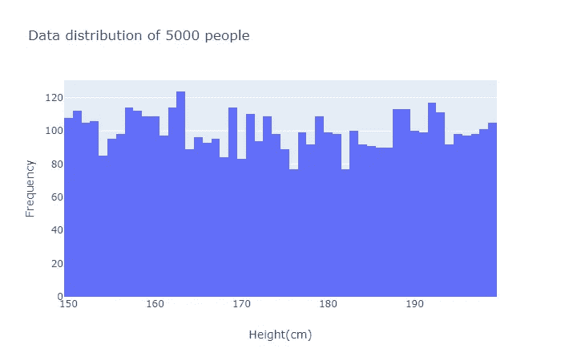
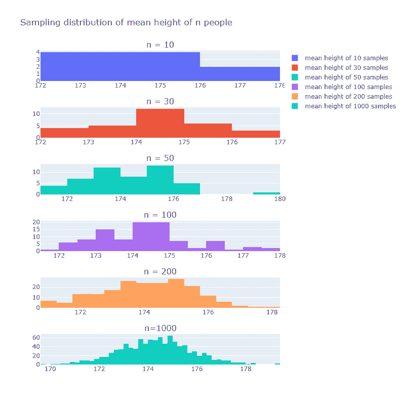

# 不再混淆中心极限定理

> 原文：<https://medium.com/analytics-vidhya/no-more-confusions-with-central-limit-theorem-8664bde4a979?source=collection_archive---------18----------------------->

Stephen H 在 Unsplash 上拍摄的照片

今天我要讲一个让我困惑了一段时间的话题，中心极限定理(CLT)。

我总是说服自己，拥有大量的数据会产生正态分布，如果你花时间去想，这是没有意义的，因为为什么收集大量的数据点会导致正态分布？(除非数据分布是正态分布)

在开始学习 CLT 之前，清楚地理解**数据分布**和**抽样分布之间的区别是很重要的。**

> **数据分布**:显示数据所有可能值的函数或列表，每个数据出现的频率。

例如，如果我们要测量 5000 人的身高，每个人的身高将代表一个数据点，数据分布显示 160 厘米、161 厘米等的人数…我们可以使用直方图来表示。

> **抽样分布**:显示每个样本的样本统计的所有可能值的函数或列表，每个样本统计可能出现的频率。

正如你从定义中看到的，主要的区别是抽样分布中的每个点都是统计的(均值、中值、标准差等)。…)的样本。使用上面的例子，如果我们选择 n 个样本(每个样本 100 人)并计算样本平均值(每个样本 100 人的平均身高),这是一个样本统计，做 M 次，然后将它们分布在直方图上，显示样本统计的每个值可能出现的可能性。

> **中心极限定理**:随着样本量的增加，**抽样分布**呈现正态分布形状的趋势。

当抽样规模大于 30 时，通常假设正态分布。

需要记住的重点是，中心极限定理只适用于抽样分布，不适用于数据分布。定义中提到的抽样规模也是指计算出的抽样统计数。

现在我们将证明 CLT 适用于抽样分布，但不适用于数据分布。

假设我们测量了 N 个人的身高，看看随着 N 的增加，数据分布是否呈正态分布。

下图显示了大小为(N) = 10、50、100、200、1000 的数据分布，很明显，N 的增加不会使数据分布呈正态分布。

现在，从我们开始时创建的 5000 人的人口中，我们将重复下面两个步骤 N 次，以表明随着 N 的增加，采样分布变得正态分布。

1.  选择 100 个人
2.  计算平均身高(样本统计)

你可以在下面看到，随着样本数量的增加，我们的抽样分布看起来更像正态分布。现在看一下我们开始时 5000 人身高的数据分布，中心极限定理的妙处在于不管数据分布形状如何，只要 N 足够大，抽样分布总是变成正态分布。这将导致大量的计算优势，因为许多统计方法具有正态分布假设。一些优势包括获得经验规则，更快的计算二项式和泊松分布等等。我们不会详细讨论，因为这超出了今天博客的范围。

总之，我们已经了解了数据分布和抽样分布之间的区别。了解到中心极限定理仅适用于抽样分布，无论总体数据分布的形状如何，当您创建样本量足够大(n > 30)的抽样分布时，中心极限定理将始终成立。

参考资料:

*   [数据科学家实用统计学第 1 版—第 2 章](https://math2510.coltongrainger.com/books/2017-bruce-and-bruce-pratical-statistics-for-data-scientists.pdf)
*   [数据分发](https://www.statisticshowto.com/data-distribution/#:~:text=A%20data%20distribution%20is%20a,how%20often%20each%20value%20occurs.)
*   [正态分布视频](https://www.youtube.com/watch?v=rBjft49MAO8&ab_channel=CrashCourse)
*   [正态分布的经验法则](https://www.youtube.com/watch?v=mtbJbDwqWLE&ab_channel=SimpleLearningPro)
*   [正态分布的重要性](http://davidmlane.com/hyperstat/A25329.html)