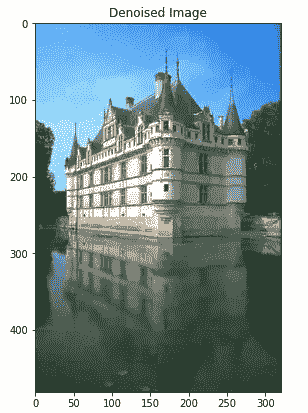
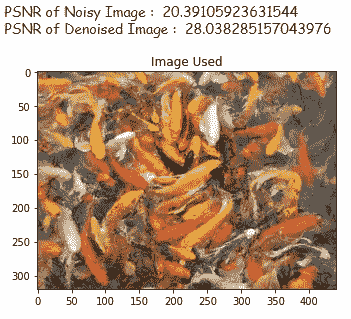

# 使用深度学习模型去除图像中的噪声

> 原文：<https://medium.com/analytics-vidhya/noise-removal-in-images-using-deep-learning-models-3972544372d2?source=collection_archive---------0----------------------->

# *目录:*

1.  **问题概述。**
2.  **深度学习模型的使用。**
3.  **资料收集和准备。**
4.  **绩效指标。**
5.  **先切进场。**
6.  **试验不同的模型。**
7.  **模型量化。**
8.  **模型分析。**
9.  **构建 web 应用程序。**
10.  **未来的工作。**
11.  **参考文献。**

# 1.问题概述

图像去噪是从图像中去除噪声的过程。噪声的增加会造成信息的丢失。噪声可以由多种方式产生，例如在弱光环境下拍摄图像时，由于热量、数码相机的传感器照明水平或由于硬件中的错误存储位置或长距离数据传输中的位错误而导致的电路损坏。

**什么是噪音？**

额外的不必要的像素值被添加到图像中，导致信息丢失。噪音可以是各种类型的，比如-

像素值与周围像素值完全不同的脉冲噪声(IN)。脉冲噪声有两种类型，即椒盐脉冲噪声(SPIN)和随机值脉冲噪声(RVIN)。

加性高斯白噪声(AWGN)，图像中的每个像素都会从其原始值发生少量变化。

# **2*2。深度学习模型的使用***

在获取原始图像对于稳健性能非常重要的情况下，或者在填充缺失信息非常有用的情况下，例如从非常远的物体拍摄的天文图像，从降级图像中去除噪声并恢复原始图像是非常重要的。

卷积神经网络适用于图像。我们尝试了一些研究论文中提到的多个深度神经网络架构，并比较了每个模型的结果。

# ***3。数据收集和准备*和**

我们将使用公开可用的图像，并根据我们的要求进行修改。

数据来源:[https://github.com/BIDS/BSDS500](https://github.com/BIDS/BSDS500)

该数据集由加州伯克利大学提供，包含 500 幅自然图像。

我们将这 500 幅图像分成 400 幅训练图像和 100 幅测试图像。

现在，我们从这些图像中创建补丁，补丁大小为 40 x 40，步幅为 40，裁剪大小不同。这样做之后，我们得到了 85600 个训练补丁和 21400 个测试数据补丁。

可以使用以下代码从给定的图像中获取补丁:

# ***4。绩效指标***

**PSNR** 是最常用的度量标准，用于测量从噪声压缩中获得的图像质量。

术语**峰值信噪比(PSNR)** 是信号的最大可能值(功率)与影响其表示质量的失真噪声功率之间的比率的表达式。PSNR 通常用对数分贝标度来衡量。

给定地面真实图像(g)，噪声图像(f) PSNR 可由下式计算

其中 MSE 由下式给出:

# *5。第一次切割方法*

在第一次切割方法中，我们将创建输入管道，将面片数据作为输入，并向其添加一些随机噪声，利用这些噪声面片，我们将使用 tensorflow keras 训练一个简单的卷积自动编码器模型。

使用 tf.data 的输入管道代码:

现在，我们将训练一个自动编码器模型，其中均方误差(MSE)作为损失函数，初始学习速率为 1e-03 的 Adam 作为优化器。

使用自动编码器，我们获得了 0.0020 的训练损失和 0.0021 的测试损失

# ***6。不同型号的试验***

我们将尝试用于图像去噪任务的不同深度学习架构。

**6.1。DNCNN**

研究论文:[https://arxiv.org/pdf/1608.03981v1.pdf](https://arxiv.org/pdf/1608.03981v1.pdf)

建筑:

给定有噪声的图像输入“y ”,模型预测残留图像“R ”,我们可以通过 **x=y-R** 得到干净的图像“x”

该模型包括三种类型的层，总深度为 D:

(i) Conv+ReLU:对于第一层，大小为 3×3×c 的 64 个滤波器被用于生成 64 个特征图，然后校正线性单元(ReLU)被用于非线性。这里，c 表示图像通道的数量，即，对于灰度图像，c = 1，对于彩色图像，c = 3。

(ii) Conv+BN+ReLU:对于层 2 *(D -1)，使用大小为 3×3×64 的 64 个滤波器，并且在卷积和 ReLU 之间添加批量归一化。

㈢conv:对于最后一层，使用大小为 3×3×64 的 c 个滤波器来重建输出。

该模型主要有两个特点，即学习“R”的残差学习公式和批量归一化，它加快了训练速度，提高了去噪性能。

模型已经用学习率=0.001 的 Adam 优化器训练了 30 个时期，每个时期学习率衰减 5%，并且均方误差(MSE)被用作损失函数。

绘制降噪补丁:

现在，我们结合所有的图像去噪补丁，以获得完整的图像。我们可以通过下面的代码做到这一点:

**剩余学习:**

在学习了这个残留图像之后，我们将从输入中减去它。因此，我们在模型的末尾添加了一个减法层，得到去噪后的图像作为输出。

**6.2。RIDNET**

研究论文:[https://arxiv.org/pdf/1904.07396.pdf](https://arxiv.org/pdf/1904.07396.pdf)

建筑:

该模型由三个主要模块组成，即特征提取、残差模块上的特征学习残差和重构，如图所示。

增强注意模块(EAM)使用具有局部跳跃和短跳跃连接的剩余结构上的剩余。每个 EAM 进一步由 D 块组成，其后是特征关注。由于残差架构上的残差，现在可以使用非常深的网络来提高去噪性能。

模型已经用学习率= 0.001 Adam 优化器训练了 20 个时期，每个时期学习率衰减 10%，平均绝对误差(MAE)用作损失函数。

绘制降噪补丁:

绘制由补片构建的图像:

**6.3。车型对比:**

将模型在具有不同噪声水平的图像上获得的性能(以 db 为单位的 PSNR)制成表格:

# *7。模型量化*

深度学习的量化是通过低位宽数的神经网络来逼近使用浮点数的神经网络的过程。这极大地降低了使用神经网络的内存需求和计算成本。

量化后，DNCNN 模型的大小从 7 MB 减少到 2 MB，RIDNET 模型从 18 MB 减少到 6 MB。

在我们有计算限制的情况下，这种量化模型是非常有效的。这些型号的性能将接近原始型号。

以下是一些统计值，显示了 DNCNN 和 RIDNET 的量化和原始模型的性能:

通过以上观察，我们可以看到 RIDNET 比 DnCNN 模型
获得了略高的 PSNR 值，但是 RIDNET 模型花费的时间要高得多，并且模型的大小也很大。

# ***8。模型分析***

我们对 DNCNN 模型进行了一些模型分析。

**8.1。不同的噪音等级:**

我们可以观察到，该模型在噪声水平在 10-35 范围内的图像上表现良好。随着噪声水平的增加，PSNR 的改善很小。

在噪声水平 60 以上，模型很难从给定的噪声图像中重建图像。

**8.2。不同图像上的性能:**

*普通图像，噪声容易被观察到，PSNR 较高。*

*具有单一背景的图像也具有良好的 PSNR。*

*由于像素分布(大量的颜色变化)导致 PSNR 相对较低，图像的复杂性增加。*

*图像中每个区域的大量颜色变化降低了 PSNR。*

该模型试图通过观察分布在像素周围的像素来预测图像中的残留。
我们可以看到，在颜色变化和像素分布方面，模型性能随着图像复杂度的增加而降低。然而，这种影响是可以协商的，因为我们是通过对较小的图像块进行预测来重建图像的。

# ***9。构建 web 应用***

整个项目是使用 streamlit 部署的。

链接到正在运行的应用:[https://share . streamlit . io/sunilbelde/image 降噪-dn CNN-ridnet-keras/main/app . py](https://share.streamlit.io/sunilbelde/imagedenoising-dncnn-ridnet-keras/main/app.py)

运行应用程序的演示:

# *10。未来工作*

目前，这些深度学习模型仅在具有加性高斯白噪声(AWGN)的图像上训练。

在未来，我们将尝试使用带有脉冲噪声(In)、椒盐脉冲噪声(SPIN)和随机值脉冲噪声(RVIN)等噪声的图像。我们将用更适合此类噪声的体系结构来训练模型。

# *11。参考文献*

1.  [https://www.appliedaicourse.com/](https://www.appliedaicourse.com/)
2.  [https://toward sai . net/p/deep-learning/image-de-noise-using-deep-learning](https://towardsai.net/p/deep-learning/image-de-noising-using-deep-learning)
3.  [https://arxiv.org/pdf/1608.03981v1.pdf](https://arxiv.org/pdf/1608.03981v1.pdf)
4.  [https://arxiv.org/pdf/1904.07396.pdf](https://arxiv.org/pdf/1904.07396.pdf)
5.  [https://www . ni . com/en-in/innovations/white-papers/11/peak-signal-to-noise-ratio-as-an-image-quality-metric . html](https://www.ni.com/en-in/innovations/white-papers/11/peak-signal-to-noise-ratio-as-an-image-quality-metric.html)
6.  【https://www.tensorflow.org/tutorials/generative/autoencoder】

> ***如果您需要任何与代码相关的文件，请通过下面给出的链接进入我的 GitHub 库:***

 [## sunilbelde/image 降噪-dncnn-ridnet-keras

### 额外的不必要的像素值被添加到图像中，导致信息丢失。噪音可能是由…

github.com](https://github.com/sunilbelde/Imagedenoising-dncnn-ridnet-keras) 

> 如果你想在 LinkedIn 上和我联系，下面是链接。

 [## sunil belde -学生应用人工智能课程| LinkedIn

### 查看世界上最大的职业社区 LinkedIn 上 sunil belde 的个人资料。sunil 有 4 个工作列在他们的…

www.linkedin.com](https://www.linkedin.com/in/sunil-belde-1b4151129/) 

> *——————感谢您的阅读——————*