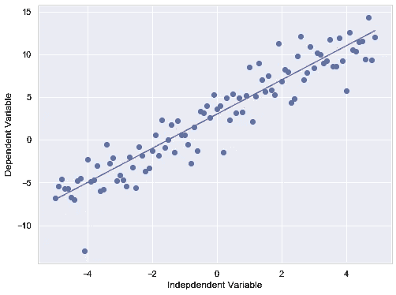
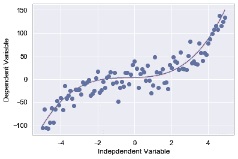
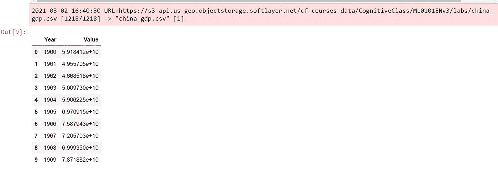
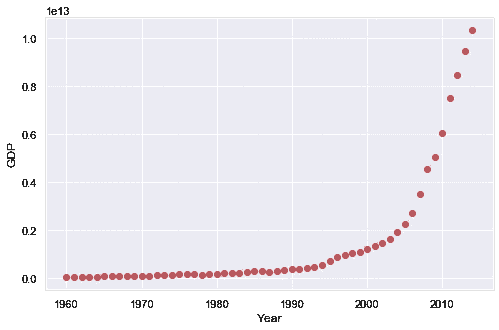
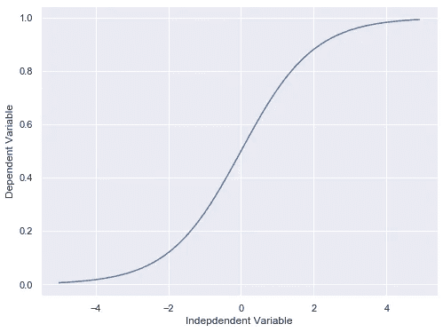
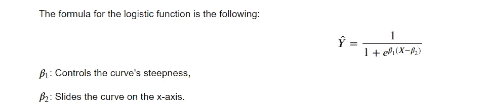
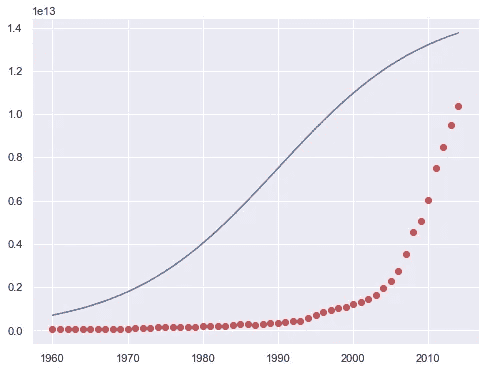
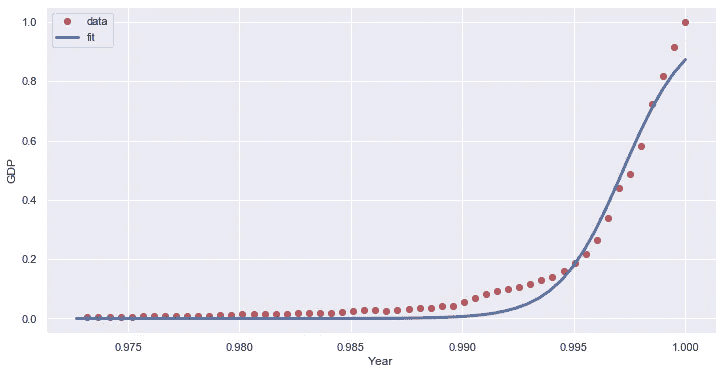

# 非线性回归分析

> 原文：<https://medium.com/analytics-vidhya/non-linear-regression-analysis-e150447ac1a3?source=collection_archive---------0----------------------->


图片来源:作者

# 介绍

如果数据显示曲线趋势，那么**线性回归**与**非线性回归**相比不会产生非常准确的结果，因为顾名思义，**线性回归**假定**数据**是**线性的**。让我们学习一下**非线性回归**并在 **python** 中应用一个例子。在这本笔记本中，我们将一个**非线性模型**拟合到与 1960 年至 2014 年中国 GDP 相对应的**数据点**。

# 导入所需的库

```
# Basic Data Science libraries**import numpy as np
import matplotlib.pyplot as plt
import seaborn as sns
%matplotlib inline****sns.set()**
```

> 虽然线性回归很好地解决了许多问题，但它不能用于所有数据集。首先回忆一下**线性回归**如何对数据集建模。它模拟了一个**因变量**变量 ***y*** 和一个**自变量**变量 ***x*** 之间的**线性关系。它有一个简单的 1 次方程，例如 **y = 2𝑥 + 3** 。**

```
**x = np.arange(-5.0, 5.0, 0.1)** #You can adjust the slope and intercept to verify the changes in the graph.
**y = 2*(x) + 3
y_noise = 2 * np.random.normal(size=x.size)
ydata = y + y_noise
plt.figure(figsize=(8,6))
plt.plot(x, ydata,  'bo')
plt.plot(x,y, 'r') 
plt.ylabel('Dependent Variable')
plt.xlabel('Indepdendent Variable')
plt.show()**
```



**非线性回归**是**独立**变量 **𝑥** 和**因变量**𝑦之间的关系，这导致了**非线性函数模型化**数据。本质上任何不是**线性**的关系都可以称为**非线性**，通常用 **𝑘** 度的**多项式**表示(最大功率 **𝑥** )。

> **𝑦 =𝑎x +𝑏𝑥 +𝑐𝑥+𝑑**

**非线性**函数可以有类似于**指数**、**对数**、**分数**等元素。例如:

> **𝑦=log(𝑥)**

甚至更复杂，例如:

> **𝑦=log(𝑎𝑥 +𝑏𝑥 +𝑐𝑥+𝑑)**

让我们来看看一个**三次**函数的图形。

```
**x = np.arange(-5.0, 5.0, 0.1)** #You can adjust the slope and intercept to verify the changes in the graph
**y = 1*(x**3) + 1*(x**2) + 1*x + 3
y_noise = 20 * np.random.normal(size=x.size)
ydata = y + y_noise
plt.plot(x, ydata,  'bo')
plt.plot(x,y, 'r') 
plt.ylabel('Dependent Variable')
plt.xlabel('Indepdendent Variable')
plt.show()**
```



> 可以看到，这个函数有 ***𝑥*** 和 ***𝑥*** 作为**独立**变量。此外，该函数的图形不是在 **2D** 平面上的直线。所以这是一个**非线性函数**。

# 非线性回归示例

举个例子，我们将尝试用一个非线性模型来拟合 1960 年至 2014 年中国 GDP 的数据点。我们下载了一个有两列的数据集，第一列是 1960 年到 2014 年之间的一年，第二列是中国在那一年以美元计算的相应年度国内生产总值。

```
**import numpy as np
import pandas as pd**#downloading dataset
**!wget -nv -O china_gdp.csv** [**https://s3-api.us-geo.objectstorage.softlayer.net/cf-courses-data/CognitiveClass/ML0101ENv3/labs/china_gdp.csv**](https://s3-api.us-geo.objectstorage.softlayer.net/cf-courses-data/CognitiveClass/ML0101ENv3/labs/china_gdp.csv) **df = pd.read_csv("china_gdp.csv")
df.head(10)**
```



# 绘制数据集

这是数据点的样子。它看起来有点像逻辑函数或指数函数。开始时增长缓慢，从 2005 年开始，增长非常显著。最后，它在 2010 年代略有减速。

```
**plt.figure(figsize=(8,5))
x_data, y_data = (df["Year"].values, df["Value"].values)
plt.plot(x_data, y_data, 'ro')
plt.ylabel('GDP')
plt.xlabel('Year')
plt.show()**
```



# 选择模型

> 从对该图的初步观察，我们确定逻辑函数可以是一个很好的近似，因为它具有从缓慢增长开始，在中间增长，然后在最后再次下降的特性；如下图所示:

```
**X = np.arange(-5.0, 5.0, 0.1)
Y = 1.0 / (1.0 + np.exp(-X))****plt.plot(X,Y) 
plt.ylabel('Dependent Variable')
plt.xlabel('Indepdendent Variable')
plt.show()**
```



# 构建模型

现在，让我们构建我们的回归模型并初始化它的参数。

```
**def sigmoid(x, Beta_1, Beta_2):
     y = 1 / (1 + np.exp(-Beta_1*(x-Beta_2)))
     return y****beta_1 = 0.10
beta_2 = 1990.0**#logistic function
**Y_pred = sigmoid(x_data, beta_1 , beta_2)****#plot initial prediction against datapoints
plt.plot(x_data, Y_pred*15000000000000.)
plt.plot(x_data, y_data, 'ro'**
```



我们在这里的任务是为我们的**模型**找到**最佳参数**。让我们先把**正常化**我们的***x*** 和 ***y*** :

## 我们如何为拟合线找到最佳参数？

我们可以使用 **curve_fit** ，它使用非线性最小二乘法来拟合我们的 **sigmoid 函数**到数据。使 **sigmoid(xdata，*popt)** - **ydata** 的残差平方和最小的参数的最佳值。popt 是我们优化的参数。

```
# Lets normalize our data
**xdata =x_data/max(x_data)
ydata =y_data/max(y_data)****from scipy.optimize import curve_fit
popt, pcov = curve_fit(sigmoid, xdata, ydata)**# Now we plot our resulting regression model.
**x = np.linspace(1960, 2015, 55)
x = x/max(x)
plt.figure(figsize=(8,5))
y = sigmoid(x, *popt)
plt.plot(xdata, ydata, 'ro', label='data')
plt.plot(x,y, linewidth=3.0, label='fit')
plt.legend(loc='best')
plt.ylabel('GDP')
plt.xlabel('Year')
plt.show()**
```



# **我们模型的计算精度？**

```
# split data into train/test
**msk = np.random.rand(len(df)) < 0.8
train_x = xdata[msk]
test_x = xdata[~msk]
train_y = ydata[msk]
test_y = ydata[~msk]**# build the model using train set
**popt, pcov = curve_fit(sigmoid, train_x, train_y)**# predict using test set
**y_hat = sigmoid(test_x, *popt)**# evaluation
**print("Mean absolute error: %.2f" % np.mean(np.absolute(y_hat - test_y)))
print("Residual sum of squares (MSE): %.2f" % np.mean((y_hat - test_y) ** 2))
from sklearn.metrics import r2_score
print("R2-score: %.2f" % r2_score(y_hat , test_y)**
```

> **平均绝对误差:0.05
> 残差平方和(MSE): 0.00
> R2 评分:0.95**

# 感谢阅读

更多此类内容[点击此处](/@kalamanoj989)并关注我。