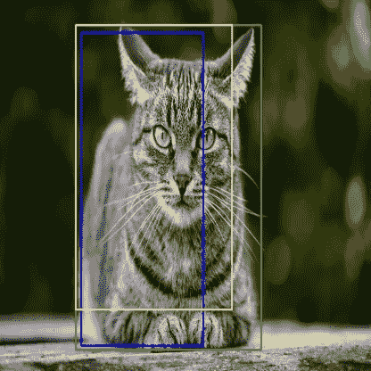
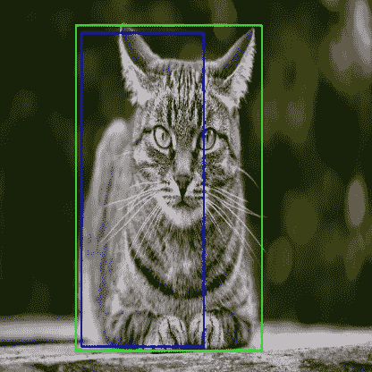
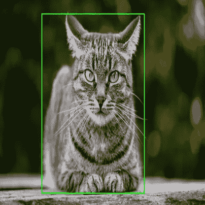
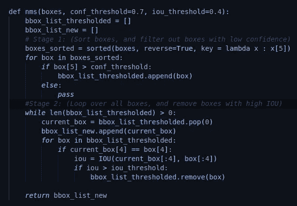
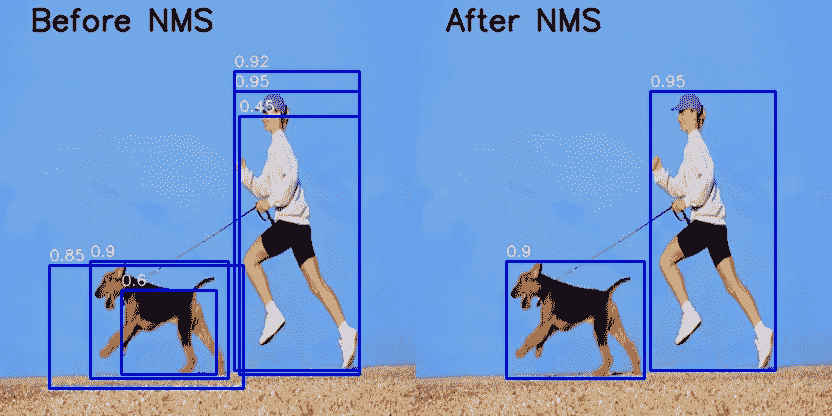

# 非最大抑制(NMS)

> 原文：<https://medium.com/analytics-vidhya/non-max-suppression-nms-6623e6572536?source=collection_archive---------0----------------------->

什么是非最大抑制，为什么要使用它？

非最大值抑制是一种主要用于对象检测的技术，旨在从一组重叠的框中选择最佳的边界框。在下图中，非最大值抑制的目的是移除黄色和蓝色框，这样我们只剩下绿色框。



图 1:同一对象的多个重叠框

**计算 NMS 的步骤:**

为了对什么是边界框，以及 IOU 意味着什么有一个大概的了解，我已经就此发表了两篇文章。([边框](https://vineeth2309.medium.com/basics-of-bounding-boxes-94e583b5e16c)，以及 [IOU](https://vineeth2309.medium.com/iou-intersection-over-union-705a39e7acef) )。两篇文章中描述的术语和参数在本文中继续使用。我将首先描述这个特殊例子的 NMS 过程，然后解释一个更一般化的算法，将它扩展到不同的类。

**解释使用的术语:**

*   我们将使用的每个边界框的格式如下:
    bbox = [x1，y1，x2，y2，class，confidence]。
*   让我们假设对于这个特定的图像，我们有一个列表 3 个边界框；即 bbox _ list =[蓝色 _box，黄色 _box，绿色 _box]。
*   green_box = [x1，y1，x2，y2，"猫"，0.9]
    yellow_box = [x5，y5，x6，y6，"猫"，0.75]
    blue_box = [x3，y3，x4，y4，"猫"，0.85]

**第一阶段(最初移除箱子):**

*   作为 NMS 的第一步，我们按信任度降序排列盒子。这给了我们:
    bbox_list = [green_box，blue_box，yellow_box]
*   然后，我们定义一个置信度阈值。任何置信度低于该阈值的盒子都将被移除。对于这个例子，让我们假设置信度阈值为 **0.8** 。使用这个阈值，我们将删除黄色框，因为它的置信度是< 0.8。这给我们留下:
    bbox_list = [green_box，blue_box]



图 2:卸下黄色盒子

**第二阶段(箱子的 IOU 比较):**

*   因为这些框是按照置信度降序排列的，所以我们知道列表中的第一个框具有最高的置信度。我们从列表中删除第一个框，并将其添加到新列表中。在我们的例子中，我们将删除绿框，并把它放到一个新的列表中，比如 bbox_list_new。
*   在这个阶段，我们为 IOU 定义一个额外的阈值。该阈值用于移除具有高重叠的框。其背后的推理如下:如果两个盒子有大量的重叠，并且它们也属于同一个类，那么这两个盒子很可能覆盖同一个对象(我们可以从图 2 中验证这一点)。因为我们的目标是每个对象有一个盒子，所以我们试着去掉可信度较低的盒子。
*   对于我们的例子，假设我们的 IOU 阈值是 **0.5**
*   我们现在开始计算绿色盒子的 IOU，bbox_list 中的每个剩余盒子也具有相同的类。在我们的例子中，我们只用蓝框来计算绿框的 IOU。
*   如果绿框和蓝框的 IOU 大于我们定义的阈值 0.5，我们将移除蓝框，因为它的置信度较低，并且也有明显的重叠。
*   对图像中的每个盒子重复这个过程，最终只得到具有高置信度的唯一盒子。



图 3:非最大抑制的结果

**算法:**

1.  定义 Confidence_Threshold 和 IOU_Threshold 的值。
2.  按照置信度的降序对边界框进行排序。
3.  移除具有置信度的盒子< Confidence_Threshold
4.  Loop over all the remaining boxes, starting first with the box that has highest confidence.
5.  Calculate the IOU of the current box, with every remaining box that belongs to the same class.
6.  If the IOU of the 2 boxes > IOU_Threshold，从我们的盒子列表中移除具有较低置信度的盒子。
7.  重复这个操作，直到我们检查完列表中的所有方框。

**代码:**

下面的代码是执行非最大值抑制的基本函数。以下代码片段中使用的 IOU 函数与上一篇文章中使用的函数相同(代码可在此处找到:)。下面计算 NMS 的代码可以优化以提高性能。



图 4:执行非最大抑制的功能

```
def nms(boxes, conf_threshold=0.7, iou_threshold=0.4):
```

*   该函数将特定图像的框列表、置信度阈值和 iou 阈值作为输入。(我将它们的默认值分别设置为 0.7 和 0.4)

```
bbox_list_thresholded = []
bbox_list_new = []
```

*   我们创建了两个名为 **bbox_list_thresholded** 和 **bbox_list_new** 的列表。
    **bbox _ list _ thresholded:**包含过滤低置信度框后的新框列表
    **bbox_list_new** :包含执行 NMS 后的最终框列表

```
boxes_sorted = sorted(boxes, reverse=True, key = lambda x : x[5])
```

*   我们开始阶段 1，按照置信度的降序对盒子列表进行排序，并将新列表存储在变量**box _ sorted**中。名为**的内置 python 函数 sorted** 遍历我们的框列表，并根据我们指定的关键字对其进行排序。在我们的例子中，我们指定一个关键字 **reverse** =True 来对列表进行降序排序。第二个关键字 **key** 指定了我们想要用于排序的约束。我们使用的 lambda 函数提供了一个映射，它返回每个边界框的第 5 个元素(置信度)。在遍历每个盒子时，排序函数将查看 lambda 函数，该函数将返回盒子的第 5 个元素(置信度),这将以相反的顺序排序。

```
*for* box in boxes_sorted:
    *if* box[5] > conf_threshold:
        bbox_list_thresholded.append(box)
    *else*:
        *pass*
```

*   我们迭代所有排序的盒子，并移除置信度低于我们设置的阈值( **conf_threshold** =0.7)的盒子

```
*while* len(bbox_list_thresholded) > 0:
    current_box = bbox_list_thresholded.pop(0)
    bbox_list_new.append(current_box)
```

*   在阶段 2 中，我们一个接一个地循环阈值化盒子列表( **bbox_list_thresholded** )中的所有盒子，直到列表被清空。
    我们首先从这个列表(current_box)中移除( **pop** )第一个盒子，因为它具有最高的置信度，并将其附加到我们的最终列表( **bbox_list_new** )。

```
 *for* box in bbox_list_thresholded:
        *if* current_box[4] == box[4]:
            iou = IOU(current_box[:4], box[:4])
            *if* iou > iou_threshold:
                bbox_list_thresholded.remove(box)
```

*   然后，我们迭代列表**中所有剩余的盒子，并检查它们是否属于与当前盒子相同的类。(方框[4]对应于该类别)**
*   如果两个盒子属于同一类，我们计算这些盒子之间的 IOU(我们将 **box[:4]** 传递给 IOU 函数，因为它对应于(x1，y1，x2，y2)的值，因为我们的 IOU 函数不需要类和置信度)。
*   如果 IOU > **iou_threshold，**我们从列表**bbox _ list _ threshold，**中移除该框，因为该框是具有较低置信度的框。

```
*return* bbox_list_new
```

*   在非最大压缩之后，我们返回更新的盒子列表。

**最终点数:**

*   非最大抑制的程序可以根据应用进行修改。例如，YOLOV3 模型使用两组置信度作为阈值测量。该算法的另一个改进被称为软 NMS，我将在以后的文章中解释。
*   我已经创建了一个**代码**，它通过两个不同类别的图像的 NMS 阈值的整个过程。我将在下面附上它的结果。完整的代码可以在这里找到[。](https://github.com/vineeth2309/Non-Max-Suppression)



图 5:代码中 NMS 的结果