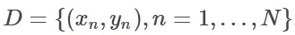
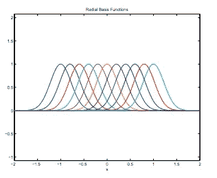
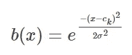
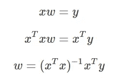
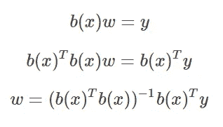
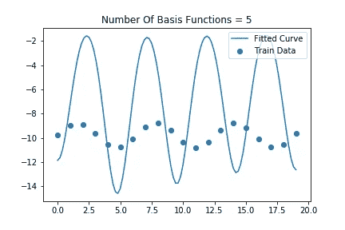
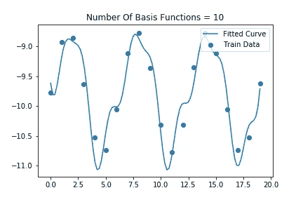
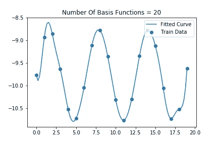
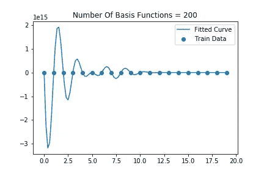

# 径向基函数非线性回归教程

> 原文：<https://medium.com/analytics-vidhya/nonlinear-regression-tutorial-with-radial-basis-functions-cdb7650104e7?source=collection_archive---------7----------------------->

让我们看看基函数回归，它允许我们对非线性关系建模。如果你熟悉常规线性回归，那么你应该知道目标是找到参数 *(α，β)* ，这样我们就可以找到最佳拟合线 *y=αx+β。*

当执行非线性回归时，我们不再只是求解一条直线的方程。现在，我们的高级目标是求解一组基函数的最佳线性组合，使我们能够对非线性的东西进行建模。

换句话说，假设我们有一些简单的数据集

现在，假设我们有一组基函数，它可以是我们想要的任何东西！对于 RBF 回归，我们将使用这样的高斯函数集合。

半径基函数示例

我们想要的是，对于每个 *x∈ D* ，有一个映射 *y=∑wₖb(x)* ，其中 *k* 是我们希望使用的基函数的数量(这是一个超参数)， *b(x)* 是我们的输入 *x* 的一个变换(在我们的例子中，它将通过一个高斯函数传递…稍后将详细介绍)，并且 *w* 将加权我们缩放每个 RBF 函数以产生多少最后，我们将求解一个 *w* ，对于任何给定的 *x* ，它可以输出 *y* 作为我们的一组基函数的组合。

对于基于 RBF 的回归，我们使用以下核来转换输入

其中 *cₖ* 是高斯分布 *k* 的中心/平均值，而 *σ* 是所述高斯分布的标准偏差。这些都是我们模型的超参数。更具体地，超参数包括 1)多少个基函数 2)每个基函数的位置和 3)每个高斯函数的方差。在我下面的例子中，我选择每个高斯的中心，使它们沿着我们的训练数据均匀分布，并任意选择标准偏差 1。对于其他类型的问题，可能有更聪明的方法来选择这些参数。

综上所述，我们要的是求解最优权重 *w* ，这样我们就能最好的求解 *y=b(x)* ᵗ *w* 。我们可以用常规线性回归的方法来求解这些参数。回想一下，对于线性回归，这意味着求解参数 *w* 需要我们做以下工作:

我们可以对非线性回归做同样的事情。也就是说，

我们剩下的是一个带有 k 个权重的权重向量，每个权重向量对应一个径向基函数。正如我们将看到的，我们可以将任何输入 *x* 转换成输出*y’*作为我们基函数的线性组合。

让我们看看在尝试将非线性 RGB 回归量拟合到正弦曲线时，使用不同数量的基函数得到的一些结果

正如我们所看到的，当我们使用太少的基函数时，我们无法捕捉正弦曲线的本质。然而，对于太多的基函数，我们严重地过度拟合了数据。

来源:

*   [http://www . cs . Toronto . edu/~ mbru bake/teaching/C11/讲义/非线性回归. pdf](http://www.cs.toronto.edu/~mbrubake/teaching/C11/Handouts/NonlinearRegression.pdf)