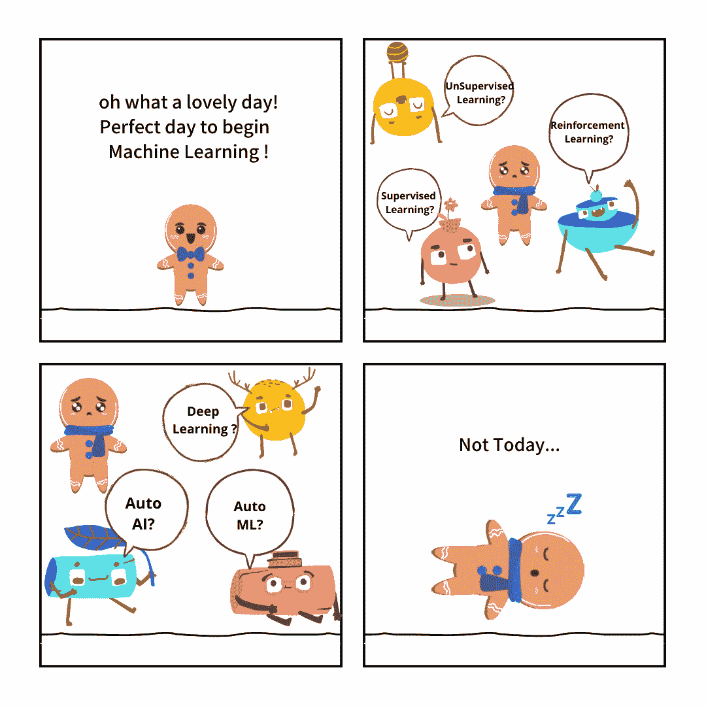
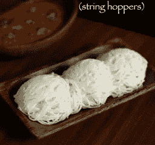
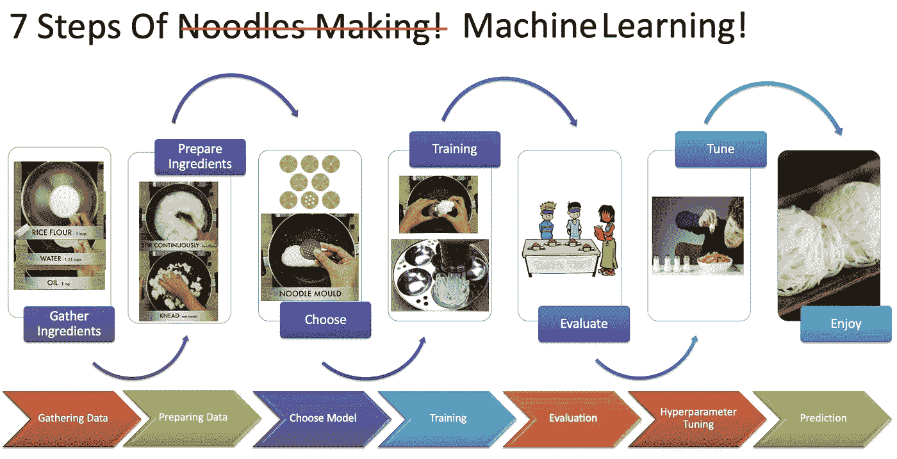
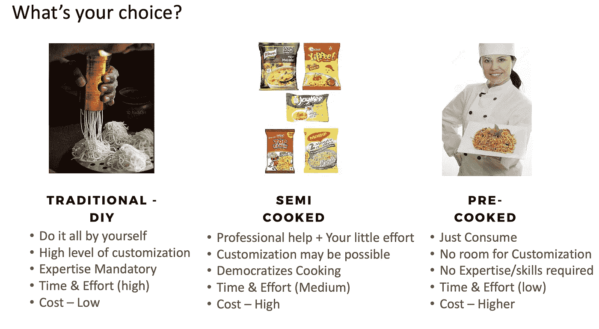
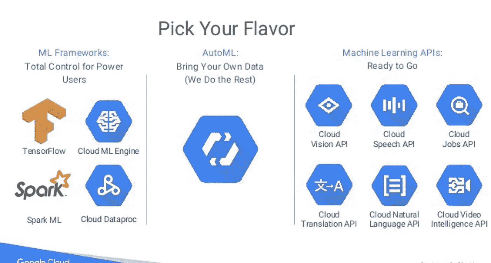
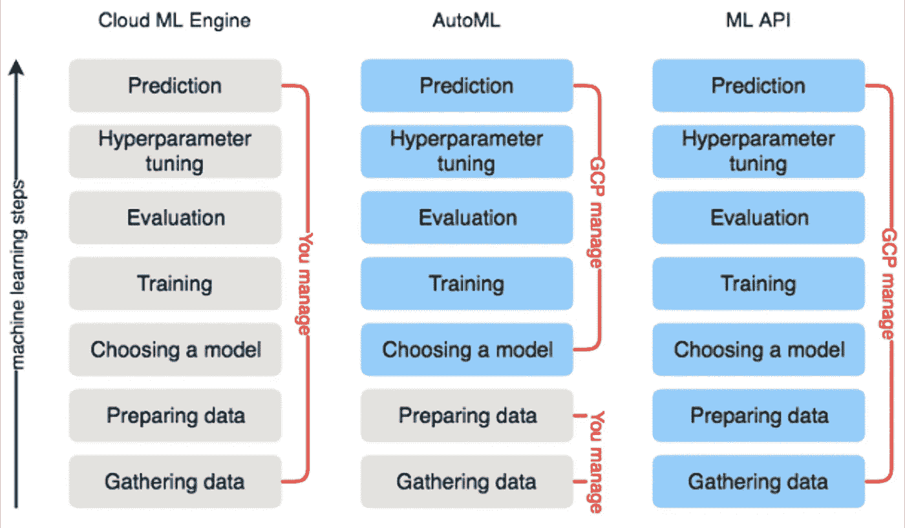
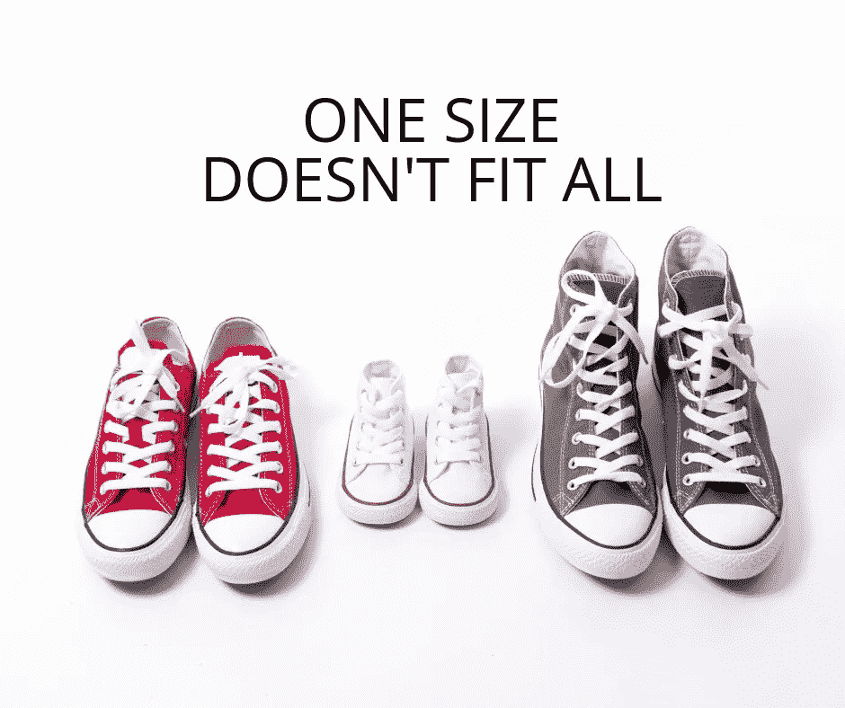

# 面条和机器学习

> 原文：<https://medium.com/analytics-vidhya/noodles-machine-learning-33fa5bfc553?source=collection_archive---------9----------------------->

# **一个吃货对机器学习口味的解读**

> **合著者又名合伙人共:安奴莎·斯里尼瓦桑** ( [安奴莎·斯里尼瓦桑](https://medium.com/u/5e31516cb84?source=post_page-----33fa5bfc553--------------------------------))

当我们开始探索机器学习时，我们意识到市场上有许多从概念到生产的解决方案。为了简化和理解这些选项，我们最初的方法是，理解 MOOC 的概念，使用经典的 ML 包(如 Numpy、Pandas、Scikit Learn、NLTK、Matplotlib)进行编码……主要是使用 Python/R on Anaconda/py charm/Rstudio 作为 IDE。

金吉先生的机器学习之旅

尽管很容易弄脏手&看看 ML 的威力，但是当经典的 ML 方法被用于现实世界的问题时，它变得复杂了。由于许多因素，如训练数据的可用性/质量、不平衡的数据集、特征工程要求、较低的精度、准确度等，问题变得复杂。

当我们为业务需求的 NLP 分类问题构建基于机器学习的分类器时，我们遇到了特征选择、不平衡数据集、超参数调整等形式的挑战。

为了提高预测精度，我们想尝试深度学习解决方案。那时，我们偶然发现了 GCP、H20 和 AWS 的 AutoML/SaaS 解决方案产品。在本文中，我们将简化来自谷歌云平台(GCP)的各种风格的 ML 产品

# 机器学习的美食家观点

hebbarskitchen.com 摄

> 我们中的许多人一定喜欢米粉/串串/ Idiyappam。
> 
> 现在让我们看看如何将制作面条与机器学习并列。
> 
> 让我们开始做饭吧！！

机器学习的 7 个步骤——美食家的观点(食谱/食物摄影:Hebbarskitchen.com 提供)

# 机器学习的味道——你的选择？

维多利亚诺·伊斯基耶多在 [Unsplash](https://unsplash.com?utm_source=medium&utm_medium=referral) 上拍摄的照片

> 自制祭品(或)半熟(或)全熟(即食)
> 食物？这难道不是我们在日常生活中必须多次做出的选择吗？选择永远不会是一样的。这取决于许多因素——出于什么目的、需要喂养的人数、烹饪技能、烹饪时间、成本限制…

面条的种类

> 以我们的食物选择为例，GCP 各地的 ML 产品可以分类如下。

ML-GCP 产品的味道(图片提供:GCP 文件)

**当我们需要满足我们特定业务需求的定制解决方案，或者市场上现有的解决方案不能解决手头的问题时，传统的 DIY / ML 框架**是首选。GCP 提供统一的 ML 平台来构建、部署和扩展有效的人工智能模型。我们还可以利用 GCP 复杂的基础设施，通过端到端的集成能力，经济高效地培训深度学习和 ML 模型。虽然它为我们提供了完全的控制和定制能力，但这种选择需要更多的专业知识、时间、成本和努力。

**Auto ML** 使 ML 专业知识有限的团队能够以最小的努力训练出高质量的定制 ML 模型。当有足够的、高质量的训练数据并且用例不是唯一的时，GCP 的 Auto ML 可以是一个有前途的探索解决方案。AutoML 自然语言(文本)、AutoML 表格(结构化数据)、AutoML 视频智能和 AutoML 视觉现在都可以在 GCP 新的统一顶点 AI 中使用。

**由 GCP 提供的经过预先训练的 ML API**可以轻松地将视觉、视频、翻译和自然语言 ML 功能注入到现有/新的应用中。这些 API 已经准备就绪&不需要任何训练数据或构建定制模型。

> 下面是一个快照，描绘了基于味道的 ML 步骤的所有权。正如你所观察到的，当我们从 DIY 模型转移到 API 方法时，所有权变得暗淡。

跨 ML 口味的所有权(图片提供:互联网)

实施该解决方案的成本各不相同。随着越来越多的公司迁移到云，如果我们能够利用现有的解决方案来解决一般问题，而不是从头开始构建解决方案，这可以帮助我们更快地构建原型并接触客户。

一个尺寸不适合所有人(图片提供:中号)

**那么，DIY ML 车型(或)Auto ML(或)ML APIs？**

选择永远不会是一样的。这取决于许多因素-ML 专业知识，上市时间，问题的独特性，数据可用性，成本，努力…

**“一刀切”**

> 声明:这是我的个人博客，因此我发布、分享和评论的任何内容都不代表我的雇主。