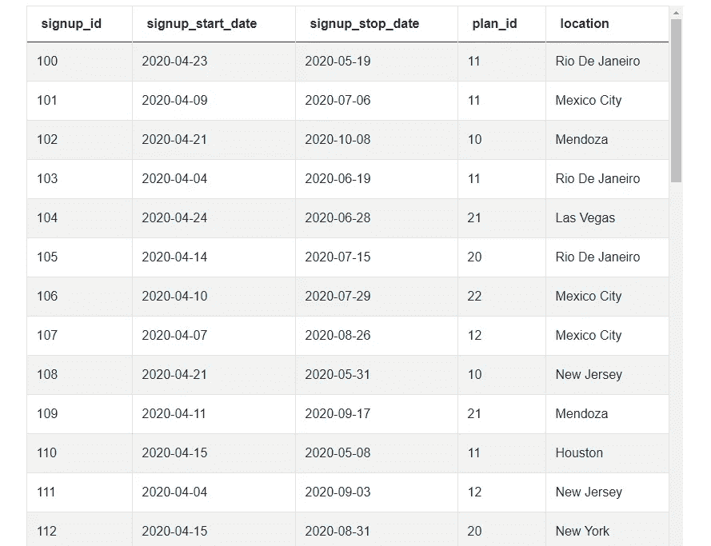
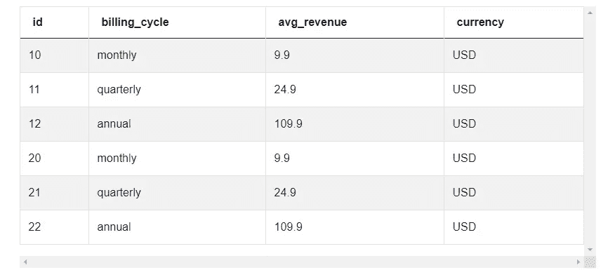

# Noom 数据科学家职位的面试问题

> 原文：<https://medium.com/analytics-vidhya/noom-interview-questions-for-data-scientist-position-3f1ca9724a05?source=collection_archive---------4----------------------->

*数据科学家职位的 Noom 面试问题列表。我们将更详细地讨论 Noom 面试问题，并帮助您解决问题。*


图片来自 [Canva](https://www.canva.com/)

**简介**

在 Noom 工作正成为许多数据科学家的重要目标。这款运用心理学和计算机科学来“颠覆减肥行业”的健身和生活应用正以惊人的速度发展；2019 年，他们的收入翻了两番，达到惊人的 2.37 亿美元。对于一个刚刚在 2016 年推出的应用程序来说，这已经不错了。目前，Noom 在全球拥有大约 4500 万用户。

考虑到这一点，我们认为就如何在 Noom 获得一份数据科学家的工作提供一些见解将是有用的。我们准备了一份现实生活中 Noom 面试问题的清单，这些问题是 Noom 的[数据科学家职位](https://www.stratascratch.com/blog/facebook-data-scientist-position-guide/?utm_source=medium&utm_medium=click&utm_campaign=blog)所需要的。我们将更详细地讨论所有这些 Noom 数据科学面试问题，并帮助您找到解决方案。此外，我们将强调为什么要问这些面试问题，以及这些问题涵盖了哪些技术概念。

# Noom 面试问题中测试的技术概念

在这一部分，我们将涵盖本文 Noom 面试问题中测试的所有技术概念。此外，我们将讨论问题的性质以及这些 Noom 面试问题如何与技术概念相关联。

下表根据本文涉及的问题，展示了 Noom 正在测试的主要技术概念:


作者创造的形象

正如我们所看到的，在面试中测试的所有概念都被用来以某种方式操纵数据，并根据设定的标准获得输出。需要产生的输出可能也需要技术概念的知识。例如，可能会要求您返回每天的用户注册数，并按降序排列结果；要做到这一点，你需要了解技术概念，如数据计数，分组，汇总和排序。

也可能有其他性质的面试问题，要求您输出一个表，其中包含注册、计费周期和工作日，以某种方式排序。要生成此表，您需要了解一些概念，如星期函数、case/when 子句、distinct 语句和数据连接。现在，让我们来看看在 Noom 的数据科学面试中会问到哪些类型的问题。

# Noom 面试问题#1:找到最有利可图的位置

问题链接:[https://platform.stratascratch.com/coding-question?id=2033&python =](https://staging.stratascratch.com/coding-question?id=2033&python=&utm_source=medium&utm_medium=click&utm_campaign=blog)


截图来自 [StrataScratch](https://www.stratascratch.com/?utm_source=medium&utm_medium=click&utm_campaign=blog)

我们被要求计算最有利可图的位置。为此，我们需要编写一个查询，返回每个注册日的最高平均收入。此外，我们需要计算每个位置的平均注册持续时间和平均收入，然后将这两个指标进行比较。最后，我们需要按照位置从最高比率到最低比率对输出进行排序。这个问题的难度很高。

以下是数据的一个示例:


截图来自 [StrataScratch](https://www.stratascratch.com/?utm_source=medium&utm_medium=click&utm_campaign=blog)


截图来自 [StrataScratch](https://www.stratascratch.com/?utm_source=medium&utm_medium=click&utm_campaign=blog)

正如我们所看到的，我们可以使用两个数据表，注册和交易。我们需要两张表来得到解决方案。注册表中的列有注册 id、注册开始日期、注册停止日期、计划 id 和位置。交易表中的列是注册 id、交易 id、交易开始日期、交易退款日期和金额(金额)。

以下是解决方案:

```
SELECT s1.location,
      mean_duration,
      mean_revenue,
      mean_revenue/mean_duration::float as ratio
FROM
  (SELECT location,
          avg(signup_stop_date::date - signup_start_date::date) as mean_duration
  FROM signups
  GROUP BY location) s1
JOIN
  (SELECT location,
          avg(amt) as mean_revenue
  FROM transactions t
  JOIN signups s ON t.signup_id = s.signup_id
  GROUP BY location) s2 ON s1.location = s2.location
ORDER BY ratio DESC
```

这是 Noom 面试中最难的问题之一，所以如果你想不出答案，也不用担心。正如你从上图中看到的，为了回答这个 Noom 面试问题，你需要知道很多方面。您需要了解一些技术概念，例如连接表、数据分组、运行子查询和对数据执行数学运算。在面试中问这个问题的原因是为了验证你是否可以做一个查询(通过子查询),从某些列中提取某些经过处理的数据，然后通过数学运算显示解决方案，以符合手头的任务。

如果试图回答这个问题让你的大脑运转起来，试着自己回答下面的问题。

# Noom 面试问题#2:按天列出注册 id

问题链接:[https://platform.stratascratch.com/coding-question?id=2030&python =](https://staging.stratascratch.com/coding-question?id=2030&python=&utm_source=medium&utm_medium=click&utm_campaign=blog)


截图来自 [StrataScratch](https://www.stratascratch.com/?utm_source=medium&utm_medium=click&utm_campaign=blog)

数据集:



截图来自 [StrataScratch](https://www.stratascratch.com/?utm_source=medium&utm_medium=click&utm_campaign=blog)

这里要求我们做的是编写一个查询，按天返回注册 id 列表，我们需要按降序排列大多数注册的结果。这个问题的难度是中等的。在他们的面试中问这个 Noom 面试问题的原因是为了验证您是否可以运行一个查询，根据值以指定的顺序返回聚合数据。这里测试的技术概念是数据分组、计数、聚合和排序。

**走近**:

解决问题的步骤如下:

*   启动一个查询，该查询从注册 id 列中给出注册开始日期和聚合的数组类型数据；
*   按注册开始日期对数据进行分组；
*   从注册开始日期列开始按降序对数据进行排序。

# Noom 面试问题#3:按账单周期和工作日注册

问题链接:[https://platform.stratascratch.com/coding-question?id=2032&python =](https://staging.stratascratch.com/coding-question?id=2032&python=&utm_source=medium&utm_medium=click&utm_campaign=blog)


截图来自 [StrataScratch](https://www.stratascratch.com/?utm_source=medium&utm_medium=click&utm_campaign=blog)

数据集:


截图来自 [StrataScratch](https://www.stratascratch.com/?utm_source=medium&utm_medium=click&utm_campaign=blog)


截图来自 [StrataScratch](https://www.stratascratch.com/?utm_source=medium&utm_medium=click&utm_campaign=blog)

为了完成这项任务，我们需要编写一个查询，返回包含每个计费周期和每个工作日注册人数的表。数据输出应该在行中包含工作日，在列中包含计费周期。正如我们从上面的附件中看到的，这个挑战引入了另一个表，即计划表。该表包含以下列:id(计划 id)、计费周期、平均收入和货币。

这是中等难度的 Noom 面试问题之一。在 Noom 访谈中问这个问题的原因是为了了解您是否可以运行带有 case/when 子句的查询，这些子句返回您需要从您所做的计算中定义的输出。这个问题测试的技术概念是提取和计算数据、星期函数、case/when 子句、distinct 语句和数据连接。

**接近**:

这里有一种方法可以解决这个问题:

*   运行一个查询，返回以下输出:
    (a)从按星期几排列的注册开始日期中提取数据(并给定一个新变量)；
    (b)当计费周期为年度时，统计不同的情况，以从注册 id 返回年度值；
    (c)当计费周期为每月时，统计不同的情况，以从注册 id 返回年度值；
    (d)当计费周期为季度时，统计不同的情况，以从注册 id 返回年度值；
*   联接计划 id 列上两个表中的数据；
*   将输出按 1 分组。

# Noom 面试问题#4:按付款方式和注册 ID 划分的平均交易价值

问题链接:[https://platform.stratascratch.com/coding-question?id=2031&python =](https://staging.stratascratch.com/coding-question?id=2031&python=&utm_source=medium&utm_medium=click&utm_campaign=blog)


截图来自 [StrataScratch](https://www.stratascratch.com/?utm_source=medium&utm_medium=click&utm_campaign=blog)

数据集:


截图来自 [StrataScratch](https://www.stratascratch.com/?utm_source=medium&utm_medium=click&utm_campaign=blog)


截图来自 [StrataScratch](https://www.stratascratch.com/?utm_source=medium&utm_medium=click&utm_campaign=blog)



截图来自 [StrataScratch](https://www.stratascratch.com/?utm_source=medium&utm_medium=click&utm_campaign=blog)

在这里，我们被要求获得交易开始时间早于 10 个月的注册列表，并获得所有这些用户的平均交易值。数据需要按计费周期分组。输出应该包含计费周期，注册 id 和平均值。在输出中，计费周期应按降序排序，注册 id 按升序排序。我们可以看到，为了回答这个问题，将使用所有三个数据表。

这是数据科学家职位最难的面试问题之一，因此我们将逐步介绍解决方案。在 Noom 访谈中问这个问题的原因是为了验证您是否可以运行包含多个数据连接、数据操作函数和输出条件的查询。Noom 面试问题中测试的技术概念是连接、数据分组/排序、where 子句和 now 时间函数。

**接近**:

解决这个问题的方法之一是:

*   运行一个查询，返回帐单周期、注册 id 和平均金额列作为输出。
*   在注册 id 上联接注册和交易表；
*   计划 id (id)上的联接计划和注册表；
*   设置一个子句，其中交易开始日期需要早于当前时间(now 函数)减去 10 个 1 个月的间隔；
*   按计费周期和注册 id 对数据进行分组；
*   按降序排列计费周期数据，按升序排列注册 id 数据。

## 结论

这篇文章的目的是让人们对 Noom 等潜在公司的典型[数据科学面试问题有一个真实的认识。对于没有提供解决方案的问题，我们希望使用我们方法中的提示可以帮助您获得想要的结果。如果你还在纠结这些解决方案，请随意查看正确答案。](https://www.stratascratch.com/blog/ultimate-guide-to-the-top-5-data-science-companies/?utm_source=medium&utm_medium=click&utm_campaign=blog)

*最初发表于*[T5【https://www.stratascratch.com】](https://www.stratascratch.com/blog/noom-interview-questions-for-data-scientist-position/?utm_source=medium&utm_medium=click&utm_campaign=blog)*。*