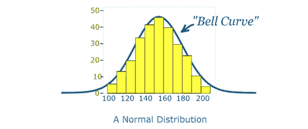

# 正态分布

> 原文：<https://medium.com/analytics-vidhya/normal-distribution-54eca3a63a77?source=collection_archive---------6----------------------->

正态分布是一种概率函数，它定义了变量的值是如何分布的。正态分布是一种对称分布，其中大多数观察值聚集在中心峰值周围，远离平均值的值的概率在两个方向上逐渐变小。

正态分布也称为钟形曲线或高斯分布。正态分布呈钟形，关于通过其中心的垂直线对称。均值、中值和众数都相等，位于分布的中心。

在下图中，我们可以看到使用直方图(显示为黄色)沿 x 和 y 轴分布的值，钟形曲线显示了沿直方图的正态分布。

许多企业和机构都遵循这种模式。这就是为什么它在统计中被广泛使用，在不同的商业领域，下面给出了几个例子。

人的高度。

测量误差。

血压。

考试的分数。

智商分数。

薪水。

机器生产的东西的大小。

考试成绩。

掷色子

扔硬币

人群的鞋码

**正态分布的性质:**

1.该曲线在中心对称(即围绕平均值μ)。

2.正好一半的值在中心的左边，正好一半的值在右边。

3.曲线下的总面积为 1。

4.中位数、均值和众数都是相等的。

统计学中最重要的分布是正态分布。

它是一个连续的分布，是我们熟悉的对称钟形曲线的基础。

任何特定的正态分布都由其均值和标准差来表示。

通过改变平均值，正常曲线向右或向左移动。

通过改变标准差，曲线变得或多或少地展开。

正态分布是一个双参数族，其中两个参数是均值和标准差。

**正态分布参数:**

正态分布的两个主要参数是平均值和标准差。这些参数决定了分布的形状和概率。轴上的分布形状随着参数值的变化而变化。

**1。** **意思是:**

平均值基本上用于测量集中趋势。

用于描述以比率或区间形式测量的变量分布的平均值。

在正态分布图中，平均值定义了峰值的位置，大多数数据点都聚集在平均值周围。

对平均值的任何更改都会使曲线沿 X 轴向左或向右移动。

**2。** **标准差:**

标准差是衡量数字分布程度的指标。

标准差决定了曲线的宽度，它收紧或扩大了沿 x 轴分布的宽度。

较小的标准差表示数据紧密地聚集在平均值周围，正态分布会更高。

较大的标准差表明数据围绕平均值展开；正态分布会更平更宽。

描述标准偏差的规则很少，其中一个是经验规则，它告诉我们有多少百分比的数据落在平均值的标准偏差范围内:

68%的数据在平均值的一个标准差范围内。

95%的数据在平均值的两个标准偏差范围内。

*   99.7%的数据落在平均值的三个标准偏差内。

**正态分布特征:**

# 对称:

正态分布具有完全对称的形状。分布曲线可以从中间分开，产生相等的两半。当一半的观察值落在曲线的每一边时，就会出现对称形状。

# 平均值、中值和众数相等:

正态分布的中点是具有最大分布的点，这意味着它拥有变量的最多观察值。中点也是这三个小节的落点。在完美(正态)分布中，度量值通常是相等的。

# 经验法则:

在正态分布的变量数据中，在平均值和平均值的特定标准偏差数之间的曲线下有一个恒定的距离比例。如上面在标准偏差中解释和说明的。

# 偏斜度和峰度:

偏斜度和峰度是衡量分布与正态分布差异程度的系数。偏斜度衡量正态分布的对称性，而峰度衡量相对于正态分布尾部的尾部厚度。

**解决正态分布相关问题的方法:-**

所有的正态分布和标准正态分布一样，都是单峰的，用一条钟形曲线对称分布。然而，正态分布可以取任何值作为其平均值和标准差。在标准正态分布中，平均值和标准差总是固定的。

每个正态分布都是标准正态分布的一个版本，它被拉伸或压缩，并水平左右移动。

平均值决定了曲线的中心位置。增大平均值会使曲线向右移动，而减小平均值会使曲线向左移动。标准差拉伸或挤压曲线。小的标准差导致窄的曲线，而大的标准差导致宽的曲线。

**如何标准化正态分布:**

当我们标准化一个正态分布时，平均值变成 0，标准差变成 1。这使您可以很容易地计算出某些值出现在您的分布中的概率，或者比较具有不同平均值和标准偏差的数据集。

对于不同的 x 值和平均值，Z 值会发生变化。

正的 z 值意味着您的 x 值大于平均值。

z 分数为负意味着您的 x 值小于平均值。

z 值为零意味着您的 x 值等于平均值。

接下来我们来看看如何计算 Z 值和概率。

步骤:1)从你的个体值中减去平均值。

2)将差值除以标准差。

我们可以将其应用于推导如下公式:

一旦有了 z 值，就可以在 z 表中查找相应的概率。根据 Z 值，我们可以参考 Z 正表或负表。

为了找到概率，我们必须参考下面给出的 Z 表。

z 表的第一列包含直到第一个小数位的 z 得分。表格的第一行给出了第二个小数位。

让我们假设我们必须找到 0.25 z 值的概率。如图所示，我们可以绕着表格移动来识别值。

P(z) = P(0.25) = 0.5987

如果我们必须确定剩余的值，我们可以直接从 1 中减去 P(z ),因为整个分布的概率是 1。