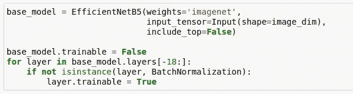
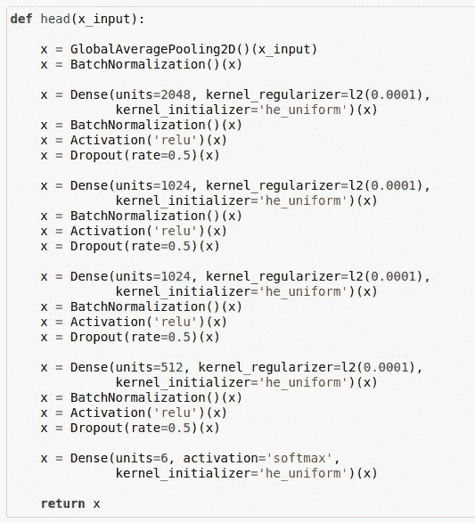
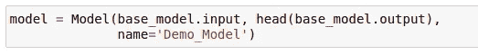
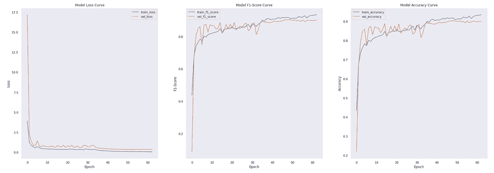

# 赢得图像分类黑客马拉松的新技术(第一部分)

> 原文：<https://medium.com/analytics-vidhya/novel-techniques-to-win-an-image-classification-hackathon-part-1-64929dd696b7?source=collection_archive---------19----------------------->

在这一系列的帖子中，我将讨论最近开发的一些现代黑客技术，以赢得图像分类黑客马拉松。传统上，我们总是依赖普通的 CNN 架构来执行图像分类。然而，这只会让你在排行榜上名列前茅。要达到顶峰，需要一些特别的东西。

> 如果你查看最近的 Kaggle 排行榜，前 10%的人在 0.0001-0.001 的分数范围内战斗。

记住这一点，下面是我在不同的图像分类黑客马拉松中用来不断获得良好 LB 分数的一些新方法。

1.  **迁移学习**
2.  **渐进式图像缩放**
3.  **CNN 关注**
4.  **集合模型**
5.  **测试时间增强(TTA)**

# 常见 CNN 架构概述

几乎所有 CNN 架构都遵循相同的通用设计原则，即在输入端叠加卷积层，同时周期性地对空间维度进行下采样，并增加特征图的数量。

传统网络架构仅由堆叠的卷积层组成，而现代架构则探索新的创新方法来构建卷积层，从而实现更高效的学习。几乎所有这些体系结构都基于一个可重复的单元，该单元在整个网络中使用。

以下是一些著名的经典网络架构:

1.  **乐网**
2.  **亚历克斯网**
3.  VGG-16

以下是一些现代网络架构:

1.  **盗梦空间**
2.  **ResNet**
3.  **密网**
4.  **ResNext**
5.  **高效网**

我推荐阅读下面的帖子，深入探究各种 CNN 架构。

 [## 插图:10 个 CNN 架构

### 普通卷积神经网络的编译可视化

towardsdatascience.com](https://towardsdatascience.com/illustrated-10-cnn-architectures-95d78ace614d) 

# 迁移学习

用于图像分类的迁移学习背后的直觉是，如果模型在足够大且通用的数据集上训练，则该模型将有效地充当视觉世界的通用模型。然后，您可以利用这些学习到的要素地图，而不必通过在大型数据集上训练大型模型来从头开始。

> 正如我喜欢说的，与其重新发明轮子，不如试着专注于制造汽车。

迁移学习具有减少神经网络模型的训练时间的优点，并且可以导致更低的泛化误差。

为了这篇文章的目的，我将使用有效的网络模型来演示迁移学习过程。

我强烈推荐阅读下面的帖子来理解高效网络的模型架构。

 [## 所有高效网络模型的完整架构细节

### 让我们深入了解所有不同高效网络模型的体系结构细节，并找出它们的不同之处…

towardsdatascience.com](https://towardsdatascience.com/complete-architectural-details-of-all-efficientnet-models-5fd5b736142) 

## 步骤 1:构建基础模型(高效网络— B5)

Tensorflow 库提供了一个现成的高效网络实现。所以我们将从导入包来构建基本模型开始。

接下来，我们将构建有效的网络模型并冻结基础层，并保持模型中的顶部块可训练。此外，我正在使用“ **imagenet** ”分类问题的模型权重。

*使用高效网络进行迁移学习时需要注意的两件事:*

1.  每个模块都需要打开或关闭。这是因为该体系结构包括从每个块的第一层到最后一层的捷径。不尊重块也会严重损害最终性能。**在上面的图片中，我保留了模型中最上面的 18 层(这是最上面的模块)可训练。**
2.  **批标准化**层需要保持冻结。如果它们也变成可训练的，解冻后的第一个纪元将显著降低精度。

## 步骤 2:在基本模型的基础上构建最终模型

首先，我们将定义“**头**”，它将位于基础模型的顶部，并将输出最终的模型预测。

接下来，我们将结合基础模型和 head，来定义最终的模型架构。

就是这样。现在模型已经准备好进行训练了。下面是我在研究黑客马拉松问题时，使用上述模型配置获得的学习曲线。

该模型在 60 个时期内达到了 90%的验证准确率。

# 结束语

这是图像分类新技术系列文章的第一部分。在下一篇[文章](https://tdtapas.medium.com/novel-techniques-to-win-an-image-classification-hackathon-part-2-e33bf0ad5fe6)中，我将继续讲述其余的新颖技巧。我强烈建议获得你自己的数据集(无论是从 Kaggle 还是使用网络搜集),并尝试本帖中详述的迁移学习方法。

请给我留下您的意见、反馈和挑战(如果您面临任何挑战)，我将与您单独联系，以便一起合作。