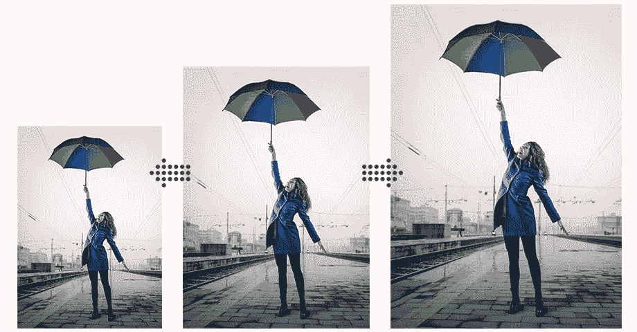
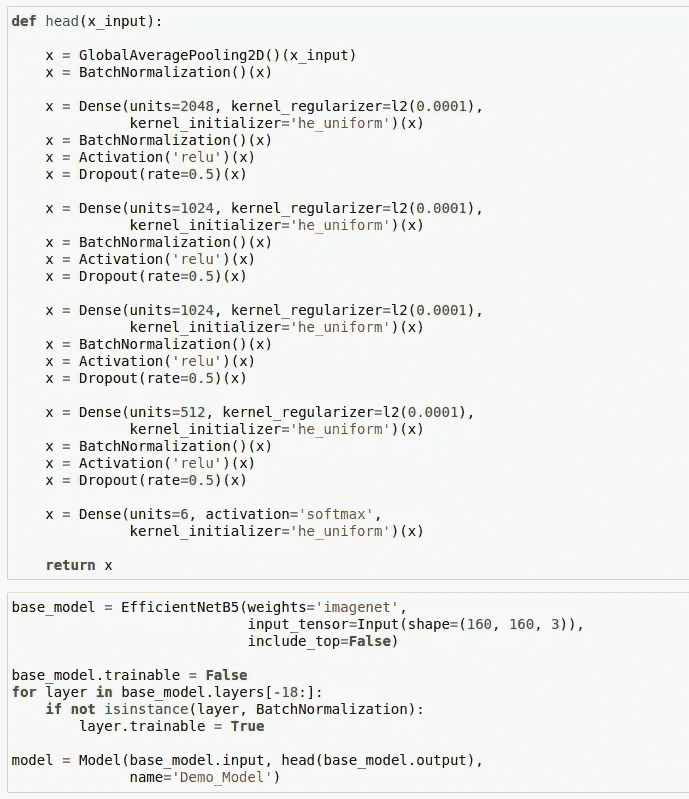
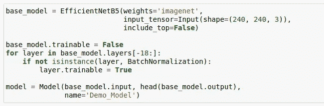
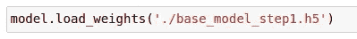
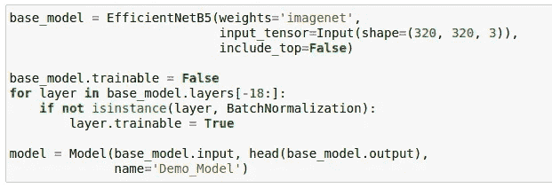
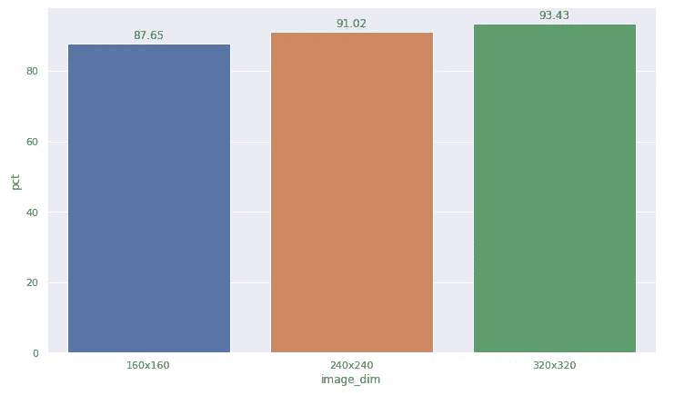

# 赢得图像分类黑客马拉松的新技术(下)

> 原文：<https://medium.com/analytics-vidhya/novel-techniques-to-win-an-image-classification-hackathon-part-2-e33bf0ad5fe6?source=collection_archive---------5----------------------->

欢迎来到“图像分类新技术”系列的第二部分。在 [**首帖**](/analytics-vidhya/novel-techniques-to-win-an-image-classification-hackathon-part-1-64929dd696b7) 中，我们讨论了迁移学习和使用预先训练好的模型进行图像分类。在这篇文章中，我将触及“T4”的基础上，逐步调整的图像大小，这对于从我们独立的有线电视新闻网模型中提取出最后一点准确性是有意义的。

# 定义

渐进式图像调整大小是一种技术，可以在训练有线电视新闻网模型缩小到更大图像尺寸的同时，按顺序调整所有图像的大小。在他精彩的 *fastai* 课程 [***程序员实用深度学习***](https://course.fast.ai/) 中简要描述了渐进式调整大小。

使用这种技术的一个很好的方法是训练一个图像尺寸较小的模型，比如 64 x 64，然后使用这个模型的权重在尺寸为 128 x 128 的图像上训练另一个模型，以此类推。每个较大规模的模型在其体系结构中结合了之前较小规模的模型层和权重，从而导致最终模型的微调以及准确度分数的提高。

> 对于人眼来说，将图像大小从(64 x 64)调整到(128 x 128)是一个非常微不足道的变化。然而，对于 CNN 模型，它提供了一个全新的数据集进行训练。

# 履行

## 第 1 步:构建图像大小(160 x 160)的基础模型

我们可以从基本图像大小(在这种情况下为 160 x 160)开始，并使用迁移学习来训练我们的初步模型(在[第一篇文章](/analytics-vidhya/novel-techniques-to-win-an-image-classification-hackathon-part-1-64929dd696b7)中已经涉及)。

> 重要:请始终保存模型权重，无论是通过使用模型检查点还是在张量流中使用 save_weights。

保存的权重将在后续步骤中用于为更大的图像大小构建模型。

## 第 2 步:构建图像大小(240 x 240)的模型

这就是乐趣从逐步调整图像大小开始的地方。我们将从构建基本模型的精确副本开始(从步骤-1)，同时将模型输入维度更改为(240 x 240)。

接下来，我们将把模型权重(在步骤-1 中学习到的)转移到新模型中。

在权重转移之后，我们可以在(240 x 240)维度的新图像上拟合模型，并且我们将再次存储得到的模型权重。

## 第 3 步:根据图像大小(320 x 320)构建最终模型

这里，我们将重复从步骤-2 的过程，唯一的区别是图像尺寸增加到(320 x 320)。

在权重转移和在(320 x 320)维的新图像上拟合模型之后，我们将存储最终模型的结果模型权重。

现在，我们准备使用最终模型的模型权重对测试图像进行预测。

# 结束语

下图显示了测试图像中单个图像尺寸的模型精度。

通过渐进式图像大小调整，我能够将准确度分数提高 6%，这是 Kaggle 排行榜上超过 50 步的飞跃。

这是图像分类新技术系列文章的第二部分。在下一篇文章的[中，我将继续其余的新技术。我强烈建议获得你自己的数据集(无论是从 Kaggle 还是使用网络抓取),并尝试本文中详细介绍的渐进式图像大小调整方法。](https://tdtapas.medium.com/novel-techniques-to-win-an-image-classification-hackathon-part-3-e45900f8ca30)

请给我留下您的意见、反馈和挑战(如果您面临任何挑战),我将与您单独联系，共同合作。