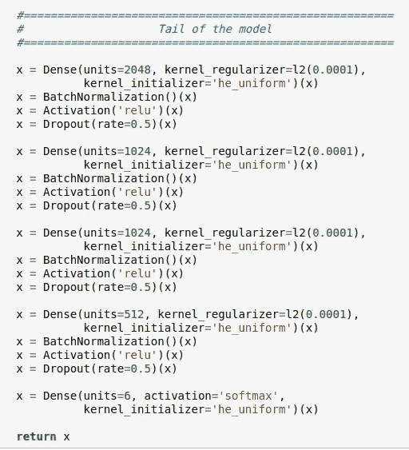

# 赢得图像分类黑客马拉松的新技术(第三部分)

> 原文：<https://medium.com/analytics-vidhya/novel-techniques-to-win-an-image-classification-hackathon-part-3-e45900f8ca30?source=collection_archive---------12----------------------->

欢迎来到“图像分类新技术”系列的第三部分。在 [**第一帖**](/analytics-vidhya/novel-techniques-to-win-an-image-classification-hackathon-part-1-64929dd696b7) 和 [**第二帖**](/analytics-vidhya/novel-techniques-to-win-an-image-classification-hackathon-part-2-e33bf0ad5fe6) 中，我们讨论了使用预训练模型的迁移学习和渐进式图像大小调整进行图像分类。在这篇文章中，我将谈到 CNN 模型中的“ ***注意机制*** ”及其在使 CNN 模型更加健壮和准确方面的重要性。

# 灵感

总的想法是从人眼的工作方式中获得灵感，即视网膜，如下图所示。

我们的眼睛可以捕捉到一个非常广阔的世界景象，然而，我们倾向于"*扫视*整个概貌，只注意视图的特定区域，而其他部分则有点"*模糊不清*"。

CNN 模型中的“ ***”注意机制*** ”就是试图利用这种想法，让神经网络能够“*聚焦*”它的“*注意*”在图像中感兴趣的部分，在那里它可以获得大部分信息，而在其他地方给予较少的“*注意*”。

# 注意模块

注意力模块用于使 CNN 模型学习并更专注于重要的信息，而不是学习无用的背景信息。在对象检测的情况下，有用的信息是我们想要在图像中分类和定位的对象或目标类裁剪。

注意模块由简单的 2D 卷积层、MLP(在信道注意的情况下)和在末端的 sigmoid 函数组成，以生成输入特征图的掩码。

一般来说，注意力机制应用于空间和通道维度。这两种注意力机制，即*空间和渠道注意力图*的生成顺序如下图所示。

你可以在下面的链接阅读 CNN 模型中关于“ ***空间和通道注意力*** ”的整篇研究论文。

# 履行

我们将在预先训练好的高效网络 CNN 模型(在之前的博客中讨论过)的基础上构建“*注意力模块*”。

下图显示了执行 ***通道关注*** 。这里“x_input”是预训练高效网 B5 模型最后一层的输出。

接下来，我们将把“ ***【空间注意力*** ”模块添加到“*通道注意力*”之上。

最后，我们将实现最终 CNN 模型的尾部，它将输出最终的预测。

# 结束语

在本系列的 [**第二篇**](/analytics-vidhya/novel-techniques-to-win-an-image-classification-hackathon-part-2-e33bf0ad5fe6) 中，我已经演示了如何使用渐进式图像缩放将模型精度从 87%提高到 93%。

在我的 CNN 模型中实现了“ ***注意力模块*** ”之后，模型准确率又从 93%跃升至 95%，并让我进入了排行榜的前 10%。

这是图像分类新技术系列文章的第三部分。在下一篇[文章](https://tdtapas.medium.com/novel-techniques-to-win-an-image-classification-hackathon-part-4-844a14104043)中，我将继续讲述其余的新颖技巧。我强烈建议获得你自己的数据集(无论是从 Kaggle 还是使用网络抓取),并尝试一下这篇文章中详述的注意力机制。

请给我留下您的意见、反馈和挑战(如果您面临任何挑战),我将与您单独联系，共同合作。