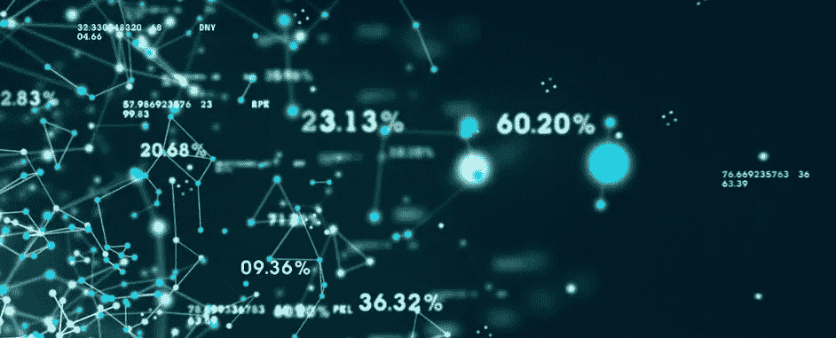
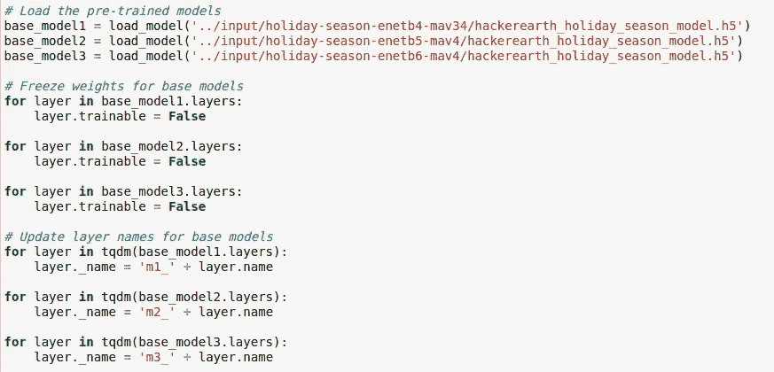
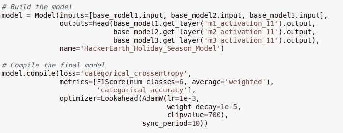
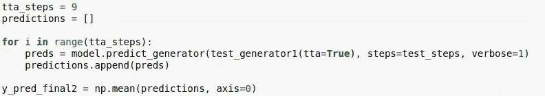
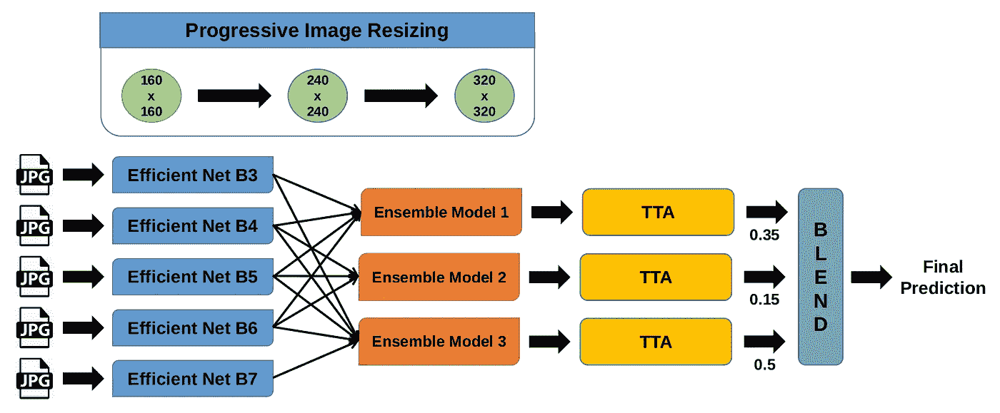

# 赢得图像分类黑客马拉松的新技术(第四部分)

> 原文：<https://medium.com/analytics-vidhya/novel-techniques-to-win-an-image-classification-hackathon-part-4-844a14104043?source=collection_archive---------9----------------------->



欢迎来到“图像分类新技术”系列的第四部分，也是最后一部分。到目前为止，我们已经讨论了 CNN 模型中的迁移学习、渐进图像缩放和注意机制。以下是相同的参考链接，以防需要复习。

[](/analytics-vidhya/novel-techniques-to-win-an-image-classification-hackathon-part-1-64929dd696b7) [## 赢得图像分类黑客马拉松的新技术(第一部分)

### 在这一系列的文章中，我将讨论一些最近开发的现代黑客技术，以赢得一个形象…

medium.com](/analytics-vidhya/novel-techniques-to-win-an-image-classification-hackathon-part-1-64929dd696b7) [](/analytics-vidhya/novel-techniques-to-win-an-image-classification-hackathon-part-2-e33bf0ad5fe6) [## 赢得图像分类黑客马拉松的新技术(下)

### 欢迎来到“图像分类新技术”系列的第二部分。在第一篇文章中，我们讨论了…

medium.com](/analytics-vidhya/novel-techniques-to-win-an-image-classification-hackathon-part-2-e33bf0ad5fe6) [](/analytics-vidhya/novel-techniques-to-win-an-image-classification-hackathon-part-3-e45900f8ca30) [## 赢得图像分类黑客马拉松的新技术(第三部分)

### 欢迎来到“图像分类新技术”系列的第三部分。在第一个帖子和第二个帖子中，我们…

medium.com](/analytics-vidhya/novel-techniques-to-win-an-image-classification-hackathon-part-3-e45900f8ca30) 

在这篇文章中，我将谈到集合模型和测试时间增强，以及它们在使模型预测更加稳健方面的重要性。

# 集合建模

集成建模是一个过程，其中通过使用许多不同的建模算法或使用不同的训练数据集，创建多个不同的模型来预测结果。然后，集合模型聚集每个基础模型的预测，并产生对未知数据的一次最终预测。

使用集合模型的动机是减少预测的泛化误差。只要基本模型是多样和独立的，当使用集合方法时，模型的预测误差降低。

这种方法在做预测时寻求大众的智慧。即使集合模型在模型中具有多个基础模型，它也作为单个模型来行动和执行。

# 测试时间增加

测试时数据增强(TTA)是一种可以通过在推理过程中应用增强来提高模型性能的技术，是一种用于深度学习模型的流行策略。

对同一幅图像的多个修改版本进行推断，然后
将预测结果汇总，以获得更高的整体准确性。

> 与训练时间数据扩充不同，我们不需要对模型进行任何更改，因此它可以应用于已经训练好的模型！

假设我们有一个 CNN 分类器，它做出了下面的预测。

`[0.08 0.00 **0.54** 0.01 0.37 0.00 0.00 0.00 0.00 0.00]`

这是这张图片的真实标签:

`[0.0 0.0 0.0 0.0 **1.0** 0.0 0.0 0.0 0.0 0.0]`

在这种情况下，图像会被错误分类，因为**5 级**被分类为**3 级**。为了改善这个结果，我们可以尝试通过分类器运行不同版本的图像，看看会出现什么。让我们通过网络运行原始图像和水平翻转的图像。网络的输出现在将是两个向量:

```
[[0.08 0.00 **0.54** 0.01 0.37 0.00 0.00 0.00 0.00 0.00]
 [**0.43** 0.00 0.11 0.00 0.39 0.01 0.00 0.01 0.04 0.00]]
```

当我们平均这两个向量时，我们得到下面的向量:
`[[0.25 0.00 0.33 0.01 **0.38** 0.01 0.00 0.01 0.02 0.00]]`

太好了！现在最大的概率给了**5 级**。

实际上，我们不能指望测试时间的增加能解决我们所有的问题。但是，我们可以预期，当我们使用多个扩充样本而不是仅使用单个输入样本时，平均来说，我们会获得更好的性能。

# **实现(系综模式)**

我们将从导入预训练的基础模型开始。



这里，我们已经加载了基本 CNN 模型，并冻结了基本模型中的所有层。此外，我们还重命名了模型层，以避免名称冲突。

接下来，我们将定义系综模型。



如上图所示，来自所有 3 个基本模型的输入和输出被用于集合最终模型。

现在，模型已准备好进行训练和预测。

# 实现(测试时间增加)

我们将从定义一个定制的数据生成器开始，它将输出测试图像的增强版本。


您可以参考下面的链接，了解更多关于 Tensorflow 和 Keras 中自定义数据生成器的信息。

[](/@anuj_shah/creating-custom-data-generator-for-training-deep-learning-models-part-2-be9ad08f3f0e) [## 为训练深度学习模型创建自定义数据生成器-第 2 部分

### 第 1 章:什么是 python 中的生成器函数以及 yield 和 return 之间的区别

medium.com](/@anuj_shah/creating-custom-data-generator-for-training-deep-learning-models-part-2-be9ad08f3f0e) 

接下来，我们将运行每组增强测试图像的模型预测，并取预测的平均值以获得最终值。



# 最终模型架构

下图显示了最终的 CNN 模型架构，它结合了本系列中详细介绍的所有主题。



# 结束语

这是图像分类小说技巧系列文章的最后一部分。我强烈建议获得您自己的数据集(从 Kaggle 或使用 web 抓取),并尝试本系列中详细介绍的不同技术。

请给我留下您的意见、反馈和挑战(如果您面临任何挑战),我将与您单独联系，共同合作。

您可以在下面的链接中参考本系列的代码库。

[](https://github.com/dlaststark/machine-learning-projects/tree/master/HackerEarth%20Competitions/Holiday%20Season%20Image%20Classification) [## dlaststark/机器学习项目

### 集中存储库来存储和处理我所有的机器学习项目-dlaststark/machine-learning-projects

github.com](https://github.com/dlaststark/machine-learning-projects/tree/master/HackerEarth%20Competitions/Holiday%20Season%20Image%20Classification)