# 使用 UNet 和 HRNet 的核探测

> 原文：<https://medium.com/analytics-vidhya/nuclei-detection-using-unet-and-hrnet-1f586560a582?source=collection_archive---------0----------------------->

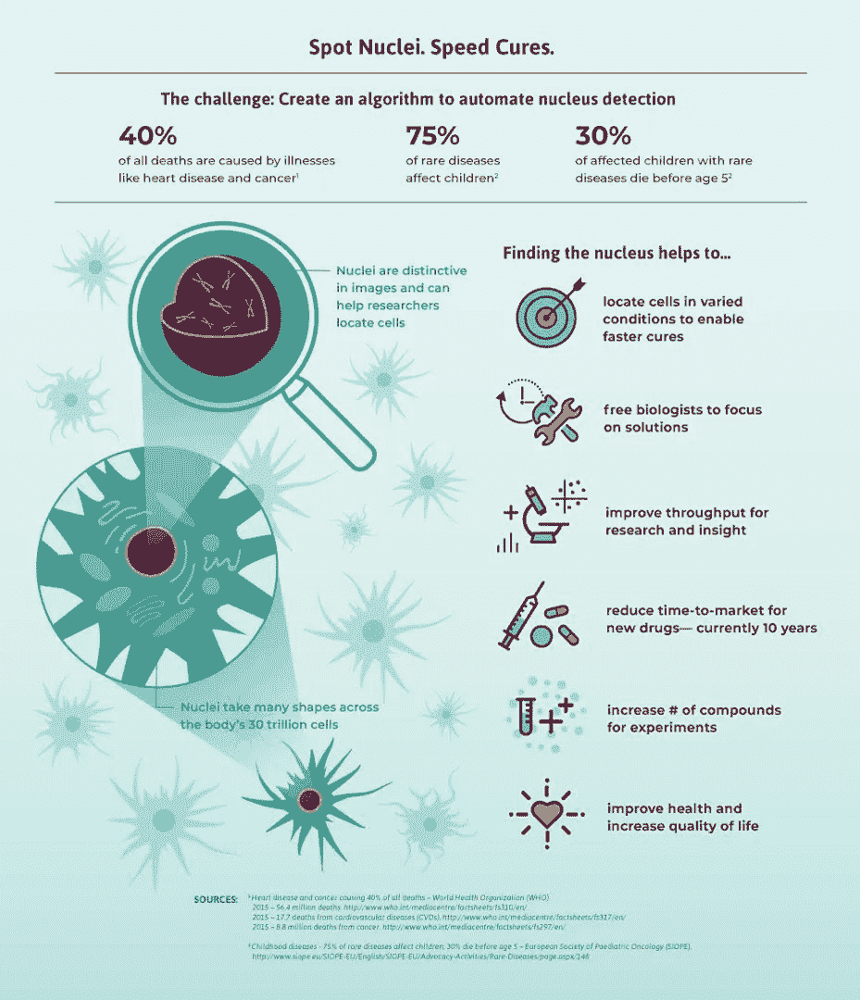

细胞核检测。[信用](https://www.kaggle.com/c/data-science-bowl-2018)

**目录:**

*   介绍
*   商业问题
*   问题定式化
*   数据管道
*   自定义性能指标
*   UNet 模型
*   HRNet 模型
*   推理
*   模型比较
*   模型量化
*   结论
*   未来的工作
*   链接
*   参考

# 介绍

计算机视觉是一个专注于帮助计算机看东西的研究领域。它是一个多学科领域，可以广泛地称为人工智能和机器学习的子领域，可能涉及使用专门的方法和利用通用的学习算法。计算机视觉的目标是理解数字图像的内容。典型地，这包括开发试图复制人类视觉能力的方法。理解数字图像的内容可能涉及从图像中提取描述，该描述可以是对象、文本描述、三维模型等等。许多流行的计算机视觉应用包括尝试识别照片中的事物；例如:

*   **物体分类:**这张照片中的物体属于哪一大类？
*   **物体识别:**这张照片中给定物体的类型是什么？
*   **物体验证:**物体在照片里吗？
*   **物体检测:**照片中的物体在哪里？
*   **物体地标检测:**照片中物体的关键点是什么？
*   **物体分割:**图像中哪些像素属于物体？
*   **物体识别:**这张照片里有什么物体，它们在哪里？

在数字图像处理和计算机视觉中，图像分割是将数字图像分割成多个片段(像素组，也称为图像对象)的过程。分割的目标是简化和/或改变图像的表示，使其更有意义，更易于分析。图像分割通常用于定位对象和边界(直线、曲线等)。)在图像中。更准确地说，图像分割是给图像中的每个像素分配标签的过程，使得具有相同标签的像素共享某些特征。有两种类型的分割-语义分割和实例分割。如果在一幅图像中有 5 个人，语义分割将集中于将所有人分类为单个实例。另一方面，实例分段。会逐一确认这些人的身份。医学图像分割是分割医学图像中感兴趣对象的任务。图像分割被认为是最基本的医学成像过程，因为它通过半自动或自动过程提取感兴趣区域(ROI)。它根据指定的描述将图像划分为多个区域，例如在边界检测、肿瘤检测/分割和肿块检测的医学应用中分割身体器官/组织。因为分割将图像分割成连贯的区域，所以可以通过提取图像的全局特征将聚类过程应用于分割，以专业地将 ROI 从背景中分离出来。

# 商业问题

*   **问题陈述:
    识别细胞图像中的细胞核。但是为什么呢？** 识别细胞核是大多数分析的起点，因为人体 30 万亿个细胞中的大多数都含有一个充满 DNA 的细胞核，DNA 是为每个细胞编程的遗传密码。识别细胞核使研究人员能够识别样本中的每个细胞，通过测量细胞对各种处理的反应，研究人员可以了解潜在的生物过程。
*   **数据来源:** https://www.kaggle.com/c/data-science-bowl-2018
*   **现实世界/业务约束:
    *** 没有这样的延迟要求。但是这个模型也不应该花几个小时来分割。
    *不正确分割的成本很高，因为它可能无法正确识别细胞核，这将在进一步的任务中产生进一步的后果。
    *模型要有良好的泛化能力，不能过拟合。

# 问题定式化

*   **数据**
    *来源:[https://www.kaggle.com/c/data-science-bowl-2018/overview](https://www.kaggle.com/c/data-science-bowl-2018/overview)
    *该数据集包含大量分割的细胞核图像。
*   每个图像由一个关联的 ImageId 表示。属于图像的文件包含在具有此 ImageId 的文件夹中。该文件夹中有两个子文件夹:
    **‘图像’*—包含图像文件。
    **‘遮罩’*—包含每个细胞核的分段遮罩。此文件夹仅包含在训练集中。每个掩模包含一个核。遮罩不允许重叠(没有像素属于两个遮罩)。
*   **深度学习问题类型:图像分割**
    我们要识别细胞图像中存在的每一个细胞核。
*   **性能指标:** 由于这是一个图像分割任务，因此有两个最常用的指标:

1.  **交集超过并集:** IoU 是预测分割和基础事实之间的重叠面积除以预测分割和基础事实之间的并集面积。该指标的范围为 0–1(0–100%)，0 表示没有重叠，1 表示完全重叠的分段。

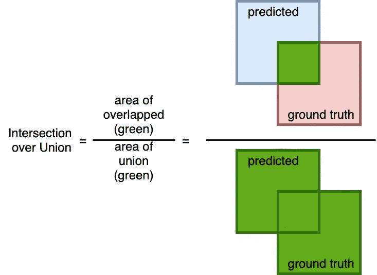

欠条评分。[信用](https://jinglescode.github.io/2019/11/07/biomedical-image-segmentation-u-net/)

**2。Dice 系数:** Dice 系数是 2 *重叠面积除以两幅图像的总像素数。骰子系数与借据非常相似。它们是正相关的，这意味着如果一个人说模型 A 在分割图像方面比模型 B 好，那么另一个人也会这么说。像欠条一样，它们的范围都是从 0 到 1，1 表示预测和真实之间的最大相似度。

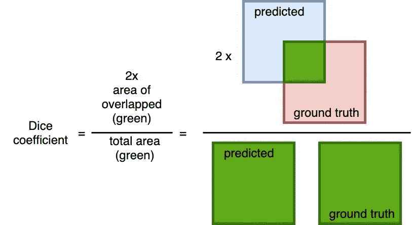

骰子系数。[信用](https://jinglescode.github.io/2019/11/07/biomedical-image-segmentation-u-net/)

# 数据管道

对于这个项目，我用以下方式创建了输入数据管道:

1.  首先，我解压缩提供的训练和测试数据集，并将内容存储到“训练”和“测试”文件夹/目录中:

```
#Unzipping the training and testing folders into directoriesprint('Unzipping stage1_train.zip')
!unzip -q "../input/data-science-bowl-2018/stage1_train.zip" -d train/
print('Unzipped stage1_train.zip')print('Unzipping stage1_test.zip')
!unzip -q "../input/data-science-bowl-2018/stage1_test.zip" -d test/
print('Unzipped stage1_test.zip')
```

2.之后，我创建了一个数据帧，文件名作为行，对应于数据集中的每个样本点。

```
# Function to create a dataframe of files which will be used for further processingdef files_df(root_dir):
  subdir = os.listdir(root_dir)
  files = []
  df = pd.DataFrame()
  for dir in subdir:
    files.append(os.path.join(root_dir,dir))
  df['files'] = files 
  return df# Root directories for training and testing
TRAIN_ROOT = './train'
TEST_ROOT = './test'train_df = files_df(TRAIN_ROOT)
test_df = files_df(TEST_ROOT)
```

3.然后，我再次创建了一个数据帧，它将从前面的数据帧中获取文件名，并为图像创建图像路径和掩码路径，以及与每个文件名相对应的掩码。以下函数不仅会创建一个数据帧，还会将对应于每个单元图像的各种掩码组合成一个掩码。这样做的原因是对于特定的细胞图像有各种掩模，其中每个掩模识别同一细胞图像中的不同细胞核:

```
# Hyperparameters
IMG_WIDTH = 256
IMG_HEIGHT = 256
IMG_CHANNELS = 3
CLASSES = 1
BATCH_SIZE = 8# Function which will create a dataframe of image paths and mask paths along with creating a single mask with multiple masksdef image_df(filenames):
  image_paths = []
  mask_paths = []
  df = pd.DataFrame() for filename in tqdm(filenames):
    file_path = os.path.join(filename,'images')
    image_path = os.path.join(file_path,os.listdir(file_path)[0])
    image_paths.append(image_path) mask = np.zeros((IMG_WIDTH,IMG_HEIGHT,1))
    mask_dir = file_path.replace("images", "masks")
    masks = os.listdir(mask_dir) for m in masks:
      mask_path = os.path.join(mask_dir,m)
      mask_  = cv2.imread(mask_path, cv2.IMREAD_UNCHANGED)
      mask_  = cv2.resize(mask_,(IMG_WIDTH,IMG_HEIGHT), interpolation=cv2.INTER_NEAREST)
      mask_  = np.expand_dims(mask_, axis = -1)
      mask = np.maximum(mask,mask_) newmask_dir = mask_dir.replace("masks", "masks_") if not os.path.isdir(newmask_dir):
      os.mkdir(newmask_dir) newmask_path = image_path.replace("images", "masks_")
    mask_paths.append(newmask_path)
    cv2.imwrite(newmask_path, mask) df['images'] = image_paths
  df['masks'] = mask_paths
  return df # Training dataframe
train_filenames = train_df['files']
train = image_df(train_filenames)
```

4.之后，我将训练数据分为训练集和验证集:

```
X_train, X_val = train_test_split(train, test_size=0.1, random_state=42)
```

5.然后我做了一个数据预处理函数:

```
# Function to parse image and mask file path and convert them into image and maskdef parse_function(image_path, mask_path):

  image_string = tf.io.read_file(image_path)
  image = tf.image.decode_png(image_string, channels=IMG_CHANNELS)#
  image = tf.image.convert_image_dtype(image, tf.float32)
  image = tf.image.resize(image, [IMG_HEIGHT, IMG_WIDTH]) mask_string = tf.io.read_file(mask_path)
  mask = tf.image.decode_png(mask_string, channels=IMG_CHANNELS)#
  mask = tf.image.convert_image_dtype(mask, tf.float32)
  mask = tf.image.resize(mask, [IMG_HEIGHT, IMG_WIDTH])
  return image, mask
```

6.然后是使用 tf.data 创建训练和验证数据集:

```
# Training datasettrain_ds = tf.data.Dataset.from_tensor_slices((X_train['images'], X_train['masks']))train_ds = train_ds.shuffle(X_train.shape[0])train_ds = train_ds.map(parse_function, num_parallel_calls=tf.data.AUTOTUNE)train_ds = train_ds.map(train_preprocess, num_parallel_calls=tf.data.AUTOTUNE)train_ds = train_ds.batch(BATCH_SIZE)train_ds = train_ds.prefetch(1)# Validation datasetval_ds = tf.data.Dataset.from_tensor_slices((X_val['images'], X_val['masks']))val_ds = val_ds.shuffle(X_val.shape[0])val_ds = val_ds.map(parse_function, num_parallel_calls=tf.data.AUTOTUNE)val_ds = val_ds.batch(BATCH_SIZE)val_ds = val_ds.prefetch(1)
```

7.训练数据集示例:

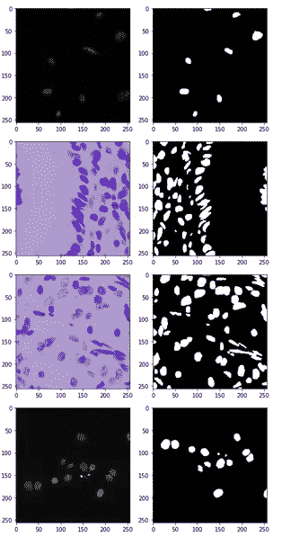

训练数据集示例-左侧为原始图像，右侧为地面实况。

8.验证数据集示例:

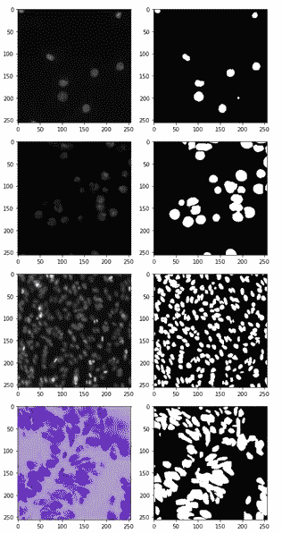

验证数据集的示例-左侧为原始图像，右侧为地面实况。

# 自定义性能指标

为了这项工作，我定制了张量流的平均 IoU 度量。这样做是为了结合一个阈值，用于将预测概率转换成布尔张量，布尔张量是可变的。

```
# Custom MeanIoU Metric functionclass MeanIoU(tf.keras.metrics.Metric):
  def __init__(self, num_classes, thres=0.5, name='mean_iou', dtype=None):
    super(MeanIoU, self).__init__(name=name, dtype=dtype)
    self.num_classes = num_classes
    self.thres = thres
    self.total_cm = self.add_weight('total_confusion_matrix',
                                   shape=(num_classes, num_classes),
                                 initializer=tf.zeros_initializer())
  def update_state(self, y_true, y_pred, sample_weight=None):
    y_true = tf.cast(y_true, self._dtype)
    y_pred = tf.cast(y_pred, self._dtype)
    if y_pred.shape.ndims > 1:
      y_pred = tf.reshape(y_pred, [-1])
    if y_true.shape.ndims > 1:
      y_true = tf.reshape(y_true, [-1]) y_pred = tf.where(y_pred > self.thres, 1.0, 0.0) if sample_weight is not None:
      sample_weight = tf.cast(sample_weight, self._dtype)
      if sample_weight.shape.ndims > 1:
        sample_weight = tf.reshape(sample_weight, [-1]) current_cm = tf.math.confusion_matrix(y_true,
                                          y_pred,
                                          self.num_classes,
                                          weights=sample_weight,
                                          dtype=self._dtype) return self.total_cm.assign_add(current_cm)

  def result(self):
    sum_over_row = tf.cast(tf.reduce_sum(self.total_cm, axis=0), dtype=self._dtype) sum_over_col = tf.cast(tf.reduce_sum(self.total_cm, axis=1), dtype=self._dtype) true_positives = tf.cast(tf.linalg.tensor_diag_part(self.total_cm), dtype=self._dtype) denominator = sum_over_row + sum_over_col - true_positives num_valid_entries = tf.reduce_sum(tf.cast(tf.math.not_equal(denominator, 0), dtype=self._dtype)) iou = tf.math.divide_no_nan(true_positives, denominator) return tf.math.divide_no_nan(tf.reduce_sum(iou, name='mean_iou'), num_valid_entries) def reset_states(self):
    # The state of the metric will be reset at the start of each epoch.
    tf.keras.backend.set_value(self.total_cm, np.zeros((self.num_classes, self.num_classes))) def get_config(self):
    config = {'num_classes': self.num_classes}
    base_config = super(MeanIoU, self).get_config()
    return dict(list(base_config.items()) + list(config.items()))
```

# UNet 模型

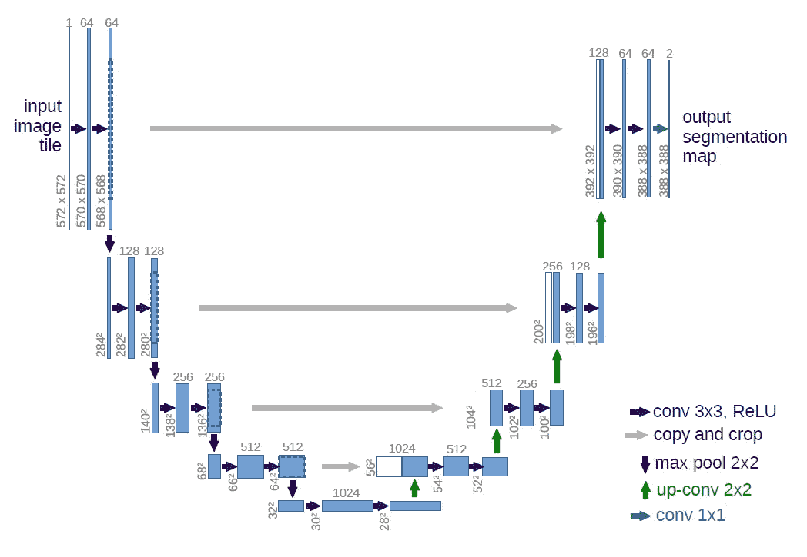

UNet 模型的体系结构。[信用](https://arxiv.org/abs/1505.04597)

UNet 由 Olaf Ronneberger 等人开发，用于生物医学图像分割。该架构包含两条路径。第一条路径是收缩路径(也称为编码器)，用于捕获图像中的上下文或提取图像中的因素。编码器以堆叠方式由卷积层和最大池层组成。

第二条路径是对称扩展路径(也称为解码器)，用于使用转置卷积实现精确定位。因此，它是一个端到端的完全卷积网络(FCN)，即它只包含卷积层，不包含任何密集层，因此它可以接受任何大小的图像。要了解更多关于 UNet 的信息，请阅读研究论文— [U-Net:生物医学图像分割的卷积网络](https://arxiv.org/abs/1505.04597)。

## 体系结构

在下面的代码中，我们可以看到使用 Tensorflow 实现的 UNet 架构的实现。

```
mean_iou = MeanIoU(2, 0.4)# Input Layer
# Input shape 256X256X3
inputs = Input((IMG_HEIGHT, IMG_WIDTH, IMG_CHANNELS)) # Left Side/Downsampling Side
# 256 -> 128
conv1 = Conv2D(16, (3, 3), activation='relu', kernel_initializer='he_normal', padding='same')(inputs)conv1 = Conv2D(16, (3, 3), activation='relu', kernel_initializer='he_normal', padding='same')(conv1)pool1 = MaxPool2D((2, 2))(conv1)
pool1 = Dropout(0.25)(pool1)# 128 -> 64
conv2 = Conv2D(32, (3, 3), activation='relu', kernel_initializer='he_normal', padding='same')(pool1)conv2 = Conv2D(32, (3, 3), activation='relu', kernel_initializer='he_normal', padding='same')(conv2)pool2 = MaxPool2D((2, 2))(conv2)
pool2 = Dropout(0.5)(pool2)# 64 -> 32
conv3 = Conv2D(64, (3, 3), activation='relu', kernel_initializer='he_normal', padding='same')(pool2)conv3 = Conv2D(64, (3, 3), activation='relu', kernel_initializer='he_normal', padding='same')(conv3)pool3 = MaxPool2D((2, 2))(conv3)
pool3 = Dropout(0.5)(pool3)# 32 -> 16
conv4 = Conv2D(128, (3, 3), activation='relu', kernel_initializer='he_normal', padding='same')(pool3)conv4 = Conv2D(128, (3, 3), activation='relu', kernel_initializer='he_normal', padding='same')(conv4)pool4 = MaxPool2D((2, 2))(conv4)
pool4 = Dropout(0.5)(pool4)# Middle Part
# 16 -> 16
convm = Conv2D(256, (3, 3), activation='relu', kernel_initializer='he_normal', padding='same')(pool4)convm = Conv2D(256, (3, 3), activation='relu', kernel_initializer='he_normal', padding='same')(convm)# Right Side/ Upsampling Side
# 16 -> 32
uconv4 = Conv2DTranspose(128, (2, 2), strides=(2, 2), padding='same')(convm)uconv4 = Concatenate()([uconv4, conv4])
uconv4 = Dropout(0.5)(uconv4)uconv4 = Conv2D(128, (3, 3), activation='relu', kernel_initializer='he_normal', padding='same')(uconv4)uconv4 = Conv2D(128, (3, 3), activation='relu', kernel_initializer='he_normal', padding='same')(uconv4)# 32 -> 64
uconv3 = Conv2DTranspose(64, (2, 2), strides=(2, 2), padding='same')(uconv4)uconv3 = Concatenate()([uconv3, conv3])
uconv3 = Dropout(0.5)(uconv3)uconv3 = Conv2D(64, (3, 3), activation='relu', kernel_initializer='he_normal', padding='same')(uconv3)uconv3 = Conv2D(64, (3, 3), activation='relu', kernel_initializer='he_normal', padding='same')(uconv3)# 64 -> 128
uconv2 = Conv2DTranspose(32, (2, 2), strides=(2, 2), padding='same')(uconv3)uconv2 = Concatenate()([uconv2, conv2])
uconv2 = Dropout(0.5)(uconv2)uconv2 = Conv2D(32, (3, 3), activation='relu', kernel_initializer='he_normal', padding='same')(uconv2)uconv2 = Conv2D(32, (3, 3), activation='relu', kernel_initializer='he_normal', padding='same')(uconv2)# 128 -> 256
uconv1 = Conv2DTranspose(16, (2, 2), strides=(2, 2), padding='same')(uconv2)uconv1 = Concatenate()([uconv1, conv1])
uconv1 = Dropout(0.5)(uconv1)uconv1 = Conv2D(16, (3, 3), activation='relu', kernel_initializer='he_normal', padding='same')(uconv1)uconv1 = Conv2D(16, (3, 3), activation='relu', kernel_initializer='he_normal', padding='same')(uconv1)# Output Layer
# Output shape 256X256X1
outputs = Conv2D(CLASSES, (1, 1), activation='sigmoid')(uconv1)model = Model(inputs=[inputs], outputs=[outputs])
model.compile(optimizer='adam', loss='binary_crossentropy', metrics=[mean_iou])#model.summary()
```

## 复试

模型检查点回调用于保存最佳性能模型。

```
!rm -rf ./unet_save/if not os.path.exists('unet_save'):
  os.makedirs('unet_save')filepath="unet_save/weights-{epoch:04d}.hdf5"
checkpoint = tf.keras.callbacks.ModelCheckpoint(filepath=filepath,
                                                save_best_only=True,
                                                mode='max',
                                             monitor='val_mean_iou')
```

## 培养

模型第一次训练 30 个周期，然后再训练 60 个周期。第二次训练从第一轮表现最好的时期开始。

```
callbacks_list = [checkpoint]
# First round of training
history = unet_model.fit(train_ds,
                         initial_epoch = 0,
                         epochs=30,
                         callbacks=callbacks_list,
                         validation_data=val_ds)# Second round of training
initial_epoch = int(sorted(os.listdir('unet_save'))[-1].split('.')[0].split('-')[-1])history = unet_model.fit(train_ds,
                         initial_epoch = initial_epoch,
                         epochs=60,
                         callbacks=callbacks_list,
                         validation_data=val_ds)# Best model
unet_model = tf.keras.models.load_model('./unet_save/'+sorted(os.listdir('unet_save'))[-1])# save model
unet_model.save("unet_model.h5")
unet_model = tf.keras.models.load_model("unet_model.h5")
```

# HRNet 模型

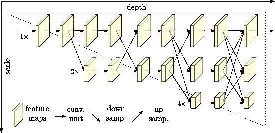

HRNet 模型的体系结构。[信用](https://arxiv.org/abs/1908.07919)

HRNet 模型是京东王等人开发的。艾尔。用于解决先前图像分割模型中缺乏高级分辨率的问题。他们的架构能够在整个过程中保持高分辨率的表现。该架构的第一级是一个高分辨率子网，然后逐渐将高到低分辨率子网逐一添加，形成更多级，并将多分辨率子网并联。(I)这种方法并联连接高到低分辨率子网，而不是像大多数现有解决方案那样串联连接。因此，可以保持高分辨率，而不是通过由低到高的过程来恢复分辨率。(ii)大多数现有的融合方案集合了低级和高级表示。相反，在该架构中，在相同深度和相似级别的低分辨率表示的帮助下，执行重复的多尺度融合来增强高分辨率表示，反之亦然，从而导致高分辨率表示更加丰富。要了解更多关于 HRNet 的信息，请阅读研究论文— [视觉识别的深度高分辨率表征学习](https://arxiv.org/abs/1908.07919)。

## 体系结构

在下面的代码中，我们可以看到使用 Tensorflow 实现的 HRNet 架构的实现。

```
# Hyperparameters
BN_MOMENTUM = 0.1
BN_EPSILON = 1e-5
INITIALIZER = 'he_normal'# Functions to build layersdef conv(x, outsize, kernel_size, strides_=1, padding_='same', activation=None):
  return Conv2D(outsize, 
                kernel_size, 
                strides=strides_, 
                padding=padding_,
                kernel_initializer=INITIALIZER, 
                use_bias=False,
                activation=activation)(x) def BasicBlock(x, size, downsampe=False):
  residual = x out = conv(x, size, 3)
  out = BatchNormalization(epsilon=BN_EPSILON,
                           momentum=BN_MOMENTUM)(out)
  out = Activation('relu')(out) out = conv(out, size, 3)
  out = BatchNormalization(epsilon=BN_EPSILON,
                           momentum=BN_MOMENTUM)(out) if downsampe:
    residual = conv(x, size, 1, padding_='valid')
    residual = BatchNormalization(epsilon=BN_EPSILON,
                                  momentum=BN_MOMENTUM)(residual) out = Add()([out, residual])
  out = Activation('relu')(out) return out def BottleNeckBlock(x, size, downsampe=False):
  residual = x
  out = conv(x, size, 1, padding_='valid')
  out = BatchNormalization(epsilon=BN_EPSILON,
                           momentum=BN_MOMENTUM)(out)
  out = Activation('relu')(out) out = conv(out, size, 3)
  out = BatchNormalization(epsilon=BN_EPSILON,
                           momentum=BN_MOMENTUM)(out)
  out = Activation('relu')(out) out = conv(out, size * 4, 1, padding_='valid')
  out = BatchNormalization(epsilon=BN_EPSILON,
                           momentum=BN_MOMENTUM)(out) if downsampe:
    residual = conv(x, size * 4, 1, padding_='valid')
    residual = BatchNormalization(epsilon=BN_EPSILON,
                                  momentum=BN_MOMENTUM)(residual)

  out = Add()([out, residual])
  out = Activation('relu')(out) return out def layer1(x):
  x = BottleNeckBlock(x, 64, downsampe=True)
  x = BottleNeckBlock(x, 64)
  x = BottleNeckBlock(x, 64)
  x = BottleNeckBlock(x, 64)

  return x def transition_layer(x, in_channels, out_channels):
  num_in = len(in_channels)
  num_out = len(out_channels)
  out = [] for i in range(num_out):
    if i < num_in:
      if in_channels[i] != out_channels[i]:
        residual = conv(x[i], out_channels[i], 3)
        residual = BatchNormalization(epsilon=BN_EPSILON,
                                     momentum=BN_MOMENTUM)(residual)
        residual = Activation('relu')(residual)
        out.append(residual)
      else:
        out.append(x[i])
    else:
      residual = conv(x[-1], out_channels[i], 3, strides_=2)
      residual = BatchNormalization(epsilon=BN_EPSILON,
                                    momentum=BN_MOMENTUM)(residual)
      residual = Activation('relu')(residual)
      out.append(residual) return out def branches(x, block_num, channels):
  out = []
  for i in range(len(channels)):
    residual = x[i]
    for j in range(block_num):
      residual = BasicBlock(residual, channels[i])
    out.append(residual) return out def fuse_layers(x, channels, multi_scale_output=True):
  out = []
  for i in range(len(channels) if multi_scale_output else 1):
    residual = x[i]
    for j in range(len(channels)):
      if j > i:
        y = conv(x[j], channels[i], 1, padding_='valid')
        y = BatchNormalization(epsilon=BN_EPSILON,
                               momentum=BN_MOMENTUM)(y)
        y = UpSampling2D(size=2 ** (j - i))(y)
        residual = Add()([residual, y])
      elif j < i:
        y = x[j]
        for k in range(i - j):
          if k == i - j - 1:
            y = conv(y, channels[i], 3, strides_=2)
            y = BatchNormalization(epsilon=BN_EPSILON,
                                   momentum=BN_MOMENTUM)(y)
          else:
            y = conv(y, channels[j], 3, strides_=2)
            y = BatchNormalization(epsilon=BN_EPSILON,
                                   momentum=BN_MOMENTUM)(y)
            y = Activation('relu')(y)
        residual = Add()([residual, y])
    residual = Activation('relu')(residual)
    out.append(residual)

  return out # Functions to create model def HighResolutionModule(x, channels, multi_scale_output=True):
  residual = branches(x, 4, channels)
  out = fuse_layers(residual, channels,
                    multi_scale_output=multi_scale_output)
  return out def stage(x, num_modules, channels, multi_scale_output=True):
  out = x
  for i in range(num_modules):
    if i == num_modules - 1 and multi_scale_output == False:
      out = HighResolutionModule(out, channels,
                                 multi_scale_output=False)
    else:
      out = HighResolutionModule(out, channels)
  return out def hrnet_keras(input_size=(256, 256, 3)):
  channels_2 = [32, 64]
  channels_3 = [32, 64, 128]
  channels_4 = [32, 64, 128, 256]
  num_modules_2 = 1
  num_modules_3 = 4
  num_modules_4 = 3 inputs = Input(input_size)
  x = conv(inputs, 64, 3, strides_=2)
  x = BatchNormalization(epsilon=BN_EPSILON,momentum=BN_MOMENTUM)(x)
  x = conv(x, 64, 3, strides_=2)
  x = BatchNormalization(epsilon=BN_EPSILON,momentum=BN_MOMENTUM)(x)
  x = Activation('relu')(x) la1 = layer1(x)
  tr1 = transition_layer([la1], [256], channels_2)
  st2 = stage(tr1, num_modules_2, channels_2)
  tr2 = transition_layer(st2, channels_2, channels_3)
  st3 = stage(tr2, num_modules_3, channels_3)
  tr3 = transition_layer(st3, channels_3, channels_4)
  st4 = stage(tr3, num_modules_4, channels_4,
              multi_scale_output=False)
  up1 = UpSampling2D()(st4[0])
  up1 = conv(up1, 32, 3)
  up1 = BatchNormalization(epsilon=BN_EPSILON,
                           momentum=BN_MOMENTUM)(up1)
  up1 = Activation('relu')(up1)
  up2 = UpSampling2D()(up1)
  up2 = conv(up2, 32, 3)
  up2 = BatchNormalization(epsilon=BN_EPSILON,
                           momentum=BN_MOMENTUM)(up2)
  up2 = Activation('relu')(up2)
  final = conv(up2, 1, 1, padding_='valid', activation='sigmoid') model = Model(inputs=inputs, outputs=final)

  return model hrnet_model = hrnet_keras()
hrnet_model.summary()
hrnet_model.compile(optimizer='adam', 
                    loss='binary_crossentropy', 
                    metrics=[mean_iou])
```

## 复试

模型检查点回调用于保存最佳性能模型。

```
!rm -rf ./hrnet_save/if not os.path.exists('hrnet_save'):
  os.makedirs('hrnet_save')
filepath="hrnet_save/weights-{epoch:04d}.hdf5"
checkpoint = tf.keras.callbacks.ModelCheckpoint(filepath=filepath,
                                                save_best_only=True,
                                                mode='max',
                                             monitor='val_mean_iou')
```

## 培养

模型第一次训练 30 个周期，然后再训练 60 个周期。第二次训练从第一轮表现最好的时期开始。

```
callbacks_list = [checkpoint]
# First round of training
history = hrnet_model.fit(train_ds,
                          initial_epoch = 0,
                          epochs=30,
                          callbacks=callbacks_list,
                          validation_data=val_ds)# Second round of training
initial_epoch = int(sorted(os.listdir('hrnet_save'))[-1].split('.')[0].split('-')[-1])history = hrnet_model.fit(train_ds,
                          initial_epoch = initial_epoch,
                          epochs=60,
                          callbacks=callbacks_list,
                          validation_data=val_ds)# Best model
hrnet_model = tf.keras.models.load_model('./hrnet_save/'+sorted(os.listdir('hrnet_save'))[-1])# save model
hrnet_model.save("hrnet_model.h5")
hrnet_model = tf.keras.models.load_model("hrnet_model.h5")
```

# 推理

## 对验证数据集的推断:

```
for image, mask in val_ds.take(1):
  for i in range(BATCH_SIZE):
    pred_mask_u  = unet_model.predict(image[i][np.newaxis,:,:,:])
    pred_mask_h  = hrnet_model.predict(image[i][np.newaxis,:,:,:]) fig = plt.figure(figsize=(14,10)) ax1 = fig.add_subplot(141)
    ax1.title.set_text('Original Image')
    ax1.imshow(image[i]) ax2 = fig.add_subplot(142)
    ax2.title.set_text('Ground Truth')
    ax2.imshow(mask[i][:,:,0], cmap='gray') ax3 = fig.add_subplot(143)
    ax3.title.set_text('UNet Prediction')
    ax3.imshow(pred_mask_u[0,:,:,0], cmap='gray')

    ax4 = fig.add_subplot(144)
    ax4.title.set_text('HRNet Prediction')
    ax4.imshow(pred_mask_h[0,:,:,0], cmap='gray')

    plt.show()
```

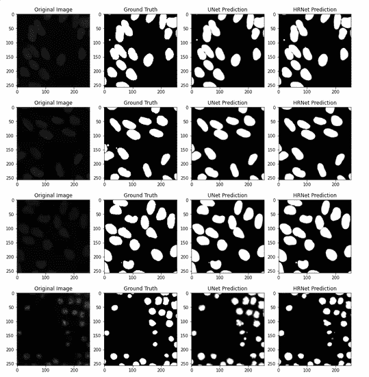

对验证数据集的推断。

## 对测试数据集的推断:

```
test_filenames = test_df['files']
for filename in test_filenames[:5]:
  file_path = os.path.join(filename,'images')
  image_path = os.path.join(file_path,os.listdir(file_path)[0])
  image_string = tf.io.read_file(image_path)
  image = tf.image.decode_png(image_string, channels=IMG_CHANNELS)#
  image = tf.image.convert_image_dtype(image, tf.float32)
  image = tf.image.resize(image, [IMG_HEIGHT, IMG_WIDTH]) pred_mask_u  = unet_model.predict(image[np.newaxis,:,:,:])
  pred_mask_h  = hrnet_model.predict(image[np.newaxis,:,:,:]) fig = plt.figure(figsize=(10,6)) ax1 = fig.add_subplot(131)
  ax1.title.set_text('Original Image')
  ax1.imshow(image) ax2 = fig.add_subplot(132)
  ax2.title.set_text('UNet Prediction')
  ax2.imshow(pred_mask_u[0,:,:,0], cmap='gray') ax3 = fig.add_subplot(133)
  ax3.title.set_text('HRNet Prediction')
  ax3.imshow(pred_mask_h[0,:,:,0], cmap='gray')
  plt.show()
```

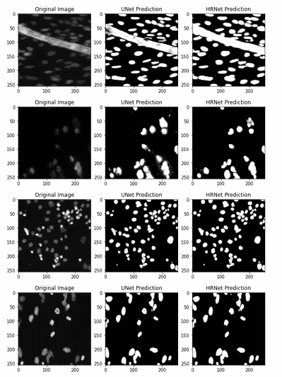

测试数据集上的推断。

# 模型比较

在这一节中，我们将看到我们的两个模型的表现。首先，我们将制作一个数据框架，其中包含每个数据点的每个模型的 IoU 得分。

```
# Function to create a dataframe with iou_scores for each model and image and mask paths.def metric_df(data):
  unet_iou_scores = []
  hrnet_iou_scores = []
  m = MeanIoU(2, 0.4)
  for i in tqdm(range(len(data))):
    image_path = data['images'].iloc[i]
    mask_path = data['masks'].iloc[i] image_string = tf.io.read_file(image_path)
    image = tf.image.decode_png(image_string,channels=IMG_CHANNELS)
    image = tf.image.convert_image_dtype(image, tf.float32)
    image = tf.image.resize(image, [IMG_HEIGHT, IMG_WIDTH]) mask_string = tf.io.read_file(mask_path)
    mask = tf.image.decode_png(mask_string, channels=CLASSES)
    mask = tf.image.convert_image_dtype(mask, tf.float32)
    mask = tf.image.resize(mask, [IMG_HEIGHT, IMG_WIDTH]) pred_mask_u = unet_model.predict(image[np.newaxis,:,:,:])
    m.update_state(mask, pred_mask_u)
    u_iou_score = m.result().numpy()
    unet_iou_scores.append(round(u_iou_score,4)) pred_mask_h = hrnet_model.predict(image[np.newaxis,:,:,:])
    m.update_state(mask, pred_mask_h)
    h_iou_score = m.result().numpy()
    hrnet_iou_scores.append(round(h_iou_score,4)) data['unet_iou_scores'] = unet_iou_scores
  data['hrnet_iou_scores'] = hrnet_iou_scores
  return data df = train.copy()
df = metric_df(df)
df = df.sort_values(by=['hrnet_iou_scores','unet_iou_scores'])
```

## 最佳输出样本

这些是获得最佳 IoU 分数的样品。

```
d1 = df.tail()
for i in range(5):
  image_path = d1['images'].iloc[i]
  mask_path = d1['masks'].iloc[i] image_string = tf.io.read_file(image_path)
  image = tf.image.decode_png(image_string, channels=IMG_CHANNELS)
  image = tf.image.convert_image_dtype(image, tf.float32)
  image = tf.image.resize(image, [IMG_HEIGHT, IMG_WIDTH]) mask_string = tf.io.read_file(mask_path)
  mask = tf.image.decode_png(mask_string, channels=CLASSES)
  mask = tf.image.convert_image_dtype(mask, tf.float32)
  mask = tf.image.resize(mask, [IMG_HEIGHT, IMG_WIDTH]) pred_mask_u  = unet_model.predict(image[np.newaxis,:,:,:])
  pred_mask_h  = hrnet_model.predict(image[np.newaxis,:,:,:]) fig = plt.figure(figsize=(14,10)) ax1 = fig.add_subplot(141)
  ax1.title.set_text('Original Image')
  ax1.imshow(image) ax2 = fig.add_subplot(142)
  ax2.title.set_text('Ground Truth')
  ax2.imshow(mask[:,:,0], cmap='gray') ax3 = fig.add_subplot(143)
  ax3.title.set_text('UNet: ' +str(round(d1['unet_iou_scores'].iloc[i],4)))
  ax3.imshow(pred_mask_u[0,:,:,0], cmap='gray') ax4 = fig.add_subplot(144)
  ax4.title.set_text('HRNet: ' +str(round(d1['hrnet_iou_scores'].iloc[i],4)))
  ax4.imshow(pred_mask_h[0,:,:,0], cmap='gray') plt.show()
```

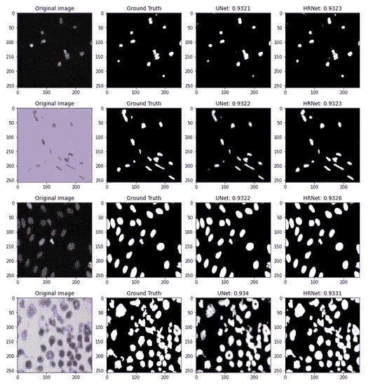

得分最高的样本。

## 最差输出样本

这些是 IoU 得分最低的样本。

```
d2 = df.head()
for i in range(5):
  image_path = d2['images'].iloc[i]
  mask_path = d2['masks'].iloc[i] image_string = tf.io.read_file(image_path)
  image = tf.image.decode_png(image_string, channels=IMG_CHANNELS)
  image = tf.image.convert_image_dtype(image, tf.float32)
  image = tf.image.resize(image, [IMG_HEIGHT, IMG_WIDTH]) mask_string = tf.io.read_file(mask_path)
  mask = tf.image.decode_png(mask_string, channels=CLASSES)
  mask = tf.image.convert_image_dtype(mask, tf.float32)
  mask = tf.image.resize(mask, [IMG_HEIGHT, IMG_WIDTH])

  pred_mask_u  = unet_model.predict(image[np.newaxis,:,:,:])
  pred_mask_h  = hrnet_model.predict(image[np.newaxis,:,:,:]) fig = plt.figure(figsize=(14,10)) ax1 = fig.add_subplot(141)
  ax1.title.set_text('Original Image')
  ax1.imshow(image) ax2 = fig.add_subplot(142)
  ax2.title.set_text('Ground Truth')
  ax2.imshow(mask[:,:,0], cmap='gray') ax3 = fig.add_subplot(143)
  ax3.title.set_text('UNet: '+ str(round(d2['unet_iou_scores'].iloc[i],4)))
  ax3.imshow(pred_mask_u[0,:,:,0], cmap='gray') ax4 = fig.add_subplot(144)
  ax4.title.set_text('HRNet: '+ str(round(d2['hrnet_iou_scores'].iloc[i],4)))
  ax4.imshow(pred_mask_h[0,:,:,0], cmap='gray') plt.show()
```

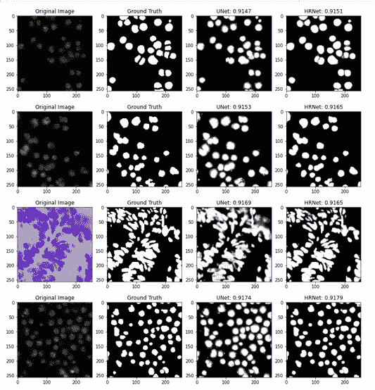

分数最差的样本。

## 模型的 IoU 分数分布

1.  **范围在 0 到 1 之间的借据分数分布:
    *** 下图没有提供太多信息。
    *我们将它放大。

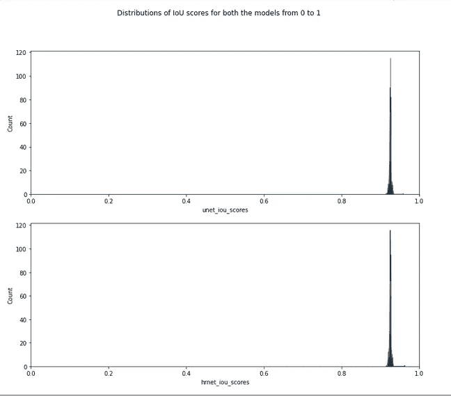

**2。范围在 0.91 和 0.96 之间时的 IoU 分数分布:
*** 下面两个图看起来几乎相同。
*就 HRNet 而言，iou 得分大于 0.93 的分数似乎略高于 UNet。

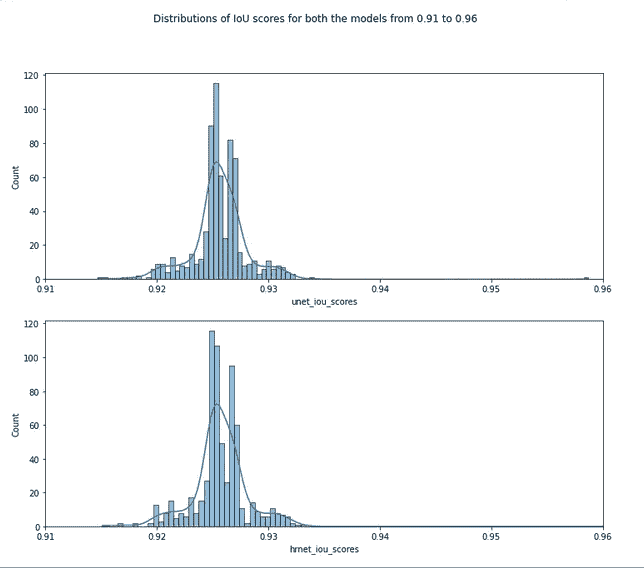

**3。范围在 0.92 和 0.935 之间时的 IoU 分数分布:** *从下图中我们可以看到，HRNet 的情况下 0.93 之后的分数比 UNet 多。

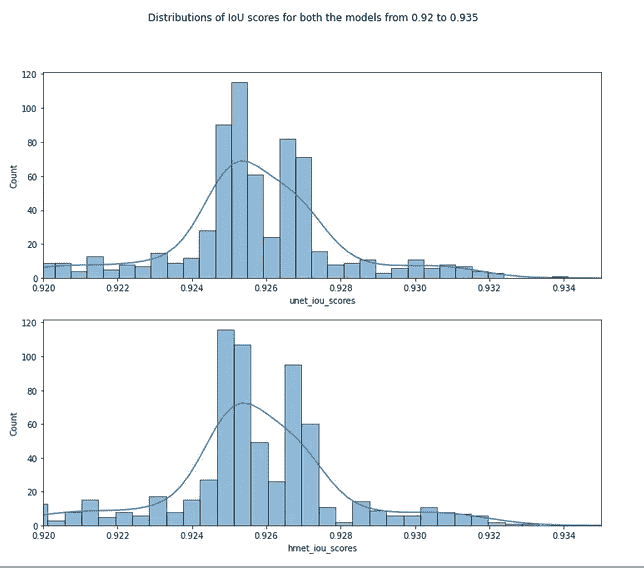

## 两种模型的 IoU 分数散点图

1.  **介于 0 和 1 之间时得分散点图:
    *** 两个模型的 iou 得分散点图。
    *绿色表示 HRNet 比 UNet 给出更好的 iou 分数。
    *红色表示 UNet 给出的 iou 分数优于 HRNet 的分数。

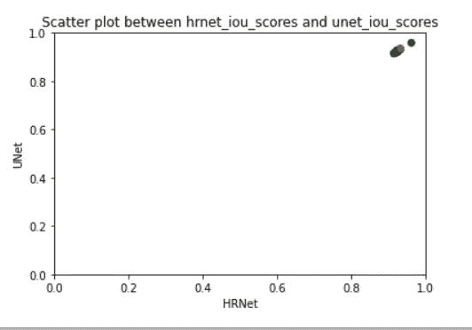

介于 0 和 1 之间的分数散点图。

**2。范围在 0.92 到 0.94 之间时分数之间的散点图:
*** 放大散点图我们可以看到绿点比红点多。
*这表明 HRNet 的表现优于 UNet。
*我们可以看到，UNet 表现更好的点遍布整个系列。

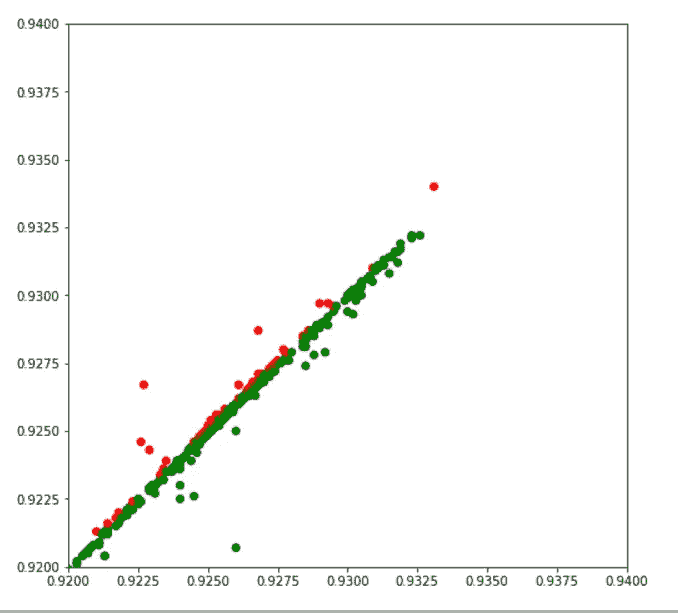

介于 0.92 和 0.94 之间的分数散点图。

**3。范围在 0.925 和 0.9275 之间时分数之间的散点图:**
*在该图中我们可以看到，虽然 HRNet 的表现优于 UNet，但差异非常小。

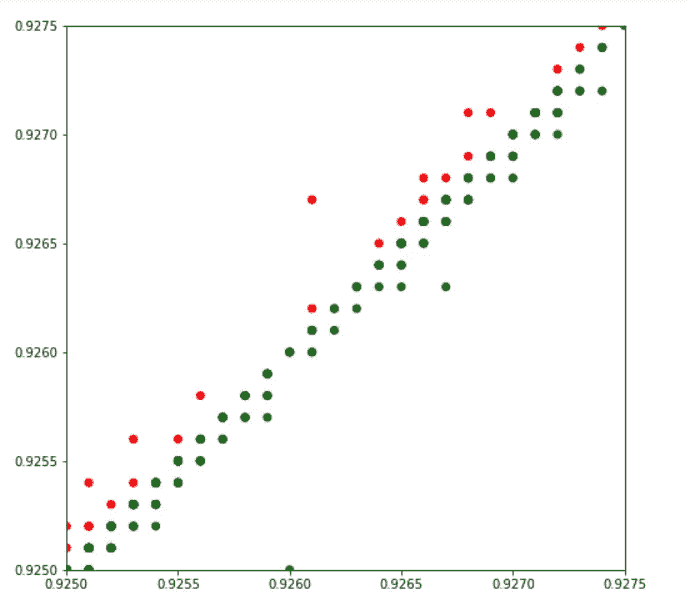

介于 0.925 和 0.9275 之间的分数散点图。

# 模型量化

```
tflite_models_dir = pathlib.Path("/content/drive/MyDrive/CaseStudy2/")
tflite_models_dir.mkdir(exist_ok=True, parents=True)
```

## UNet 模型的训练后量化:

```
# UNet Model
unet_model = tf.keras.models.load_model("/content/drive/MyDrive/CaseStudy2/unet_model.h5")# Post Training quantized UNet model
converter = tf.lite.TFLiteConverter.from_keras_model(unet_model)
converter.optimizations = [tf.lite.Optimize.DEFAULT]
quant_unet_model = converter.convert()# Save the quantized UNet model:
quant_unet_file = tflite_models_dir/"quant_unet_model.tflite"
quant_unet_file.write_bytes(quant_unet_model)
```

## 人力资源网培训后量化；

```
# HRNet Model
hrnet_model = tf.keras.models.load_model("/content/drive/MyDrive/CaseStudy2/hrnet_model.h5")# Post Training quantized HRNet model
converter = tf.lite.TFLiteConverter.from_keras_model(hrnet_model)
converter.optimizations = [tf.lite.Optimize.DEFAULT]
quant_hrnet_model = converter.convert()# Save the quantized HRNet model:
quant_hrnet_file = tflite_models_dir/"quant_hrnet_model.tflite"
quant_hrnet_file.write_bytes(quant_hrnet_model)
```

## 量化前后模型的大小:

*我们可以看到 UNet 和 HRNet 模型的文件大小都有相当大的减少。
*当我们希望在小型设备上部署我们的模型时，这种缩减是很好的。

```
print("UNet model in Mb:", os.path.getsize("/content/drive/MyDrive/CaseStudy2/unet_model.h5") / float(2**20))print("Quantized UNet in Mb:", os.path.getsize("/content/drive/MyDrive/CaseStudy2/quant_unet_model.tflite") / float(2**20))print("Float HRNet in Mb:", os.path.getsize("/content/drive/MyDrive/CaseStudy2/hrnet_model.h5") / float(2**20))print("Quantized HRNet in Mb:", os.path.getsize("/content/drive/MyDrive/CaseStudy2/quant_hrnet_model.tflite") / float(2**20))
```

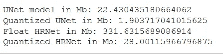

所有型号的大小，以 MB 为单位。

## 未量化和训练后量化模型的评估；

*   **量化的 UNet:**

```
# Importing Quantized UNet model
u_interpreter = tf.lite.Interpreter(model_path="/content/drive/MyDrive/CaseStudy2/quant_unet_model.tflite")# Function to predict segments using quantized UNet model
def lite_unet_model(images):
  u_interpreter.allocate_tensors()
  u_interpreter.set_tensor(u_interpreter.get_input_details()[0]['index'], images)
  u_interpreter.invoke()
  return u_interpreter.get_tensor(u_interpreter.get_output_details()[0]['index'])
```

*   **量化 HRNet:**

```
# Importing Quantized HRNet model
h_interpreter = tf.lite.Interpreter(model_path="/content/drive/MyDrive/CaseStudy2/quant_hrnet_model.tflite")# Function to predict segments using quantized HRNet model
def lite_hrnet_model(images):
  h_interpreter.allocate_tensors()
  h_interpreter.set_tensor(h_interpreter.get_input_details()[0]['index'], images)
  h_interpreter.invoke()
  return h_interpreter.get_tensor(h_interpreter.get_output_details()[0]['index'])
```

*   **所有模型的样本预测** :
    *在某些点上，UNet 的表现优于 HRNet，在某些点上，HRNet 的表现优于 UNet。
    *还可以看出，对于那些 UNet 表现优于 HRNet 的数据点，其量化版本显示了相同的行为。
    *总体来看，四款机型的 IoU 评分差异非常小。

```
df = train.sample(n=8, random_state=1)
m = MeanIoU(2, 0.4)
for i in range(len(df)):
  image_path = df['images'].iloc[i]
  mask_path = df['masks'].iloc[i]

  image_string = tf.io.read_file(image_path)
  image = tf.image.decode_png(image_string, channels=IMG_CHANNELS)#
  image = tf.image.convert_image_dtype(image, tf.float32)
  image = tf.image.resize(image, [IMG_HEIGHT, IMG_WIDTH]) mask_string = tf.io.read_file(mask_path)
  mask = tf.image.decode_png(mask_string, channels=CLASSES)
  mask = tf.image.convert_image_dtype(mask, tf.float32)
  mask = tf.image.resize(mask, [IMG_HEIGHT, IMG_WIDTH]) pred_mask_u = unet_model.predict(image[np.newaxis,:,:,:])
  m.update_state(mask, pred_mask_u)
  u_iou_score = m.result().numpy() pred_mask_qu = lite_unet_model(image[np.newaxis,:,:,:])[0]
  m.update_state(mask, pred_mask_qu)
  qu_iou_score = m.result().numpy() pred_mask_h = hrnet_model.predict(image[np.newaxis,:,:,:])
  m.update_state(mask, pred_mask_h)
  h_iou_score = m.result().numpy() pred_mask_qh = lite_hrnet_model(image[np.newaxis,:,:,:])[0]
  m.update_state(mask, pred_mask_qh)
  qh_iou_score = m.result().numpy() fig = plt.figure(figsize=(16,14)) ax1 = fig.add_subplot(161)
  ax1.title.set_text('Original Image')
  ax1.imshow(image) ax2 = fig.add_subplot(162)
  ax2.title.set_text('Ground Truth')
  ax2.imshow(mask[:,:,0], cmap='gray') ax3 = fig.add_subplot(163)
  ax3.title.set_text('UNet: '+ str(round(u_iou_score,4)))
  ax3.imshow(pred_mask_u[0,:,:,0], cmap='gray') ax4 = fig.add_subplot(164)
  ax4.title.set_text('Quant_UNet: '+ str(round(qu_iou_score,4)))
  ax4.imshow(pred_mask_qu[:,:,0], cmap='gray') ax5 = fig.add_subplot(165)
  ax5.title.set_text('HRNet: '+ str(round(h_iou_score,4)))
  ax5.imshow(pred_mask_h[0,:,:,0], cmap='gray') ax6 = fig.add_subplot(166)
  ax6.title.set_text('Quant_HRNet: '+ str(round(qh_iou_score,4)))
  ax6.imshow(pred_mask_qh[:,:,0], cmap='gray')

  plt.show()
```

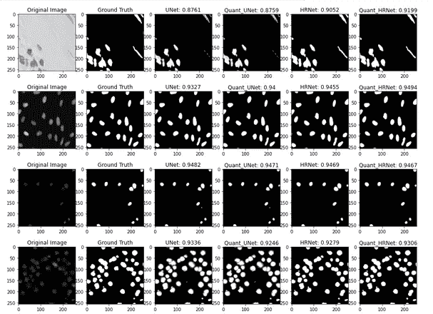

具有相应 IoU 分数的所有模型的样本预测。

*   **30 个图像样本的平均 IoU 得分:
    *** 我们可以得出结论，在 UNet 和 HRNet 中，HRNet 具有更好的平均 IoU 得分。类似地，量化后 HRNet 具有更好的平均 IoU 分数。
    *同样对于这个样本大小，量化 HRNet 比浮点 HRNet 具有更好的平均 IoU 分数。如果我们想在更小的设备上部署模型，那么量化 HRNet 将是一个更好的选择。

```
df = train.sample(n=30, random_state=1)
unet_iou_scores = []
quant_unet_iou_scores = []
hrnet_iou_scores = []
quant_hrnet_iou_scores = []
m = MeanIoU(2, 0.4)
for i in range(len(df)):
  image_path = df['images'].iloc[i]
  mask_path = df['masks'].iloc[i] image_string = tf.io.read_file(image_path)
  image = tf.image.decode_png(image_string, channels=IMG_CHANNELS)
  image = tf.image.convert_image_dtype(image, tf.float32)
  image = tf.image.resize(image, [IMG_HEIGHT, IMG_WIDTH]) mask_string = tf.io.read_file(mask_path)
  mask = tf.image.decode_png(mask_string, channels=CLASSES)
  mask = tf.image.convert_image_dtype(mask, tf.float32)
  mask = tf.image.resize(mask, [IMG_HEIGHT, IMG_WIDTH]) pred_mask_u = unet_model.predict(image[np.newaxis,:,:,:])
  m.update_state(mask, pred_mask_u)
  u_iou_score = m.result().numpy()
  unet_iou_scores.append(round(u_iou_score,4)) pred_mask_qu = lite_unet_model(image[np.newaxis,:,:,:])[0]
  m.update_state(mask, pred_mask_qu)
  qu_iou_score = m.result().numpy()
  quant_unet_iou_scores.append(round(qu_iou_score,4)) pred_mask_h = hrnet_model.predict(image[np.newaxis,:,:,:])
  m.update_state(mask, pred_mask_h)
  h_iou_score = m.result().numpy()
  hrnet_iou_scores.append(round(h_iou_score,4)) pred_mask_qh = lite_hrnet_model(image[np.newaxis,:,:,:])[0]
  m.update_state(mask, pred_mask_qh)
  qh_iou_score = m.result().numpy()
  quant_hrnet_iou_scores.append(round(qh_iou_score,4))print('The average IoU Score for UNet model: ', np.mean(np.array(unet_iou_scores)))print('The average IoU Score for Quantized UNet model: ', np.mean(np.array(quant_unet_iou_scores)))print('The average IoU Score for HRNet model: ', np.mean(np.array(hrnet_iou_scores)))print('The average IoU Score for Quantized HRNet model: ', np.mean(np.array(quant_hrnet_iou_scores)))
```

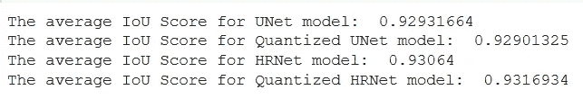

样本量为 30 的模型的平均 IoU 分数。

# 结论

*   总的来说，如果我们看到 HRNet 比 UNet 表现更好，虽然差异非常小。
*   如果我们想在智能手机或 raspberry pi 等小型设备上部署这项工作，那么使用量化模型会更好。
*   量化模型尺寸非常小，性能几乎没有下降。
*   在这种情况下，量化的模型表现得和未量化的模型一样好。
*   量化后的模型大多稍逊于未量化的模型。但是在某些情况下，量化模型给出的结果比未量化的模型稍好。
*   对于 UNet 比 HRNet 表现更好的情况，它们的量化版本显示了相同的行为，反之亦然。

# 未来的工作

这项工作将扩展到探索最新分段体系结构。此外，还可以探索进一步提高本工作中使用的模型的性能。

# 链接

*   **Github 链接:** [https://github.com/sahu-mak/Nuclei_Detection_CaseStudy](https://github.com/sahu-mak/Nuclei_Detection_CaseStudy)
*   **Linkedin 链接:**
    [https://www.linkedin.com/in/sahumayank/](https://www.linkedin.com/in/sahumayank/)
*   **细流 app 视频链接:**
    [https://youtu.be/7F6eKNpPep0](https://youtu.be/7F6eKNpPep0)

# 参考

*   [https://towards data science . com/metrics-to-evaluate-your-semantic-segmentation-model-6 BCB 99639 aa 2](https://towardsdatascience.com/metrics-to-evaluate-your-semantic-segmentation-model-6bcb99639aa2)
*   [https://cs230.stanford.edu/blog/datapipeline/](https://cs230.stanford.edu/blog/datapipeline/)
*   [https://www.tensorflow.org/guide/data#basic_mechanics](https://www.tensorflow.org/guide/data#basic_mechanics)
*   https://arxiv.org/abs/1505.04597
*   人力资源网—[https://arxiv.org/abs/1908.07919](https://arxiv.org/abs/1908.07919)
*   [https://github.com/1044197988/TF.keras-常用-模型/blob/master/% E5 % B8 % B8 % E7 % 94% A8 % E5 % 88% 86% E5 % 89% B2 % E6 % A8 % A1 % E5 % 9E % 8B/HR net . py](https://github.com/1044197988/TF.Keras-Commonly-used-models/blob/master/%E5%B8%B8%E7%94%A8%E5%88%86%E5%89%B2%E6%A8%A1%E5%9E%8B/HRNet.py)
*   [https://www . tensor flow . org/lite/performance/post _ training _ quant](https://www.tensorflow.org/lite/performance/post_training_quant)
*   [https://www.appliedaicourse.com](https://www.appliedaicourse.com/)