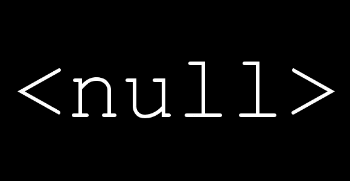

# NullPointerException

> 原文：<https://medium.com/analytics-vidhya/nullpointerexception-a869bc49b50d?source=collection_archive---------15----------------------->



[http://www . devs anon . com/language-agnostic/checking-for-nulls-not-more/](http://www.devsanon.com/language-agnostic/checking-for-nulls-not-anymore/)

当你试图使用一个不指向内存中任何位置(空)的引用，就好像它在引用一个对象时，就会出现异常。对空引用调用方法或试图访问空引用的字段将触发`NullPointerException`。这些是最常见的，但是其他的方法在`[NullPointerException](http://docs.oracle.com/javase/7/docs/api/java/lang/NullPointerException.html)` javadoc 页面上列出。

当你声明一个引用变量(即一个对象)时，你实际上是在创建一个指向一个对象的指针。考虑下面的代码，其中声明了一个原始类型的变量`int`:

```
int x;
x = 10;
```

在这个例子中，变量`x`是一个`int`，Java 会将它初始化为`0`。当你在第二行赋值`10`时，你的`10`值被写入`x`引用的内存位置。

但是，当你试图声明一个引用*类型*时，一些不同的事情发生了。以下面的代码为例:

```
Integer num;
num = new Integer(10);
```

第一行声明了一个名为`num`的变量，但是它实际上还不包含一个原始值。相反，它包含一个指针(因为类型是引用类型`Integer`)。既然你还没有说指向什么，Java 就把它设置为`null`，意思是“**我在指向*无*** ”。

在第二行中，`new`关键字用于实例化(或创建)一个类型为`Integer`的对象，指针变量`num`被分配给该`Integer`对象。

当您声明了一个变量，但在尝试使用该变量的内容之前没有创建一个对象并将它赋给该变量时，就会发生`NullPointerException`(称为*解引用*)。所以你指向的东西实际上并不存在。

解引用通常发生在使用`.`访问方法或字段，或者使用`[`索引数组的时候。

如果你试图在创建对象之前取消引用`num`，你会得到一个`NullPointerException`。在最琐碎的情况下，编译器会捕捉到问题并让你知道“【T2”，但有时你可能会编写不直接创建对象的代码。

例如，您可能有如下方法:

```
public void doSomething(SomeObject obj) {
   //do something to obj, assumes obj is not null
   obj.myMethod();
}
```

在这种情况下，您不是在创建对象`obj`，而是假设它是在调用`doSomething()`方法之前创建的。请注意，可以这样调用该方法:

```
doSomething(null);
```

在这种情况下，`obj`就是`null`，语句`obj.myMethod()`会抛出一个`NullPointerException`。

如果该方法像上面的方法一样打算对传入的对象做些什么，抛出`NullPointerException`是合适的，因为这是一个程序员错误，程序员将需要该信息用于调试目的。

除了作为方法逻辑结果抛出的`NullPointerException`之外，您还可以检查`null`值的方法参数，并通过在方法开头附近添加类似下面的内容来显式抛出 npe:

```
//Throws an NPE with a custom error message if obj is null
Objects.requireNonNull(obj, "obj must not be null");
```

请注意，在您的错误消息中清楚地说明*哪个*对象不能是`null`是有帮助的。验证这一点的好处是 1)您可以返回自己更清晰的错误消息，2)对于方法的其余部分，您知道除非`obj`被重新分配，否则它不为空，可以安全地取消引用。

或者，可能有这样的情况，方法的目的不仅仅是对传入的对象进行操作，因此空参数可能是可接受的。在这种情况下，您需要检查一个空参数**和不同的行为。您还应该在文档中解释这一点。例如，`doSomething()`可以写成:**

```
/**
  * @param obj An optional foo for ____. May be null, in which case 
  *  the result will be ____.
  */
public void doSomething(SomeObject obj) {
    if(obj == null) {
       //do something
    } else {
       //do something else
    }
}
```

最后，[如何使用堆栈跟踪](https://stackoverflow.com/q/3988788/2775450)查明异常&的原因

> *可以使用什么方法/工具来确定原因，从而阻止异常导致程序提前终止？*

带有查找窃听器的声纳可以探测到 NPE。

现在 Java 14 增加了一个新的语言特性来显示 NullPointerException 的根本原因。自 2006 年以来，这种语言特性一直是 SAP 商业 JVM 的一部分。下面是 2 分钟阅读，了解这个惊人的语言功能。

[https://jfeatures.com/blog/NullPointerException](https://jfeatures.com/blog/NullPointerException)

在 java 14 中，以下是示例 NullPointerException 异常消息:

> *在线程“main”Java . lang . nullpointerexception 中:无法调用“java.util.List.size()”，因为“List”为空*

# **避免 NullPointerException 的 Java 技巧和最佳实践**

1.  对已知字符串而非未知对象调用 equals()和 equalsIgnoreCase()方法
2.  更喜欢 valueOf()而不是 toString()，两者都返回相同的结果
3.  使用空安全方法和库
4.  避免从方法返回 null，而是返回空集合或空数组。
5.  使用注释@NotNull 和@Nullable
6.  避免代码中不必要的自动装箱和取消装箱
7.  遵循合同并定义合理的默认值
8.  使用空对象模式
9.  使用 Java 8 Optional 作为方法中返回值，Optional 类提供了表示可选值而不是空引用的解决方案。
10.  使用 final 修饰符来强制执行良好的初始化。