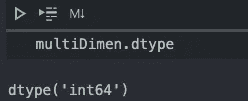

# numpy:Ndarrys 简介

> 原文：<https://medium.com/analytics-vidhya/numpy-an-introduction-to-ndarrys-c04bc0fdd41d?source=collection_archive---------28----------------------->

Numpy 是 Numerical Python 的缩写，是许多其他数据科学库(如 Pandas 和 Scikit-learn)所依赖的基础库。除了数据科学应用之外，numpy 还有助于显著减少您的计算时间，并使您的代码更加高效。本教程将向您介绍 Numpy 的一些独特属性，尤其是 ndarray。

# 设置

为了使用 numpy，标准的导入方式如下:

```
import numpy as np
```

如果您的计算机上尚未安装 numpy，请使用以下命令进行安装:

```
pip3 install numpy
```

# **创建 n 阵列**

ndarray 是同一类型项目的多维容器，是 N 维的(因此得名),对于存储大型数据集来说，它比典型的 Python 数组更灵活、更快。

声明 ndarray 非常简单:


声明一维数组

如果有一个相同长度的嵌套数组列表，也可以将它们转换为多维 ndarray:


声明多维数组

你也可以初始化一个空的 ndarray，一个只有 0 的数组，或者一个只有 1 的任意大小的数组。


零数组、空数组和一数组初始化

需要注意的是，空的 numpy 数组是用随机值填充的，这些值可能是也可能不是 0。

# 内置 ndarray 函数

为了找到 ndarray 的维度，可以使用。形状方法:


寻找数组的维数

您还可以通过实现。数据类型方法。重要的是要记住，ndarray 只能有一种数据类型，这使它不同于常规的 Python 数组。



方法初始化给定特定步骤的某个范围的数组。arange 函数。


。一个大例子

要创建一个浮点序列，可以使用。linspace，其中前两个参数表示范围，第三个参数是要生成的项数。


。linspace 示例

# NumPy 数组的基本操作

ndarrays 最好的特性之一是，您不必编写 for 循环来在数组之间进行计算，这就是通常所说的矢量化。典型的算术运算是按元素进行的。

在下面的例子中，假设一组学生在最近的考试中得到了一个数字分值。总测试总共有 30 分，学生们想计算他们得到的百分比。


元素式操作

如果您尝试在没有 numpy 的情况下这样做，您将不得不使用 for 循环来对数组的每个元素执行给定的操作。

您还可以对给定的数组执行布尔运算，以查看哪些学生通过了测试，哪些学生没有通过。


Numpy 数组上的布尔运算

# 切片和索引

由于 numpy 通常用于处理较大的数据集，因此在对数组进行索引和切片时，不是像 Python 中的典型数组那样创建副本，而是在对 ndarray 进行切片时，创建更大数组的“视图”。让我们看一个简单的例子。


Numpy 中的索引和切片

如上所述，splitArr 不是一个单独的实体，也不是位置 2-4 的值的副本，而是对这些值的引用。因此，更改 splitArr 中的值将会更改原始 ndarray 中的值。ndarrays 以这种方式工作的原因是因为 NumPy 通常用于非常大的数据集，因此，复制数据将是对内存的低效使用。如下图所示，这在常规 Python 数组中是不成立的。


Python 中的索引和切片

您可以使用 NumPy 通过调用来编写如上所示的确切代码。复制()。


创建 n 阵列切片的副本

# 结论

总的来说，ndarray 有许多超越 Python 中典型数组的功能。练习并掌握 ndarray 所有特性的最好方法是使用大型数据集来练习它！希望这有助于你获得更好的理解！:)