# NumPy:用于数据科学的 Python 库

> 原文：<https://medium.com/analytics-vidhya/numpy-day-3-at-internity-foundation-efcef826e549?source=collection_archive---------7----------------------->


NumPy 是一个 Python 库，用于处理数组。

**导入库**

```
import numpy as np
```

**检查版本**

```
 np.__version__
```

**从 python 列表创建 NumPy 数组**

```
arr = np.array([1,2,3,4])
```

**检查类型**

```
type(arr)
# Output : <class 'numpy.ndarray'>
# arr is n-dimensional numpy array
```

**检查 numpy 数组中元素的数据类型**

```
arr.dtype
# Output : int64
```

**检查 numpy 数组的尺寸**

```
arr.ndim
# Output : 1 
# arr is 1-dimensional arraynp.array([[1,2],[3,4],[5,6]]).ndim
# Output : 2
# arr is 2-dimensional array
```

**检查 numpy 数组的形状**

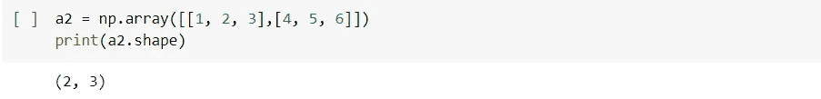

更改 numpy 数组的形状

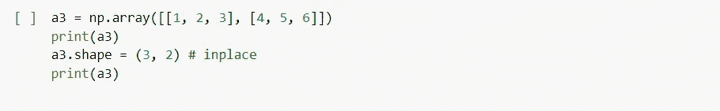

**整形:改变 numpy 数组的形状**

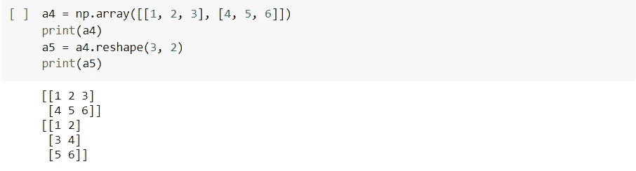

**使用“*arrange”***在一个范围内创建一个数组

*默认 np.arange(start=0，stop，step=1，dtype='int')*

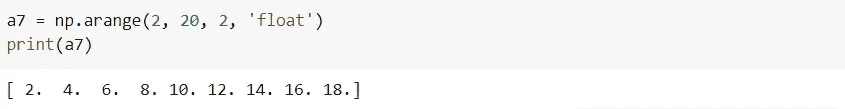

***【林空间】***

*返回间隔[开始，停止]* 内间隔均匀的样本

*np.linspace(start=0，stop，nums=50，endpoint=True，* retstep=False，dtype=None *)*

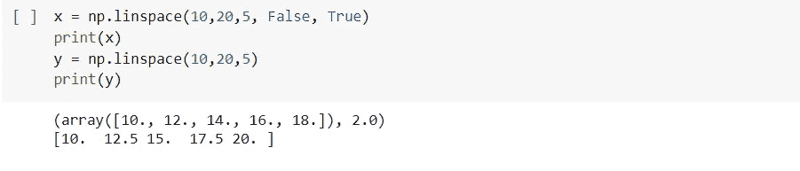

**统计**

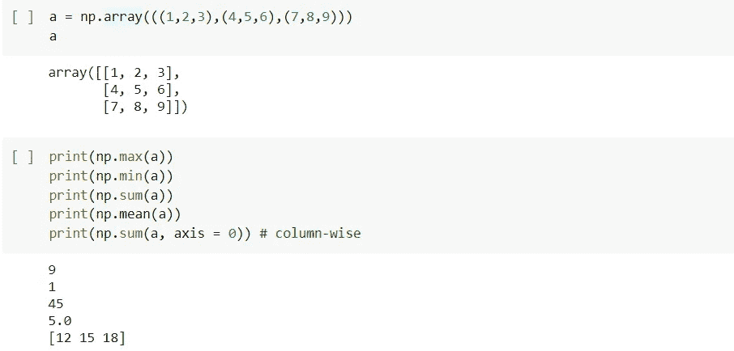

**转置**

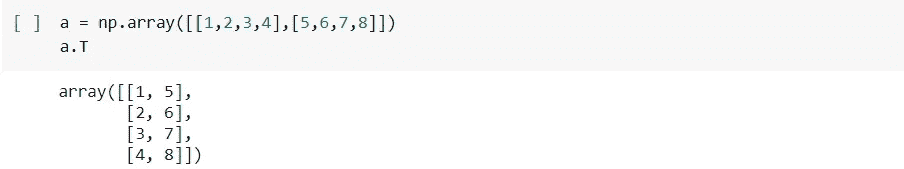

***【NP . where】***

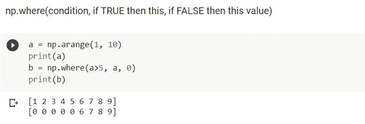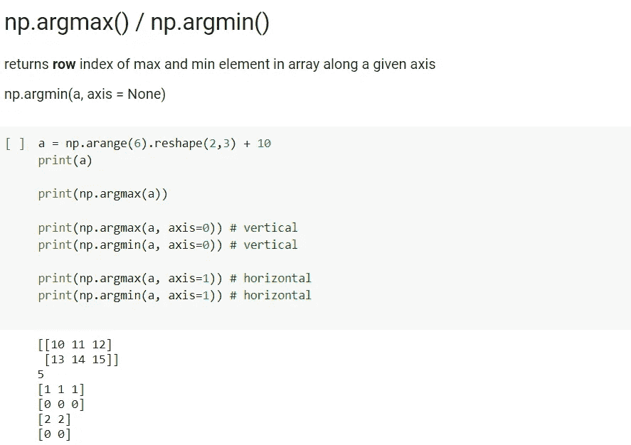

*argmin* '使用 numpy 数组或列表

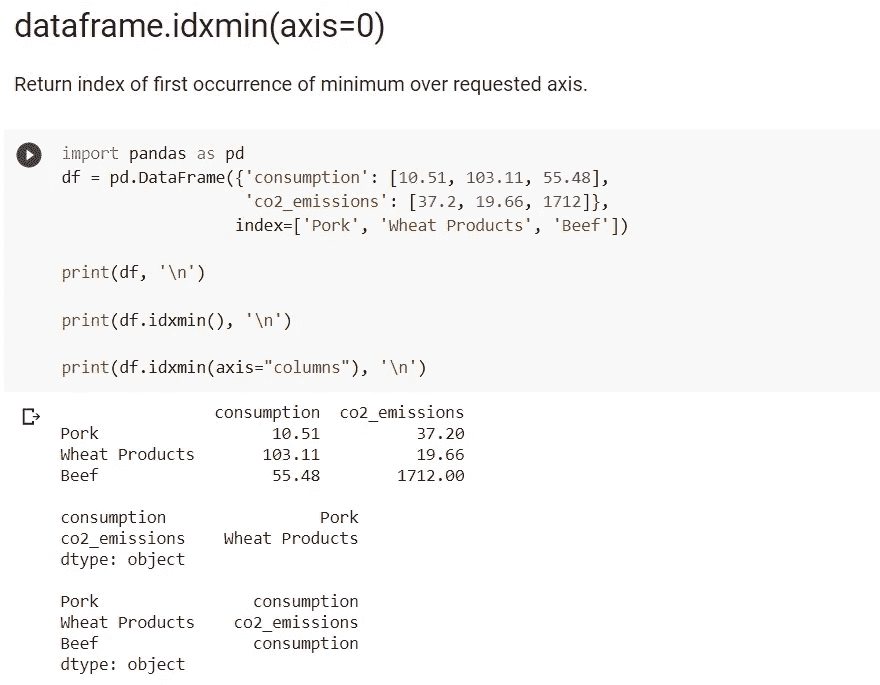

*idxmin* '仅适用于数据帧和序列

**drop_duplicates :** 返回删除了重复行的数据帧。

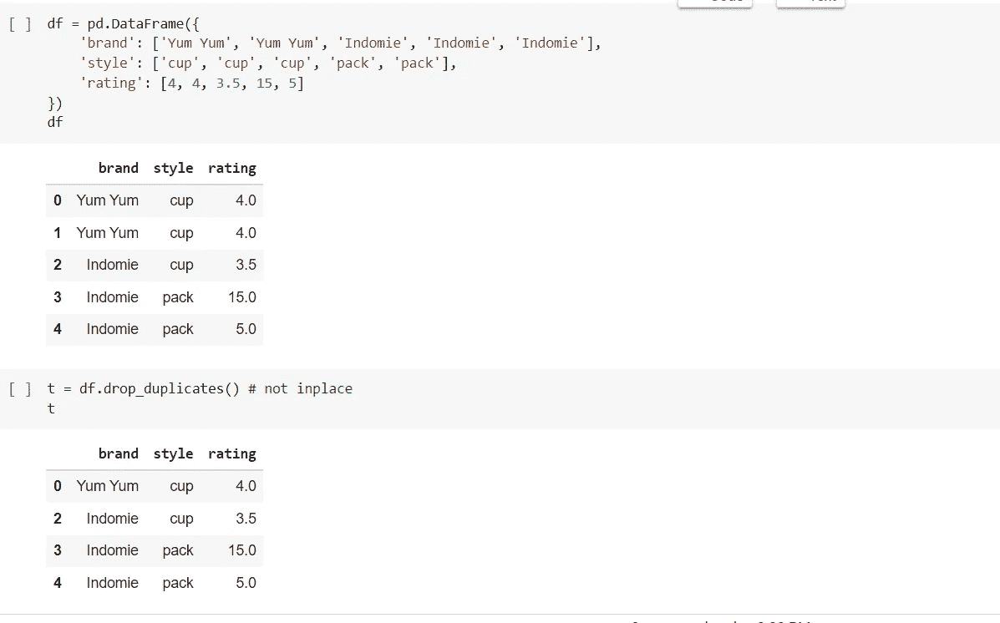

要了解更多关于 NumPy 的信息，请在这里查看官方文档。

在下一篇博客中，我们将讨论 python 的另一个重要库- ' *Pandas* '，它使数据集的处理变得容易，并在数据科学中得到广泛应用。

快乐学习！！