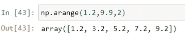
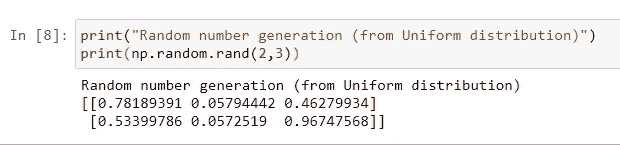

# 初学者的 Numpy:

> 原文：<https://medium.com/analytics-vidhya/numpy-for-beginners-13a21d2f0054?source=collection_archive---------18----------------------->

# *Numpy 是什么？*

Numpy 是 python 中的一个库，也被称为数字 python。它用于处理数组，也适用于线性代数、随机数和矩阵。使用 NumPy，可以对阵列执行数学和逻辑运算。它还处理多维数组。我认为学习 NumPy 将是迈向 python 数据科学之旅的第一步。

因此，我将从导入库的基础开始，就我所知，我将涵盖。

如果你想导入这个库，你只需要用 python 写一行代码。

现在，在导入库之后，让我们探索一下这个库能为我们提供什么。

# Numpy 数组:

现在来看如何创建一个数组。假设你有一个名为' l '的列表，你想把它转换成一个数组，那么你只需要使用 np.array 函数，你的整个列表就会被转换成这个列表。

# 向上投射:

假设你有一个异构列表‘l’。

现在如果你想把这个列表转换成一个数组，你只需要像我上面做的那样做，但是你会在输出中看到一点变化。

你看到整个列表已经被转换成了一个数组，但是数组中的所有数据都是字符串的形式，现在你会奇怪这是怎么发生的。所以我会说在一个异构列表中所有的数据都被转换成列表中最高的数据类型。这个概念叫做上抛。

我希望你们都把注意力集中在 dtype= '

# 多维数组:

所以从一个多维数组开始，让我们从一个二维数组开始，然后我们将继续到更深的维度。

让我们创建一个二维数组

现在假设如果我们想要创建一个二维以上数组，那么我们使用一个称为 ndmin 的参数。无论赋予“ndmin”什么值，都会将数组转换为该维数。

# 阵列到矩阵和矩阵到阵列的转换:

现在，如果我们想把数组转换成矩阵，那么我们用 np.mat 函数把数组转换成矩阵，我们可以用 np.array 函数把矩阵转换成数组。

## 阵列到矩阵:

## 矩阵到数组:

# Numpy 中的数据类型:

## 尺寸:

现在，如果你想知道数组的维数，可以使用“ndim”函数。

## 尺寸:

如果你想知道一个数组的大小，可以使用“size”函数。

## 形状:

如果你想知道数组的形状，可以使用“shape”函数。

它告诉你它有 2 行 6 列。

# 阿兰格:

所以你想理解一个`arange`函数，首先你应该知道一些关于值域函数的知识。

`range`函数只接受整数参数，从不接受浮点参数。这是范围函数的限制。为了克服这个问题，NumPy 有一个既接受整数又接受浮点数的函数。

你看，我给了起始值 1.2，结束值 9.9，增量为 2。

# 林空间:

假设您想要在一些间隔之间生成一些数据，因为 linspace 非常有用。例如，您想要生成 10 个介于 1 和 50 之间的数字。

你可以看到它已经生成了 10 个 1 到 50 之间的数字。1 是起始值，50 是结束值，并且您要生成的值的数量是 10，默认情况下它会生成 50 个数字。

# 矩阵创建:

假设你想创建一个零矩阵，那么你可以使用 np.zeros 函数。

你看，我们已经创建了一个 2D 零矩阵。

如果你想为 1 创建相同的矩阵，你可以使用 np.ones 函数。

我们可以对它进行算术运算，我们可以创建任意数量的矩阵。

我们已经创建了一个 7 的矩阵。这样，你可以创建任何数量的矩阵。

这些事情看起来很容易，但在深度学习和机器学习中非常有用。

# 随机数生成:

假设我们想要生成一个从 0 到 1 的随机数矩阵，为此我们有一个函数叫做 np.random.rand()。在这种情况下，生成具有均匀分布的矩阵。

还有一个函数叫做 np.random.randn()。此函数生成均值为零且标准差为 1 的正态分布中的数字。

上面是一个正态分布图，np.random.randn()生成正态分布中的随机数。

如果我们想在一个范围内生成一个随机整数，那么我们可以使用 np.randint()来实现。

# 结论:

所以这都是关于 NumPy 的，我已经尽力解释了。希望大家了解 NumPy 的基本概念和功能。

## 谢谢你