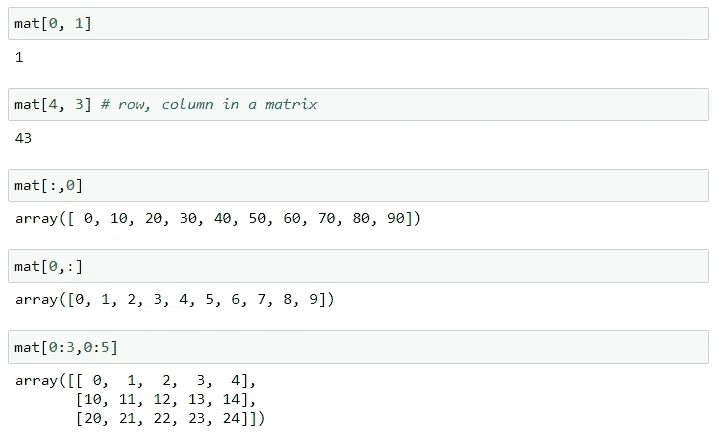
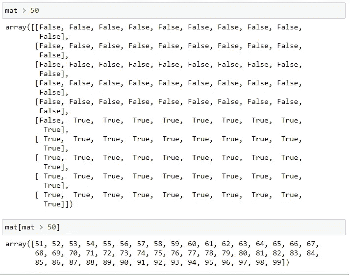

# NumPy —数字 Python 库

> 原文：<https://medium.com/analytics-vidhya/numpy-numerical-python-library-2262f9a32555?source=collection_archive---------14----------------------->

Hiii 我可爱的朋友们:)我们今天重点讲数值 python 库。在进行任何分析和进入数据科学之前，这是一个主库。我认为，这是这个地区的第一步。

NumPy 是一个 python 编程库，可以轻松处理多维序列和矩阵。如果你想通过机器学习，深度学习等..你应该先学 NumPy。我会给出数字图书馆的所有实用方法。你可以说这个故事应该是你的速成班:)让我们开始吧…

首先，我们必须导入 NumPy 库及其所有相关模块。

Numpy 库导入

作为一个额外的信息，如果你想看到所有相关的方法，模块等，你只能把一个点写在 np ( np。)并按下关键字上的 tab 键。通过这种方式，你将看到所有的方法和模块。

让我们为数值 python 数组描述的输入参数创建一个基本列表。

Numpy 数组创建

我们可以创建一个 numpy 数组，就像上面我写的代码一样，并且可以检查数组的类型。

当使用 arange 方法时，程序返回给定间隔内均匀分布的值。这意味着你应该给程序一个初始状态，终点桩号和步数来绘制你用参数定义的特定路径。如果不给出任何步数，程序将一个接一个地增加。

方法用法

此外，我们还可以识别零矩阵和单位矩阵。这些只能用写“np.ones”或者“np.zeros”来描述。你可以创建一维或二维的矩阵，你唯一要做的就是给 2D 一个元组，给 1D 一个数。

零和一数组

Linspace 方法也像 arange 方法一样工作，但是它们之间有一个显著的区别。Arange 需要跳跃步数，而 linspace 需要跳跃元素点数。你会明白我的意思后，看看我下面的代码截图。

林空间方法

随机值的创造只能由 np.random.randint 来完成，你应该给出期望输出的区间。如果你想用随机数创建一个矩阵，你可以给你的参数添加一个元组。此外，如果您不想在内核上每次运行操作后更改随机值，如果您应该在随机值创建行的同一单元格中定义一个种子。通过这样做，不改变随机值的唯一方法。让我们看看我的内核中的以下命令。

随机值和数组创建

如果我们想获得一些基本级别的统计信息，我们可以获得最大值、最小值、平均值，或者我们也可以通过添加 argmax()等来获得它们的索引...

Numpy 数组的最大-最小-平均值

重塑矩阵的操作也应该在 NumPy 中考虑，但是我们在组织拟合值的大小时必须小心。如果我们有 10 个值，我们可以用 5*2 或 2*5 等来调整它的大小..我们不应该创建 4*6 矩阵。

重塑矩阵

当达到矩阵中的特定值时，我们可以使用行和列的索引，也可以通过给定特定索引来应用切片操作，以从原始矩阵创建子矩阵。

达到矩阵的特定值并创建子矩阵

我们可以在数组中使用一些布尔过滤掩码，通过检查下、上甚至相等来控制值的结构。我们可以像下面这样使用这些过滤器。无需编写任何条件语句，我们可以通过使用这些行来控制这些值。

过滤掩码—矩阵中的真/假

总的来说，我已经向你提供了我想要传达的信息和对数值 Python 库的了解。我们将继续下一个库。祝您愉快:)