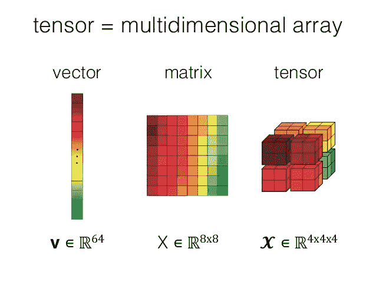

# GPU/TPU 上的 Numpy

> 原文：<https://medium.com/analytics-vidhya/numpy-on-gpu-tpu-efb8d367020a?source=collection_archive---------8----------------------->

## 深度学习

## 让你的 Numpy 代码运行快 50 倍。

图片来自[I2 教程](https://www.i2tutorials.com/what-do-you-mean-by-tensor-and-explain-about-tensor-datatype-and-ranks/)

[Numpy](https://numpy.org/) 是迄今为止最常用的对数组进行数学运算的库。它已经成为许多机器学习和数据科学库的基础。它有大量的高级数学函数来操作数组。众所周知，Numpy 因其运算速度而广受欢迎…