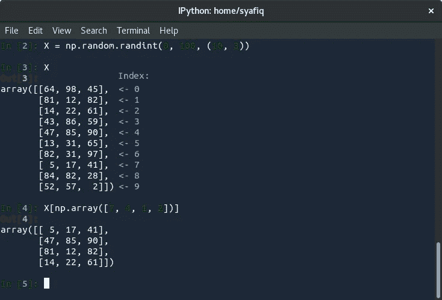
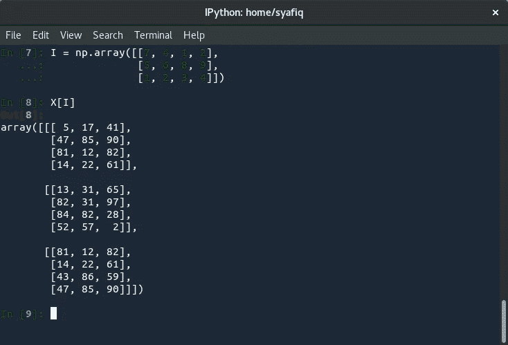
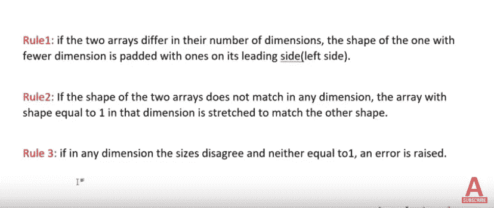

# NumPy -大图和有价值的见解

> 原文：<https://medium.com/analytics-vidhya/numpy-the-big-picture-and-worthy-insights-ae33ef0dbcc4?source=collection_archive---------24----------------------->


NumPy 使得在 PYTHON 中进行计算变得简单而快速。NumPy 是 Python 编程语言的一个库，增加了对大型多维数组和矩阵的支持，以及对这些数组进行操作的大量高级数学函数。

根据 NumPy 官方文档:NumPy 将 C 和 Fortran 等语言的计算能力引入 Python，这是一种更容易学习和使用的语言。伴随这种能力而来的是简单性:NumPy 中的解决方案通常是清晰而优雅的。

我们将参观 NumPy 的一些特殊区域，以充分了解和欣赏它的伟大之处。

# **首先，让我们看看为什么 Python 中的循环比 C 语言慢**

一个聪明的 C 编译器可能会通过识别到最后，`a`将总是 1 来优化你的循环。Python 做不到这一点，因为在迭代`xrange`时，它需要在`xrange`对象上调用`__next__`，直到它引发`StopIteration`。python 直到调用它才能知道`__next__`是否会有副作用，所以没有办法优化掉循环。从这一段中得到的启示是，优化 python“编译器”比优化 C 编译器要困难得多，因为 Python 是一种动态语言，需要编译器知道对象在特定环境下的行为。在 C 中，这要容易得多，因为 C 提前知道每个对象的确切类型。

当然，除了编译器，python 还需要做更多的工作。在`C`中，你使用**硬件指令**中支持的操作来处理基本类型。在 python 中，解释器在**软件**中一次解释一行字节码。显然，这将比机器指令花费更长的时间。数据模型(例如一遍又一遍地调用`__next__`也可能导致大量 C 不需要做的函数调用。当然，python 做这些事情是为了让它比编译语言更加灵活。

# **以 NumPy(NumPy . ndarray . stamps)为单位的大步数**

数组的**步幅**告诉我们要沿着某个轴移动到下一个位置，我们必须在内存中跳过多少字节。例如，我们必须跳过 4 个字节(1 个值)来移动到下一列，但是需要 20 个字节(5 个值)才能到达下一行的相同位置。

```
In [1]: import numpy as np
In [2]: a=np.arange(1,13,1)
In [3]: a=a.reshape(3,4)
In [4]: print(a.dtype)
In [4]: print(a.strides)
Out[3]: int32
(16, 4)abytes = a.ravel().view(dtype = np.uint8)
print(abytes[:24])
>>[1 0 0 0 2 0 0 0 3 0 0 0 4 0 0 0 5 0 0 0 6 0 0 0]abytes[1]=2
a.ravel()[0]
# 256^1 * 2 + 256^0 * 1
>>513
```

# **矢量化**

**技巧 1:** 我们可以使用整数索引的 1D 矩阵任意索引 2D 矩阵的任何一行。



10×3 矩阵 x 的一维行索引。

技巧 2: 我们可以使用整数索引的 2D 矩阵来索引 2D 矩阵的行的任何 2D 子矩阵



矩阵 x 的二维行索引。

# **高级索引**

我们也可以做整数列表和布尔索引！！我们可以使用 index 作为一个 N 维数组，类型为 boolean 或 integer 或 tuple 序列。假设我们有一个一维 NumPy 数组 A，假设 A=[1，2，3，4，5，6，7，8，9]。现在从 A 中提取 3，5 和 6，我们可以列出需要显示的索引。我们使 index=[2，4，5]。

神奇的是:一个[index]给了我们 array(3，5，6)。

我们只能在一次操作中多次访问一个索引。

我们也可以给出一个布尔条件作为索引！

```
In [1]: import numpy as np
In [2]: arr = np.array([1, -3, 2, -4, 5])
In [3]: arr[arr<0]
Out[3]: array([-3, -4])
```

# **广播**

术语广播描述了 numpy 在算术运算中如何处理不同形状的数组。在某些约束条件下，较小的阵列在较大的阵列中“广播”,以便它们具有兼容的形状。广播提供了一种向量化数组操作的方法，因此循环在 C 而不是 Python 中发生。这样做不会产生不必要的数据副本，并且通常会导致高效的算法实现。然而，在有些情况下，广播并不是一个好主意，因为它会导致内存使用效率低下，从而降低计算速度。

Brodcasting 允许我们对两个不同大小的数组进行操作，但它有一定的规则要遵循。



广播规则

广播提供了一种获取两个数组的外积(或任何其他外运算)的便捷方法。以下示例显示了两个一维数组的外部加法运算:

```
>>> a = np.array([0.0, 10.0, 20.0, 30.0])
>>> b = np.array([1.0, 2.0, 3.0])
>>> a[:, np.newaxis] + b
array([[  1.,   2.,   3.],
       [ 11.,  12.,  13.],
       [ 21.,  22.,  23.],
       [ 31.,  32.,  33.]])
```

最后，我们来看看 StackOverflow 上提到的 NumPy 上的一些著名问题:

> 如何在不截断的情况下打印完整的 NumPy 数组？

```
import sys
import numpy
numpy.set_printoptions(threshold=sys.maxsize)
```

> 将 NumPy 数组转储到 csv 文件中

```
import numpy
a = numpy.asarray([ [1,2,3], [4,5,6], [7,8,9] ])
numpy.savetxt("foo.csv", a, delimiter=",")
```

> 如何获得 NumPy 数组中 N 个最大值的索引？

```
In [1]: import numpy as np
In [2]: arr = np.array([1, 3, 2, 4, 5])
In [3]: arr.argsort()[-3:][::-1]
Out[3]: array([4, 3, 1])
```

# 参考

[](https://numpy.org/doc/stable/user/basics.broadcasting.html) [## 广播-NumPy 1.19 版手册

### 注请参阅本文中有关广播概念的插图。广播这个术语描述了 numpy 如何对待…

numpy.org](https://numpy.org/doc/stable/user/basics.broadcasting.html) 

高级数字|科学日本 2019

StackOverflow/NumPy