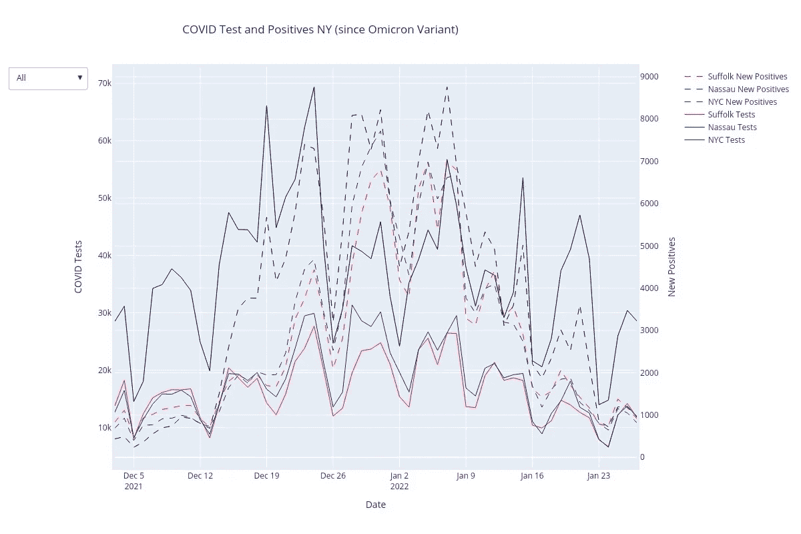

# NYS 新冠肺炎数据可视化

> 原文：<https://medium.com/analytics-vidhya/nys-covid-19-data-visualizations-ae371e416e55?source=collection_archive---------3----------------------->

针对 Omicron 变体更新

作为一家软件开发公司的数据分析师，我花了大量时间使用 SQL 来为我的工作项目提取相关数据。最近，我将我的 python 技能与探索性研究、预测性分析和图形相结合。这篇文章的目的是补充上一篇[NYS·新冠肺炎的数据文章](https://towardsdatascience.com/visualizing-nys-covid-19-data-ed97f539b921)的工作，这篇文章回顾了…