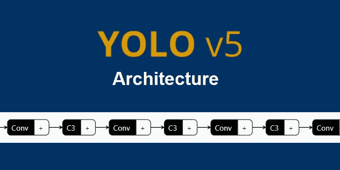
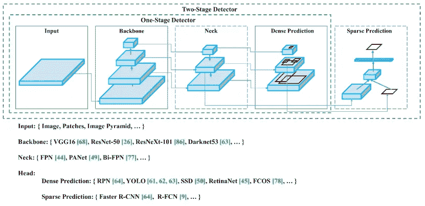
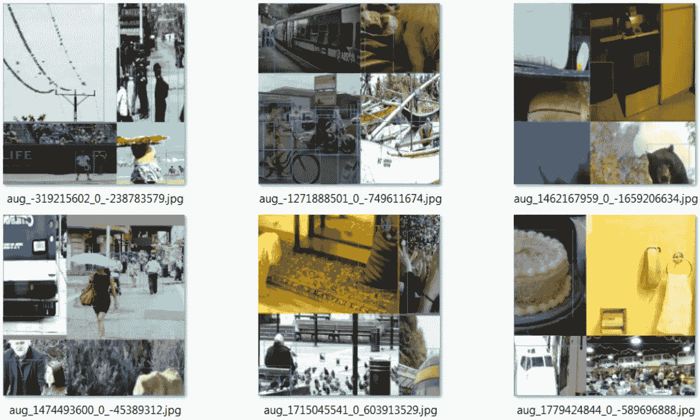
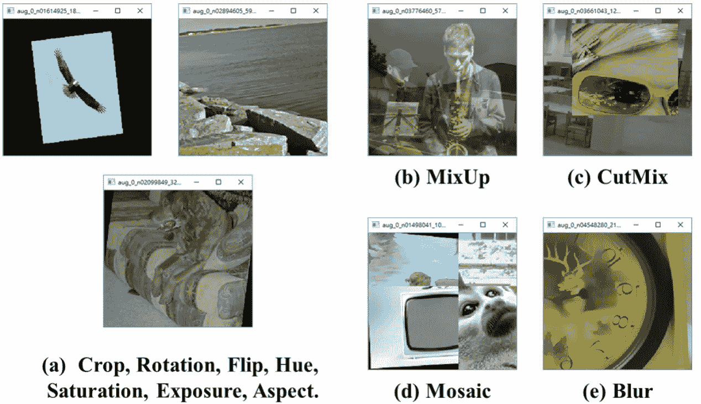
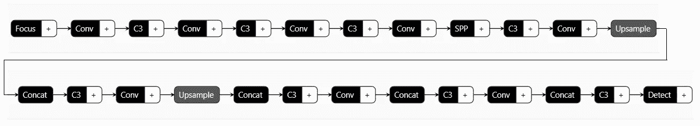
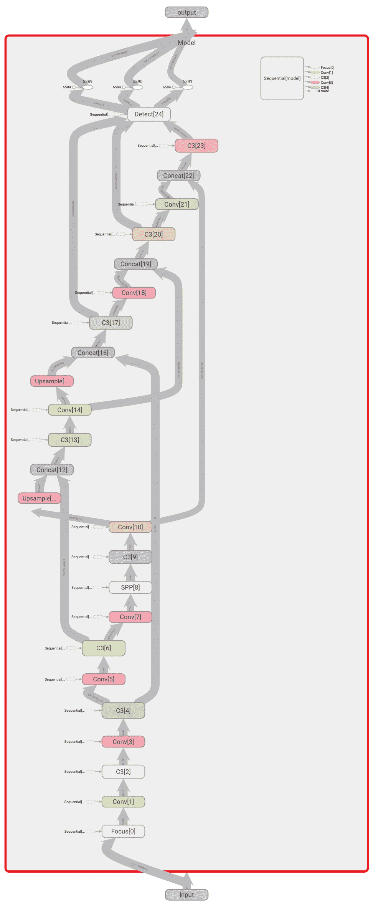

# 目标检测算法——YOLO V5 架构

> 原文：<https://medium.com/analytics-vidhya/object-detection-algorithm-yolo-v5-architecture-89e0a35472ef?source=collection_archive---------0----------------------->

YOLO v5 的历史和建筑

Yolo V5 架构

基于 CNN 的对象检测器主要适用于推荐系统。YOLO(**Y**ou**O**only**L**ook**O**nce)模型用于高性能的物体检测。YOLO 把一幅图像分成一个网格系统，每个网格检测自己内部的物体。它们可以用于基于数据流的实时对象检测。它们需要很少的计算资源。

**YOLO 的历史**

*   **yolo v1**(2015 . 6 . 8):[你只看一次:统一的、实时的物体检测](https://arxiv.org/abs/1506.02640)
*   **yolo v2**(2016 年 12 月 25 日): [YOLO9000:更好、更快、更强](https://arxiv.org/abs/1612.08242v1)
*   **yolo v3**(2018 年 4 月 8 日): [YOLOv3:增量改进](https://arxiv.org/abs/1804.02767v1)
*   **yolo v4**(2020 年 4 月 23 日): [YOLOv4:物体检测的最佳速度和精度](https://arxiv.org/abs/2004.10934v1)
*   **yolo V5**(2020 年 5 月 18 日): [Github repo](https://github.com/ultralytics/yolov5) (截至 2021 年 8 月 1 日无论文)

**注:**根据此处的注释，截至 2021 年 8 月 1 日没有关于 YOLOv5 的文件。因此，这篇文章将详细阐述 YOLOv4，以便于理解 YOLOv5。

为了理解 Yolov5 如何改进性能及其架构，让我们来看一下下面的高级对象检测架构:

来源: [Yolov4 论文](https://arxiv.org/pdf/2004.10934.pdf)

通用对象检测器将有一个**主干**用于预训练它，还有一个**头**用于预测类别和边界框。 ***主干*** 可以运行在 GPU 或者 CPU 平台上。 ***头*** 可以是**一级**(如 YOLO、SSD、RetinaNet)用于**密集预测**或者**两级**(如更快的 R-CNN)用于**稀疏预测**物体探测器。最近的物体探测器有一些层(*)来收集特征图，而且是在脊椎和头部之间。*

*在 YOLOv4 中，[**cspdarknet 53**](https://openaccess.thecvf.com/content_CVPRW_2020/papers/w28/Wang_CSPNet_A_New_Backbone_That_Can_Enhance_Learning_Capability_of_CVPRW_2020_paper.pdf)**用作主干， [**SPP 块**](https://arxiv.org/abs/1406.4729) 用于增加感受野，这分离了显著特征，并且没有降低网络运行速度。 [**PAN**](https://arxiv.org/abs/1803.01534) 用于来自不同骨干层的参数聚合。[**yolov 3**](https://arxiv.org/abs/1804.02767)**(基于锚点)头部用于 YOLOv4。*****

*******注:**有关 CSPDarknet53、SPP、PAN 和 YOLOv3 的更多详细信息，请浏览以上链接。*****

*****YOLOv4 引入了新的数据增强方法[马赛克](https://arxiv.org/pdf/2004.10934.pdf)和[自我对抗训练(SAT)](https://arxiv.org/pdf/2004.10934.pdf) 。马赛克混合了四幅训练图像。自我对抗训练分为向前和向后两个阶段。在第一阶段，网络只改变图像而不是权重。在第二阶段，训练网络来检测修改图像上的对象。*****

**********

*****来源:[马赛克数据增强](https://arxiv.org/pdf/2004.10934.pdf)*****

**********

*****来源:[yolov 4](https://arxiv.org/pdf/2004.10934.pdf)中的各种数据扩充方法*****

*****除了上述提到的模块，一些现有的方法([空间注意模块【SAM】](https://arxiv.org/abs/1807.06521)、[潘](https://arxiv.org/abs/1803.01534)、 [CBN](https://arxiv.org/abs/2002.05712) )已经被修改以提高性能。*****

*****Yolov5 几乎与 Yolov4 相似，但有以下一些区别:*****

*   *****Yolov4 在 Darknet 框架中发布，是用 C 写的**。Yolov5 基于 PyTorch 框架。*******
*   *****Yolov4 使用**。cfg** 用于配置，而 Yolov5 使用**。用于配置的 yaml** 文件。*****

*****[**Netron**中显示的 YOLOv5s 型号](https://github.com/ultralytics/yolov5/releases/download/v5.0/yolov5s.pt)*****

**************

*******Yolov5s 型号*******

*******[**YOLOv5s 型号**](https://github.com/ultralytics/yolov5/releases/download/v5.0/yolov5s.pt) **显示在张量板上*********

**********

*****来源:[约洛夫 5](https://github.com/ultralytics/yolov5/issues/1333)*****

*****请通过 [Yolov5 Github repo](https://github.com/ultralytics/yolov5) 了解更多信息。*****

*******感谢**阅读！请👏如果你喜欢这篇文章，请跟我来，因为它**鼓励我**写更多！*****