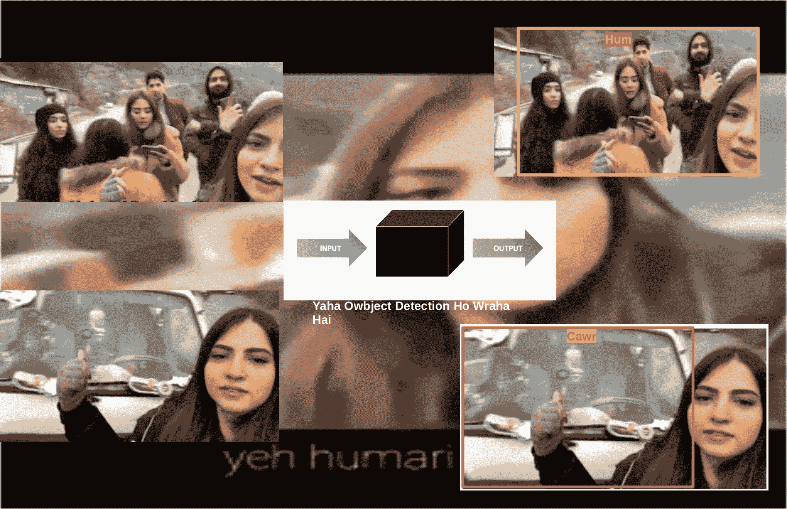
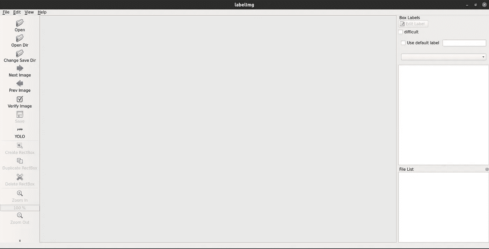
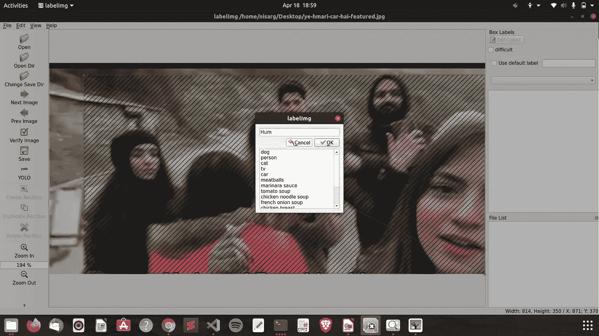

# 使用 YOLO 预训练权重的自定义数据集上的对象检测模型——训练

> 原文：<https://medium.com/analytics-vidhya/object-detection-model-on-custom-dataset-using-yolo-v3-tiny-pre-trained-weights-the-training-34ab74100147?source=collection_archive---------5----------------------->

# 物体检测:



# 数据准备

通过在终端中运行以下代码片段下载 [LabelImg](https://github.com/tzutalin/labelImg) :

```
git clone https://github.com/tzutalin/labelImg.git
```

现在，打开目录，运行“python3 labelImage.py”。它会打开一个这样的窗口。



点击“打开目录”并选择包含数据的目录。

现在点击 RectBox 上的 Create，做一个盒子，标上你想要的名字…



在标记数据后，我们必须制作一个模型(大脑)，它将把盒子放在正确的位置，也就是物体所在的位置。

将包含标签的文件夹上传到您的驱动器。

所以这里有一个[链接](https://github.com/nisargbhatt09/Object-Detection-Custom-Data/blob/main/Yolo_Training.ipynb)来训练模型:“[https://github . com/nisargbhatt 09/Object-Detection-Custom-Data/blob/main/Yolo _ training . ipynb](https://github.com/nisargbhatt09/Object-Detection-Custom-Data/blob/main/Yolo_Training.ipynb)”

# 让我们编码

如果你的设备上没有 GPU，我更喜欢你使用 Google Colab。

因此，首先让我们检查是否启用了 GPU。

```
!nvidia-smi
```

如果你得到这样的东西，GPU 是启用的。

```
+------------------------------------------------------------------+ | NVIDIA-SMI 460.56  Driver Version: 460.32.03  CUDA Version: 11.2 | |---------------------------+------------------+-------------------+ | GPU  Name        Persistence-M| Bus-Id        Disp.A | Volatile Uncorr. ECC | | Fan  Temp  Perf  Pwr:Usage/Cap|         Memory-Usage | GPU-Util  Compute M. | |                               |                      |               MIG M. | |===============================+======================+======================| |   0  Tesla P100-PCIE...  Off  | 00000000:00:04.0 Off |                    0 | | N/A   37C    P0    26W / 250W |      0MiB / 16280MiB |      0%      Default | |                               |                      |                  N/A | +-------------------------------+----------------------+----------------------+                                                                                 +-----------------------------------------------------------------------------+ | Processes:                                                                  | |  GPU   GI   CI        PID   Type   Process name                  GPU Memory | |        ID   ID                                                   Usage      | |=============================================================================| |  No running processes found                                                 | +-----------------------------------------------------------------------------+
```

访问 Google Drive

```
from google.colab import drivedrive.mount('/content/gdrive')
```

驱动器上的项目列表

```
!ln -s /content/gdrive/My\ Drive/ /mydrive!ls /mydrive
```

Darknet:是一个开源的神经网络框架。我们稍后将使用它来训练预训练的权重。

克隆黑暗网络:

```
!git clone https://github.com/AlexeyAB/darknet
```

用 GPU 设置 OpenCV

```
# change makefile to have GPU and OPENCV enable%cd darknet!sed -i 's/OPENCV=0/OPENCV=1/' Makefile!sed -i 's/GPU=0/GPU=1/' Makefile!sed -i 's/CUDNN=0/CUDNN=1/' Makefile!make
```

现在让我们从 darknet 的 cfg 目录中更改配置文件“yolov3-tiny.cfg”。这是针对一个类的，你可能有不止一个，只需用你想要的类的数量来改变 1。

```
!cp cfg/yolov3-tiny.cfg cfg/yolov3_training.cfg!sed -i 's/batch=1/batch=64/' cfg/yolov3_training.cfg!sed -i 's/subdivisions=1/subdivisions=16/' cfg/yolov3_training.cfg!sed -i 's/max_batches = 500200/max_batches = 4000/' cfg/yolov3_training.cfg!sed -i '610 s@classes=80@classes=1@' cfg/yolov3_training.cfg!sed -i '696 s@classes=80@classes=1@' cfg/yolov3_training.cfg!sed -i '783 s@classes=80@classes=1@' cfg/yolov3_training.cfg!sed -i '603 s@filters=255@filters=18@' cfg/yolov3_training.cfg!sed -i '689 s@filters=255@filters=18@' cfg/yolov3_training.cfg!sed -i '776 s@filters=255@filters=18@' cfg/yolov3_training.cfg
```

在您的驱动器上创建一个文件夹来保存权重。

```
# Create folder on google drive so that we can save there the weights!mkdir "/mydrive/yolov3_w1"
```

我们将在数据目录中创建一个名为“obj.data”的文件来保存所有的类名，这里我只使用了一个类，所以请耐心等待😌️

```
!echo "Class_Name" > data/obj.names!echo -e 'classes= 1\ntrain  = data/train.txt\nvalid  = data/test.txt\nnames = data/obj.names\nbackup = /mydrive/yolov3_w1' > data/obj.data!mkdir data/obj
```

现在我们需要预先训练的权重，您可以使用 darknet53.conv.74。这个权重将根据给定的数据进行重新训练。

```
!wget https://pjreddie.com/media/files/darknet53.conv.74
```

从驱动器中提取目录，将目录解压缩到 data/obj。

```
!unzip /mydrive/data.zip -d data/obj
```

我们将把。txt 文件。因为我们只处理一个类，所以应该是类 0。(缩进不正确，请参考代码[链接](https://github.com/nisargbhatt09/Object-Detection-Custom-Data/blob/main/Yolo_Training.ipynb)。)

```
import globimport osimport retxt_file_paths = glob.glob(r"data/obj/new_dataset/*.txt")for i, file_path in enumerate(txt_file_paths):# get image sizewith open(file_path, "r") as f_o:lines = f_o.readlines()text_converted = []for line in lines:print(line)numbers = re.findall("[0-9.]+", line)print(numbers)if numbers:# Define coordinatestext = "{} {} {} {} {}".format(0, numbers[1], numbers[2], numbers[3], numbers[4])text_converted.append(text)print(i, file_path)print(text)# Write filewith open(file_path, 'w') as fp:for item in text_converted:fp.writelines("%s\n" % item)
```

收集 jpg 文件

```
import globimages_list = glob.glob("data/obj/new_dataset/*.jpg")## Perform Normalization!!!!!!!!!!!!!!!!!!!!!!!!!!!!!!!!!!!!!!!!!!!!!!!!!!!!!!!!!!!!!!!!!!!!!!!### I have not done it........print(images_list)
```

创建 train.txt 文件，其中包含 jpg 文件的名称。

```
file = open("data/train.txt", "w")file.write("\n".join(images_list))file.close()
```

开始训练，等到模型收敛。

# 等待永恒…

```
!./darknet detector train data/obj.data cfg/yolov3_training.cfg darknet53.conv.74 -dont_show
```

此后，重量将存储在驱动器的“yolov3_w1”中。

# 你猜对了！！！

感谢阅读，请鼓掌并分享这篇文章。