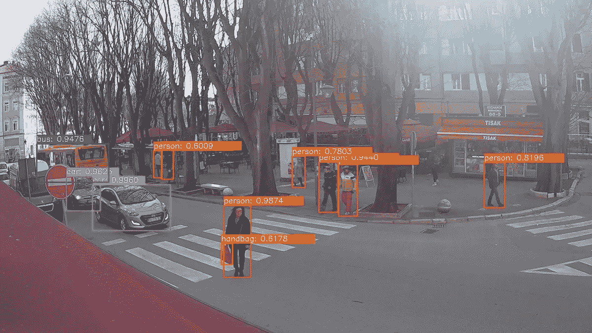
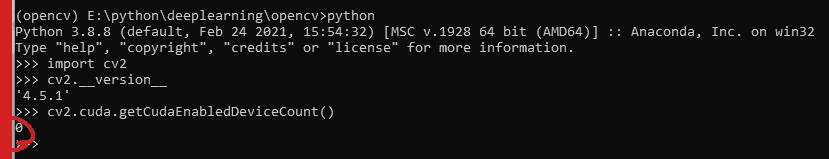
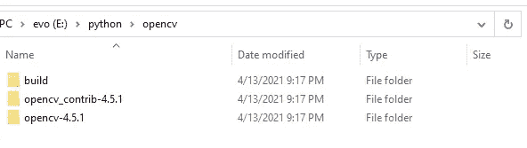
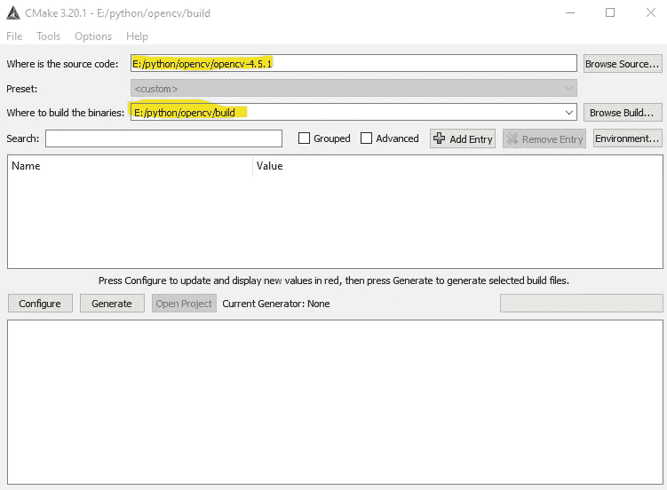
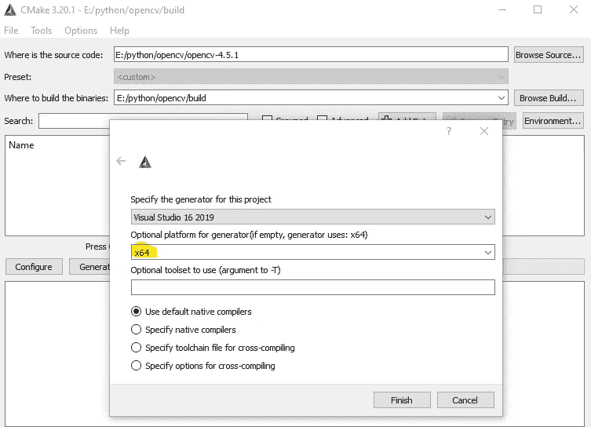
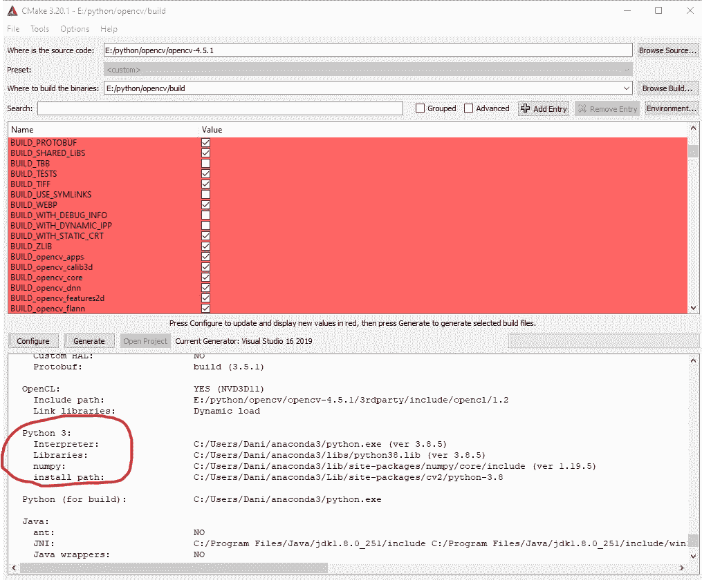
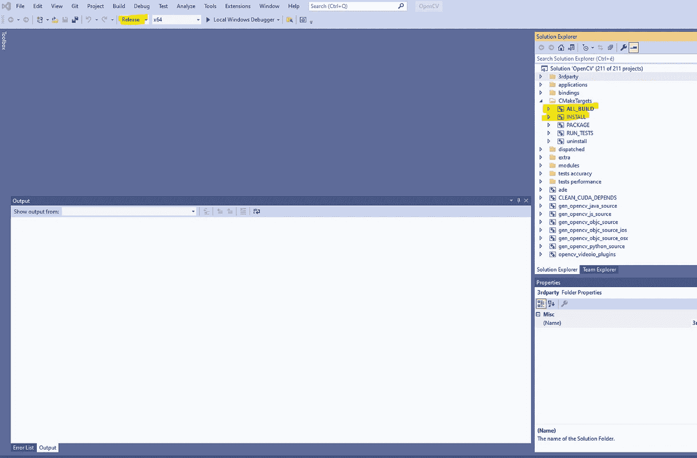
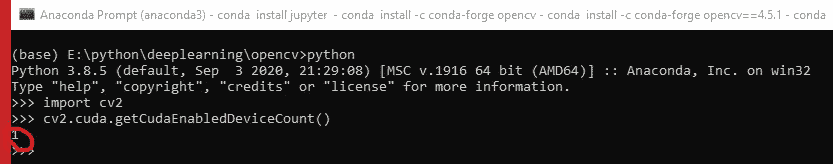
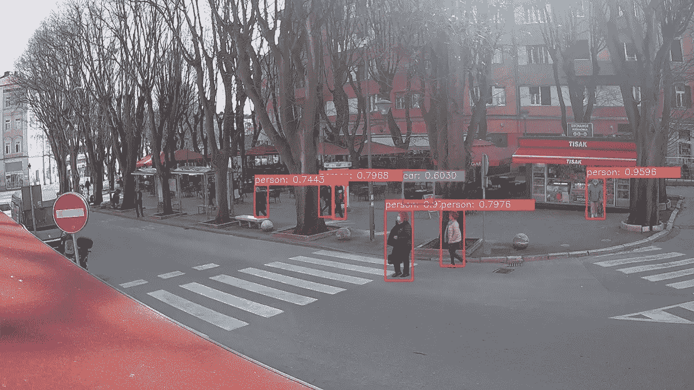

# 基于 OpenCV 和 YOLOv4 的公共摄像头目标检测

> 原文：<https://medium.com/analytics-vidhya/object-detection-on-public-webcam-with-opencv-and-yolov4-9ed51d5896a9?source=collection_archive---------2----------------------->



我已经用 Tensorflow 和 OpenCV 写了几篇关于对象检测的文章。现在我想尝试用 Tensorflow 和 OpenCV 在**公共网络摄像头**上**检测人**。
嗯，结果令人失望。我尝试了来自 Tensorflow 模型动物园的三种不同的模型，但由于网络摄像头上的人太少，它们都不起作用。这些模型几乎检测不到任何远离相机的东西。
以前我看过很多视频，在这些视频中，YOLO、v3 或 v4 都能成功检测出离摄像机很远的人，所以我决定现在试一试。

# 使用 CUDA 和 cuDNN 支持 GPU 加速，从源代码构建 OpenCV

我有一个英伟达 RTX 2080 GPU，所以我想确保 OpenCV 上的 GPU 支持加快了对象检测。
默认情况下，当您安装 OpenCV for Python 时，它不支持 GPU 和 CUDA。您可以在 Python 解释器中使用以下命令轻松检查这一点:



如果你想在 OpenCV 中使用带有 CUDA 的 GPU，你必须在本地机器上从头开始构建 OpenCV。老实说，这是整个 YOLO 经历中最困难的部分。
我有一台 Windows 10 机器，所以我按照【TheCodingBug 频道的这个惊人的循序渐进教程从源代码构建 OpenCV。在找到这个视频之前，我努力让它工作。
我只是总结了下面的步骤，如需进一步参考，请查看上面链接的视频。

## 先决条件

从头开始构建 OpenCV 需要以下先决条件:

*   安装了蟒蛇
*   [Visual Studio 2019](https://visualstudio.microsoft.com/downloads/) 安装了 C++的桌面开发
*   [安装 CUDA](https://developer.nvidia.com/cuda-downloads?) 和 [cuDNN](https://developer.nvidia.com/cudnn)
*   [CMake GUI](https://cmake.org/download/) 已安装

## 构建 OpenCV 的步骤

从 OpenCV github 页面下载最新稳定版本的代码。我们将使用可以下载的 4.5.1 版本[这里](https://github.com/opencv/opencv/tree/4.5.1)为. zip 文件。

我们将需要一些额外的模块，也必须从源构建，下载为。来自 opencv_contrib github 库的 zip 文件。请确保您下载的版本与您为 OpenCV 下载的版本相同。现在我们将在这里也使用 4 . 5 . 1。

创建一个名为 *opencv* 的新目录，在这里提取 *opencv* 和 *opencv_contrib* 。另外，在同一个文件夹中创建一个名为 *build* 的新的空文件夹。这是开始构建 OpenCV 之前的样子。



打开 CMake GUI，按照上面创建的方式设置正确的路径



当您第一次点击 configure 时，CMake 会询问生成器平台。确保为 Windows 10 机器选择 x64。



当生成完成时，检查 Python 3 部分是否出现在控制台输出中，**，否则 OpenCV 将无法在 Python 中工作**。



> 如果不存在，可能有多种原因。我面对两个。第一:Anaconda 没有在您的系统中注册为默认的 Python 解释器。解决方案:我必须在安装过程中勾选正确的复选框来重新安装 Anaconda。二:numpy 版本与要构建的 OpenCV 版本不匹配。这对我来说有点神奇，为什么 OpenCV 4.5.1 必须安装 1.19.5 numpy 版本，但在那之后它就工作了。
> 此时您所做的任何更改，都必须重新开始整个过程，直到 Python 3 部分出现。重新开始之前，请确保按下文件/删除缓存。

您必须设置以下配置选项并点击*配置*:

*   使用 _CUDA
*   OPENCV_DNN_CUDA
*   启用 _ 快速 _ 数学
*   OPENCV _ EXTRA _ MODULES _ PATH =<opencv-contrib directory="" path="">/模块</opencv-contrib>

当配置发生时，在维基百科页面中找到适合你的 GPU 的计算能力版本。2080 年的 RTX 是 7.5。
配置完成后，设置以下配置选项并再次点击配置:

*   CUDA _ 快速 _ 数学
*   CUDA_ARCH_BIN=

配置完成后，控制台看起来没有错误，按下*生成*按钮。它将在 *build* 文件夹中生成在 Visual Studio 中构建 OpenCV 所需的文件。

生成完成后，在 Visual Studio *中打开 *build/OpenCV.sln* 。*



首先，在菜单栏中将解决方案配置**从 Debug 改为 Release** 。然后在解决方案浏览器中，右击 CMakeTargets/ALL_BUILD 并点击 *Build* 。**建造这个项目**至少需要 30 分钟。构建完成且没有错误后，右键单击 CMakeTargets/INSTALL 并点击 *Build* 。

以上步骤将为*基础* conda 环境安装 OpenCV **。如果要使用不同的环境，请确保在开始整个过程之前更改以下配置选项:**

*   PYTHON3 _ 可执行文件
*   PYTHON3 _ INCLUDE _ 目录
*   PYTHON3 _ 库
*   PYTHON3_NUMPY_INCLUDE_DIRS
*   PYTHON3_PACKAGES_PATH

## 验证 OpenCV 构建成功

要验证 OpenCV 是否可以在您的 conda 环境中使用 Python 并支持 GPU，请在您的环境中运行与上面相同的命令。您应该看到有 1 个支持 CUDA 的设备可用



# 使用 YOLOv4 进行对象检测

## 准备预训练模型

现在有趣的部分来了，物体检测本身。

在你的机器上的任何地方创建一个文件夹，姑且称之为*模型*。该文件夹将包含对象检测所需的所有文件。

首先从 [darknet github 页面](https://github.com/AlexeyAB/darknet/tree/master/data)下载 *coco.names* 。这个文件包含 YOLOv4 可以检测到的类名。将该文件复制到*模型*文件夹中。
在同一个 github 存储库上从[预训练模型部分](https://github.com/AlexeyAB/darknet#pre-trained-models)下载 *yolov4.cfg* 和 *yolov4.weights* 文件并复制到*模型*文件夹中。

## 使用公共网络摄像头进行检测

我最初的想法是检测网络摄像机直播流中的物体，因为在正在发生的事情上实时展示这一点非常壮观。

所有公共网络摄像机都以某种视频流格式发布它们的视频。我最初感兴趣的网络摄像机使用的是 [M3U8](https://en.wikipedia.org/wiki/M3U#M3U8) 格式，但也有其他可用的格式。

> 事实上，我发现的大多数网络摄像头都使用 Youtube 直播功能，这需要稍微不同的方法。我将在随后的文章中讨论这个问题。

幸运的是，OpenCV 可以轻松处理这些格式。

如果你到了这一步，你可能想从我的 github 库下载用于对象检测的 Python 代码，并开始使用它。
为了在不理解底层逻辑的情况下进行尝试，您需要做的只是提供四个参数:

*   网络摄像机流 url
*   一个可选的 *frame_size* 参数，以防视频分辨率对您的显示器来说太高。如果原始尺寸适合您的显示器，请保持无。
*   检测的置信阈值。它将显示置信度高于该阈值的那些对象的边界框
*   控制重叠边界框行为的重叠阈值

```
video_url = "https://cdn-004.whatsupcams.com/hls/hr_pula01.m3u8"
frame_width = 1200
confidence_threshold = 0.6
overlapping_threshold = 0.1if __name__ == '__main__':
    get_yolo_preds(net, video_url, confidence_threshold, overlapping_threshold, labels,frame_width)
```

就是这样！您现在可以执行 Python 脚本，如果您正确地遵循了上面的说明，一个新的窗口应该会出现，检测您最喜欢的公共网络摄像头流中的对象。
我正在试验的是克罗地亚普拉市的一个公共网络摄像头。



YOLOv4 在公共网络摄像头上检测到的对象

如你所见，模型没有检测到几个人。如果我们想要改进检测并确保成功检测到场景中的大多数人，我们需要定制模型并为自己训练我们的模型。这是我将在下一篇文章中做的。

# 结论

感谢您通读我的文章。总结一下我目前为止对 YOLOv4 的体验:我发现预先训练的模型相当不准确，屏幕上有很多分类错误或未检测到的对象。这些对于人类来说非常容易检测，但对于通用的预训练模型来说显然不那么容易。为了达到更高的精度，我们必须在我们自己的对象类上训练我们自己的模型。这正是我在下一篇文章中要做的。