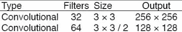
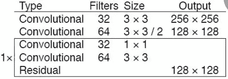
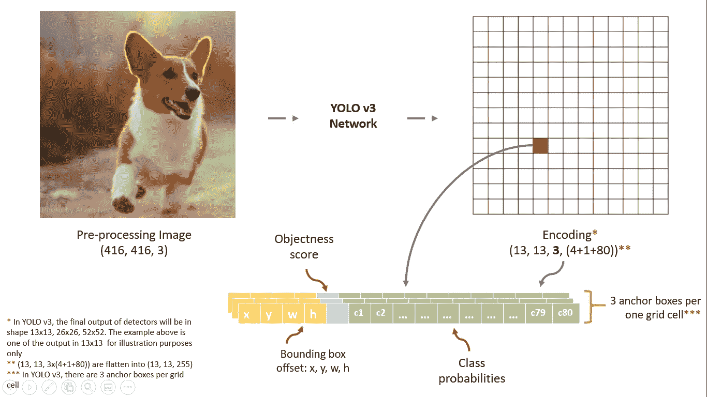
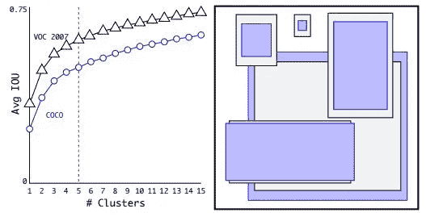
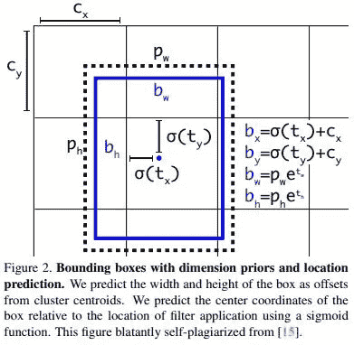

# 目标探测技术现状-YOLO-V3

> 原文：<https://medium.com/analytics-vidhya/object-detection-state-of-the-art-yolo-v3-79ad2937832?source=collection_archive---------8----------------------->

# 问题表述:

有时，我们希望找出图像中的内容，以便我们可以出于各种原因使用这些信息，例如:如果我们知道图像中的对象是什么，它的范围是什么，以及它的准确位置，我们可以使用它来完成多项任务，例如对单个图像中不同类型的对象进行分类，这在设计自动驾驶汽车时非常方便。近年来，我们通过使用深度学习模型，在这种复杂的任务中取得了更好的准确性。在这篇博客中，我们将会看到一个叫做 YOLO 的模型(你只能看一次)和它的第三个版本。

对象检测试图解决的任务是检测单个图像中的多个对象，并通过在这些对象上绘制一个称为边界框的矩形来定位这些对象。一个图像可以有多个对象，它们也有多个边界框。请看一下图像，以便更好地理解。

物体检测。来源-谷歌图片搜索。

因此，我们的模型解决的任务是给定一个输入图像，它应该返回我们每个对象的边界框，即目标和定位，第二个任务是分类，它告诉它相应的类别标签，类别标签将因问题而异。

# YOLO-V3 车型详情:

现在让我们来看看 yolov3 模型的内部。该模型由许多部分组成，但首先，让我们谈谈所使用的主干网络，也称为特征提取器，它用于提取目标定位及其分类的重要特征。这是一个完全连接的卷积网络(FCN)，这意味着它没有密集层或最大池层。在这个模型的早期版本中，他们使用了 VGG 和 ResNet 作为主干，但是在 Yolo V3 中，他们使用了一个名为 DarkNet-53 的 FCN。这是一个 53 层的完全卷积网络，如下图所示。

Yolo 建筑

模型中图像的典型输入大小是(416x416x3)，它被输入到模型中。

## 卷积模块:

卷积块

这里的卷积块意味着它具有在每个块旁边提到的滤波器大小的卷积运算，并且每个内核的大小也被定义，如果在内核大小中您看到“3 x 3 / 2 ”,这意味着步距等于 2，因为我们在这里不使用最大池运算，我们必须使用步距运算来减小图像大小。您还会注意到输出列中的大小图像的大小也减小了 2 倍

卷积操作后，它被传递到 BatchNormalisation 层，随后是 LeakyRelu 激活。

## 剩余块:

街区

残差块的想法源自 ResNet，其中他们使用残差层，如果它们不提供太多信息，则允许梯度跳过卷积操作。通过这样做，梯度的流动变得平滑，并且所有不重要的信息被网络忽略。

在暗网中，残差块的工作方式如下，如您所见，在一个较大的块中有多个块，我们将其命名为巨型块，因此在这个巨型块中有 2 个不同核大小(1，3)的卷积块，滤波器的数量分别为(32，64)，在此之后是一个残差块。

因此，从上图来看，进入我们的巨型块的输入是 128*128*64 的形状，并且在图像大小变为 128*128*64 之后，它被传递到 2 个卷积块，因此残差块所做的只是将接收到我们的巨型块(128*128*64)中的输入与第二卷积块的输出连接起来，第二卷积块将输出与接收到的(128*128*64)相同形状的张量。所以它增加了一个快捷连接。

你可能已经注意到在我们的巨型块外面标有“1x，2x，4x，8x”。这意味着整个巨型块会重复该次数。因为输入张量和输出张量的形状是相同的，所以我们可以重复运算而没有任何误差。

因此，一旦图像被传递到模型中，图像大小就会缩小 32 倍，因为正如您看到的，在每个块之后，我们都会应用一个步长为 2 的卷积块，这是 5 倍，因此我们得到了 2⁵=32.如果传递的图像形状是 416*416*3，则提取的特征形状将是 13*13*1024 (1024 是最后一个大块内的过滤器数量)。

现在我们已经成功地从主干网络中提取了特征，让我们继续前进。

## 3 级输出:

它通过自上而下的路径和横向连接将低分辨率、语义强的特征与高分辨率、语义弱的特征结合起来。

正如您在架构中看到的，三个输出来自 3 个不同的巨型块，称为 scale1，其张量形状为(52*52*256)，scale2，其形状为(26*26*512)，scale3，其形状为(13*13*1024)。这个想法来自特征金字塔网络(FPN ),这是另一种对象检测模型。

# 模型输出公式:

到目前为止，我们已经了解了图像是如何通过网络传递的，现在让我们看看模型的输出应该是什么。

直到我们将 shape (416*416)的图像下采样为 52*52、26*26、13*13。但是为了理解，让我们只考虑 13*13*1024 输出的输出特征块。我们来看看下图。

Yolo 输出

首先为了预测的目的，我们将把我们的图像分成 13×13 个块。在我们的例子中，如果输入图像是形状的，那么总的块将是(416/13)*(416/13)=32*32，所以网格的每个块(用红色标记)将具有 13 的形状，并且将有 32*32 个这样的块。

因此，根据论文，每个区块的每个网格单元将包含 3 个锚定框，每个单元将有 85 个值。让我来解释一下。

假设你在 MS-COCO 数据集上训练物体检测，我们知道它有 80 组类。所以这个数字 85 将分成 4 个边界框偏移量+1 个抽象度分数+ 80 个类别概率=85。

## 锚箱:

*锚框*是一组预定义的具有一定高度和宽度的边界框。这个想法来自 YOLO-V2。他们在 MS-COCO 数据集上对边界框的维度进行 k-means 聚类，以获得模型的良好先验。下图显示了我们通过选择不同的 k 值得到的平均 IOU 值。他们发现 k = 5 给出了一个很好的召回值与模型复杂度的比值。

锚箱。

## 边界框偏移量:

**tx 和 ty:** 该单元格边框的**偏移量**的 x 和 y 坐标。

**tw 和 th:** 该单元格边框的高度和宽度。

这些是对每个单元格的预测。请记住，这些不是实际的边界框坐标，它们只是偏移量、宽度和高度，我们将使用这些坐标来计算实际的边界框。

## 客观性分数:

不可能每个 13*13 锚定框内部都有一个对象，所以为了捕捉这个信息，我们有一个二进制标签，如果对象出现在网格单元中，这个标签就是 1，否则就是 0。

## 类别概率:

现在我们已经检测到了这个物体，我们还想知道这个物体的类型是什么:猫，狗，鸟，等等。因此，如果我们的数据集中有 80 个不同的类别，那么每个类别将有 80 个类别概率值。

边界框表示:

包围盒表示。

*   这里 **bx，by** 是 x，y 中心坐标。我们在 sigmoid 函数中传递我们的 **tx，ty** 值，将它们缩小到 0-1 之间，然后加上 **cx，cy** ，它们是单元格网格的左上角坐标。我们使用 sigmoid 是因为如果预测超过 1，那么边界框的中心可能会移动到另一个单元网格中，这打破了 YOLO 背后的理论，因为如果我们假设红框负责预测对象，则对象的中心一定位于当前的单元网格中，而不是其他地方。所以我们用一个 sigmoid 来保持网格本身的中心。
*   **bw，bh** 是我们包围盒的宽度和高度，如果对包含物体的盒子的预测 bx 和 by 是(0.3，0.8)，那么 13×13 特征图上的实际宽度和高度是(13∫0.3，13∫0.8)。
*   **tx，ty，tw，th** 是我们在预测中得到的。
*   **cx** 和 **cy** 是网格的左上角坐标。
*   **pw** 和 **ph** 为母扣的锚尺寸。这些预定义的锚是通过在数据集上运行 K-means 聚类获得的。

**多尺度输出:**

在上面的解释中，我们只看到了对 13*13 特征图的预测。相同的概念将适用于 26*26 和 52*52 特征输出。通过在不同的网格维度中应用变换，我们检测不同大小的对象。在 13*13 网格中，我们可以检测非常小的对象，而在 26*26 网格中，我们可以检测中等大小的对象，对于 52*52 网格，我们可以检测较大的对象，通过连接输出，我们可以在单个图像上得到所有三个结果的组合。

在每个比例下，每个网格单元使用 3 个预定义的锚点预测 3 个边界框，使得使用的锚点总数为 9。(不同尺度的主播不一样)。

## **非最大抑制**

所以对于一个输入图像，模型预测(52*52 +26*26 +13*13)*3 =10647 个盒子，这已经很多了。为了解决这个问题，我们局部地丢弃分类概率小于 0.5 的框，并且我们使用“**非最大抑制”**技术来处理围绕同一对象的多个边界框。为了过滤掉它，我们使用 IOU(交集/并集)分数，该分数计算实际和预测的边界框之间有多少重叠，并通过比较该特定对象的实际边界框和所有预测的边界框，使用它来过滤不需要的边界框。

因此，我们需要的输出形状是 13*13*425(5*(80+4+1))，其中 5 是锚盒的数量，但是我们有 13*13*1024 的特征图。因此，要将特征转换为我们想要的输出，我们只需使用 1 x 1 卷积层进行转换。

13*13*1024(特征图)→(1 * 1 * 425 conv)→13 * 13 * 425(输出)

现在我们的模型完成了。现在我们可以训练它了。

# 谢谢你