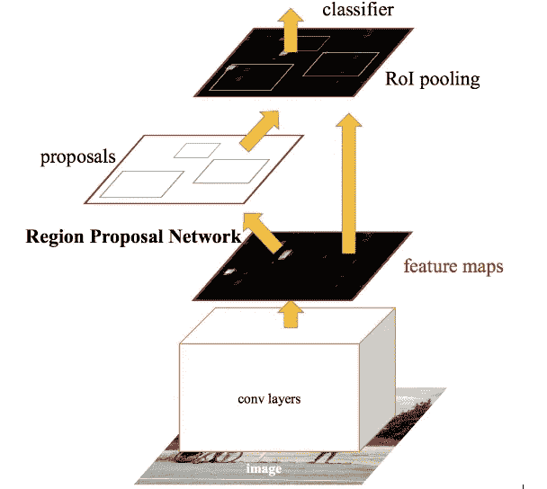

# 使用具有 CNN 特征的区域的目标检测

> 原文：<https://medium.com/analytics-vidhya/object-detection-using-regions-with-cnn-features-557392e22f84?source=collection_archive---------12----------------------->

> 目标检测是目前计算机视觉领域最具发展趋势的技术之一。这一领域的研究一直在以非常快的速度进行，结果令人震惊。

物体探测的一个简单例子

但是到底什么是物体检测呢？对象检测处理从给定的输入(图像或视频)中用包围盒识别和定位某些类别的对象。

迄今为止，一些最成功的对象检测算法如下:

1.基于区域的细胞神经网络:RCNN，快速 RCNN，快速 RCNN

2.YOLO

3.（同 solid-statedisk）固态（磁）盘

**(在本文中，我们将了解 RCNN 及其一系列改进，即快速 R-CNN 和更快的 R-CNN)**

# **一、有 CNN (R-CNN)的地区:**

这种算法包括在图像中找到可能包含对象的特定区域(使用选择性搜索)，并通过 CNN 转发这些区域以提取特征。稍后，提取的特征被用于预测类和它们周围的包围盒。

## 基本上，RCNN 包括以下步骤:

1.从输入图像中提取大约 2000 个自下而上的区域提议。

2.不管候选区域的大小或纵横比如何，我们都将它周围的一个紧密的边界框中的所有像素扭曲到所需的大小。对于每一个提议，它使用一个大的 CNN 来计算特征。

3.它使用特定类别的线性支持向量机对每个区域进行分类。

4.该算法还预测作为偏移值的四个值，以增加边界框的精度。

## 缺点:

**1。训练很慢**:每张图片大概有 2000 个区域被分类，这需要大量的时间。

**2。推理很慢:**用 VGG16 每张图像大约需要 47 秒。实时检测是不可能的。

# 二。**快速 R-CNN:**

快速 R-CNN 是 R-CNN 算法的一个临时继任者。与之前讨论的 R-CNN 相比，它涉及了几个变化，使其更快、更准确。

R-CNN 的主要问题是它在没有共享计算的情况下为每个区域提议执行 CNN 传递。快速 R-CNN 是对 R-CNN 的改进，通过 CNN 转发整个图像。

## 它包括以下步骤:

1.整个图像通过 CNN 向前传递，以生成卷积特征图。

2.从卷积特征图中识别出感兴趣的区域，并对它们应用一个 [***ROI 汇集层***](https://deepsense.ai/region-of-interest-pooling-explained/#:~:text=Region%20of%20interest%20pooling%20(also,pedestrians%20in%20a%20single%20image.&text=Two%20major%20tasks%20in%20computer%20vision%20are%20object%20classification%20and%20object%20detection.) 以将它们全部整形为相同的尺寸。然后，每个提议都被传递到一个完全连接的层。

3.然后并行使用 Softmax 层和线性回归层来输出类和包围盒。

## 缺点:

尽管快速 R-CNN 在速度和准确性方面比 R-CNN 有所改进，但是它仍然使用选择性搜索区域建议，这实际上是一个耗时的过程。

# 三。更快的 R-CNN:

更快的 R-CNN 是对快速 R-CNN 的进一步改进。快速 R-CNN 和更快速 R-CNN 之间的主要区别在于，它使用区域提议网络(RPN)来生成感兴趣区域。

## 以下是快速 R-CNN 涉及的步骤:

1.整个图像通过 CNN 向前传递，以生成卷积特征图(就像我们在快速 R-CNN 的情况下所做的那样)。

2.通过在这些特征图上应用区域提议网络(RPN)来识别感兴趣的区域，该区域提议网络返回具有其对象性分数的对象提议。

3.ROI 池层应用于它们，使它们具有相同的大小，然后提案被传递到完全连接的层。

4.在其顶部应用 Softmax 层和线性回归层来分类和输出边界框。

在我们在本文中讨论的对象检测算法中，更快的 R-CNN 是最好的。对象检测不仅限于基于区域的 CNN。还有很多其他算法，如 YOLO，SSD 和 RetinaNet，我们将在接下来的文章中讨论。

## 参考资料:

1.  [http://cs 231n . Stanford . edu/slides/2017/cs 231n _ 2017 _ lecture 11 . pdf](http://cs231n.stanford.edu/slides/2017/cs231n_2017_lecture11.pdf)
2.  [https://arxiv.org/pdf/1311.2524.pdf](https://arxiv.org/pdf/1311.2524.pdf)
3.  [https://arxiv.org/pdf/1504.08083.pdf](https://arxiv.org/pdf/1504.08083.pdf)