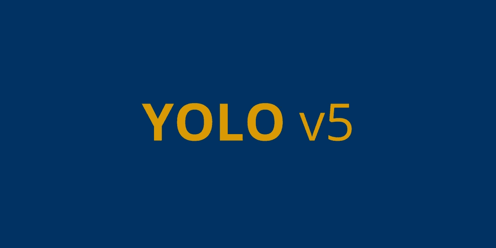
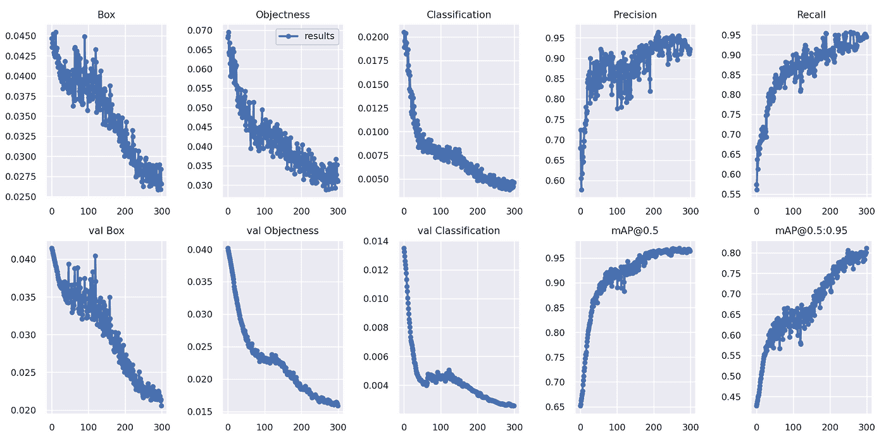
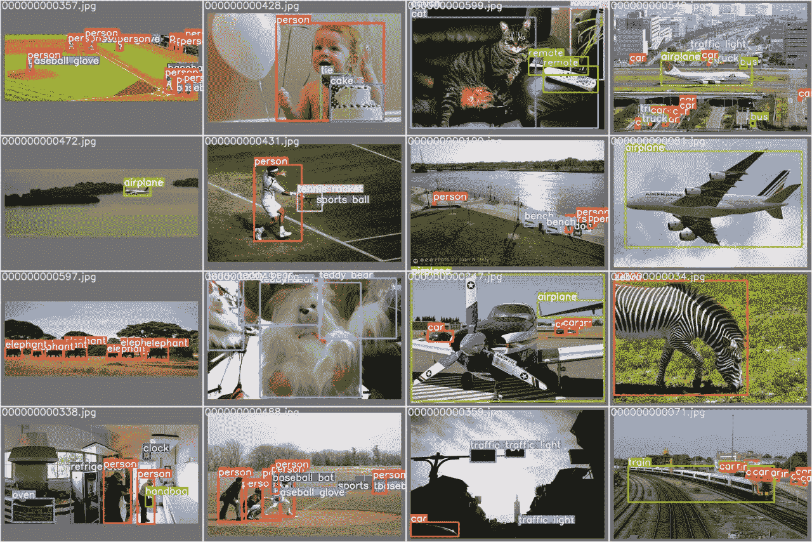
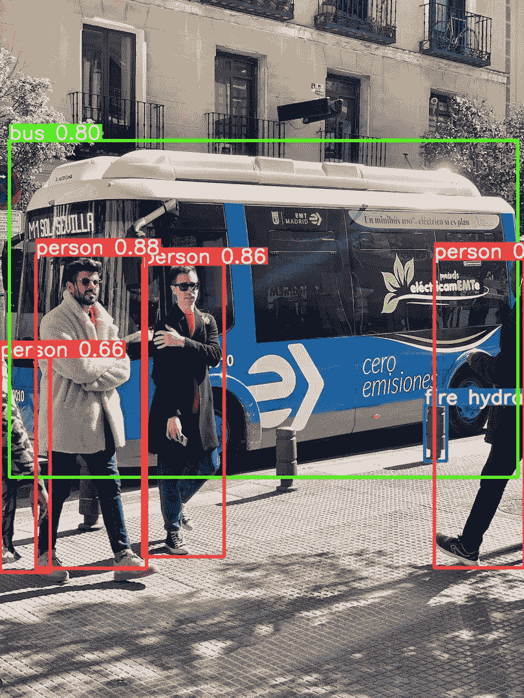
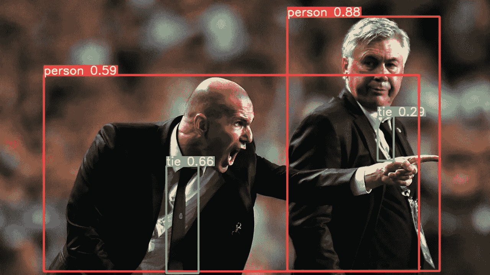

# 使用 YOLO v5 的目标检测

> 原文：<https://medium.com/analytics-vidhya/object-detection-using-yolo-v5-33dbdc020622?source=collection_archive---------2----------------------->

使用样本数据集检测对象的步骤



一般来说，分类技术在自动车辆中没有太大帮助，因为它只预测图像中的一个对象，并且不给出该图像的位置。目标检测在自动驾驶车辆中非常重要，它可以检测场景中有哪些目标以及它们的位置。[](https://arxiv.org/pdf/1506.02640.pdf)****(你只看一次)是 Joseph Redmon 等人作为一个提供类概率的回归问题，使用卷积神经网络(CNN)创建的高速实时物体检测算法。后来又经历了一些修改。为了进行预测，YOLO 只需要一次通过 CNN 的前向传播。它输出带有相应边界框的对象。它广泛应用于自动驾驶车辆中，以检测场景中的对象。****

****在本帖中，我们将使用 AWS 上 COCO 数据集(可定制)中的图像来设置和运行 YOLO。****

******步骤 1** :设置权重&偏差账户(如果你没有)****

****登录 [wandb.ai](https://wandb.ai/) 网站，复制以下内容:****

*   ****来自 wandb.ai/authorize[的 API 密钥](https://wandb.ai/authorize)****
*   ****团队名称来自[wandb.ai/settings](https://wandb.ai/settings)。默认团队名称将是用户 id。****

******步骤 2** :创建 AWS 实例****

*   ****创建实例时，选择“**深度学习 AMI (Ubuntu 18.04)版本 47.0—AMI-01f 1096 e 6659d 38 fa**”AMI，因为它具有深度学习任务所需的库。如果我们在“选择亚马逊机器映像(AMI)”步骤中搜索“**深度学习**，我们就可以找到这一点。****
*   ****为“实例类型”选择 P3 实例。实例类型 p3.2xlarge 就足够了。****
*   ****要节省成本，请在“配置实例”步骤下选择 spot 实例。****

****第三步:安装依赖项****

****登录 AWS 实例后，使用以下命令创建 **conda 环境**并设置权重& Bias 环境变量:****

```
**# Create conda environment with name 'test'
$ conda create -n test python=3.9.6 wandb# login to test environment
$ conda activate test # clone the latest yolov5 and install the required libraries
$ git clone https://github.com/ultralytics/yolov5 
$ cd yolov5
$ pip install -r requirements.txt

# Set the Weights & Bias environment# Key from [https://wandb.ai/authorize$](https://wandb.ai/authorize$)
export WANDB_API_KEY=337....4a8 # Team name from [https://wandb.ai/settings](https://wandb.ai/settings)
$ export WANDB_ENTITY=user_team_name # Project name
$ export WANDB_PROJECT=yolov5**
```

******步骤 4** :训练、Val 和测试****

```
**# Train a model. By default, it uses data/coco128.yaml and runs for 300 epochs. Dataset is downloaded from  https://github.com/ultralytics/yolov5/releases/download/v1.0/coco128.zip (128 images under images/train2017 from coco128.zip)
$ python train.py  

# Validate a model for Precision, Recall and mAP (128 images under images/train2017 from coco128.zip).
$ python val.py --weights yolov5s.pt    

# There are two images. We can use our custom images.
$ python detect.py --weights yolov5s.pt --source /home/ubuntu/yolov5/data/images**
```

******步骤 5** :查看 W & B 网站上的图表和指标****

******结果******

********

******验证批次标签******

********

******验证预测标签******

********

******列车损失******

********

******测试******

****************

******注:**以上所有结果也在 **yolov5\runs\detect\exp** 文件夹下****

******感谢**阅读！请👏如果你喜欢这个帖子，请**关注我**，因为它**鼓励我**写更多！****