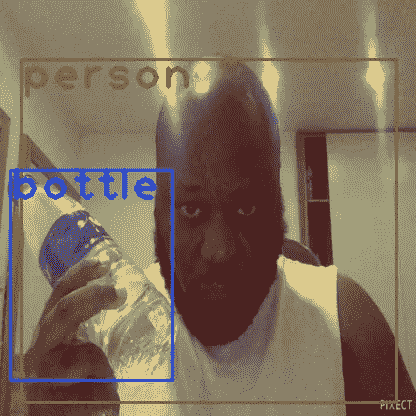
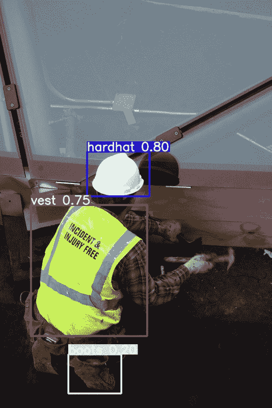
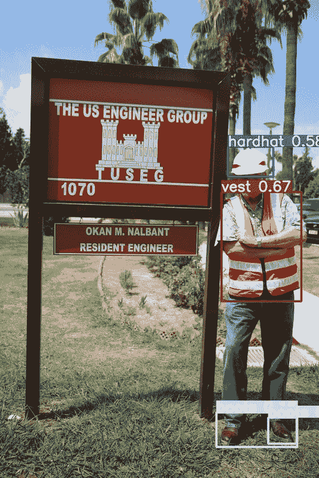
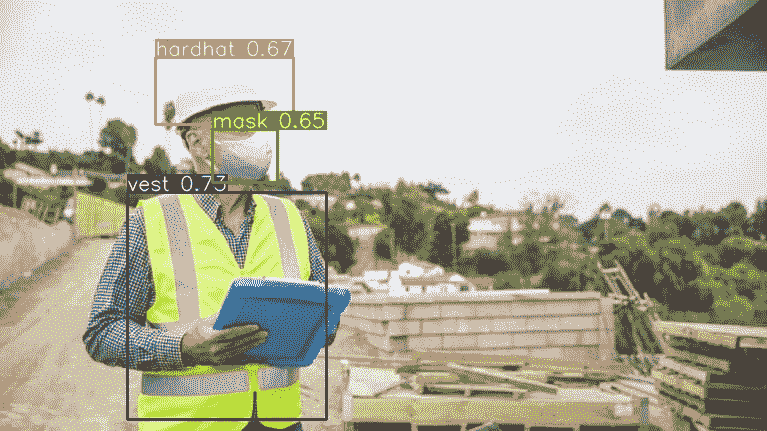

# 使用 YOLOV3 进行对象检测

> 原文：<https://medium.com/analytics-vidhya/object-detection-with-yolov3-bbdff1f8e543?source=collection_archive---------4----------------------->

对自定义数据集的简单检测

这是一篇比我通常写的要短得多的文章。我最近一直在和学校一起学习视觉拓展课程。

我用 YOLOV3 做了两个小项目。第一个是使用预先训练的权重对我拿着 coco 数据集中的一件物品的图像进行推断。

我拿着一个瓶子

第二，我收集并注释了 100 张包含**安全帽、背心、靴子和面具**的图片，并在上面训练 YOLO。图像注释是使用这个简洁的[注释工具](https://github.com/miki998/YoloV3_Annotation_Tool)完成的。

该模型被训练了 13 个时期，实现了 0.54 的 mAP@0.5。以下是一些模型预测。

后来，我从 youtube 上收集了一个 12s 的视频，其中包含了上面提到的许多对象，并使用 [ffmeg](https://pypi.org/project/ffmpeg-python/) 将它们转换成帧。

我在提取的帧上运行了异议检测模型，并把它们转换回视频-

我还探索了如何使用 K-Means 聚类生成锚盒，你可能会发现在这个 [repo](https://github.com/cydal/YOLOAnchorBoxes) 中。

链接到 OpenCV-YOLO [回购](https://github.com/cydal/YOLOV3OpenCV)。

链接到训练和推理[报告](https://github.com/cydal/YOLOV3)。

# **参考文献**

[Sergio Canu](https://pysource.com/author/admin/)yolo object detection 使用 opencv with python[https://py source . com/2019/06/27/yolo-object-detection-using-opencv-with-python/](https://pysource.com/2019/06/27/yolo-object-detection-using-opencv-with-python/)

雷德蒙，约瑟夫和法尔哈迪，阿里 2018 YOLOv3:增量改进[https://pjreddie.com/darknet/yolo/](https://pjreddie.com/darknet/yolo/)

 [## GitHub-theschoolofai/yolo v3:yolo v3 示例

### YoloV3 经过简化，可通过定制数据集在 Colab 上进行培训。我们添加了一个非常“小”的训练图像拼贴…

github.com](https://github.com/theschoolofai/YoloV3) 

[https://github.com/miki998/YoloV3_Annotation_Tool](https://github.com/miki998/YoloV3_Annotation_Tool)