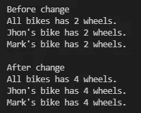
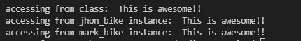

# Python 中的面向对象编程

> 原文：<https://medium.com/analytics-vidhya/object-oriented-programming-in-python-2f2f6c68dca2?source=collection_archive---------9----------------------->

我最近一直在学习 python，在这个过程中，我遇到了一件引起我注意的事情，面向对象编程，这种编写和构造代码的方式提供了一种处理问题的新方法，这就是为什么今天我将解释一些与之相关的概念。

让我们开始想象一个对象，可以是你想要的任何对象，例如，我要选择一辆自行车，所以在这个例子中，我的自行车有一些属性，例如，品牌，颜色，长度，高度等。就像我的自行车一样，其他任何自行车都可以有自己的品牌、颜色、长度等。因此，两辆自行车共享的属性可以在一个类中定义，对于这个示例，该类是“Bike ”,每辆自行车都是该类的一个实例，我们称之为对象，正如我们可以看到的那样，每个对象的属性可以有不同的值，所以这是一个非常简单的关于类和对象含义的示例，只是为了热身！！！，哈哈哈。

现在让我们看看如何使用 python 将它转换成代码，首先让我们定义我们的类 Bike，然后让我们创建两个具有不同属性的对象:

自行车课

自行车类的实例(对象)

正如我们所看到的，每个实例对于相同的属性都有自己的值，如果我们执行这段代码，我们将得到以下输出:

输出

太棒了，对吧？，现在让我们对这个新概念进行更多的实验。

## 类别属性:

类属性是所有实例共享的“属性”,例如，假设由“Bike”类创建的所有自行车都有两个轮子，如果我们将其转换为代码，我们会将“wheels”属性添加到我们的类中，如下所示:

要访问这个属性，我们可以使用类本身，也可以使用它的任何实例:

访问“wheels”类属性

输出

为了演示所有实例共享该属性，让我们更改它的值，并查看该更改是否在所有实例中都得到反映:

示例代码:更改类属性值

输出

还有 tada！，所有实例的值都如预期的那样发生了变化。

## 实例属性

这种属性不是所有实例共享的类属性，而是只属于一个对象，在我们的示例中，我们已经定义了实例属性:品牌、颜色、长度和高度，这些属性定义了每辆自行车将具有的属性，如果我们更改其中一个属性的值，我们将看到该更改只会影响我们从中选择属性的对象，让我们看一个示例，想象在我们的示例中，Mark wnat 将他的自行车的颜色从蓝色更改为红色，在代码中我们可以将其转换为:

更改对象属性值

改变属性值的输出

我们可以看到，只有 mark 的自行车的属性“颜色”的值发生了变化，如果我们打印 jhon bike 的颜色，我们会看到它保留了自己的颜色:

打印自行车变色前后的颜色

自行车变色后的颜色

正如我们所看到的，约翰的自行车颜色仍然是黄色，而马克的自行车颜色从蓝色变成了红色。

另外值得一提的是，属性可以是以下任何一种:

*   Public (attr):可以从任何地方访问
*   Protected (_attr):可以从派生类中访问
*   Private (__attr):只能使用“self”访问

## 创建类和实例属性的方法:

Python 为我们提供了许多创建类和实例属性的方法，下面是一些例子:

类别属性:

*   定义类的属性

*   使用类:

在运行时创建新的类属性

输出

*   使用类方法:

为 Bike 类添加类方法

测试属性创建工作正常的示例代码

输出

*   使用“__class__ ”:

还有另一种创建类属性的方法，即使用实例，访问其类，然后声明属性，这不是创建此类属性的好方法，但它有助于我们探索 python 为我们提供的选项来实现这一点，对于此示例，我们将在我们的类中定义一个新方法，当调用此方法时，它将通过从任何实例使用“self”访问“__class__”属性来创建类属性:

向定义类属性的对象添加新方法

探索类属性创建的示例代码

输出

实例属性:

*   使用“自我”

使用“self”声明的实例属性

*   使用“__dict__”

使用“__dict__”创建的实例属性

输出

*   使用实例

使用实例本身创建的实例属性

输出

## 类别和实例属性之间的差异:

*   所有实例共享类属性，如果我们改变一个类属性值，这种改变将反映在该类的每个实例上
*   实例属性属于每个单独的对象，如果我们更改任何实例的任何属性的值，这种更改只会反映到同一对象，其他实例将保持其值。

## 优点和缺点:

这取决于你编码的内容，在某些情况下类属性比实例属性更适合，反之亦然。

*   如果您想存储某个类的所有对象的相关数据，类属性会很有帮助。
*   另一方面，实例属性允许您用自定义值个性化每个单独的对象。
*   即使删除了一个类的所有实例，也可以访问类属性。
*   实例属性只能在对象生存期内访问。
*   Python 允许我们动态地创建这两种属性。
*   如果你用一个类属性的相同名称声明一个实例属性，事情会变得混乱，如果你试图从对象中访问一个类实例，你将得到属性实例值。

## python 如何处理这些属性:

Python 通过使用字典' __dict__ '来管理属性，实例属性和类属性存储在不同的字典中，为了查看这一点，让我们从任何实例和类中打印出' __dict__ '到每个实例和类给出的输出中:

打印 __ 字典 _ _

打印输出 __dict__

正如我们看到的，两个字典存储不同的值，第一个只存储 insances 属性，另一个存储与类“Bike”相关的属性。

一如既往，我希望这篇文章能以某种方式帮助你，保重，看下一篇！！！。