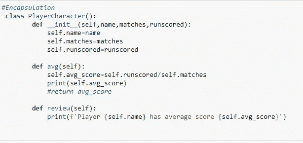
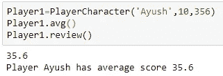
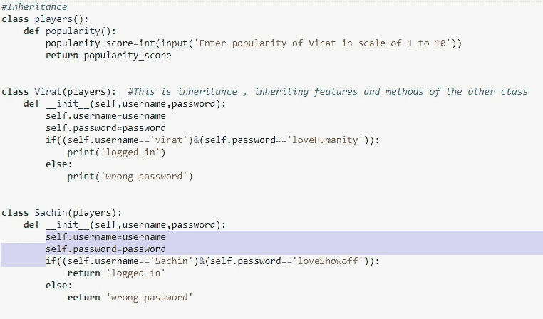
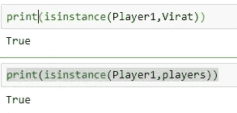
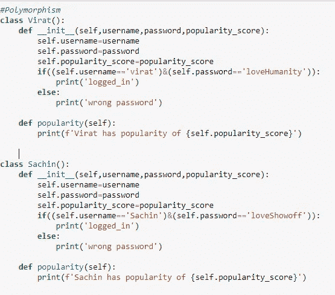
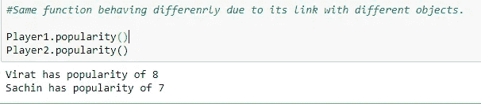

# 面向对象编程(OOP)概念:封装、抽象、继承和多态

> 原文：<https://medium.com/analytics-vidhya/object-oriented-programming-oop-concepts-encapsulation-abstraction-inheritance-polymorphism-d712efa70d87?source=collection_archive---------16----------------------->

“python 中的一切都是对象”是每个开发人员都会听到的一句话。我试图用实际例子用非常简单的术语解释 OOP 中的四个非常重要的概念。希望大家觉得有用，容易理解。首先让我们从定义开始。

封装被定义为将基本的数据特征和方法包装成一个单元，主要是类。下面用一个例子让我们理解一下:

我们可以看到不同的特性如名称、匹配和得分以及方法 avg()、review()是如何整合到一个类 PlayerCharacter()中的。

抽象被定义为在不包括背景细节和解释的情况下表现本质特征的行为。下面让我们看看它的应用。

抽象

我们创建了一个对象，只用一行代码就得到了平均的结果，而不关心具体的操作是如何完成的。非常简单但仍然非常重要。

继承只不过是一个类继承另一个类的属性的机制。下面的例子非常简单，可以理解这样一个重要而复杂的概念。

遗产

从上图可以看出，Virat 和 Sachin 类是如何继承其他类玩家的属性的。请看下面我是如何使用 python 中的内置函数 isinstance()来确认这一点的。Player1 是 Virat 和 players 的实例。

多态是由两个词 poly 和 morphism 组成的，前者意味着许多，而 morphism 意味着形式。从技术上讲，它是函数在不同类中表现不同的能力。像往常一样，让我们看看下面的例子:

代码 _ 多态性

看看同一个函数 popularity()在不同的类中表现如何不同(给出不同的输出)。

请再读一遍，定义和代码相当重。如果你想让我写或解释任何与经济学、机器学习和时间序列分析以及人工智能相关的东西，请在下面的 linkedin 上给我写信。[https://www.linkedin.com/in/ayush-yadav-2903b099/](https://www.linkedin.com/in/ayush-yadav-2903b099/)

快乐学习！！