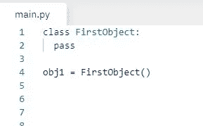
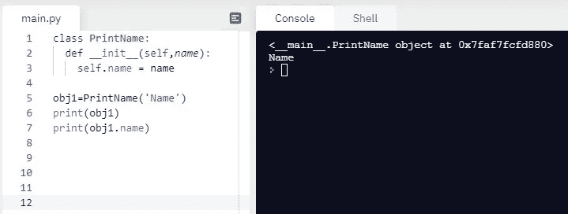
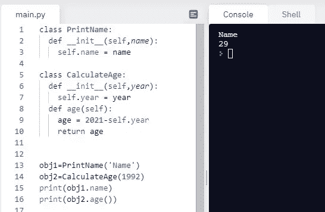
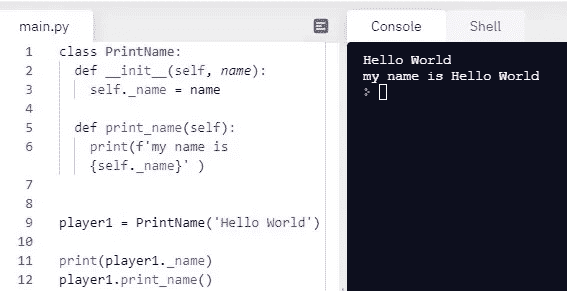
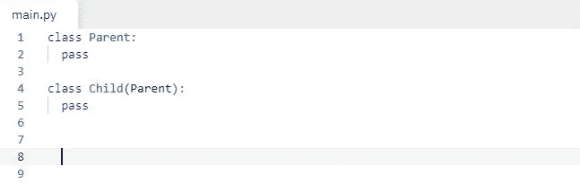
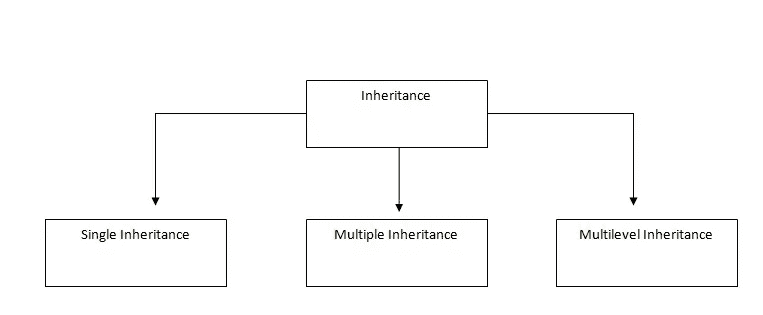
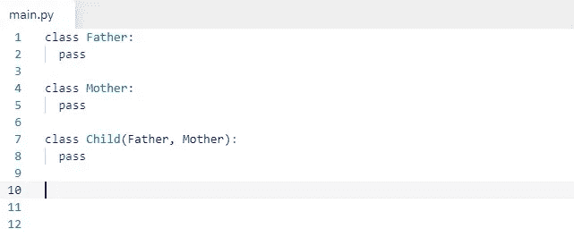
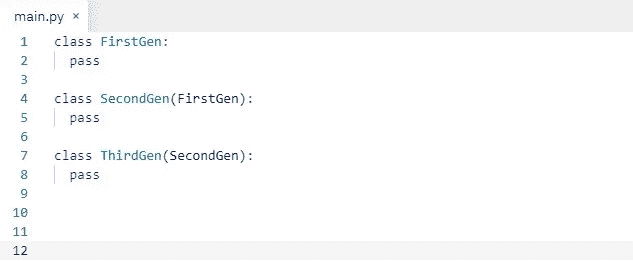
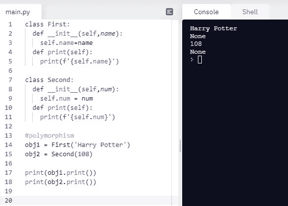

# 面向对象编程 Python-指南

> 原文：<https://medium.com/analytics-vidhya/object-oriented-programming-python-a-guide-f919084cd944?source=collection_archive---------19----------------------->

编码，编程！怎么办？我应该学什么？我能跳过什么？最重要的方面是什么？所有这些问题都会浮现在你的脑海里。不要慌！我将向您介绍编码的神奇世界。这里学学榜样。

最重要的方面的最大答案*很简单。你应该完全掌握的第一件事是 OOP。无论你的抱负或目标是什么，都可以是通过面试，获得一份工作的入围名单，创办一家信息技术公司等等。你得知道 OOP。OOP 是你喜欢的编码语言的敲门砖。Java、JavaScript、Python、C++和 Ruby 等等，你会遇到了解 OOP 的需求。OOP 的概念在这些语言中大多是相同的，比如多态、封装等。但是也有特定于语言的情况，比如 C++经典的“通过引用调用或通过值调用”。在 Python 中是什么样子的？任何猜测！！就是“通过对象引用调用”。*

所以，本文将用最简单的方式解释 Python 中的 OOP。即使 Python 不是你的语言，也不要担心没有语言歧视。编程是一种平等的语言。这篇文章将是你在 OOP 中清晰的参考点。

以下是主题列表:

1.OOP 到底是什么？

2.目标

3.属性和方法

4.__init__:构造函数

5.OOP 的四大支柱

6.包装

7.抽象

8.遗产

9.多态性

# 一、OOP 到底是什么？

在 python 中，它看起来像这样

一个基本的 OOP 代码

假设你正在为计算器编写一个程序。你的程序可以做加法、减法等基本运算。你想让它更实用，你想让你的程序计算复利，还想让它把摄氏温度转换成华氏温度。你不认为你的代码会看起来很乱吗？难道不是要一次又一次地创造除法和乘法的功能吗？

这就是 OOP 拯救你的地方。它帮助你成为编码界的玛丽·近藤。它帮助你变得更有条理。它帮助您将创建复利功能的负担放在朋友身上。你把代码分成不同的部分，按照你的意愿把一个部分的功能扩展到另一个部分，它是可读的和更有效的。

# 二。对象、属性和方法，__init__:

你声明了一个类，然后你想在里面使用属性和方法。简而言之，属性和方法就是程序要实现的功能。

对象实例化

在上面的例子中，我们创建了一个类，它的基本功能是获取名字并只关心它们。

然后为了使用类 PrintName，我们将实例化这个类。我们该怎么做？通过制作一个物体。当初你做 obj1，现在通过 obj1。您可以访问 PrintName 中所有可用的属性和方法。

现在在 Python 中，什么是 __init__()。它是一个构造函数方法。构造函数是在你创建一个对象时被调用的方法。当您创建 obj1 时，init 会立即被调用。

# 三。OOP 的四大支柱是什么？

a.包装

b.抽象

c.遗产

d.多态性

如果你想精通 OOP，你需要理解这四个。你对这四个概念的了解必须切中要害。你不需要紧张地学习哪些地方会被实现，而是把重点放在理解上。

# **四。封装:**

假设您有这么多页面，一些页面包含关于 python 语言的信息，一些包含关于 JavaScript 的信息。为了把自己从混乱中拯救出来，你会怎么做？您将把 python 页面放在一个框中，将 JavaScript 页面放在另一个框中。这就是封装的作用。

封装将数据和功能绑定在一个地方。你可以只在你想的时候访问特定类的内容，这不会和你的其他代码冲突。

> “快速绑定快速找到”:莎士比亚的《威尼斯商人》

封装的实现

在这个程序中，年龄计算放在 CalculateAge 中，姓名放在 PrintName 中。

注意->我们使用 camel case 来声明类名。

# 动词 （verb 的缩写）抽象:

它有助于降低复杂性和提高效率。人们还能从代码中得到什么？就 python 而言，抽象中重要的一点是没有私有变量。其他 OOP 语言如 Java 等有一个公共和私有变量的概念，而在 Python 中我们没有。在 python 中，我们使用编码实践来判断它是否是私有变量。我们使用(__)

声明(__)的做法

# 不及物动词继承:

类似地，一个类可以继承其父类的特征，这里唯一的不同是，在人类中，遗传特征是自然选择的结果，而在程序员这里，它变成了人类选择。

就 Python 中的语法而言，继承如下所示:

Python 中的继承语法

上面的代码也是 ***单继承*** 最简单的例子。

继承的类型

多重遗传

这就是 ***多重继承*** 的例子。在这种特殊情况下，编写父类的顺序将决定子类中代码的执行。换句话说，书写父、母的顺序将决定子类的输出。

多级遗传

上面的代码帮助你理解， ***多级继承*** 。如果在 FirstGen 中创建了一个方法，而您在 SecondGen 中创建了具有不同功能的相同方法{same name}，那么它将覆盖 FirstGen 的方法，并且被调用类的被调用方法将被执行。

# 七。多态性:

它是采取不同形式的能力。例如:如果你在不同的类中有两个同名的方法。你用这两个不同的类制造了两个不同的对象。那么对象的执行将决定调用哪个方法。

多态性的例子

还有很多面向对象的主题需要讨论，但是上面提到的涵盖了最基本的概念。通过实践和实现 OOP 的各个方面，你将正确地学习 OOP 的概念。

快乐编码:)