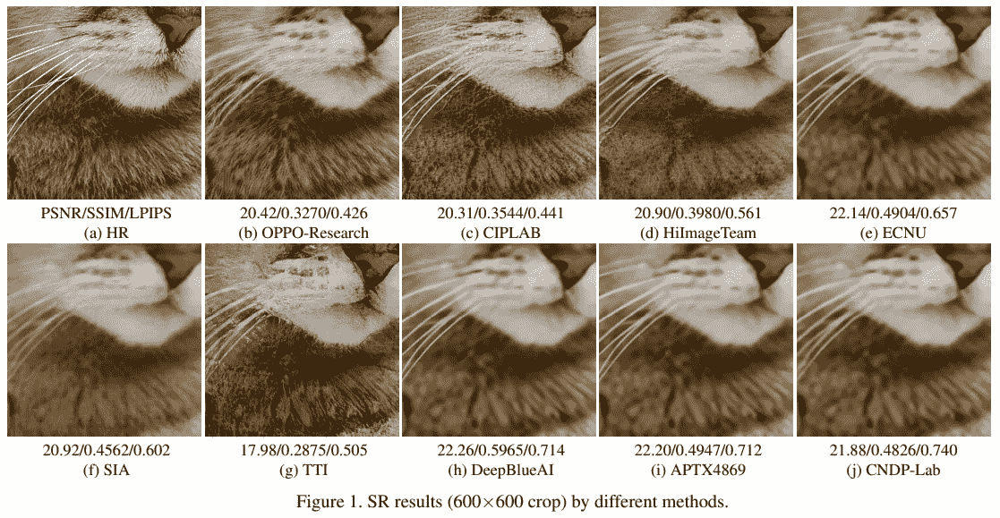
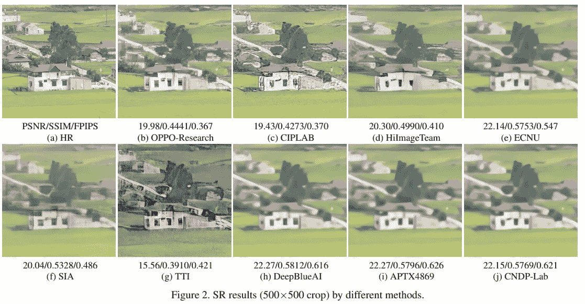

# 关于极端超分辨率的观察

> 原文：<https://medium.com/analytics-vidhya/observations-on-extreme-super-resolution-ec016f8d1e57?source=collection_archive---------8----------------------->

# 介绍

正如我们在本帖的[中回顾的 NTIRE 2020 挑战极限超分辨率，我们有一个非常大的缩放因子(x16)。参与这项挑战的团队提出了各种模型架构和缩放方法。一些团队通过使用 SR-fitted 模型而不是 VGG 网络对感知损失进行了微小的修改。](/analytics-vidhya/an-overview-of-ntire-2020-extreme-super-resolution-challenge-c69b4daf41fd)

不幸的是，问题远未解决。正如我们在下图中看到的，一些方法成功地重建了高分辨率纹理信息，但无法生成具有空间信息的真实结构。

# 对该方法的意见

我认为极限心率与经典的 x4 问题有很大的不同，在 x4 问题中，我们得到了一些可信的信息，这些信息可以在重建心率图像时参考。我们必须从原始 HR 图像的 0.39%(1/16x16)恢复图像。因此，我认为这个问题更接近于“条件图像生成”,而不是以前的 SR 方法。

关注感知质量的先前的 SR 方法，例如 SRGAN、EnchanceNet 和 ESRGAN，使用混合损失，该混合损失将逐像素损失、感知损失和对抗损失相加。一个问题是，这需要在对抗性损失和内容损失之间进行权衡，因为这些损失根本上彼此不一致。

最近的模型充分执行了这种权衡，并生成了视觉上令人愉悦的超分辨率图像。然而，在极端的 SR 中，我们必须在权衡过程中处理感知和对抗损失，同时最小化内容损失的影响，以确保 SR 图像是 LR 图像的副本。这可能很容易通过调整超参数来实现更好的折衷，或者可能需要对算法和评估度量进行根本性的改变。

# 渐进式增长？StyleGAN？

与此同时，论文“为提高质量、稳定性和变化性而渐进增长 gan”中提出的管道似乎适用于极端 SR。我们可以将发电机的渐进增长视为对前一阶段输出的超解析。

由于已知渐进生长可提高 GAN 训练的稳定性，因此当对发生器使用更注重 GAN 的方法时，它也可能有助于预期的不稳定性。

我们也可以使用改进的 StyleGAN 论文中提出的想法。通过向中间层引入像素噪声，网络可以向图像提供随机变化，以减轻来自鉴别器的压力，从而生成新的图像。

总的来说，我认为必须引入更注重 GAN 的方法来提高图像的感知质量，因为像素级内容损失无法为高质量图像生成提供有意义的指导。