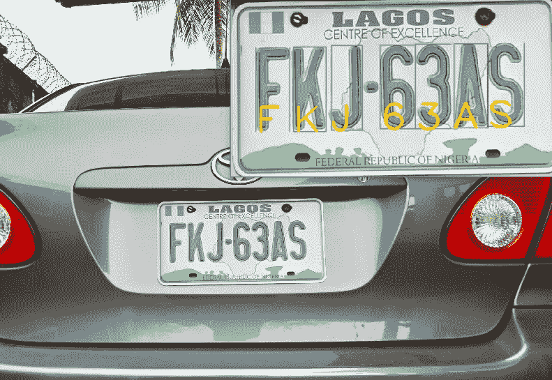
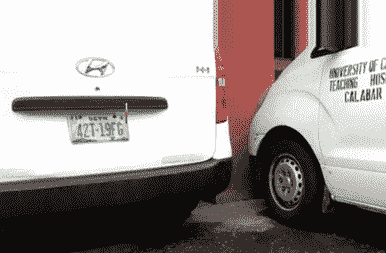
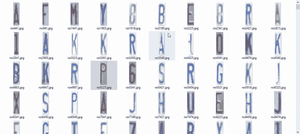
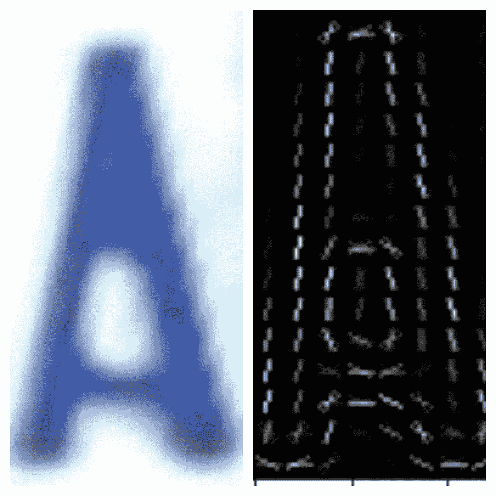
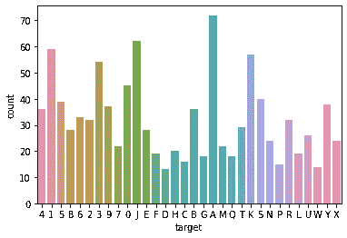
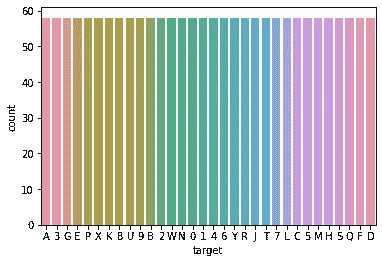
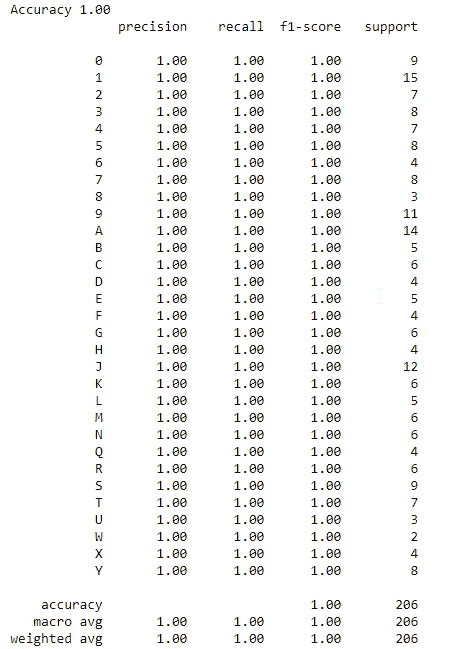
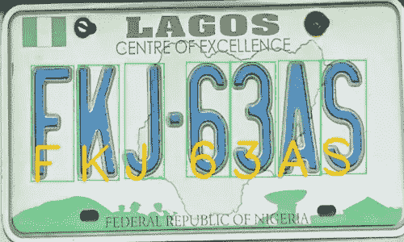

# 带有机器学习的自定义 OCR

> 原文：<https://medium.com/analytics-vidhya/ocr-with-machine-learning-55c7d082fe78?source=collection_archive---------7----------------------->

不是每个 AI 问题都需要深度学习。



作者图片

在撰写本文时，关于使用机器学习的自定义光学字符识别的帖子数量非常少。你可能会看到的常见方法利用了深度学习或[宇宙魔方](https://github.com/tesseract-ocr/tesseract)库。在这篇文章中，我将解释如何使用机器学习来训练你自己的光学字符识别器。我们要研究的方法不需要太多的数据，但是执行起来非常好。我用这个为尼日利亚车牌制作了一个原型 ALPR。所以让我们开始吧。

首先，你要知道 OCR，就像你的*猫 vs 狗*教程一样，只是图像分类。是啊！一种多类图像分类。然而，在这种情况下，你的文件夹不会被标记为**猫和狗**，而是 **A-Z** 和**0–9**。

**！！！**注意有时**零‘0’**可能看起来像**字母‘O’，**根据你的字体类型选择一个或两个**。**

此外，我们不会使用 Keras、Tensorflow 或任何深度学习库。相反，我们将使用一种我们都知道并且喜爱的流行的机器学习分类算法，*逻辑回归*。

# 概述

1.收集和清理数据集

2.基于梯度方向直方图的特征提取

3.培训和测试

# **收集和清理数据**

像所有机器学习问题一样，我需要数据。数据是驱动*人工智能*的引擎。正如我前面提到的，这是用于车牌识别程序。所以，我在镇上到处走，给汽车拍照和录像。对于视频，我写了一个简单的程序来每秒保存 2 帧。最后，我有了相当多的车牌，然而，我没有使用所有的照片，因为这是一个原型，但结果令人印象深刻。由于大多数车牌都是歪斜的，所以还有很多工作要做。我必须对所有的图像进行透视校正。

同样，利用我的图像处理技能，我用 OpenCV 编写了另一个 python 脚本来帮助我在选择了车牌的四个角之后校正透视。此后，我对图像进行了阈值处理，得到了提取并保存的字母轮廓。



透视变换—作者的图像

仍然在清理中，我有大约 1037 张不同字母 A-Z，0-9 的图片，这些图片又要被分类到它们各自的文件夹中。



要排序的字符-按作者排序的图像

拖放当然不是一个选项，所以再次，python 来拯救！！。编写了另一个脚本，但是这一次，程序一个接一个地显示字符，并且当在键盘上按下相应的字符时，它保存到适当的文件夹中。因此，如果显示字母**‘A’**的图像，并且在键盘上按下**‘A’**，它会将其保存到文件夹**‘A’**。最后，我还必须做视觉确认，并消除任何错误。最后，清洗和分类完成了！

# **使用梯度方向直方图(HOG)的特征提取**

现在，我的数据已经被清理了，至少 60%的工作已经完成。我开始从我的图像中提取特征。

给大家介绍一下，**方向渐变直方图(HOG)** 。HOG 从 2004 年就有了，现在还在用。如果你是那些跳过图像处理的基础，跳入深度学习的人之一，你可能不知道我在说什么。然而，只需知道它类似于发生在卷积神经网络中的特征提取，因此[参见此处](https://learnopencv.com/histogram-of-oriented-gradients/)了解更多细节。

让我们通过使用下面的代码来看看一只猪是什么样子的。

```
import cv2
from skimage.feature import hogim_test =  cv2.imread('ocr_data/train/A/roi107644.jpg',0)
_,hog_img= hog(im_test,orientations=9,pixels_per_cell=(8,8), cells_per_block=(1, 1),visualize=**True**)
plt.imshow(hog_img,cmap='gray')
```



字母 A 的方向梯度直方图(HOG)——作者图片

但是，我把它当成了一维数组。数组的长度通常由提取 HOG 的参数集决定。在这个例子中，我的是 1052 列。

# 使用逻辑回归和测试进行培训

从这里，我读入每幅图像，执行特征提取，然后将提取的特征及其相应的标签存储在一个列表中，稍后再将其转换为数据帧。

```
features = []
labels = []
**for** i,j **in** enumerate(zip(pathimg,labels_list)):
  imgs,label = j
  **for** img **in** imgs:
      img = cv2.imread(train_dir+label+'/'+img)
      img_res=cv2.resize(img,(64,128),interpolation=cv2.INTER_AREA)
      img_gray= cv2.cvtColor(img_res,cv2.COLOR_BGR2GRAY)
      hog_img= hog(img_gray,orientations=9,pixels_per_cell=(8,8), cells_per_block=(1, 1))
      features.append(hog_img)
      labels.append(label)df = pd.DataFrame(np.array(features))
df['target'] = labels
df
```

然后我检查数据是否平衡，通过使用

```
sns.countplot(x='target', data=df)
```



哎呀，数据非常不平衡。然后我们把它分成训练集和测试集，然后使用 imblearn I 通过过采样来平衡数据。

# **培训**

在这里，我使用逻辑回归来构建我的分类器。

```
x = np.array(df.iloc[:,:-1])
y = np.array(df['target'])from sklearn.linear_model import LogisticRegression
from sklearn.model_selection import train_test_split
x_train, x_test, y_train, y_test = train_test_split(x, y,
                                                    test_size=0.20,
                                                    random_state=42)from imblearn.over_sampling import SMOTE
sm = SMOTE(random_state=0)
sm_x,sm_y=sm.fit_sample(x_train, y_train)bal_df = pd.DataFrame(sm_x)
bal_df['target']=pd.DataFrame(sm_y)
sns.countplot(x='target', data=bal_df)
```



平衡数据—按作者分类的图像

```
lreg = LogisticRegression()
clf=lreg.fit(sm_x, sm_y)
y_pred = clf.predict(x_test)
print('Accuracy **{:.2f}**'.format(clf.score(x_test, y_test)))

**from** **sklearn.metrics** **import** classification_report
print(classification_report(y_test, y_pred))
```

下面是培训的结果。



ocr 分类报告-按作者分类的图像

# 测试

最后，让我们使用我们的模型。

首先，我们加载我们的分类器并读入我们的图像。

```
# Load the classifier
clf = joblib.load("ocr_data/models/hog_lreg_model_3.pkl")# Read the input image
im = cv2.imread("ocr_data/licenseplates/licplate4.jpg")
```

接下来，我们将图像转换为灰度，这样我们就可以对其进行阈值处理，找到轮廓，然后从左到右对其进行排序。您可以查找 python 的“排序”内置函数。

```
# Convert to grayscale
im_gray = cv2.cvtColor(im, cv2.COLOR_BGR2GRAY)

# Threshold the image in order to find contours
ret, im_th = cv2.threshold(im_gray, 0, 255, cv2.THRESH_BINARY+cv2.THRESH_OTSU)# Find contours in the image
ctrs,hier = cv2.findContours(im_th, cv2.RETR_TREE,
                                 cv2.CHAIN_APPROX_SIMPLE)
bboxes=[cv2.boundingRect(c) for c in ctrs]
sorted_bboxes = sorted(bboxes,key=lambda b:b[0])
```

然后，我们使用指定的最大宽度和高度遍历排序后的边界框，裁剪字符，调整大小，提取 HOG 特征，将它们传递给分类器以获得预测，然后将结果存储在一个列表中。

```
plate_char=[]
for num,i_bboxes in enumerate(sorted_bboxes):
    [x,y,w,h]=i_bboxes
    if h>100 and w < 100:
    # Make the rectangular region around the digit
        cv2.rectangle(im,(x,y),(x+w,y+h),(0,255,0),1)
        roi=im_gray[y:y+h,x:x+w]
        # Resize the image
        roi = cv2.resize(roi, (64, 128), interpolation=cv2.INTER_AREA)
        # Calculate the HOG features
        # use the same parameters used for training
        roi_hog_fd = hog(roi, orientations=9, pixels_per_cell=(8, 8),
                         cells_per_block=(1, 1))
        cpred = clf.predict(np.array([roi_hog_fd]))

        cv2.putText(im, str((cpred[0])), (x,y+h),cv2.FONT_HERSHEY_SIMPLEX,
                    2, (0, 200, 250), 3)
        plate_char.append(str(cpred[0]))print(''.join(plate_char))cv2.imshow('result',im)
```

就是这样！



作者使用训练过的模型图像在车牌上执行 ocr

笔记本的链接可以在[这里](https://github.com/jideilori/ocr-ml)找到